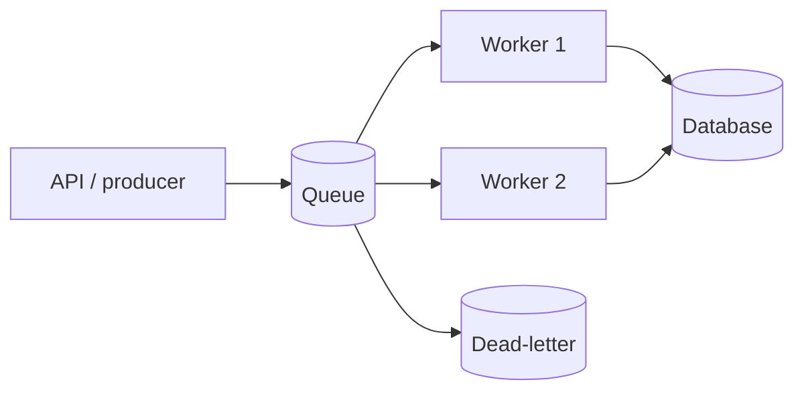

# Asynchronous Processing

## 1. One-Line Definition
Asynchronous processing decouples an action from its consequence: the producer submits work and moves on, and the work completes later — in a different request, thread, process, or time — via a queue, event bus, or background worker.

## 2. Why Do We Need It?
Some jobs are too slow, too chunky, or too many to run inside a user request: sending 10,000 emails, converting a video, recomputing a feed, notifying a million devices. Others must simply not couple systems (the payment event must reach accounting without payment waiting on accounting). Async makes request latency independent of background work, smooths bursts into a rate workers can handle, and lets components evolve and fail independently (see [[loose-coupling|Loose Coupling]]).

## 3. Simple Intuition
A restaurant order chit. You order; the kitchen writes a chit and hangs it on a rail. The rail queues the work; the cooks take chits one at a time as they have capacity; the front of house doesn't wait for the kitchen to finish. Ordering and cooking are decoupled, the kitchen is protected from a rush, and the staff can even add a new station (a new worker) without touching ordering.

## 4. What Happens Without It?
Slow work blocks the hot path: a request to create a post waits while the system notifies 10,000 followers — latency explodes, threads pile up, and one heavy post can freeze others. Rapid bursts hit the backend directly and melt it (a viral post = an instant 10x fan-out into the notification service). Coupled components also fail as one: accounting down means payments stop. All three are exactly the async pattern's cure.

## 5. Core Idea
- **Producers queue, consumers process:** work is handed to a broker (see [[message-queue|Message Queue]]) or event bus; whoever is ready takes it. The producer's latency is just "enqueue and confirm".
- **Buffering smooths bursts:** the queue is a shock absorber — a burst becomes a backlog that workers digest at their rate instead of a spike into the backend (see [[consumer-lag|Consumer Lag]] as the measure).
- **Delivery semantics must be chosen:** at-least-once (redelivery possible → consumers must be idempotent, see [[delivery-semantics|Delivery Semantics]], [[idempotency|Idempotency]]), at-most-once (drops allowed), or exactly-once-effect (the hard middle).
- **Ordering is usually partition-scoped, not global:** "all events for user X in order" is achievable; "everything in the whole world in order" is not (see [[kafka-ordering|Kafka Ordering]]).
- **Failure isolation:** a broken consumer doesn't stop the producer; the queue holds the work until recovery (that's also why a dead-letter queue exists for truly stuck messages).
- **At-least-once + retries + DLQ** is the standard triple for correctness: no loss, bounded retries, nothing silently dropped.

## 6. Important Terminology

| Term                | Simple Meaning                                              |                   |
| ------------------- | ----------------------------------------------------------- | ----------------- |
| Producer            | The thing that submits async work                           |                   |
| Consumer / worker   | The thing that processes it                                 |                   |
| Broker / queue      | The buffer between them                                     |                   |
| Backlog / lag       | Pending work; how far behind consumers are                  |                   |
| At-least-once       | Work may be delivered more than once                        |                   |
| Exactly-once effect | Idempotent processing of possibly-duplicated delivery       |                   |
| DLQ                 | Dead-letter queue for work that failed permanently          |                   |
| Outbox pattern      | Publish atomically with the DB commit (see [[outbox-pattern | Outbox Pattern]]) |
| Event vs command    | "Something happened" vs "please do this"                    |                   |

## 7. Basic Architecture



## 8. Request or Data Flow
1. A request arrives; the service does the *fast, necessary* work, then publishes "task/event X" to the queue and replies to the caller immediately.
2. The queue stores the work durably; workers pull at their own pace (multiple workers = parallel consumption).
3. Each worker processes idempotently (a redelivered message must not double-apply); on transient failure it retries; on persistent failure the message lands in the DLQ for inspection.
4. The caller never knows or waits for the background completion — that's the point — and gets the result later via polling, webhook, or eventual direct access.

## 9. Practical Example
**Post-and-fanout (assumptions):** creating a post must return in <150ms, but a creator has 100K followers.
- Sync part: write the post, commit it (and emit via the outbox pattern so the publish can't be lost).
- Async part: a fanout worker reads the post event and enqueues "deliver to list of followers" chunks, processed at a safe rate.
- Bursts: a viral post produces 5M notifications — the queue holds them; workers catch up over minutes; the notification service is never flattened. Lag is monitored (see [[consumer-lag|Consumer Lag]]), and a DLQ catches anything poison.

## 10. Scaling
Async scales by scaling the *consumers*: more workers = more throughput, auto-scaling on queue depth (see [[autoscaling|Autoscaling]]), and partitions/consumers let you parallelize while keeping per-key order (see [[publish-subscribe|Publish/Subscribe]]). Scaling limits: single-partition ordering caps you at one consumer per partition; hot keys concentrate work on one partition; and unbounded backlog pressure (backpressure — planned) means buffering has a cost — eventually you must shed or slow producers. The queue itself must scale as a cluster (see [[kafka-architecture|Kafka Architecture]]).

## 11. Reliability and Failure Scenarios

| Failure                          | What Happens                 | Detection               | Recovery                           | Trade-off                      |
| -------------------------------- | ---------------------------- | ----------------------- | ---------------------------------- | ------------------------------ |
| Consumer crashes mid-job         | Message may be redelivered   | Unacked message timeout | Reconsume idempotently             | Duplicate-safe consumers       |
| Producer publishes, then crashes | Work never enqueued?         | Outbox relay check      | Outbox pattern → publish-on-commit | Slight write cost              |
| Queue crashes                    | Work buffered in broker lost | Broker replication      | Replicate the queue (multi-broker) | Replication cost               |
| Poison message                   | Worker retries forever       | DLQ growth              | Move to DLQ, alert, fix            | Delivery time for healthy work |
| Consumer runs behind             | Stale processing             | Consumer lag metric     | Scale workers, shed                | Freshness trade-off            |

## 12. Consistency and Correctness
Async means the consequence is *eventual* — the correctness burden is explicit: at-least-once delivery plus idempotent consumers is the workhorse (see [[delivery-semantics|Delivery Semantics]], [[exactly-once-effect|Exactly-Once Effect]]); the **outbox pattern** (see [[outbox-pattern|Outbox Pattern]]) makes "commit to DB" and "publish event" atomic so work can't be lost between them; ordering is partition-scoped and must be designed for; and compensating logics (sagas — see [[saga-and-strangler|Saga and Strangler Fig]]) unwind partially completed async chains. Staleness is always possible, so consumers must re-check state or tolerate it.

## 13. Performance
Async's win: request latency drops to "enqueue, ack" — independent of job duration. Throughput is the workers' rate, decoupled from request rate (a burst becomes backlog). Overheads: serialization/copy (cheap), broker hops (an extra network round trip), and backpressure debt — a large backlog is *latent latency*: the work is done, but its effects are late. Monitoring lag is the performance control (see [[consumer-lag|Consumer Lag]]).

## 14. Security
Async surfaces include: message payloads at rest and in transit (encrypt — see [[encryption-and-keys|Encryption and Keys]]), authorization at the *worker* (a worker must still check who may perform the action — deferred execution is not deferred authorization), and poisoning: validate/dead-letter hostile payloads instead of retrying them blindly. Payloads may also be replayed — idempotency keys double as replay protection.

## 15. Trade-Offs

| Choice              | Advantages                      | Disadvantages                 | When to Use                       |
| ------------------- | ------------------------------- | ----------------------------- | --------------------------------- |
| Async queue         | Fast requests, burst absorption | Eventually, extra moving part | Slow/side-effect work             |
| At-least-once       | Nothing lost                    | Duplicates possible           | The default; idempotent consumers |
| Exactly-once effort | No duplicates in effect         | Complexity, latency           | Money, dedup-critical flows       |
| At-most-once        | Simplest, least state           | Drops allowed                 | Metrics, best-effort logs         |
| Outbox publish      | No lost events                  | Write-plus-relay machinery    | Any DB-then-publish step          |

## 16. Common Mistakes
- Assuming "async = exactly once" — brokers deliver at-least-once; if the consumer isn't idempotent you get duplicate effects.
- Publishing before the DB commit — event says "X happened" that didn't (that's the outbox's job).
- Ordering assumptions: polling workers don't guarantee global order; design partition-scoped or accept out-of-order.
- No DLQ/no lag monitoring — a stuck consumer silently breaks the feature.
- Buffering without bounds — a runaway producer makes the backlog the new outage (backpressure, planned).

## 17. HLD vs LLD Boundary
HLD: which work is async, the queue/topic topology, delivery semantics, ordering scope, outbox vs direct publish, DLQ policy, consumer scaling approach, lag targets. LLD: the handler code in a worker, retry-wiring in the client SDK, idempotency-key storage and checks, the outbox relay implementation, DLQ subscription handlers.

## 18. Interview Questions

### Beginner
- What problem does asynchronous processing specifically solve that synchronous cannot?
- What does "at-least-once with idempotent consumer" mean concretely?

### Intermediate
- Design the notification path for a viral post without flattening the backends.
- A consumer lags for minutes. Diagnose, then decide: scale, shed, or redesign.

### Advanced
- Design an outbox + relay for "commit order, publish event" with no loss and no duplicate effects.
- How do you keep per-user ordering yet scale consumers when fanning out to millions?

## 19. Interview Memory Summary

> [!abstract]- Interview Memory Summary

### Remember

- Async decouples action from consequence; the request path gets fast.
- The queue absorbs bursts into a digestible backlog.
- Delivery semantics: choose at-least-once + idempotent consumers (the default).
- Ordering is partition-scoped, not global — design for it.
- Outbox pattern makes commit + publish atomic.
- DLQ catches poison; lag measures how late the effects are.
- A consumer is still authority-checked — deferring execution is not deferring authz.

### 30-Second Explanation

Move slow or side-effect work into a queue consumed by workers: producers enqueue and reply instantly, queues absorb bursts, workers process idempotently under at-least-once delivery, the outbox makes publish-atomic-with-commit, and DLQs plus lag monitoring keep stuck work visible — eventual by design, safe by dint of idempotency.

### Interview Traps

- Claiming async gives exactly-once for free.
- Publishing an event before the DB commit.
- Global-ordering promises that aren't partition-scoped.
- No DLQ: a poison message stalls the pipeline forever.
- "Async is faster" — it's more *available and burst-resistant*, not magically faster for a single unit.

### Key Trade-Off

Async trades immediacy for availability and burst-resilience: effects become eventual, and the price of that is a delivery-semantics + idempotency + ordering discipline that sync never demanded.

## 20. Related Concepts

### Prerequisites

- [[message-queue|Message Queue]]
- [[synchronous-processing|Synchronous Processing]]

### Commonly Used Together

- [[delivery-semantics|Delivery Semantics]]
- [[idempotency|Idempotency]]
- [[outbox-pattern|Outbox Pattern]]
- [[consumer-lag|Consumer Lag]]

### Alternatives

- [[synchronous-processing|Synchronous Processing]] (the immediate path for result-needed work)

### Advanced Concepts

- [[event-driven-architecture|Event-Driven Architecture]]
- [[publish-subscribe|Publish/Subscribe]]
- [[kafka-architecture|Kafka Architecture]]
- [[exactly-once-effect|Exactly-Once Effect]]

Related planned topics (not authored yet): backpressure, idempotent consumers.

## 21. References
Kleppmann ch. 11 (stream processing, event sourcing framing); standard messaging docs on delivery semantics (Kafka, RabbitMQ); outbox pattern write-ups (Transactional Outbox). Verify current broker guarantees and `max.poll`/visibility semantics with vendor docs.

## 22. Active Recall

Test yourself before revealing each answer.

> [!question]- Why does async make a system more burst-resistant, not just "faster"?
> A synchronous backend receives the whole burst as concurrent in-flight load and must scale capacity to peak. An async pipeline buffers the burst as a backlog: producers just enqueue (cheap), workers consume at their sustainable rate, and the backend never sees any spike. The request is *accepted now, effected later* — which is how you survive a viral moment rather than scaling for it.

> [!question]- What is the exact contract of "at-least-once + idempotent consumer"?
> The broker may deliver a message more than once; the consumer must make re-processing a no-op. Concretely: process under an idempotency/operation key — check-and-set (e.g., a unique DB key or dedup store) so the second arrival is skipped. Result: no lost work, no duplicate effects — effectively-once, without the broker-level exactly-once machinery.

> [!question]- Why publish via the outbox instead of directly after a DB commit?
> Because "I committed" and "I published" are two separate operations — crash between them loses events (or worse, publishes events that never committed). The outbox writes the event into the same transaction as the business change and a relay publishes outbox rows afterward: commit and publish become one atomic unit, so the event stream can never disagree with the database.

> [!question]- Trade-off: raise consumer parallelism to fix lag vs redesign the queue topology.
> Raising workers helps only if the bottleneck is consumer compute and the ordering model tolerates it — one partition can have only one consumer, so a hot key caps you. If the lag comes from a poison message, a hot partition, or an undersized design (job needs N times more work), scaling masks it. Diagnose lag by cause: capacity, hot key, or algorithmic, then scale, partition, or redesign accordingly.

> [!question]- Interview scenario: "create post" must return fast, but fanning out to 1M followers. Show the design with its correctness guarantees.
> 1. Sync: write+commit the post; the outbox in the same transaction emits a "post created" event — no loss, no gap.
> 2. Async: a fanout worker (or the event handlers) enqueue per-user "deliver to X" tasks on partitioned topics keyed by user, preserving per-user order.
> 3. Notification workers consume idempotently (delivery ID dedup) at a rate the SMTP/push tier can hold.
> 4. Lag monitored; DLQ for poison; producers unaffected if any worker dies. Result: 150ms create that never flakes under popularity.

> [!question]- Your async consumer holds payment-adjacent data. What security checks must survive the async move?
> Authorization must be enforced at the worker, not inherited from the producer: the deferred job must still verify who may perform the action and any tenant scoping (see [[authentication-vs-authorization|Authentication vs Authorization]]). Payloads need at-rest encryption and replay protection (idempotency keys), and hostile payloads must dead-letter rather than retried forever — a poison message that storms the loop is a mini-DoS.

## 23. When Should I Use This?

### Use it when

- The work is slow enough that holding the request would blow the latency budget.
- The result isn't needed by the caller to proceed (side effects, notifications, analytics).
- Traffic bursts must be absorbed without scaling to peak (viral posts, flash sales).
- Producers and consumers should evolve, deploy, and fail independently.

### Avoid it when

- The caller needs the result immediately and the work is fast (now it's a sync path that shouldn't be async).
- The "async" addition is pure overhead: no separation of speed, burst, or coupling to justify the broker.
- The team won't operate the semantics: without idempotency, DLQs, and lag monitoring, async becomes silent daily corruption.

### What problem does it solve?

It makes request latency independent of work duration, lets bursts be buffered instead of flattening backends, and decouples systems so each can scale and fail alone — with a delivery-semantics and idempotency discipline that makes eventual effects correct.

### What problem does it NOT solve?

It doesn't deliver strong, immediate consistency (effects are eventual by design — see [[consistency|Consistency]]), doesn't give exactly-once for free (idempotency is on you), doesn't fix hot-key or unbounded-backlog pressure, and it can't hide a design where the "async" step actually could have been dropped — an unused feature flag on a queue is a tax.

## 24. Decision Connections

Decisions that go together with asynchronous processing:

- [[message-queue|Message Queue]] — the buffer/transport the whole pattern runs on.
- [[synchronous-processing|Synchronous Processing]] — the sibling you split work with, by the "needed now?" test.
- [[delivery-semantics|Delivery Semantics]] — the guarantee you must choose: at-least-once and the rest.
- [[idempotency|Idempotency]] — what makes redelivery safe.
- [[outbox-pattern|Outbox Pattern]] — atomic publish-with-commit so the event stream matches the DB.
- [[consumer-lag|Consumer Lag]] — the load and freshness signal for the whole pipeline.
- [[event-driven-architecture|Event-Driven Architecture]] — async at the architectural scale, across many producers/consumers.
- [[exactly-once-effect|Exactly-Once Effect]] — the strongest form, when duplicates are money.

Decision tree:

```
Work must happen after a request
    |
    +-- Caller needs the result to proceed?
    |      → [[synchronous-processing|Synchronous Processing]]
    |
    +-- Slow / side-effect / bursty?
    |      → [[message-queue|Message Queue]] + workers
    |      → +-- DB commit + publish atomically?
    |      |      → [[outbox-pattern|Outbox Pattern]]
    |      +-- Redelivery safe?
    |      |      → idempotent consumers ([[delivery-semantics|at-least-once]])
    |      +-- Poison messages?
    |             → DLQ + alerting
    |
    +-- Events drive other systems?
    |      → [[event-driven-architecture|Event-Driven Architecture]]
    |      → [[publish-subscribe|Publish/Subscribe]]
```