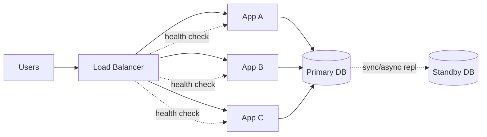

# Availability

## 1. One-Line Definition
Availability is the percentage of time a system remains operational and able to serve requests, usually expressed as "nines" (99%, 99.9%, 99.99%).

## 2. Why Do We Need It?
Every minute of downtime costs money and trust. Availability quantifies how much uptime you promise, which drives redundancy decisions: a 99% system can be a single server; a 99.99% system needs replicas, failover, and careful procedures.

## 3. Simple Intuition
A bakery that's open 8 hours a day is 33% available — fine for a bakery. A hospital pharmacy must be open 100%. Availability is deciding, per component and per system, how much "open time" the users actually require and paying only for that much.

## 4. What Happens Without It?
A single server fails when its disk fills, its process crashes, or the cloud region hiccups. Without redundancy and failover, every such event is an outage. Users see errors or timeouts; revenue and trust leak.

## 5. Core Idea
**Uptime % = uptime hours / total hours.**
- 99% → ~3.65 days down/year. 
- 99.9% → ~8.76 hours down/year.
- 99.99% → ~52.6 minutes down/year.
- 99.999% → ~5.26 minutes down/year.

To reach high availability you remove single points of failure (SPOFs): run multiple instances, put a load balancer in front, replicate data, and automate failover. Availability is a **layered** property: the whole system is only as available as its weakest required dependency, but graceful degradation means a down dependency can yield a *degraded but available* system.

## 6. Important Terminology

| Term                  | Simple Meaning                                                         |
| --------------------- | ---------------------------------------------------------------------- |
| Nines                 | Shorthand for availability (3 nines = 99.9%)                           |
| Uptime                | Time the service is usable                                             |
| Downtime              | Time the service is not usable                                         |
| SPOF                  | Single point of failure: one component whose loss kills the system     |
| Redundancy            | Duplicated components ready to take over                               |
| Failover              | Automatic switch to a standby component                                |
| Degraded availability | Available, but serving reduced functionality                           |
| Planned downtime      | Maintenance windows (count against availability if users are affected) |

## 7. Basic Architecture



## 8. Request or Data Flow
Users hit the LB, which only sends traffic to **healthy** apps (health checks). If an app dies, it is removed from rotation and (ideally) re-provisioned. If the primary DB dies, the standby is promoted and app config/dns/connection strings point at it. Every layer has a backup so a single failure never becomes an outage.

## 9. Practical Example
**Banking app (assumptions):** target 99.99% availability.
- Apps: 3 nodes in 2 availability zones, behind an LB.
- DB: primary + synchronous standby + automated failover, backups to another region.
- Blast-radius controls: separate accounts/regions, staged rollouts, runbooks, and SLO dashboards so an engineer can act within minutes.

## 10. Scaling
Availability and scale interact: more nodes mean individual failures are normal — availability now comes from **redundancy + automation**, not from "one machine is very reliable". Auto-scaling also smooths traffic spikes (protects latency/availability during load), and multi-region active-active deployment is the next availability level (survive a region outage).

## 11. Reliability and Failure Scenarios
- **App server failure:** health check → removed from rotation → restart/reprovision. Trade-off: need 2+ nodes and health-check latency window.
- **DB failure:** detect via replication monitoring/heartbeat → promote standby/replica. Trade-off: async replication may lose recent commits (that's why durability/RPO matters).
- **Network partition:** nodes can't reach quorum → leader election, or serve read-only. Trade-off: availability vs consistency (CAP).
- **Region failure:** fail over to standby region; active-passive costs a warm copy, active-active costs conflict resolution.
- **Deployments:** the most common cause of outages — blue-green / canary / feature flags with instant rollback.

## 12. Consistency and Correctness
High availability typically means accepting weaker consistency (replicas, async replication). Must decide per operation: critical money ops stay strongly consistent; the feed can be stale for a moment. Availability is *not* free — it trades against consistency and cost.

## 13. Performance
Availability ≠ speed. A system can be 100% available but slow. But timeouts/retries during failure look like latency, and degraded performance during partial failure is itself an availability incident (SLOs measure both).

## 14. Security
High availability invites abuse: DDoS can take down an "available" service. Add rate limiting, WAF, and load shedding so availability survives malicious load. Also secure the failover paths themselves (standby DB creds, DNS control).

## 15. Trade-Offs

| Choice | Advantages | Disadvantages | When to Use |
|--------|------------|---------------|-------------|
| Single server | Cheap, simple | Low availability | Dev/test, non-critical |
| Active-passive | Simple, good DR | Wastes a node, failover seconds | Most production systems |
| Active-active | No wasted nodes, sub-second failover | Conflict resolution, complexity | Global latency + high avail |
| Async replication | Fast writes, no write-blocking | Some data loss on failover | Where RPO can be minutes |
| Sync replication | Zero loss | Slower writes, writes blocked if replica down | Payments, critical data |

## 16. Common Mistakes
- Quoting "99.999%" availability without counting the DB, session store, and payment provider — the chain is only as available as its weakest mandatory link.
- Treating maintenance, rollouts, and failed deploys as "not downtime" — if users can't use it, it's downtime.
- Adding replicas for availability without automating failover — a human paged at 3am is not availability.

## 17. HLD vs LLD Boundary
HLD: availability targets, redundancy topology, failover strategy, regions/AZs. LLD: how a specific health-check endpooint or retry loop is implemented in code.

## 18. Interview Questions

### Beginner
- What does 99.99% availability mean in downtime per year?
- What is a single point of failure? Give an example.

### Intermediate
- How do you make a stateless web tier and a stateful DB tier highly available?
- What is the difference between active-passive and active-active?

### Advanced
- Design for regional failure with an RPO of 15 minutes and RTO of 10 minutes.
- How does the CAP theorem bound how available a strongly consistent system can be?

## 19. Interview Memory Summary

> [!abstract]- Interview Memory Summary

### Remember

- Availability = uptime %; nines ≈ downtime/year (99.9% ≈ 8.76 hours/year).
- Remove SPOFs top to bottom — the chain is only as available as its weakest dependency.
- App tier: load balancer + N nodes + health checks.
- Data tier: replicas + automated failover.
- You trade consistency and cost for availability (CAP).

### 30-Second Explanation

Redundancy at every layer + automated failover + health checks + graceful degradation.

### Interview Traps

- Quoting "multi-region makes us 100x more available" — regions don't even out downtime, and active-active doubles complexity; justify per requirement.
- Quoting "99.999%" without counting the DB, session store, and payment provider — the weakest mandatory link rules.
- Treating maintenance, rollouts, and failed deploys as "not downtime" — if users can't use it, it's downtime.
- Adding replicas without automating failover — a human paged at 3am is not availability.

### Key Trade-Off

The chain is only as available as its weakest link, so every "nine" you add costs consistency (weaker, async replication) and money (redundancy, automation, regions) — with the last nines being exponentially more expensive.

## 20. Related Concepts

### Prerequisites

- [[reliability|Reliability]]
- [[system-design-fundamentals|System Design Fundamentals]]

### Commonly Used Together

- [[failover|Failover]]
- [[rpo-rto|RPO and RTO]]
- [[standby-models|Standby Models]]
- [[database-replication|Database Replication]]
- [[load-balancing|Load Balancing]]
- [[disaster-recovery|Disaster Recovery]]

### Advanced Concepts

- [[cap-theorem|CAP Theorem]]

Related planned topics (not authored yet): nines-of-availability.

## 21. References
Standard availability calculations (Uptime Institute, AWS architecture guidance). Recheck exact cloud failover semantics with provider docs.

## 22. Active Recall

Test yourself before revealing each answer.

> [!question]- What problem does a quantified availability target solve?
> "Be up all the time" is undecidable — you can't size redundancy without a number. 99% can be a single server; 99.99% needs replicas, automated failover, and careful procedures. The uptime % converts a vague promise into concrete redundancy decisions.

> [!question]- What does 99.99% availability mean in downtime per year?
> 99.99% → ~52.6 minutes down/year. For reference: 99% → ~3.65 days; 99.9% → ~8.76 hours; 99.999% → ~5.26 minutes. Each additional nine shrinks allowed downtime dramatically and costs exponentially more.

> [!question]- What is a single point of failure and how do you remove one?
> An SPOF is one component whose loss takes down the whole system. Remove by redundancy + automation: multiple app instances behind a load balancer with health checks, replicated data, and automated failover — a backup without automated switchover is not availability.

> [!question]- Active-passive vs active-active: when do you pick which?
> Active-passive keeps a warm standby (failover in seconds) — simple, wastes a node; use for most production systems. Active-active serves from all regions with no wasted nodes and sub-second failover, but needs conflict resolution and doubles complexity — use for global latency plus high availability.

> [!question]- What do you give up to reach high availability?
> Consistency and cost. High availability typically means async replication and weaker consistency (stale reads, and on failover a possible RPO of recent writes). Sync replication avoids loss but slows writes and blocks if the replica is down — CAP bounds the consistency/availability trade.

> [!question]- What happens to a "99.99% available" system whose primary DB fails without automated failover?
> A human must be paged, diagnose, and promote a standby at 3am — that window counts as downtime. Availability comes from redundancy + automation, not from one "very reliable" machine; the chain is only as available as its weakest mandatory dependency, and deploys are the most common cause of outages.

> [!question]- Interview scenario: design for regional failure with RPO 15 minutes and RTO 10 minutes.
> Replicate data to a standby region with at most 15 minutes of acceptable loss (RPO) and a documented runbook that restores service in 10 minutes (RTO). Active-passive costs a warm copy; active-active costs conflict resolution. Then rehearse the failover — a DR plan that was never drilled is a hypothesis.

## 23. When Should I Use This?

### Use it when

- You have a concrete uptime target (99.9%, 99.99%) and must choose redundancy per tier.
- You're designing failover for the app tier (LB + N nodes) and data tier (replicas + promotion).
- You need to pick active-passive vs active-active or sync vs async replication.
- You must defend an availability number against cost (pay only for what users need).

### Avoid it when

- Users tolerate brief outages and you'd rather spend on features.
- You can't automate failover — a manually paged standby is not real availability.
- The cost of another nine (10x complexity) exceeds its user benefit.
- You're at the point of weak consistency hurting correctness (money paths) — handle consistency instead.

### What problem does it solve?

Problem: a single server fails when its disk fills, its process crashes, or its region hiccups — every such event is an outage. Solution: quantified targets (nines) plus redundancy at every layer, automated failover, health checks, and graceful degradation so a single failure never becomes a user-visible outage.

### What problem does it NOT solve?

Availability does not guarantee correctness — an up-but-wrong system is unreliable, and that's reliability's job. It also trades away fresh data under async replication, does not by itself survive a region (that needs disaster recovery), and cannot absorb malicious load (DDoS) without rate limiting and load shedding.

## 24. Decision Connections

Decisions that go together with availability:

- [[reliability|Reliability]] — availability is uptime; reliability is correct-under-faults; the wrong-system problem lives here.
- [[failover|Failover]] — the automation that turns a standby into actual availability.
- [[rpo-rto|RPO and RTO]] — bound how much data you can lose and how fast you recover.
- [[standby-models|Standby Models]] — active-passive vs active-active: the redundancy topologies that realize availability.
- [[database-replication|Database Replication]] — replicas provide the data redundancy availability depends on.
- [[load-balancing|Load Balancing]] — health checks and rerouting for the stateless tier.
- [[cap-theorem|CAP Theorem]] — why higher availability means weaker consistency during partitions.
- [[disaster-recovery|Disaster Recovery]] — the region-level reach of availability planning.

Decision tree:

```
Target uptime number?
    |
    +-- 99% (can be a single server)?
    |      → dev/test, non-critical — accept low availability
    |
    +-- 99.9-99.99%?
    |      → Redundant app nodes behind [[load-balancing|Load Balancing]]
    |      → [[database-replication|Database Replication]] + automated [[failover|Failover]]
    |      → define [[rpo-rto|RPO and RTO]], choose [[standby-models|Standby Models]]
    |
    +-- Survive a region loss?
    |      → [[disaster-recovery|Disaster Recovery]] (multi-region active-passive/active-active)
    |
    +-- Consistency cost too high?
           → rebalance via [[cap-theorem|CAP Theorem]] — weakens consistency for availability
```