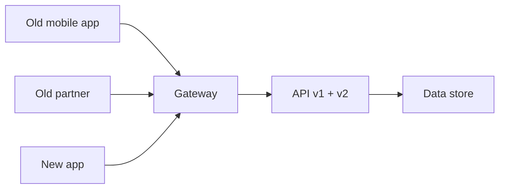

# Backward Compatibility

## 1. One-Line Definition
Backward compatibility is the property that a new version of a component, API, schema, or storage format keeps working for consumers built against the old one — so old clients, old data, and old deploy lanes can coexist with the new version without a coordinated, simultaneous upgrade.

## 2. Why Do We Need It?
Under coordinated-everything, every change large or small becomes a global pause: every consumer must be updated and deployed in the same window, or untested clients hit new formats and break. Real systems can't do that — mobile apps update on their own schedule, partner integrations outlive us, read replicas lag behind new writers, and data written last year must open with today's code. Backward compatibility is what makes change continuous instead of choreographed.

## 3. Simple Intuition
A phone charger standard. A phone released in 2020 works with the charger released in 2026 — the newer charger is backward compatible with the older phone. The manufacturer didn't need every phone to be in the same room when the new charger shipped; the interface promised "old devices keep working". That promise is the entire point.

## 4. What Happens Without It?
Every release becomes a cliff: upgrade the message format and old consumers silently mis-parse; add a required field and old producers stop being accepted; change the config schema and the fleet's older nodes fail to boot. Rollouts become all-or-nothing (see [[deployment-strategies|Deployment Strategies]]), rollbacks become impossible, and "we can't change X" hard-codes around the legacy until the system fossilizes.

## 5. Core Idea
- **Additive over destructive changes:** adding a field to a message/response is safe; removing, renaming, or changing its type is breaking. The default rule: new versions are old-version-plus-more.
- **Optional over required:** new fields are optional with defaults, so old consumers ignore them and old producers can omit them and still be accepted.
- **Versioned contracts, transparent evolution:** elements carry version info (API version, schema version, feature flag) so both sides know which rules apply (see [[api-versioning|API Versioning]]).
- **The compatibility matrix:** *payload compatibility* (old consumer reads new data), *behavioral compatibility* (new code keeps old semantics unless versioned), *storage/schema compatibility* (old records remain readable), *deployment compatibility* (an N-1 rollout stays sane). See schema migration (planned).
- **Backward compat for producers and consumers both:** it's not just "old clients, new API" — a *new* client speaking to an *old* server is forward/sideways compatibility, often achieved by boring old-format defaults and additive optional fields.

## 6. Important Terminology

| Term | Simple Meaning |
|------|----------------|
| Backward compatible | New version still serves/parses old versions |
| Breaking change | Old consumers/producers break with new version |
| Additive field | New, optional, defaulted — safe |
| Deprecation | Announced removal path, with window |
| Versioned endpoint | e.g., /v1 path or header (see [[api-versioning|API Versioning]]) |
| Schema evolution | Old rows open under new code |
| Compatibility window | How long old and new must coexist safely |
| Feature flag | Gates new behavior behind a switch (see [[feature-flags|Feature Flags]]) |

## 7. Basic Architecture



## 8. Request or Data Flow
1. The gateway accepts requests at v1 (old) and v2 (new) simultaneously; versioning is explicit (path or header).
2. A v2 request may include new optional fields; the service fills defaults when they're absent.
3. Old clients never receive fields they can't parse beyond what their version promises; new fields ride in additive shapes.
4. The service reads data written by old versions (schema evolution — see schema migration, planned) so no historical record becomes unreadable on upgrade.

## 9. Practical Example
**Partner feed API upgrade (assumptions):** 1,200 partners on v1, an impossible all-at-once upgrade.
- v2 adds `discount` as an optional field on each line item; v1 partners ignore it, v2 partners use it.
- Nothing is renamed or retyped: a `price` stays `price`; amounts keep the same currency units.
- v1 is deprecated with a published window (9 months, analytics on usage, kill date), so partners migrate at their own pace and the fleet ships v2 today (see deprecation — planned, and [[api-versioning|API Versioning]]).

## 10. Scaling
Backward compatibility compounds with every consumer you add: a 100-consumer API change is a project; a 10,000-consumer one is unconstitutional unless designed for it. As fleets and data grow, have the discipline become *procedural*: automated contract checks (see [[contract-first-design|Contract-First Design]]) that fail a breaking change in CI, canonical schema registries, data-format compatibility testing against old readers (e.g., decoding *today's* rows with *last year's* sample readers), and a per-API compatibility budget that forces deprecation planning as part of any breaking change.

## 11. Reliability and Failure Scenarios

| Failure | What Happens | Detection | Recovery | Trade-off |
|---------|--------------|-----------|----------|-----------|
| Silent breaking change | Old consumers mis-parse | Error/contract tests | Revert the change, version it properly | Contract test cost |
| Additive field becomes required | Old producers rejected | Producer error rates | Make it optional again / dual-version | Negotiation overhead |
| Schema migration bug | Old rows misread | Read-audits/checks | Restore from old-format backup | Migration proof cost |
| Version removed too early | Consumers still live | Version-usage analytics | Extend window / keep a shim | Maintenance burden |

## 12. Consistency and Correctness
Compatibility is a correctness contract across versions: old code must still compute correct answers on new data (and vice versa), old storage must remain interpretable, and dual-versioned reads/writes during rollout must not corrupt shared state. Idempotency and default filling are part of it — new empty values must mean "nothing provided", not "erase". Where old and new semantics genuinely differ, the difference belongs under an explicit version or flag, never silently.

## 13. Performance
Compatibility has mild costs: version dispatch (a lookup), optional-field parsing, keeping legacy code paths alive, and the extra warm layers behind translation. The big performance trap is in *data*: backward-compatible storage often means keeping old and new formats readable simultaneously — rows with both versions' shapes, denormalized "for old readers" fields — which bloats writes and scans. Decide the format once, evolve it carefully, and let deprecated versions ride a cheap translation shim instead of taxing the hot path forever.

## 14. Security
Version boundaries are authorization boundaries: old versions may lack security fixes, so they should be able to be *end-of-lifed* — flagged, logged, and rate-limited at the gateway when the window closes. Security-related changes (authNFactors, schema fields for identity) must be carefully versioned so a v1 client never silently bypasses a v2 security guarantee. And inputs from old versions still need full validation — "it's our old format" is not a shortcut around input hardening (see [[web-vulnerabilities|Web Vulnerabilities]]).

## 15. Trade-Offs

| Choice | Advantages | Disadvantages | When to Use |
|--------|------------|---------------|-------------|
| Additive optional fields | Safe, cheap coexistence | Clutter, ambiguous meaning | Most API evolution |
| Versioned endpoints | Clean semantics per version | Parallel maintenance cost | Breaking changes, big clients |
| Deprecation with window | Migrated consumers, clean exit | Long-lived legacy surface | Any public/partner API |
| Dual format storage | Old readers keep working | Write/scan bloat | Long-lived data formats |
| Compatibility CI checks | Breaking changes fail fast | Test upkeep | Growing consumer counts |

## 16. Common Mistakes
- Think "it'll be fine, we're the only consumers" — until a cached mobile client, an old ETL, or a partner proves otherwise.
- Making an additive field required "now that everyone updated" for the people who in fact didn't.
- Renaming or retyping fields "for cleanliness" inside a compatibility window.
- Removing a version the day after announcing it — the announcement is not the migration.
- Data changes separate from code changes — a query that expects the new shape breaks with old rows, or vice versa.

## 17. HLD vs LLD Boundary
HLD: versioning policy, compatibility rules (additive/optional), compatibility matrix for payload/storage/deploy, deprecation windows and criteria, who owns breaking-change approval. LLD: the actual serialization schema files, the version-dispatch code, the default-filling and field-mapping implementations, the migration scripts and their reader tests.

## 18. Interview Questions

### Beginner
- What makes a change backward compatible vs breaking?
- Why is adding an optional field safe when adding a required one isn't?

### Intermediate
- 1,200 partners consume your feed API. Design the v2 rollout without a global migration.
- Your stored data must be readable by last year's code after you add new fields. How do you guarantee it?

### Advanced
- Design the compatibility and deprecation policy for a platform API with 10,000 consumers including third parties.
- When must you knowingly ship a breaking change, and what is the full safe procedure?

## 19. Interview Memory Summary

> [!abstract]- Interview Memory Summary

### Remember

- Backward compat = new version still works for old consumers and old data.
- Additive over destructive; optional over required.
- Version explicitly; never silently change semantics.
- Compatibility is fourfold: payload, behavior, storage, deployment.
- Deprecation is a window, not an announcement.
- Verify in CI: contract tests and old-reader tests.
- Security fixes need version-EOL; never let old versions bypass new guarantees.

### 30-Second Explanation

Evolve everything additively — new fields are optional, nothing is renamed or retyped, versions are explicit — and prove it in CI with contract checks plus old-reader tests; when a breaking change is unavoidable, version it, publish a deprecation window with usage analytics, and gate the cutoff behind data, so old consumers keep working until they, not your release, choose to move.

### Interview Traps

- "Optional field, added it — fine" but it's required-in-practice inside the service logic.
- Removing the old version on announcement day.
- Compatibility untested: "we didn't run old readers against new rows."
- A "cleanup" rename inside a live compatibility window.

### Key Trade-Off

Backward compatibility buys continuous, uncoordinated deployment and long-lived data at the price of a growing legacy surface — the discipline is evolving additively, deprecating with real windows, and containing old-format cost to translation shims rather than taxing the hot path forever.

## 20. Related Concepts

### Prerequisites

- [[api-versioning|API Versioning]]
- [[contract-first-design|Contract-First Design]]
- [[api-design-principles|API Design Principles]]

### Commonly Used Together

- [[feature-flags|Feature Flags]]
- [[deployment-strategies|Deployment Strategies]]
- [[webhooks|Webhooks]] (backward-compatible event payloads)

### Alternatives

- [[extensibility|Extensibility]] (the property that additive change stays easy)

### Advanced Concepts

- schema migration (planned)
- schema registry (planned) — see [[kafka-architecture|Kafka Architecture]]

## 21. References
Postel's robustness principle ("be liberal in what you accept"); API versioning guidance (stripe/Google API design guides); Apache Avro / protobuf schema-evolution docs for binary compatibility rules. Verify current provider versioning semantics with vendor docs.

## 22. Active Recall

Test yourself before revealing each answer.

> [!question]- Why is adding a required field a breaking change, and how do you make it safe anyway?
> Old producers don't send it — new code requires it → rejection or a crash; old consumers may not expect it — but the real breaker is the producer side. To make it safe: ship it *optional with a default* first, let the fleet populate real values, then flip it required in a *later version* after usage data proves coverage. Requirement-walls come from data maturity, not from declaration.

> [!question]- When is "renaming a field" never acceptable, and what's the safe equivalent?
> Inside any window where old readers exist — a rename is a silent break for anything parsing by name (and typed readers often crash on the missing name). The safe equivalent is adding the new-name field, keeping the old one, migrating readers with a deprecation window, then removing the old name in the version where analytics show adoption.

> [!question]- Compatibility covers four planes. Name them and one failure for each.
> Payload (old consumer mis-parses new data → crash/404), behavior (new code changes old semantics with no version → wrong-but-valid results), storage/schema (old rows unreadable after upgrade → historical reads fail), deployment (N-1 nodes can't interop with N → a mismatched rollout breaks mid-flight). A change is only "compatible" when all four are proven.

> [!question]- Trade-off: keep old versions forever as a shim, or commit to deprecation windows?
> Shims-forever accumulate a legacy tax: maintenance, security patching, and a hot path that serves formats nobody wants. Deprecation windows force eventual cleanup but require discipline (announced dates, usage analytics, blocker-free cutoff criteria, and an exception path). Rule: keep shims only where the consumer count is truly uncontrollable and the tax is small; use windows everywhere else — compatibility is a cost you budget, not a default.

> [!question]- Interview scenario: 10,000 third-party consumers, you need breaking v2. Walk the full, safe procedure.
> 1. Publish v2 as a *parallel* version with additively-first semantics; old stays live. 2. Document the delta precisely; publish deprecation with a long fixed window and a migration guide. 3. Run automated contract checks so v2 never *accidentally* breaks; run old-reader tests on new payloads. 4. Track v1 usage by consumer and set a data-driven cutoff (e.g., <1% of traffic, oldest cohorts migrated). 5. Cut over with the gateway logging/rate-limiting remaining v1, then remove. The procedure turns a cliff into a scheduled, measured ramp.

> [!question]- Why do security changes especially demand versioned, time-boxed compatibility?
> Because security guarantees don't age gracefully to "old, unpatched, but available": a v1 client must never implicitly bypass a v2 auth requirement, yet you also can't cut off 10,000 consumers overnight. So security-semantics changes are versioned (v2 has stronger checks), the old version is explicitly EOL-flagged, and its lifetime is a *security-patched* window with enforced migration — compatibility has to include "old versions stay safe for the limited time they exist."

## 23. When Should I Use This?

### Use it when

- Any consumer is outside your deploy control (mobile, partner, third party, legacy ETL).
- Data written historically must remain readable after format changes.
- You deploy progressively (canaries, blue-green) where N-1 nodes coexist — see [[deployment-strategies|Deployment Strategies]].
- The API/schema is public or long-lived enough that breaking = incident.

### Avoid it when

- Everything is genuinely under one deploy control and backward costs (shims, negotiated semantics) exceed the benefit — then a coordinated change is cheaper.
- The "compatibility" would mean silently maintaining *wrong* old semantics forever — deprecation, not gentrification of a bug, is the fix.

### What problem does it solve?

It makes change continuous instead of choreographed: old consumers, old data, and old deploy lanes coexist with the new version through additive optional evolution, explicit versioning, and announced deprecation windows — so you can ship v2 today while v1 users migrate at their own pace, and old records never become unreadable.

### What problem does it NOT solve?

It doesn't justify permanent legacy (windows should close), doesn't erase the security exposure of old versions (only patching + EOL-flagging does), doesn't make the safety of a change real without testing it (CI contract/old-reader checks are mandatory), and it can't fix a data model whose historical values are already wrong — compatibility preserves behavior, it doesn't repair it.

## 24. Decision Connections

Decisions that go together with backward compatibility:

- [[api-versioning|API Versioning]] — the mechanism old and new clients live under.
- [[contract-first-design|Contract-First Design]] — contracts make the compatibility promise testable.
- [[feature-flags|Feature Flags]] — gating new behavior so the rollout is reversible.
- [[deployment-strategies|Deployment Strategies]] — N/N-1 coexistence that compatibility makes safe.
- [[webhooks|Webhooks]] — event payloads need the same additive/versioned discipline.
- [[extensibility|Extensibility]] — additive evolution is how extensible systems keep their promise.
- schema migration (planned) — the data-side twin of API compatibility.
- [[kafka-architecture|Kafka Architecture]] — schema-aware brokers where format evolution is a first-class concern.

Decision tree:

```
Change a contract, payload, or storage format
    |
    +-- Is the change additive (new optional field)?
    |      → ship as v1+; default-fill; contract-test it
    |
    +-- Requires removing/renaming/retyping?
    |      → it's breaking: version it ([[api-versioning|API Versioning]])
    |      → support both in the window
    |      → publish deprecation + data-driven cutoff
    |
    +-- Old and new flows interleave mid-deploy?
    |      → (rollout N-1 nodes, night-time ETL)
    |      → storage/schema compatibility + old-reader tests
    |
    +-- Security-relevant semantics?
    |      → versioned stronger checks; EOL-flag old
    |      → patched window; enforced migration
    |
    +-- Actually coordinated? (one deploy to rule them all)
           → a single coordinated change may beat shims — weigh it
```