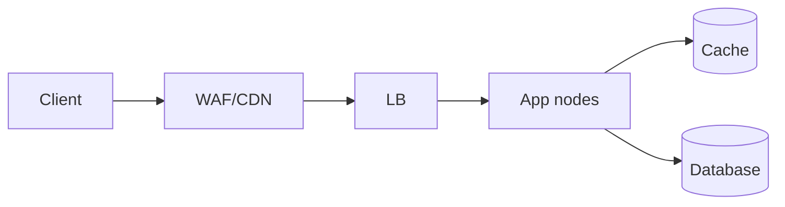

# Bottleneck Identification

## 1. One-Line Definition
A bottleneck is the single resource or component that limits the system's total throughput or latency growth — removing it raises capacity; ignoring it means extra investment buys nothing.

## 2. Why Do We Need It?
You cannot scale what you cannot name. Most scaling failures are not "needs more machines" but "this one component saturates no matter how many machines you add." Identifying the bottleneck is the difference between adding hardware and adding capacity.

## 3. Simple Intuition
A highway with 10 fast lanes feeding a single toll booth: adding more highway is pointless because every car queues at the booth. The booth is the bottleneck. Find the narrowest pipe in the request path, fix that one, and the whole system breathes.

## 4. What Happens Without It?
Teams add instances behind a load balancer, then wonder why requests still fail. The hidden database, the single Redis connection pool, the hot shard, or the shared lock is silently saturated. Money is spent, latency stays bad, and debuggability is poor because nobody measured the path.

## 5. Core Idea
Find bottlenecks systematically:
1. **Instrument every hop** — latency, QPS, utilisation per component (metrics + tracing).
2. **Identify the saturated resource** — CPU, memory, disk I/O, network, DB connections, locks, GC. Utilisation ~100% on any of these = ceiling.
3. **Confirm by experiment** — load test: inject traffic and watch which component's latency/QPS stops scaling.
4. **Fix the specific resource**, then **re-measure**: bottlenecks move (fix the DB, now the cache becomes the limit).

Common high-level bottlenecks by tier: web/app CPU, memory/GC; DB connection pool, disk I/O, lock contention; cache capacity/temperature (hot keys); network bandwidth; queue consumer lag; DNS/LB; a single hot key in a sharded store.

**Queuing insight:** utilisation near 100% → queueing delay explodes non-linearly. A resource at 95% utilisation can have 20x worse queueing than at 50%.

## 6. Important Terminology

| Term           | Simple Meaning                                           |
| -------------- | -------------------------------------------------------- |
| Bottleneck     | The limiting resource on the path                        |
| Utilisation    | % of a resource that is busy                             |
| Saturation     | Resource at/near 100% — queue forms                      |
| Queueing delay | Waiting time behind a busy resource                      |
| Hotspot        | One node/key/shard with disproportionate traffic         |
| Critical path  | The serial chain of dependencies a request must traverse |
| Contention     | Multiple threads waiting for the same resource           |

## 7. Basic Architecture



For each arrow/box, you ask: which is the narrowest? A classic answer: DB pool is 95% utilised while CPU is 20% → the DB connections are the bottleneck, not compute.

## 8. Request or Data Flow
Trace one request end-to-end: DNS → LB → app → cache/DB. At each step record: time, QPS, utilisation, error rate. The step whose utilisation approaches 100% (or whose latency dominates p99) under concurrency is the bottleneck. Repeat after every fix.

## 9. Practical Example
**E-commerce search (assumptions):** p99 rises at 50% of target load.
- Metrics show: app CPU 30%, DB CPU 90%, DB connection pool 100%, Redis 20%.
- Conclusion: the **database**, not the app tier, is the bottleneck — specifically connection exhaustion.
- Fixes in order: pool sizing + query caching → push hot query results to Redis → separate read replica for search. Re-measure after each.

## 10. Scaling
Bottlenecks appear at each scale band:
- 10k users → app CPU/DB connections.
- 100k users → DB I/O, single cache node, network egress.
- 1M users → hot shards, fan-out tax, cross-DC latency, write amplification.
Add capacity to the *identified* bottleneck only; a balanced system's bottleneck is always present and always moving.

## 11. Reliability and Failure Scenarios
- **Partial outage from saturation:** bottleneck saturates → timeouts → clients retry → retry storm melts the system (cascade). Mitigate: backpressure, load shedding, circuit breakers.
- **Detection:** USE metrics — **U**tilisation, **S**aturation, **E**rrors per resource. High utilisation + high latency = saturated.
- **Recovery:** shed non-critical traffic, reduce concurrency (admission control), fail over the saturated component.
- **Cold cache after deploy:** caches are coldest right after the largest traffic spike (deploy) — warm them or expect a stampede.

## 12. Consistency and Correctness
Bottlenecks often come from correctness mechanisms: strong-consistency reads hit the primary (skip replicas), transactions hold locks, idempotency lookups double I/O. Optimise the bottleneck without relaxing correctness — move reads to replicas for eventually-consistent-tolerant data.

## 13. Performance
Performance and bottlenecking are the same question from two sides: performance = how fast per request; bottleneck = what limits the total. When you optimise the bottleneck, p99 falls because queueing delay disappears.

## 14. Security
Rate limiting and WAF can become their own bottlenecks under attack or heavy legitimate traffic. Load shed aggressively today to keep the system up; verify security layers can process the design's peak QPS.

## 15. Trade-Offs

| Choice | Advantages | Disadvantages | When to Use |
|--------|------------|---------------|-------------|
| Over-provision | Simple, safe | Wastes money; may still hit shared resource | Early stage |
| Fix on evidence | Efficient | Needs good metrics/tracing | Steady growth |
| Read replica for hot reads | Cheap | Stale reads, extra storage | Read-heavy DB bottleneck |
| Cache hot path | Big win | Invalidation, cold-start risk | Read-heavy, hot keys |
| Shard / partition | Scales writes/storage | Rebalancing, cross-shard queries | Data- or write-bound growth |

## 16. Common Mistakes
- Guessing "it's the DB" without measuring — metrics first, fix second.
- Optimising a non-bottleneck (the fastest component) and calling it progress.
- Sizing for peak utilisation ~100% — queueing theory says leave headroom (typically 60-80% target).
- Ignoring **latency as evidence**: high p99 with low utilisation = a slow dependency or a lock/hotspot, not necessarily saturation.

## 17. HLD vs LLD Boundary
HLD: which tier is the bottleneck, what to add (replica/shard/cache/LB), sizing. LLD: a specific lock in code, a specific query plan, goroutine/thread contention inside one service.

## 18. Interview Questions

### Beginner
- What is a bottleneck and why is it important?
- Name three common database bottlenecks.

### Intermediate
- Your app tier is 20% utilised but p99 is bad. Where do you look next?
- How do USE metrics help find a bottleneck?

### Advanced
- After adding a read replica, throughput didn't improve. What's the likely cause and how do you prove it?
- How do you keep retries from turning a partial bottleneck into a full outage?

## 19. Interview Memory Summary

> [!abstract]- Interview Memory Summary

### Remember

- A bottleneck is the component limiting growth — removing it raises capacity.
- Find it with metrics (USE) and load tests, not guessing.
- Queueing explodes near 100% utilisation — leave headroom (60-80% target).
- Bottlenecks move after each fix — re-measure.
- Protect against retry storms when saturated.

### 30-Second Explanation

Measure every tier, find the saturated resource, fix it, re-measure; expect the bottleneck to move.

### Interview Traps

- "Add more app servers" when the shared DB or a hot key is the real ceiling — always name the exact saturated resource.
- Guessing "it's the DB" without measuring — metrics first, fix second.
- Optimising a non-bottleneck (the fastest component) and calling it progress.
- Ignoring latency as evidence: high p99 with low utilisation = a slow dependency or lock/hotspot, not saturation.

### Key Trade-Off

You cannot scale what you cannot name — so you pay an observability cost (metrics, tracing, load tests) to find the single saturated resource, and fixing it merely moves the bottleneck to the next one.

## 20. Related Concepts

### Prerequisites

- [[latency-vs-throughput|Latency vs Throughput]]

### Commonly Used Together

- [[observability|Observability]]
- [[golden-signals|Golden Signals]]
- [[distributed-tracing|Distributed Tracing]]
- [[load-balancing|Load Balancing]]
- [[capacity-estimation|Capacity Estimation]]

### Advanced Concepts

- [[circuit-breaker|Circuit Breaker]]
- [[retry-and-timeout|Retry and Timeout]]

## 21. References
Brendan Gregg's USE method; Google SRE Book chapters on capacity and saturation. Verify current practice with load-testing documentation.

## 22. Active Recall

Test yourself before revealing each answer.

> [!question]- What problem does identifying the bottleneck solve?
> You cannot scale what you cannot name: most scaling failures are "this one component saturates no matter how many machines you add" — adding hardware isn't adding capacity until you know which component is the constraint. That's the difference between spending money and growing capacity.

> [!question]- What is a bottleneck and why does removing it matter?
> The single resource or component that limits the system's total throughput or latency growth. Removing it raises capacity; ignoring it means extra investment buys nothing — like widening a highway that still feeds one toll booth.

> [!question]- How do you find a bottleneck instead of guessing?
> 1. Instrument every hop (latency, QPS, utilisation — metrics + tracing). 2. Identify the saturated resource (CPU, I/O, connections, locks, GC at ~100%). 3. Confirm by load test: inject traffic and watch which component stops scaling. 4. Fix that resource, then re-measure — bottlenecks move.

> [!question]- Why does a resource at 95% utilisation cause 20x worse queueing than at 50%?
> Utilisation near 100% → queueing delay explodes non-linearly. Little's Law shows in-flight work = latency × throughput, and a nearly-full resource forms a queue where every arriving request waits. Sizing to ~60-80% utilisation (headroom) prevents the latency cliff.

> [!question]- What do you give up to know your bottleneck precisely?
> You invest in observability (metrics, tracing, load-testing tooling) and monitoring cost, plus the operational discipline to act on evidence. The alternative — over-provisioning "to be safe" — wastes money and can still hit an invisible shared resource the same way.

> [!question]- After adding a read replica, throughput didn't improve. What's the likely cause?
> The bottleneck wasn't DB reads: maybe DB writes, the app tier, connection pooling, or a hot key on a single shard. That's the classic "bottleneck moved / wasn't where I guessed" failure — prove it with utilisation data before and after, and check p99 vs saturation.

> [!question]- A saturated bottleneck starts throwing timeouts. What happens next and how do you stop it?
> Clients retry, retries multiply load, and the retry storm melts the system (cascade). Mitigate: backpressure, load shedding (drop non-critical traffic), admission control (reduce concurrency), and circuit breakers so failing dependencies fail fast instead of amplifying.

> [!question]- Interview scenario: e-commerce search p99 rises at 50% of target load.
> 1. Metrics: app CPU 30%, DB CPU 90%, DB connection pool 100%, Redis 20% → the DB — specifically connection exhaustion — is the bottleneck, not the app tier.
> 2. Fixes in order: pool sizing + query caching → push hot query results to Redis → separate read replica for search.
> 3. Re-measure after each step — the bottleneck will move.

## 23. When Should I Use This?

### Use it when

- Performance/p99 is bad and you must decide which tier deserves the next investment.
- You scale out and throughput stops growing — find the shared point (DB pool, cache node, hot key).
- You must write or evaluate load tests and want the right question ("which component saturates first?").
- You're triaging a partial outage and need to know whether saturation causes it.

### Avoid it when

- You can clearly name the bottleneck from known capacity math and don't need new measurement.
- The system is too small to matter yet — a nose-to-the-glass pass is cheaper than full instrumentation.
- The problem is a correctness bug, not a capacity limit — metrics won't find wrong results without result-quality checks.

### What problem does it solve?

Problem: teams add instances and money while the hidden database, single connection pool, hot shard, or shared lock stays silently saturated — debuggability is poor because nobody measures the path. Solution: a systematic loop (instrument every hop → find the saturated resource via USE metrics → confirm by load test → fix → re-measure), so investment lands on the actual ceiling.

### What problem does it NOT solve?

It doesn't tell you why a dependency is slow (distributed tracing + code inspection do), it doesn't fix wrong results or correctness bugs, and it can't protect a saturated system from retry storms by itself — you still need circuit breakers, backpressure, and load shedding as the safety layer.

## 24. Decision Connections

Decisions that go together with bottleneck identification:

- [[latency-vs-throughput|Latency vs Throughput]] — the measurements (p99, QPS) that expose the bottleneck.
- [[capacity-estimation|Capacity Estimation]] — estimates give you expected ceilings to compare measured saturation against.
- [[observability|Observability]] — metrics + tracing are how utilisation per hop is actually captured.
- [[golden-signals|Golden Signals]] — latency, traffic, errors, and saturation: the four signals that reveal the limiting resource.
- [[distributed-tracing|Distributed Tracing]] — pinpoints the slow hop when utilisation is low but p99 is high.
- [[load-balancing|Load Balancing]] — the layer where health checks and rerouting respond to a saturated app tier.
- [[circuit-breaker|Circuit Breaker]] — stops a saturated dependency from melting the whole caller.
- [[retry-and-timeout|Retry and Timeout]] — backoff + jitter so retries don't turn a bottleneck into a storm.

Decision tree:

```
System is slow / not scaling
    |
    +-- High p99 with LOW utilisation?
    |      → slow dependency, lock, or hotspot — not saturation
    |         → [[distributed-tracing|Distributed Tracing]], check callers
    |
    +-- A resource near 100% utilisation?
    |      → [[observability|Observability]] + USE metrics to name it
    |         +-- App CPU?          → more stateless nodes behind [[load-balancing|Load Balancing]]
    |         +-- DB connections?   → pool sizing, query caching, read replica
    |         +-- Single hot key?   → split/fan-out/cache that key
    |
    +-- Saturated and throwing timeouts?
    |      → [[circuit-breaker|Circuit Breaker]] + [[retry-and-timeout|Retry and Timeout]] (backoff, jitter, shedding)
    |
    +-- Size the target first?
           → [[capacity-estimation|Capacity Estimation]]
    +-- Monitor on the 4 signals?
           → [[golden-signals|Golden Signals]]
```