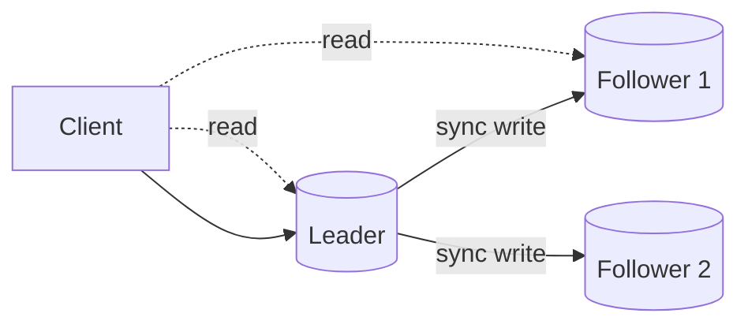

# Consistency

## 1. One-Line Definition
Consistency is the guarantee about what a reader sees after writes across the system — whether every read returns the latest, globally agreed value, or whether briefly stale/divergent views are allowed in exchange for speed and availability.

## 2. Why Do We Need It?
Once data lives on more than one machine (replicas, shards, caches, microservices), a single write is no longer a single mutation: it spreads asynchronously. Readers at different nodes can legitimately disagree unless the system orders and publishes updates in a consistent way. Consistency rules define the contract users rely on — a payment must not disappear after confirmation, a profile edit must show up on the next refresh — and choosing the right level is one of the highest-leverage decisions in any design.

## 3. Simple Intuition
A family group chat where one person announces "dinner at 7". If the message is delivered instantly to everyone (strong consistency), no second-guessing. If delivery can lag (eventual consistency), some people show up at 7, others at 7 since they read later, and a few argue about the time. You accept lag when it's harmless — but never for the person who takes the order.

## 4. What Happens Without It?
Without an explicit consistency model, users experience the worst of all worlds: writes appear and disappear depending on which node answers, decremented balances re-materialize, edits silently overwrite each other, and replica-administered reads contradict the primary. Support tickets rise, reconciliation scripts multiply, and every "fix" lurches the system between behaviors nobody can reason about.

## 5. Core Idea
Consistency is not one switch; it is a spectrum of *guarantees*:
- **Strong (linearizable) consistency:** once a write is acknowledged, every subsequent read everywhere returns it — ordered as if a single machine ran everything. Slow and fragile under partitions.
- **Eventual consistency:** replicas converge over time to the same value if writes stop; reads may be stale in between. Fast and available; reasoning burden shifts to the app.
- **Session guarantees in between:** read-your-writes, monotonic reads, writes-follow-reads — shaped to what products actually need (see [[strong-vs-eventual-consistency|Strong vs Eventual Consistency]]).
- **The mechanism:** ordering + propagation. Consensus (see [[consensus|Consensus]]) picks a serial order; replication (see [[database-replication|Database Replication]]) propagates it; conflict resolution (LWW, version vectors — planned) decides ties when ordering is relaxed.
- **Why it's constrained:** the network can't be perfectly reliable and instantaneous, so you pay in latency (waiting for consensus) or in availability (refusing to serve if you can't be sure you're current). See [[cap-theorem|CAP Theorem]] and [[global-consistency|Global Consistency]].

## 6. Important Terminology

| Term | Simple Meaning |
|------|----------------|
| Strong consistency | Every read sees every earlier acknowledged write |
| Eventual consistency | Copies converge eventually; reads may be stale |
| Linearizability | Operations appear in a single real-time order |
| Read-your-writes | You always see your own latest write |
| Monotonic reads | Later reads never see older state than earlier reads |
| Replication lag | How far behind a copy is (see [[replication-lag|Replication Lag]]) |
| Consensus | Getting nodes to agree on one order |
| Conflict resolution | Deciding the winner when copies diverged |
| Quorum | Minimum nodes that must agree for a read/write |

## 7. Basic Architecture



## 8. Request or Data Flow
1. Write goes to the leader; with sync replication (or quorum) enough copies acknowledge before the caller is told success.
2. A strong-consistency read can be served by any node that has applied that write — commonly the leader or a read-your-writes-pinned replica.
3. An eventual-consistency read hits any replica, which may still be applying the write; it returns what that node has locally.
4. The same write becomes visible at different times on different nodes — that spread is the consistency model in action.

## 9. Practical Example
**E-commerce cart (assumptions):** reads mostly happen right after writes by the same user; inventory counts are contested by everyone.
- Session-scoped reads use read-your-writes, so a user's own add-to-cart appears instantly — cheap, no global consensus.
- Inventory uses strong/quorum reads on reserve so two buyers can't take the last item.
- "Number of likes" is allowed eventual consistency — lag of seconds is invisible to users.

## 10. Scaling
Strong consistency scales poorly: every read must wait for ordering, so nodes become a bottleneck and the system degrades under partitions. Scaling levers: partition data so most operations are single-key (strong consistency stays cheap *within* a partition — see [[sharding|Sharding]]), shard by tenant, relax to session guarantees, or move to conflict-resolving eventual consistency with CRDTs (see [[crdt|CRDTs]]) where the domain tolerates it. The general rule: consistency guarantees shrink as nodes-per-operation grow, so co-locate what must be strongly consistent.

## 11. Reliability and Failure Scenarios

| Failure | What Happens | Detection | Recovery | Trade-off |
|---------|--------------|-----------|----------|-----------|
| Network partition | Nodes can't sync writes | Heartbeat/quorum status | Serve majority side; minority waits | Consistency vs availability |
| Replica lags badly | Stale reads for everyone | Lag metric (see [[replication-lag|Replication Lag]]) | Route reads to leader, catch up | Latency on hot path |
| Diverged copies | Conflicting values after split | Conflict detection | LWW/version-vector merge | Data lineage decisions |
| Quorum half-lost | Neither side has majority | Majority detection | Wait for partition heal; refuse writes meanwhile | Availability drop |

## 12. Consistency and Correctness
Consistency is what makes correctness visible across nodes: idempotent writes (see [[idempotency|Idempotency]]) prevent re-delivery from corrupting state, versioned writes stop lost-update overwrites, and transactional boundaries (see [[transactions-and-acid|Transactions and ACID]]) define how many keys must change atomically. Effortful cases — decrements, "last write wins", multi-key moves — should be *named* in the design, not discovered mid-incident.

## 13. Performance
The performance story of consistency: strong = every read/write waits on ordering + the slowest required ack (high p99, bounded availability); eventual = local reads, cheap writes, occasional replay. Quorum reads (see [[cap-theorem|CAP Theorem]] for the W/R interplay) trade latency and availability in fine increments, which is why systems expose tunable quorums rather than an all-or-nothing switch.

## 14. Security
Consistency has security edges: stale reads can *authorize* (a revoked token still accepted by a lagging replica — pin auth reads to a strongly consistent view), and conflict resolution must not let an attacker's "last write" silently overwrite a legitimate one (version the write, authorize the writer). Caches shared across tenants must also implement per-tenant isolation (see [[tenancy-and-cells|Multi-Tenancy and Cell-Based Architecture]]).

## 15. Trade-Offs

| Choice | Advantages | Disadvantages | When to Use |
|--------|------------|---------------|-------------|
| Strong consistency | Predictable, correct reads | Slow, fragile under partitions | Money, inventory, auth |
| Read-your-writes | Cheap and feels correct | Only fixes the self-view | User's own data paths |
| Eventual consistency | Fast, available, scales | Stale/divergent reads | Counters, feeds, profiles |
| Quorum reads/writes | Tunable middle ground | Complexity; still weaker than linearizable sometimes | Balanced workloads |
| CRDT convergence | No resolvers needed | Semantics limited to merge-friendly ops | Collaborative state, offline |

## 16. Common Mistakes
- Using "eventually consistent" as a blanket excuse — designs that silently tolerate stale *authorization or money* reads.
- Building read-your-writes by accident instead of by design (pinning is a promise you must keep).
- Confusing linearizable with "ordered" — order within a shard isn't order across the system.
- Choosing strong consistency globally, then discovering every remote read is now the bottleneck.
- Ignoring that conflict resolution (LWW) silently *loses updates* when two writers edit the same field.

## 17. HLD vs LLD Boundary
HLD: the consistency model per data path (strong vs eventual vs session), quorum sizes, where the leader/source of truth lives, propagation mode, conflict-resolution policy. LLD: the specific token/lease pinning code, conflict-merge implementations, and per-operation read-path routing in a client driver.

## 18. Interview Questions

### Beginner
- What does "eventual consistency" actually guarantee?
- Why can't you have strong consistency everywhere for free?

### Intermediate
- Pick consistency models for cart, inventory, and likes in one commerce design. Defend each.
- A read-your-writes guarantee needs a mechanism. What is it and when does it break?

### Advanced
- Design conflict resolution for an offline-first notes app where two devices edited the same line.
- How do quorum read/write sizes (W + R > N) trade consistency against availability?

## 19. Interview Memory Summary

> [!abstract]- Interview Memory Summary

### Remember

- Consistency = a named guarantee about what reads see after writes.
- Not one switch — a spectrum: strong, session, eventual.
- Strong: read always sees acknowledged writes; costs latency + availability.
- Eventual: copies converge; reads may be stale; app must tolerate it.
- Read-your-writes and monotonic reads cover the common product cases cheaply.
- Consensus orders, replication spreads, conflicts must be resolved.
- Choose per data path, never globally.

### 30-Second Explanation

For each data path, pick the *weakest consistency that satisfies the product*: strong/quorum for money and inventory, read-your-writes for a user's own data, eventual for counts and feeds — implement via quorums, pinning, and versioned writes, and never let stale views serve decisions that matter (auth, payments).

### Interview Traps

- "We use eventual consistency" without stating the conflict-resolution story.
- Demanding linearizability for everything — the SLO collapses under partitions.
- Misspelling the guarantee: eventual is *convergence*, not *instant agreement*.
- Forgetting stale reads can authorize or charge things.

### Key Trade-Off

Stronger consistency trades latency, availability, and node scale for reader confidence; the right design picks the weakest guarantee each path can live with, so strong consistency stays reserved for the few paths where it pays.

## 20. Related Concepts

### Prerequisites

- [[cap-theorem|CAP Theorem]]
- [[strong-vs-eventual-consistency|Strong vs Eventual Consistency]]
- [[database-replication|Database Replication]]

### Commonly Used Together

- [[replication-lag|Replication Lag]]
- [[transactions-and-acid|Transactions and ACID]]
- [[idempotency|Idempotency]]

### Alternatives

- [[distributed-transactions|Distributed Transactions]] (multi-key atomicity as the strong-consistency tool across services)

### Advanced Concepts

- [[consensus|Consensus]]
- [[raft-and-paxos|Raft and Paxos]]
- [[crdt|CRDTs]]
- [[global-consistency|Global Consistency]]

Related planned topics (not authored yet): session guarantees catalogue, version vectors and conflict resolution.

## 21. References
Kleppmann *Designing Data-Intensive Applications* ch. 5 and 7 (replication, consistency models); Herlihy & Wing's linearizability paper; CAP and PACELC discussions (see [[cap-theorem|CAP Theorem]]). Verify current provider isolation levels with vendor docs.

## 22. Active Recall

Test yourself before revealing each answer.

> [!question]- What does eventual consistency guarantee exactly, and what doesn't it guarantee?
> It guarantees convergence: if writes stop, all copies will agree over time (absent loss). It does not guarantee when, and does not guarantee that any given intermediate read is fresh. Reads can be stale indefinitely if the tail is slow; the model only promises eventual agreement.

> [!question]- Why can't strong consistency be free?
> Every read must be sure it sees the latest acknowledged write, which requires ordering and agreement across nodes — that takes communication (latency) and stalls reads during network partitions or node loss (availability). Per CAP/PACELC you sacrifice latency or availability to buy that certainty.

> [!question]- An e-commerce site: which paths deserve strong consistency and which tolerate eventual?
> Strong: inventory reserves, price commits, auth/authorization reads — a wrong answer is a real cost. Eventual: view counts, "people bought this too", follower lists, like counts — seconds of staleness are invisible. Session (read-your-writes): the user's own cart and profile edits, so their next read sees their own change without global consensus.

> [!question]- Your app promises read-your-writes via a replica. What mechanism and when does it break?
> Pin a session to a replica that has applied that user's writes (e.g., route reads by session to a node known to be at or past the user's write timestamp/LSN). It breaks if the pinned node fails mid-write, if reads are re-routed by the LB to another replica, or if the user moves devices/sessions — each case must re-pin or fall back to the leader.

> [!question]- Trade-off: last-write-wins conflict resolution. What silent bug does it cause?
> Two writers editing the same field (e.g., a profile) overwrite each other's change, no matter which was intended — LWW discards one. The fix path is version stamps/vector clocks to detect concurrent edits, then merge or prompt. LWW is cheap and fine for monotonic fields like counters; dangerous for concurrent human edits.

> [!question]- Interview scenario: two users somehow reserve the same last inventory item. Which consistency decision produced this?
> The reservation path was not strongly consistent (likely two replicas, or two shards, or a stale cache) — each user saw zero count at their node. Fix: reserve via a single strongly-consistent counter, or a DB constraint/unconditional decrement with a check that replays on failure, or a single-key distributed lock. State which consistency the reserve operation actually had, then make it strong or serialize it.

## 23. When Should I Use This?

### Use it when

- Data is replicated, cached, or sharded — the instant more than one node answers.
- Multiple writers can touch the same field/entity (concurrent edits need a rule).
- Reads happen at different times from different nodes/services (cross-service state).
- You need to state guarantees users can rely on (payments visible, edits persist).

### Avoid it when

- Single machine, single store, single writer — no consistency question exists yet (that machine is your strong guarantee).
- The data is disposable and divergence is genuinely harmless (metrics snapshots).

### What problem does it solve?

It defines what "correct" means when reads can happen anywhere. Named per path, it prevents disappearing writes, stale-with-authority reads, silent overwrites, and reconciliation chaos — while keeping costs (latency, availability, complexity) proportional to what each path actually needs.

### What problem does it NOT solve?

It doesn't make the network reliable (partitions still happen; consistency choices only define the aftermath), it doesn't stop data loss (see [[durability|Durability]]), and it can't make divergent intents converge without an explicit resolution policy — strong consistency just moves the ordering problem elsewhere.

## 24. Decision Connections

Decisions that go together with consistency:

- [[cap-theorem|CAP Theorem]] — the frame that says you cannot have all three corners.
- [[strong-vs-eventual-consistency|Strong vs Eventual Consistency]] — the two ends of the spectrum you'll choose between.
- [[database-replication|Database Replication]] — the mechanism that spreads writes into copies needing rules.
- [[replication-lag|Replication Lag]] — the measurable divergence that tells you how much staleness is real.
- [[consensus|Consensus]] — how nodes agree on one order when strong consistency matters.
- [[crdt|CRDTs]] — merge-friendly eventual consistency for collaborative state.
- [[transactions-and-acid|Transactions and ACID]] — the single-node strong-consistency baseline.
- [[durability|Durability]] — the sibling guarantee: data must survive as well as agree.

Decision tree:

```
Multiple copies of the data can serve reads?
    |
    +-- No → single store: [[transactions-and-acid|Transactions and ACID]] covers it
    |
    +-- Yes → pick per path
    |      +-- Money / inventory / auth-writes?
    |      |      → strong / quorum reads and writes
    |      |      → serialize via [[consensus|Consensus]]-based leader
    |      +-- Same user reads their own writes?
    |      |      → read-your-writes pinning (session guarantee)
    |      +-- Everyone reads roughly-current data, no cross-claims?
    |      |      → [[strong-vs-eventual-consistency|eventual consistency]] + monitoring lag
    |      +-- Offline writes / concurrent edits?
    |             → [[crdt|CRDTs]] or version-vector merge
    |
    +-- Region-scale reads?
           → [[global-consistency|Global Consistency]] / active-active
```