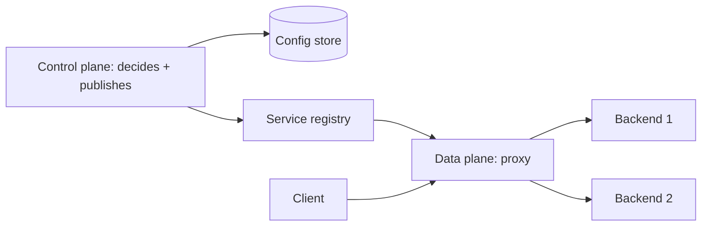

# Control Plane vs Data Plane

## 1. One-Line Definition
The control plane is the brain that decides what should happen (configuration, routing tables, policies, orchestration); the data plane is the muscle that does it on every request (forwarding packets, serving requests, executing rules) — and the two have different latency, scale, and failure requirements.

## 2. Why Do We Need It?
If every packet or request had to ask "head office" how to be handled, traffic would crawl and the system would die with the office. The split exists because decisions (what policy applies, where this VIP routes, how an app should be deployed) change rarely, while execution (millions of requests per second) happens everywhere. Keeping the planes separate lets each be engineered for its own job: the data plane fast and hot-path, the control plane safe and consistent.

## 3. Simple Intuition
A highway network. The traffic department (control plane) designs the rules — speed limits, turn signs, closures — once in a while. Drivers (data plane) act on those rules instantly at every intersection without calling the department each time a light changes. Occasionally the department updates a sign; drivers adapt on the next pass. If drivers had to phone the department per turn, traffic would stop.

## 4. What Happens Without It?
Two failure modes. First: the data plane consults the central brain per request — every packet and API call pays a control-plane round trip, latency explodes, and one brain failure kills all traffic. Second: the control plane is treated like a hot path — configuration writes race with traffic, policy updates drop requests, and a "config save" can take down production. The split exists precisely to keep these failure domains apart.

## 5. Core Idea
- **Control plane (slow, rare, correct):** *decides* and *propagates*: checks routing tables, policies, service endpoints, desired deployments, quotas. Changes are infrequent; consistency and auditability matter more than speed. Typical hosts: orchestrators (see [[kubernetes|Kubernetes]]), service registries (see [[service-discovery|Service Discovery]]), API gateways' policy config, DNS masters, clustering coordinators (see [[consensus|Consensus]]).
- **Data plane (fast, constant, hot):** *executes* on the live payload: forwards packets, serves API calls, applies the cached policy. Every microsecond counts; it cannot stop to ask. Typical hosts: load balancers/proxies (see [[reverse-proxy|Reverse Proxy]], [[load-balancing|Load Balancing]]), API gateway's request front, SDN switches, the serving code of an application.
- **The contract between them:** the control plane decides, the data plane *executes the last known good policy* while the control plane updates. The data plane should degrade gracefully *without* contacting the control plane — worst case: continue with the stale policy (see [[resilience|Resilience]]).
- **Observability of the handoff:** a propagating config change is the classic cause of "we changed nothing and it broke" — the control plane published, the data planes reacted seconds/minutes later, unevenly.

## 6. Important Terminology

| Term | Simple Meaning |
|------|----------------|
| Control plane | Decides and propagates state changes |
| Data plane | Executes policy on live traffic |
| Stateless data plane | Forward decisions without consulting a registry |
| Desired state | What the control plane wants the world to be |
| Reconciliation | Control plane converging real to desired state |
| Config propagation | How decisions reach the executing nodes |
| Fencing | Stopping a stale control-plane actor |
| Fail-open / fail-closed | Data plane behavior when control plane is unreachable |

## 7. Basic Architecture



## 8. Request or Data Flow
1. Operators declare state to the control plane (a service's desired replicas, a routing policy).
2. The control plane persists it and propagates the decision (to the orchestrator's workers, the proxy's config endpoint).
3. The data plane — the proxy/load balancer — applies the new policy locally and serves traffic without further consultation; every request is local and fast.
4. If the control plane dies, the data plane keeps serving with the last known policy — traffic survives; reconciliation waits for the brain to return.

## 9. Practical Example
**Service mesh / gateway (assumptions):** a gateway routes to 40 services by path.
- Control plane: computes the routing table from service discovery and policy, publishes it, and keeps it consistent (a separate, small, replicated store).
- Data plane: the gateway caches the table locally and routes each request in microseconds with zero coordination.
- Config change: a new canary version appears — the control plane updates the table; the gateway picks it up without dropping a connection; if discovery is briefly wrong, the gateway retries the old route (last-known-good) instead of 404ing everything.

## 10. Scaling
The data plane scales horizontally by adding stateless replicas (each locally serves traffic — see [[load-balancing|Load Balancing]], [[reverse-proxy|Reverse Proxy]]); the control plane scales by keeping its own state small and replicating it, not by asking every proxy. Watch the propagation: as the fleet grows, control-plane config storms (every node reloading simultaneously) and uneven rollout (half the proxies on old rules) are the classic scale failures. The answer is rate-limited, versioned propagation plus version-lagged acceptance windows.

## 11. Reliability and Failure Scenarios

| Failure | What Happens | Detection | Recovery | Trade-off |
|---------|--------------|-----------|----------|-----------|
| Control plane down | No new decisions, no reconfig | Heartbeat, consensus quorum | Quorum failover; data plane keeps serving | Control plane is small but critical |
| Config propagation storm | All proxies reload at once | Reload-rate metrics | Rate limit, spread rollouts | Slower propagation |
| Split-brain control plane | Two conflicting policies | Leader election (see [[raft-and-paxos|Raft and Paxos]]) | Fence the loser | Eventual availability loss |
| Stale config on plane | Requests routed by old rules | Config-checksum monitoring | Re-sync from registry | Window of wrongness |
| Data plane crashed | Traffic stops for its slice | Health/consumer loss | Auto-restart, LB routes around | Redundant proxies needed |

## 12. Consistency and Correctness
The control plane's consistency is *decision* consistency — it should agree on the desired state (via replicated store + consensus, see [[consensus|Consensus]], [[raft-and-paxos|Raft and Paxos]]), never two authors at once, and propagate *versions* so the data plane can tell which policy it holds. The data plane must be correct under staleness: it executes the last-known-good policy and must not fail-closed if the control plane blips (decide per path whether stale-forwarding is acceptable or whether fail-closed is required for safety, e.g., revoked access).

## 13. Performance
The data plane is where latency lives or dies: zero control-plane calls on the hot path, local policy lookup, and hardware/nic acceleration where needed. The control plane is performance-tolerant (configuration-rate writes, not per-request) but must not leak into the hot path: watch propagation latency (a slow control plane makes config changes feel like outages) and reconfiguration overhead (each rule change should cost near-zero on the next request).

## 14. Security
The control plane is a high-value target: whoever writes config controls all traffic — protect it with strong auth, audit, and separate credentials from the data plane (least privilege, see [[authentication-vs-authorization|Authentication vs Authorization]]). Mutating a control plane warrants mTLS and signed config; the data plane must reject tampered policy. Also: fail-closed vs fail-open security decisions live exactly here — when the control plane is unreachable, do you refuse (secure) or keep serving stale policy (available)?

## 15. Trade-Offs

| Choice | Advantages | Disadvantages | When to Use |
|--------|------------|---------------|-------------|
| Inline (every request asks center) | Always-current policy | Latency, central SPOF | Trivial scale only |
| Pushed/cached policy | Fast data plane, survives brain loss | Staleness window | Almost all real systems |
| Control plane with quorum | Consistent decisions | Small cluster to run | Any real deployment |
| Fail-open data plane | Traffic survives brain loss | Stale/possibly-wrong policy served | Non-security-critical |
| Fail-closed data plane | Never serves wrong policy | Outage when brain unavailable | Access-control critical |

## 16. Common Mistakes
- Putting decision logic on the request path (a routing "lookup" that talks to the registry per request — that's a control-plane leak).
- Treating the control plane like disposable config: no backups, no consensus, one author that split-brains silently.
- Config propagation without versioning — can't tell which plane executed which policy.
- Load-balancer health checks and config reloads storming simultaneously during a rollout.
- Deciding fail-open vs fail-closed by accident rather than per path (auth should usually fail-closed).

## 17. HLD vs LLD Boundary
HLD: plane placement, how decisions propagate (push/pull, versioned), control-plane consistency (quorum), data-plane fail-open/fail-closed posture, propagation limits, who mutates config. LLD: the specific proxy config format and reload logic, the registry client library's cache/retry code, the control-plane API's reconciliation loop implementation.

## 18. Interview Questions

### Beginner
- What is the difference between the control plane and the data plane?
- Why must the data plane not ask the control plane on every request?

### Intermediate
- A config change takes effect on 60% of proxies instantly and 40% an hour later. Diagnose and standardize.
- When is fail-open the right data-plane behavior, and when is it a security bug?

### Advanced
- Design a global traffic-routing system (DNS + proxies) whose control plane can lose a region without dropping traffic.
- How do you protect a control plane that mutating it controls all traffic in the fleet?

## 19. Interview Memory Summary

> [!abstract]- Interview Memory Summary

### Remember

- Control plane decides; data plane executes.
- Decisions are rare and consistent; execution is constant and fast.
- The data plane must work from local, cached, last-known-good policy.
- Config propagation is versioned and rate-limited, or rollouts storm.
- Control plane needs consensus + fencing, like any critical state.
- Fail-open vs fail-closed is a per-path security decision.
- The control plane is the highest-value target in the system.

### 30-Second Explanation

Keep decision-making in a small, consistent control plane (replicated store + quorum), never on the request path; push versioned policy to stateless data planes that serve locally and keep serving last-known-good when the brain blips; and decide per path whether stale is acceptable (fail-open) or only refusal is (fail-closed).

### Interview Traps

- A routing/registry call on the hot path called "the design".
- Unversioned config changes you can't map to live behavior.
- One-author control plane that split-brains silently.
- Presenting fail-open as the default for everything, including auth.

### Key Trade-Off

The split buys hot-path speed and brain-loss survivability by accepting a policy staleness window and a control plane that is small, critical, and must be operated with consensus discipline — you are trading immediacy of decisions for resilience of execution.

## 20. Related Concepts

### Prerequisites

- [[load-balancing|Load Balancing]]
- [[reverse-proxy|Reverse Proxy]]

### Commonly Used Together

- [[service-discovery|Service Discovery]]
- [[service-mesh|Service Mesh]]
- [[kubernetes|Kubernetes]]
- [[dns|DNS and DNS Resolution]]

### Alternatives

- [[distributed-systems|Distributed Systems]] (the coordination family this belongs to)

### Advanced Concepts

- [[consensus|Consensus]]
- [[raft-and-paxos|Raft and Paxos]]
- [[geo-dns-anycast|Geo-DNS and Anycast]]
- [[edge-computing|Edge Computing]]

## 21. References
Standard SDN literature (OpenFlow's control/data plane split); service mesh and gateway docs (Envoy, Istio, Kong) on xDS/control plane fragments; cloud provider docs on managed control planes. Verify current propagation semantics with vendor docs.

## 22. Active Recall

Test yourself before revealing each answer.

> [!question]- Why can't the data plane consult the control plane per request?
> Because per-request consultation moves a microsecond hot path onto a shared, authoritative brain: every request pays a network round trip plus the brain's queue, throughput collapses at the brain's limit, and the brain's failure becomes every request's failure. The data plane exists to serve locally; the control plane to decide rarely.

> [!question]- What does "the proxy keeps serving last-known-good" mean in a control-plane outage?
> The proxy cached the last policy it received and continues executing it — requests still route, policy still applies — while the control plane is down or unreachable. The system trades a bounded staleness window (policy is as-new-as-the-last-push) for survivability: traffic flows unless the policy itself says otherwise.

> [!question]- Why do config rollouts cause the "we changed nothing, everything broke" incidents?
> Because propagation is old: 40% of nodes pick the change up after everyone else, or all reload simultaneously and stampede the registry/health checkers. Version-lag between planes means some traffic follows new rules while other still follows old — observable as mysteriously inconsistent behavior. Fix: versioned config, rate-limited rollouts, and a health check that nodes reveal their config version.

> [!question]- Trade-off: fail-open vs fail-closed for a data plane when control plane is unreachable.
> Fail-open keeps serving with the last-known-good policy: available, possibly stale — acceptable for routing/feature-flag-type policy where stale is tolerable. Fail-closed refuses: available-less but provably correct — the only acceptable posture where the policy is access control or a revocation list. The decision is per-path security, not a global switch.

> [!question]- Interview scenario: globally distributed proxies, the control plane lives in one region, and that region dies. Design the survival.
> 1. Don't route every request to the region — proxies hold locally-cached, versioned policy, so the data plane keeps serving regardless. 2. Run the control plane as a multi-region quorum (consensus) so decision-making is never one region; 3. On region loss, either another quorum half continues publishing or the fleet freezes on the last known config (fail-open where safe). 4. The region's return reconciles: propagate newer versions, rate-limited, re-check live. Traffic is the product; the brain's job is to catch up to it.

> [!question]- You are a security reviewer: someone proposes fail-open for an auth-enforcing gateway. What do you argue?
> Fail-open means "if the control plane is down, serve requests anyway" — which, for an auth gateway, means serving requests you cannot verify as authorized: an availability feature that silently disables the security boundary. Argue for fail-closed (or allowlist whitelist) for decision-critical paths, and reserve fail-open for policy that only affects quality or routing.

## 23. When Should I Use This?

### Use it when

- Anything routes, load-balances, or forwards traffic at scale (gateway, proxy, mesh, DNS, SDN).
- Configuration/policy changes must not block or risk live traffic.
- You need the fleet to survive the loss of its coordinator/renderer/config-broker.
- Observability must tie "which policy version is running where" to behavior.

### Avoid it when

- The system is one machine with one config file — the split adds machinery with nothing to split.
- "Control plane" would mean hardcoding decisions in code with no consistency story — that's neither plane, it's a distributed monolith.

### What problem does it solve?

It lets hot paths run locally and fast while decisions stay authoritative and consistent: the control plane (small, coherent, consensus-backed) decides rarely; stateless data planes execute instantly, serve last-known-good when the brain blips, and adopt versioned changes safely via rate-limited propagation — so neither the brain's failure nor its updates threaten traffic.

### What problem does it NOT solve?

It doesn't remove the decision-authority problem entirely (a control plane still needs consensus, fencing, and backup to avoid split-brain), doesn't make stale policy *current*, doesn't automatically pick your fail-open/fail-closed posture, and it can't protect against a compromised control plane that legitimately decides something bad — that's an authorization/audit problem, not a topology one.

## 24. Decision Connections

Decisions that go together with control plane vs data plane:

- [[load-balancing|Load Balancing]] and [[reverse-proxy|Reverse Proxy]] — the natural data planes.
- [[service-discovery|Service Discovery]] — the registry the control plane reads and the data plane must cache.
- [[service-mesh|Service Mesh]] — the pattern that formalizes control-plane/data-plane separation for services.
- [[kubernetes|Kubernetes]] — a control-plane/data-plane system (API server + kubelets) in production.
- [[consensus|Consensus]] and [[raft-and-paxos|Raft and Paxos]] — how the control plane stays single-voiced.
- [[dns|DNS and DNS Resolution]] — a control-plane (authoritative) + data-plane (recursive resolvers) pair.
- [[geo-dns-anycast|Geo-DNS and Anycast]] — data-plane routing decisions propagated globally.
- [[resilience|Resilience]] — last-known-good and fail-open/fail-closed are resilience postures.

Decision tree:

```
Traffic must be handled many times per second
    |
    +-- Does handling need a fresh decision per request?
    |      → no: cache the decision locally (data plane)
    |      → yes: you have a control-plane leak; move it off-path
    |
    +-- Decisions change?
    |      → control plane with replicated store + quorum
    |      → propagate versioned config, rate-limited
    |
    +-- Control plane unreachable — what may the data plane do?
    |      +-- stale = safe? → fail-open, keep serving last-known-good
    |      +-- stale = dangerous (auth)? → fail-closed
    |
    +-- Multiple regions?
           → controller quorum across regions
           → data planes serve from local state (see [[edge-computing|Edge Computing]])
```