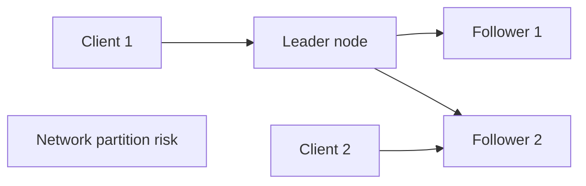

# Distributed Systems

## 1. One-Line Definition
A distributed system is a collection of independent computers that appear to their users as one coherent system, coordinating over a network — where every message can be delayed, reordered, or lost, and any machine can fail at any moment.

## 2. Why Do We Need It?
Single machines have hard limits: storage, CPU, write throughput, and a physical footprint that can burn down. Distributed systems exist because no one machine can hold the data and traffic of a large product — and because some workloads (global services, analytics over petabytes) are definitionally multi-machine. The price of entry is that *partial failure* becomes ordinary: at any instant, part of the system is up and part is not, and no one knows instantly which.

## 3. Simple Intuition
A company with many offices. Each office has its full local staff and records; the offices are linked by a mail courier (the network) that occasionally loses letters or takes days. Head office insists everyone sees "one company", but an office can't know instantly what another just decided. Every question — "how much inventory do we really have?" — is now a coordination problem, not a lookup.

## 4. What Happens Without It?
Without mastering the fundamentals, you build systems that fail in signature distributed ways: a "simple" update thinks it succeeded and split-brain writes diverge forever, a retry double-charges a customer, two leaders emerge and both accept writes, a lock is released early and two workers duplicate the job, or clocks disagree and "latest" is meaningless. These aren't bugs you fix once — they're the water you swim in.

## 5. Core Idea
The distributed-systems canon, in one view:
- **No global knowledge:** no one can see the whole system's state at a moment. Detection of failure is *itself* a distributed problem (timeouts guess; consensus decides).
- **Partial failure is the norm:** some nodes may have accepted a write while others never saw it; the system must define correct behavior for every subset.
- **Ordering is hard:** without a shared clock, "which happened first?" is a coordination question — solved by logical clocks/versioning, or by consensus for a total order (see [[consensus|Consensus]], [[raft-and-paxos|Raft and Paxos]]).
- **Consistency is a continuum:** strong vs eventual (see [[consistency|Consistency]], [[strong-vs-eventual-consistency|Strong vs Eventual Consistency]]) — a decision per operation, bounded by [[cap-theorem|CAP Theorem]] / PACELC.
- **Correctness is built, not assumed:** idempotency, fencing, quorums, and exactly-once *effect* are the tools (see [[idempotency|Idempotency]], [[exactly-once-effect|Exactly-Once Effect]], [[durability|Durability]]).
- **Replication is the workhorse:** copies for availability + durability (see [[database-replication|Database Replication]]), which creates the consistency and ordering questions above.

## 6. Important Terminology

| Term | Simple Meaning |
|------|----------------|
| Node | One computer in the system |
| Partial failure | Some nodes fail while others continue |
| Partition | Network split: nodes can't reach each other |
| Consensus | Getting nodes to agree despite failures |
| Quorum | Minimum set that can decide (see [[cap-theorem|CAP Theorem]]) |
| Leader election | Picking one node to coordinate |
| Fencing | Making a stale node unable to act |
| Logical clock | Ordering events without wall-clock trust |
| At-least-once | Delivery may duplicate (see [[delivery-semantics|Delivery Semantics]]) |
| Idempotency | Re-running the op is safe (see [[idempotency|Idempotency]]) |

## 7. Basic Architecture



## 8. Request or Data Flow
1. A client sends a write; the request goes to the current leader (or anywhere, depending on routing).
2. The leader replicates the write to a quorum of followers before acknowledging, so the "durable now" bar is a majority, not one machine (see [[durability|Durability]]).
3. A read from a follower may be stale; a read from the leader is current — the consistency knob picks which is acceptable.
4. If the leader dies, the followers must *agree* on a successor (leader election, fencing the old one) before any more writes — the moment of election is where correctness is won or lost (see [[raft-and-paxos|Raft and Paxos]]).

## 9. Practical Example
**Global key-value store (assumptions):** 3 replicas in 2 regions, reads must usually be local.
- Writes: quorum (2 of 3) acknowledges, so one region can be down and writes continue.
- Reads: local replica served normally; strong reads routed to the quorum.
- One region's nodes stop responding: the quorum in the healthy region elects the surviving leader, fences the partitioned one, and serves — meanwhile the partitioned side, believing itself isolated, must *refuse* writes (or be ready to lose them) rather than silently diverge.
- That refusal vs divergence trade is the whole distributed story in one sentence.

## 10. Scaling
Distributed systems scale horizontally (see [[horizontal-vs-vertical-scaling|Horizontal vs Vertical Scaling]]), but scaling multiplies failure: N nodes means N times more "component currently failing". Techniques that make scale possible — sharding (see [[sharding|Sharding]]), consistent hashing (see [[consistent-hashing|Consistent Hashing]]), gossip (see [[gossip-protocol|Gossip Protocol]]), distributed ID generation (see [[distributed-id-generation|Distributed ID Generation]]) — are each a distributed algorithm with its own consistency burden. Total coordination cost grows super-linearly with participants, which is precisely why the design keeps shared state as small as possible.

## 11. Reliability and Failure Scenarios

| Failure | What Happens | Detection | Recovery | Trade-off |
|---------|--------------|-----------|----------|-----------|
| Node dies | Requests to it fail | Timeout/gossip, health | Redirect to replicas | Consistency of promotion |
| Network partition | Split brain risk | Heartbeat failure | Majority quorum; minority waits | Availability vs consistency |
| Clock skew | Ordering/lock bugs | Clock monitoring | NTP + logical clocks, not wall time | Precision vs complexity |
| Slow node | Tail latency inflates | Latency percentiles | Hedging/fallback, remove from set | Extra calls |
| Old leader revives | Two writers | Fencing tokens | Revoked authority | Writes rejected |

## 12. Consistency and Correctness
This is the discipline that separates distributed from merely parallel: what is the system's answer *when only a subset saw the write*? Correctness tools: quorum-based reads/writes (see [[cap-theorem|CAP Theorem]]), consensus order (see [[consensus|Consensus]]), conflict-resolving types (see [[crdt|CRDTs]]), fencing to kill stale writers (see [[distributed-locks|Distributed Locks]]), idempotent operations to survive retries, and clocks that order events honestly (logical clocks, not wall time where trust matters).

## 13. Performance
Distributed systems spend latency on coordination: replication waits for the slowest member of the quorum, cross-node reads pay a network round trip, and sync ordering adds consensus latency. The levers: keep hot operations single-node where possible, quorum or replica reads for cold paths, partition key design for locality (see [[shard-key|Shard Key]]), and async replication where staleness is acceptable. Tail latency is aggravated by fan-out — a request that touches many nodes inherits their worst (see [[tail-latency|Predictable Tail Latency]]).

## 14. Security
Distribution widens the attack surface: every node, every message channel, every discovery mechanism is exposed. Non-negotiables: mutual TLS between services (see [[encryption-and-keys|Encryption and Keys]]), service identity and least privilege (see [[authentication-vs-authorization|Authentication vs Authorization]]), tenant isolation preserved across replicas/cells (see [[tenancy-and-cells|Multi-Tenancy and Cell-Based Architecture]]), and defense against the distributed-flavored attacks: poisoned gossip, replayed messages, and fake leaders.

## 15. Trade-Offs

| Choice | Advantages | Disadvantages | When to Use |
|--------|------------|---------------|-------------|
| Replication | Availability, durability | Lag, consistency work | Every stateful tier |
| Quorum writes | Strong without all-nodes | Latency = slowest of quorum | Money paths |
| Async replication | Fast, available writes | Loss window, staleness | Tolerant paths |
| Total order (consensus) | Simple reasoning | Slow, one bottleneck | Small critical state |
| Eventual + resolution | Scales, available | Merges, staleness | Feeds, collaborative state |
| Sharding | Linear write/storage scale | Query complexity, rebalancing | Data too big for one node |

## 16. Common Mistakes
- Assuming a failed call means "didn't happen" — the ambiguous timeout is half the distributed-systems canon (answer: idempotency).
- Wall-clock trust for ordering and leases — clocks drift; use logical clocks or consensus.
- Quorum math mistakes: W+R ≤ N allows stale reads by definition.
- No fencing: promoting a successor while the old leader still writes = split brain.
- "We'll handle the failure modes in code" — the failure *model* is a design decision up front (synchronous vs asynchronous, fail-stop vs byzantine).

## 17. HLD vs LLD Boundary
HLD: the failure model, consistency per operation, quorum sizes, replication modes, election/fencing strategy, clock assumptions, partition behavior. LLD: the specific consensus library integration, retry/timeout constants, fence token issuance, gossip message handling, version-vector merge code.

## 18. Interview Questions

### Beginner
- What makes a system "distributed" beyond just having many servers?
- Why can't one node instantly know another has failed?

### Intermediate
- Your write succeeded from the caller's view but only one of three replicas stored it. What are the possible futures?
- Explain why fencing is required when a new leader takes over.

### Advanced
- Design a 3-region system where a region loss never loses acknowledged writes, and state exactly where the latency goes.
- How does quorum size (W, R, N) become a sliding consistency-vs-availability dial?

## 19. Interview Memory Summary

> [!abstract]- Interview Memory Summary

### Remember

- Many nodes, one coherent view, unreliable network, partial failure.
- No global knowledge: failure is a guess until consensus says otherwise.
- Ordering without a trustworthy clock is a coordination problem.
- Consistency is per-operation, bounded by CAP/PACELC.
- Idempotency, fencing, quorums, exactly-once-effect are the toolbox.
- Replication creates the consistency questions replicas are meant to ask.
- Reject writes you can't win, or accept the divergence.

### 30-Second Explanation

Design for partial failure: replicate for availability and durability, slice by shard keys to scale, choose a consistency level per operation (quorums for strong, async for tolerant), and bolt correctness on with idempotency, fencing, and consensus order — remembering no node knows the whole truth and every guarantee has a latency/availability price.

### Interview Traps

- Treating "network is occasionally broken" as an edge case instead of the model.
- Clock-trusting for "latest".
- Quorum math that allows stale reads ($W+R \leq N$).
- No fence: old leader revives and writes.
- Promising exactly-once without stating the retry+dedup mechanism.

### Key Trade-Off

Every distributed guarantee trades latency and availability for certainty; the craft is choosing, per operation, how much certainty you can afford — and building the failure model into the design rather than finding it in production.

## 20. Related Concepts

### Prerequisites

- [[consistency|Consistency]]
- [[cap-theorem|CAP Theorem]]
- [[database-replication|Database Replication]]

### Commonly Used Together

- [[durability|Durability]]
- [[fault-tolerance|Fault Tolerance]]
- [[shared-nothing-architecture|Shared-Nothing Architecture]]
- [[loose-coupling|Loose Coupling]]

### Alternatives

- [[scalability|Scalability]] (the growth goal that motivates distribution)

### Advanced Concepts

- [[consensus|Consensus]] and [[raft-and-paxos|Raft and Paxos]]
- [[distributed-transactions|Distributed Transactions]]
- [[distributed-locks|Distributed Locks]]
- [[distributed-id-generation|Distributed ID Generation]]
- [[gossip-protocol|Gossip Protocol]]
- [[crdt|CRDTs]]
- [[bft|Byzantine Fault Tolerance]]
- [[exactly-once-effect|Exactly-Once Effect]]

## 21. References
Kleppmann *Designing Data-Intensive Applications* — the canonical foundations text; Leslie Lamport's "Distributed Systems" notes at MSR; standard surveys of failure models, logical clocks, and consensus. Verify current managed-service guarantees (quorums, fencing, region behavior) with vendor docs.

## 22. Active Recall

Test yourself before revealing each answer.

> [!question]- Why is "did the node fail?" a distributed problem rather than a simple check?
> Because the check itself is a message across the very network that may be failing. A timeout says "we couldn't hear it" — which is ambiguous: the node may be dead, slow, partitioned, or fine while *we* are unreachable. Turning that guess into a decision requires *agreement* between surviving nodes (consensus/quorum), not a single prober's opinion.

> [!question]- What is the difference between a logical clock and wall-clock time, and when does it matter?
> Wall time comes from a clock that drifts and can be wrong; "latest write wins" by wall time can reorder what actually happened. Logical clocks (Lamport/vector) order events from causality, and versioning (version vectors) distinguishes "newer" from "concurrent". They matter wherever ordering decides correctness — LWW merges, cache invalidation, leader leases — and they matter *more* than wall time the moment a single source of truth is split.

> [!question]- Why must a revived old leader be fenced, not just "notified"?
> Because by the time the new leader was elected, the old leader may not have seen the election at all (partition). If it believes it's still leader and accepts writes, both accept — divergent histories, permanently. Fencing gives authority a *monotonic token*: any write without the current token is rejected by the storage layer, so the stale leader's writes die at the door regardless of what it believes.

> [!question]- What is the exact quorum condition for a stale read, and why?
> Read quorum R and write quorum W with N replicas: writes reach W nodes, reads consult R nodes. If W+R ≤ N, a read can miss the nodes that wrote, so it may return old data — that's the staleness budget. For a fresh read you need W+R > N (guaranteed overlap). Quorum size is the sliding dial between staleness and availability that cost more certainty.

> [!question]- Interview scenario: three regions, a write is acknowledged to a user in region A, then region A vanishes. When is that write safe?
> Only if the acknowledgement was *quorum-wide* across regions: the write was stored by a majority that still exists (e.g., A+B with A gone → B remains). If the ack came from a region-local majority (2 of 3 replicas all in A), an A-loss loses it. The design must push the ack boundary into a cross-region quorum — and the price is cross-region write latency.

> [!question]- "We'll get exactly-once by retrying once if a timeout happens." What is missing?
> Exactly-once *effect* needs three things: a retry budget, a dedup/idempotency mechanism, and knowledge of what "applied" means (see [[exactly-once-effect|Exactly-Once Effect]]). A blind single retry doesn't know whether the original applied, so you may double-apply; and "once" under an at-least-once broker needs the consumer-side dedup. State the retry semantics and the dedup key, or you've only moved the ambiguity.

## 23. When Should I Use This?

### Use it when

- The workload outgrows one machine (storage, writes, compute, geographic reach).
- Availability or durability requirements exceed one site's honest guarantees.
- Multiple independent systems must act as one product.
- You're designing the state coordination: replication, sharding, leaders, ordering.

### Avoid it when

- One machine, a stable workload, no geographic need — distribution is pure cost.
- The "distribution" would be one monolith split across hosts sharing one database (all the problems, none of the autonomy — see [[service-oriented-architecture|Service-Oriented Architecture]]).
- The team can't bear the operational load (consensus, replication, partition drills).

### What problem does it solve?

It makes many machines behave as one coherent system despite the unreliable network and ordinary partial failure — replicating for durability and availability, sharding for scale, and defining per-operation consistency so that every outcome ("which server answered, who saw the write, what survives") has a named, correct rule.

### What problem does it NOT solve?

It doesn't make the network reliable (it designs around loss), doesn't grant instant reliable failure knowledge, doesn't give strong consistency free (every level costs latency/availability), and no amount of distribution fixes a system whose local reasoning about state was wrong — the hard part of distributed thinking is thinking about subsets of nodes, and that skill is non-negotiable.

## 24. Decision Connections

Decisions that go together with distributed systems:

- [[consistency|Consistency]] — the per-operation guarantee the whole design hinges on.
- [[cap-theorem|CAP Theorem]] — the bounds that force the consistency/availability trade.
- [[database-replication|Database Replication]] — the copy mechanism that creates the coordination questions.
- [[consensus|Consensus]] and [[raft-and-paxos|Raft and Paxos]] — ordering and agreement when it must be right.
- [[distributed-transactions|Distributed Transactions]] — multi-node atomicity's expensive answer.
- [[distributed-locks|Distributed Locks]] — coordination primitives, fence them or lose correctness.
- [[shared-nothing-architecture|Shared-Nothing Architecture]] — how distribution keeps nodes independent.
- [[exactly-once-effect|Exactly-Once Effect]] — the retry+dedup discipline every distributed write relies on.

Decision tree:

```
More than one machine must act as one system
    |
    +-- Need durability/availability across node loss?
    |      → [[database-replication|Database Replication]]
    |      → [[durability|Durability]]
    |
    +-- Data/writes outgrow any one node?
    |      → [[sharding|Sharding]] + [[shard-key|Shard Key]]
    |
    +-- Nodes must agree on shared state?
    |      → [[consensus|Consensus]] / [[raft-and-paxos|Raft and Paxos]]
    |
    +-- Multi-step work across services?
    |      → [[distributed-transactions|Distributed Transactions]]
    |
    +-- Reordering / concurrent writes?
    |      → per-op [[consistency|Consistency]] choice
    |      → conflict resolution ([[crdt|CRDTs]])
    |
    +-- Keep nodes independent?
           → [[shared-nothing-architecture|Shared-Nothing Architecture]]
    |
    +-- Prove retries are safe?
           → [[idempotency|Idempotency]] + [[exactly-once-effect|Exactly-Once Effect]]
```