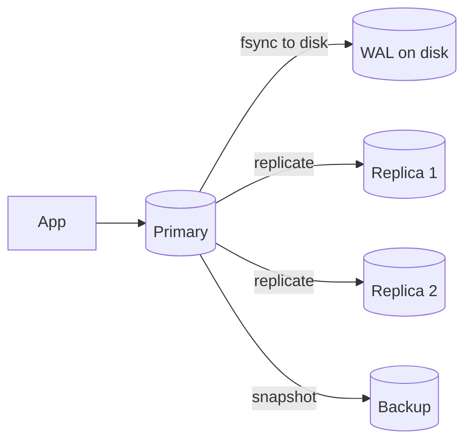

# Durability

## 1. One-Line Definition
Durability is the guarantee that once a system acknowledges a write, that data survives crashes, power loss, disk failure, and machine loss — it is not lost even if everything around it dies.

## 2. Why Do We Need It?
An acknowledged write that later disappears is worse than a failed write: the user believes the action happened (money moved, message sent, order stored) and the system believes it too until reconciliation reveals the gap. Durability is what turns a database or queue into a trustworthy source of truth, and it is the layer that defines how much data you can lose in a disaster (RPO).

## 3. Simple Intuition
A bank teller confirms your deposit after writing it in a ledger book and filing the carbon copy in a second drawer. If the bank only told you "done" and kept one copy on a single page, one fire destroys your deposit. Durable = write it down in a way that survives the building burning down (journal + copy in another location).

## 4. What Happens Without It?
A server crash or power cut leaves the acknowledged data gone: orders that never existed, account balances reverted, emails/posts lost while clients were told they succeeded. It also breaks every downstream expectation — retries, audits, backups — and eventually forces expensive, angry reconciliation with customers.

## 5. Core Idea
Durability is achieved by making data survive the *acknowledgement boundary*:
- **Write-ahead journaling (WAL/redo log):** the change is appended to a durable log and flushed to physical disk *before* the success response is sent.
- **fsync:** flush OS buffers to real disk/SSD so the write is not sitting in volatile memory that dies on power loss.
- **Replication:** keep N copies on independent machines (different disks, racks, AZs, regions); if one copy dies, the others survive.
- **Sync vs async replication:** sync replication waits for a replica to ack before acking the client (strictly durable, slower); async can lose the last few writes.
- **Quorum writes:** W writes out of N replicas ack before the leader ack, so the majority that can still elect a leader has the data.
- **Backups:** a coordinated copy for disaster recovery, with a defined RPO (how much you can lose) and RTO (how fast you recover).

## 6. Important Terminology

| Term | Simple Meaning |
|------|----------------|
| WAL / redo log | Append-only journal of changes, flushed before ack |
| fsync | Force OS buffers to physical disk |
| Ack boundary | The point after which the caller assumes data is safe |
| Sync replication | Leader waits for replica ack before replying |
| Async replication | Leader replies first, replica catches up later |
| Replication factor | Number of copies of the data |
| Quorum | Minimum copies that must ack a write |
| RPO | How much data can be lost on failure |
| RTO | How long recovery takes |
| Backup | Periodic, restorable snapshot of data |

## 7. Basic Architecture



## 8. Request or Data Flow
1. A write arrives: the change is appended to the WAL and fsynced to disk.
2. The in-memory/table data structure is updated; the row is now readable.
3. Optionally, replication sends the change to replicas — sync waits for ack, async does not.
4. Only after the configured ack boundary is met does the system reply success to the caller.
5. On crash, recovery replays the WAL so the last acknowledged writes are present.

## 9. Practical Example
**Order service with async replicas:** a write is fsynced to the primary WAL (the true durability point), acknowledged to the client, then replicated to R1/R2. If the primary disk dies 10 seconds later, the last 10 seconds of writes need replay — that window is the RPO. The primary's fsync makes the ack honest; replication only shrinks the recovery time.

**Cashier's check write (strict):** sync replication with quorum of majority: a payment record must be on the leader *and* one replica before the client gets "payment accepted", so even an instant leader loss keeps the record.

## 10. Scaling
- More replicas widen the safety margin but each sync copy adds write latency; the fix is quorum writes and async followers for most copies.
- Very high write volume: group commit and batching fsyncs amortize the flush cost across many writes.
- Larger datasets: durability per shard — each shard replicates independently — sees [[sharding|Sharding]] for the slicing, this concept for the per-shard guarantee.
- Cross-region durability: replicate to a second region for disaster cases, accepting that cross-region sync writes are slow (see [[cross-region-replication|Cross-Region Replication]]).

## 11. Reliability and Failure Scenarios

| Failure | What Happens | Detection | Recovery | Trade-off |
|---------|--------------|-----------|----------|-----------|
| Power loss mid-write | Volatile data lost | Crash recovery scan of WAL | Replay WAL to last ack | fsync cost per write |
| Disk failure | One copy gone | Disk health, scrub/checksum | Failover to replica, rebuild | Replication factor cost |
| Cluster-wide loss | Whole site gone | Site health check | Restore from backup, replay | Backup lag = RPO |
| Silent corruption | Data present but wrong | Checksums, parity/scrubbing | Restore from clean copy/replica | Extra storage + reads |

## 12. Consistency and Correctness
Durability is meaningless unless the ack boundary is consistent with what survives. Sync replication ties durability to an *availability* condition: if the required replica is down, writes must halt to preserve the guarantee (or you relax the boundary). Replica counts interact with [[cap-theorem|CAP Theorem]] roughly as: the more copies you require to ack, the stronger durability but the lower availability during node loss. Idempotent replay and version stamps keep recovery from double-applying WAL entries.

## 13. Performance
fsync-per-write is the classic bottleneck — group commit, larger write batches, and modern SSDs raise throughput dramatically. Sync replication multiplies latency by the slowest required ack, and replication consumes bandwidth proportional to write volume. Durability is sized against the user-perceived latency budget (see [[latency-vs-throughput|Latency and Throughput]]).

## 14. Security
Encryption at rest must be paired with durable key management — if the encryption key is stored only on the dying node, the backup is unreadable. Backups must be encrypted and access-controlled too, and replication streams should use network-layer TLS so a "second copy" does not leak data while traveling.

## 15. Trade-Offs

| Choice | Advantages | Disadvantages | When to Use |
|--------|------------|---------------|-------------|
| fsync on every write | Strong durability | Slower writes | Database, queue acks |
| Async replication | Fast writes | Loss window = RPO | Feeds, logs, counters |
| Sync/quorum replication | Near-zero loss | Higher latency, lower availability | Payments, ledger, critical state |
| Backup + replay | Cheap wide coverage | Restore takes time (RTO) | Cost-sensitive cold DR |
| Multi-region replicas | Survive region disaster | Latency, cost, conflict handling | Compliance, global apps |

## 16. Common Mistakes
- Acking before fsync/replication — the success message is the durability contract, and saying "done" before data is safe is a lie.
- Assuming "replicas are replicas": async replicas can lag seconds behind, so they don't cover the RPO gap.
- Choosing fsync=false for speed and forgetting it during a crash postmortem.
- Relying on backups that were never restore-tested — an unverified backup is a hypothesis.
- Believing one every-thing-on-disk machine is durable — a burned rack kills the disk too; you need *other machines* or regions.

## 17. HLD vs LLD Boundary
HLD: the durability contract — what ack means per data class, replication factor, sync vs async, quorum size, RPO/RTO, backup cadence, fsync policy. LLD: the actual `fsync()` call order, WAL flush code in the storage engine, replication client timeout tuning, backup scripts.

## 18. Interview Questions

### Beginner
- If the database replies success, is the data always safe? Why not?
- What is the difference between durability and backup?

### Intermediate
- Your async replica is 30 seconds behind. What breaks in a failure right now?
- Compare fsync-per-write with group commit: latency, throughput, durability.

### Advanced
- Design a payment service that must never lose an acknowledged write but also survives an entire region outage. What does it cost?
- When does sync replication stop being a durability measure and start being an availability hazard?

## 19. Interview Memory Summary

> [!abstract]- Interview Memory Summary

### Remember

- Durability = data survives after the ack; the ack boundary is the contract.
- fsync + WAL make a single machine honest; replication adds machine-level survival.
- Sync replication is strict but trades availability for durability.
- Async replication has an inherent loss window (RPO).
- Quorum writes (W of N) balance durability, latency, availability.
- Backups cover disaster loss but give you RTO as well as RPO.
- Encrypted data is only as durable as its keys.

### 30-Second Explanation

Before replying success, flush the change to a durable WAL (fsync), and replicate it enough that the surviving majority has the data. Sync/quorum for money paths, async with a known RPO everywhere else, and verified backups for the whole-site disaster.

### Interview Traps

- "The DB is durable" — durability is defined by *when* you ack, so say explicitly what ack means.
- Confusing backup with durability — backup is the slow, whole-site layer; replication is the fast, per-failure layer.
- "fsync everywhere" — the cost is real; durable writes are slower writes.
- Claiming zero data loss with async replication — that is an oxymoron.

### Key Trade-Off

Durability buys safety in exchange for write latency and availability; the honest design picks a *different ack boundary per data class* instead of one blanket policy.

## 20. Related Concepts

### Prerequisites

- [[reliability|Reliability]]
- [[database-replication|Database Replication]]

### Commonly Used Together

- [[rpo-rto|RPO and RTO]]
- [[disaster-recovery|Disaster Recovery]]
- [[failover|Failover]]
- [[erasure-coding|Erasure Coding]]

### Alternatives

- [[caching|Caching]] (fast and disposable — the opposite durability profile, useful precisely because it can discard data)
- [[content-addressable-storage|Content-Addressable Storage]] (immutable durable blobs for files)

### Advanced Concepts

- [[cap-theorem|CAP Theorem]] and [[strong-vs-eventual-consistency|Strong vs Eventual Consistency]]
- [[exactly-once-effect|Exactly-Once Effect]]

Related planned topics (not authored yet): synchronous replication internals, WAL tuning per storage engine.

## 21. References
Kleppmann *Designing Data-Intensive Applications* ch. 5 (replication, durability trade-offs); standard database manuals on WAL/fsync semantics; Kafka docs on `acks` and `min.insync.replicas`. Verify current provider disk and region guarantees with vendor docs.

## 22. Active Recall

Test yourself before revealing each answer.

> [!question]- When is data officially "durable" in a system?
> At the ack boundary: the point where the system has flushed the change (WAL fsynced) and/or the required copies (sync replicas/quorum) have confirmed — and *only then* it may reply success. Anything before that can be lost.

> [!question]- Why is fsync alone not enough for durability across a machine failure?
> fsync protects you from process crash and power loss by pushing the WAL to local disk, but it does nothing for a dead disk or burned rack — the copy died with it. Durability across machine loss requires replication to independent machines (and ideally regions for whole-site loss).

> [!question]- You have the primary with two async replicas. What is your real RPO right now?
> The probability is roughly the replication lag window (seconds to minutes). The moment the primary fails you lose every write the replicas hadn't caught up on. The true RPO is the lag, not "zero", and you can measure it.

> [!question]- Why does sync replication hurt availability, not just latency?
> If writes must wait for a replica to ack, then a slow or dead replica makes every write fail or slow down. Either you stall writes (availability drops) or you relax the boundary (durability drops) — you cannot win both.

> [!question]- Interview scenario: payments system needs acknowledged writes that survive a region failure. What is the design?
> The ack boundary must sit in the surviving region: writes force-synced on the leader WAL and replicated synchronously (or with quorum) to a majority that spans regions, so a region loss leaves a majority holding the data. The cost is cross-region write latency and complexity — that is the durability-availability-latency triangle in action.

> [!question]- How do you get durability without paying fsync cost for every single write?
> Group commit / batching: amortize one fsync across many concurrent writes, so durability is delayed by milliseconds but throughput stays near peak. The window between "write left memory" and "fsync landed" is the remaining risk — which is why money paths often insist on the full pause.

> [!question]- A backup taken daily can never achieve strong durability. Why not, and what does it actually buy you?
> A daily backup means up to 24 hours of acknowledged writes exist nowhere else — a huge RPO. It buys whole-site disaster recovery with bounded RTO (restore + replay), not per-write durability. Strong durability is about the ack path (WAL + replication); backups are the last-resort recovery layer.

## 23. When Should I Use This?

### Use it when

- Acknowledge-then-lose is unacceptable: payments, orders, messages, identity, ledger.
- You need to state an RPO and RTO and pick replication + backup policy from them.
- You are designing a queue or database and must define what a producer ack means.
- Compliance or audit requires provable write survival.

### Avoid it when

- The data is reconstructable or disposable (cache, ephemeral session, derived metrics) — best-effort durability is the right cost.
- The latency cost of durable writes destroys the product and the data truly can be regenerated.
- Nobody will operate the boundary — durability only exists if fsync policy, replica counts, and restore drills are actually maintained.

### What problem does it solve?

An acknowledged write must not vanish. It solves that with a defined ack boundary (fsync + WAL), replicated copies to survive machine loss, quorum writes for strict cases, and verified backups for whole-site disaster — each with an explicit RPO/RTO.

### What problem does it NOT solve?

It does not give you availability (a durably stored write can still be unreachable), it does not guarantee consistency (copies can lag and diverge), it does not remove the cost of recovery time (RTO is a separate number), and no policy can be called durable until it is tested in a real restore/failover drill.

## 24. Decision Connections

Decisions that go together with durability:

- [[reliability|Reliability]] — durability is one of its pillars; correctness and recovery are the others.
- [[database-replication|Database Replication]] — the mechanism that turns one copy into N copies across failures.
- [[rpo-rto|RPO and RTO]] — the numbers that choose sync vs async and backup cadence.
- [[disaster-recovery|Disaster Recovery]] — the whole-site layer: backups, restores, drills.
- [[failover|Failover]] — promoting the surviving durable copy after a leader dies.
- [[cap-theorem|CAP Theorem]] — sync durability only exists while the required replicas are reachable.
- [[caching|Caching]] — the counter-example: a component deliberately allowed to lose data.

Decision tree:

```
Data must survive after acknowledgment?
    |
    +-- Single machine, process crash / power loss?
    |      → WAL + fsync before ack
    |
    +-- Machine (disk) can die entirely?
    |      → [[database-replication|Database Replication]]
    |         +-- Zero-loss requirement (money)?
    |         |      → sync / quorum writes (accept latency)
    |         +-- Loss window acceptable?
    |              → async replication, measure lag = RPO
    |
    +-- Entire site can be destroyed?
           → [[disaster-recovery|Disaster Recovery]]
           → [[cross-region-replication|Cross-Region Replication]] for strict cases
    |
    +-- Cheap rebuild acceptable?
           → [[caching|Caching]] / disposable copies only
           → [[rpo-rto|RPO and RTO]] to quantify what you accept
```