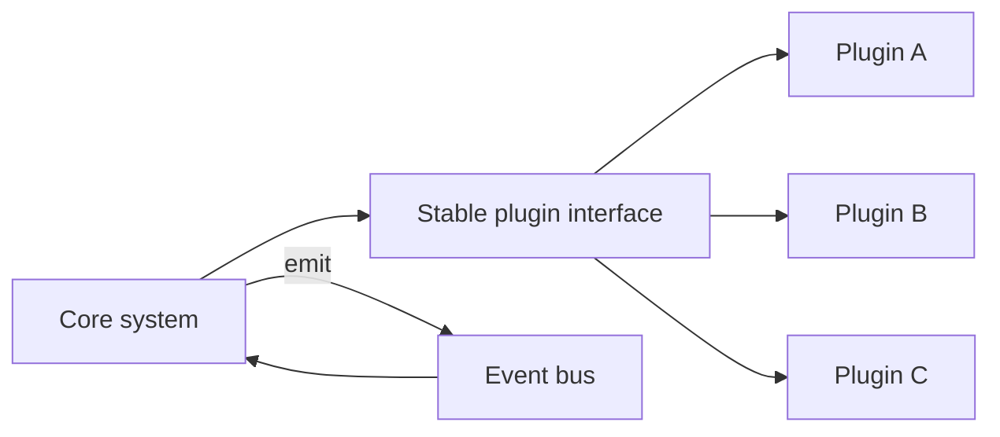

# Extensibility

## 1. One-Line Definition
Extensibility is a system's ability to accommodate new features, behaviors, and integrations without modifying (or fully understanding) the existing core — typically by adding new code or components rather than rewriting old ones.

## 2. Why Do We Need It?
Products evolve faster than their first designs: new channels, new payment providers, new event handlers, new parsers, new devices. If every new capability requires touching the core codebase, every feature becomes a global risk. Extensibility makes growth additive — you attach a new piece instead of editing the existing building.

## 3. Simple Intuition
A power strip with standardized sockets. Any brand of appliance plugs in; you don't cut open the wall wiring for a new toaster. The socket (stable interface) and the plug (extension) are agreed up front, so appliances arrive without the house being rewired each time.

## 4. What Happens Without It?
A new feature means modifying shared core code — merging into hot paths, risking regressions for all existing users, and creating code where every branch is "for this one special case". Systems become so coupled to their history that adding support for a new country, file format, or vendor requires a quarter of refactoring and a fleet of regression tests.

## 5. Core Idea
Extensibility comes from **stable extension points**:
- **Plug-in / strategy interfaces:** the core defines an interface; implementations plug in (new notification channels, ranking algorithms, storage backends).
- **Open/Closed principle:** core is closed to modification but open to extension — new behavior arrives as new classes/modules, not edits to existing ones.
- **Events and hooks:** the core emits events; new subscribers react without core changes (see [[event-driven-architecture|Event-Driven Architecture]]).
- **Layered boundaries and stable contracts:** a well-documented interface (see [[contract-first-design|Contract-First Design]]) means extensions don't break the core.
- **Configuration and feature flags:** behavior toggles without code changes (see [[feature-flags|Feature Flags]]).
- **Data-driven extensibility:** new types/rules stored as data (rule engines, admin-defined fields) instead of code branches.

## 6. Important Terminology

| Term | Simple Meaning |
|------|----------------|
| Extension point | A defined seam where new behavior can attach |
| Open/Closed Principle | Open to extension, closed to modification |
| Plugin/spi | Standard interface + pluggable implementation |
| Strategy pattern | Swap algorithms behind one interface |
| Hook / callback | Core invokes registered code at a defined moment |
| Event subscription | New consumers react to events the core emits |
| Feature flag | Toggle that switches behavior without deploy |
| Contract stability | Interface guaranteed not to change underneath |

## 7. Basic Architecture



## 8. Request or Data Flow
1. Core reaches a decision point (a send, a parsing step, a payment) and asks the registered extension via the stable interface.
2. Each plugin implements the interface; configuration selects which one is active.
3. For event-driven extension, core publishes an event; subscribed handlers react (asynchronously) without the core knowing them.
4. New capability = register a new implementation/subscriber + config change, with zero edits to core logic.

## 9. Practical Example
**Notification platform:** the core renders a message and calls the `Channel` interface. Adding SMS later is a new class implementing `Channel.send()`, registered in config — the core, its tests, and all existing channels are untouched. An integrations marketplace can then be shipped by third parties against the documented contract.

## 10. Scaling
Extensibility scales system *capability*, not just load. As the org grows, plugin ecosystems let teams deliver independently against stable interfaces (ownership scaling). Watch out: an ever-growing plugin surface needs versioning, discovery, and testing support; and a "plugin for everything" core becomes a framework that costs more to maintain than the features it delivers. Balance with the actual number of true extension points.

## 11. Reliability and Failure Scenarios

| Failure | What Happens | Detection | Recovery | Trade-off |
|---------|--------------|-----------|----------|-----------|
| A plugin is buggy | One capability behaves wrong | Plugin-scoped metrics/canary | Disable that plugin's flag | Per-plugin isolation cost |
| Plugin A breaks contract | Core gets unexpected behavior | Contract tests, validation | Roll back plugin version | Enforced interface testing |
| Too many extensions | Core becomes a framework | Complexity review | Consolidate, prune | Bureaucracy |
| Interface versioned too often | Extensions churn | Breaking-change detection | Deprecate with migration period | Versioning overhead |

## 12. Consistency and Correctness
Extensions can't silently change core semantics: enforce the contract with tests (see [[contract-first-design|Contract-First Design]]), isolate each plugin's state, and version interfaces so old plugins keep working while new ones appear (see [[backward-compatibility|Backward Compatibility]]). For event-driven extension, apply at-least-once delivery and idempotency (see [[delivery-semantics|Delivery Semantics]]) so duplicate hooks don't double-apply.

## 13. Performance
The extension layer adds an indirection (interface dispatch, event publish). For hot paths, keep the plugin boundary cheap or allow direct registration; for cold paths (a send happening a few times per second), the design benefit dwarfs the overhead. Event-driven extension can amplify load — one core event fanning out to many handlers (see [[fanout-and-aggregation|Fan-Out/Fan-In]]), so budget handler capacity and backpressure.

## 14. Security
Plugins are code that runs inside your trust boundary — treat third-party plugins with sandboxing or process isolation, audit what hooks they can reach, and validate all data handed to them. Never let an untrusted configuration select an arbitrary plugin. Extension registries themselves need integrity protection so "a new plugin" can't be a supply-chain attack.

## 15. Trade-Offs

| Choice | Advantages | Disadvantages | When to Use |
|--------|------------|---------------|-------------|
| Plugin interface | Additive growth, independent teams | Framework complexity, indirection | Multiple real extension kinds |
| Event-driven extension | Loose, async, decoupled | Harder to trace, at-least-once needed | Reactions to state changes |
| Data-driven rules | Change without deploys | Debuggability, validation burden | Business rules, admin config |
| Direct code (no extension) | Simplest, fastest, clearest | Every feature touches core | Few stable extension kinds |
| Feature flags | Instant toggle, no code | Flag sprawl | Temporary/rollout behavior |

## 16. Common Mistakes
- Designing pluggable everything on day one — premature abstraction; you didn't have two real use cases yet.
- Treating the plugin interface as internal detail — a breaking interface change breaks every extension; the interface is a contract.
- Letting plugins reach deep internals — each exposed knob becomes permanent API and a regression risk.
- Building only for your own extensions, then being surprised third parties need it versioned and documented.
- Event-added features that bypass testing — a subscriber that throws silently is an outage nobody sees.

## 17. HLD vs LLD Boundary
HLD: which extension points exist, the interface contract and its versioning, plugin discovery/deploy model, event catalog, flag strategy. LLD: the concrete interface signatures, individual plugin implementations, hook invocation points in code, registration mechanism in the framework.

## 18. Interview Questions

### Beginner
- What does the open/closed principle mean for a system's growth?
- When would you NOT build a plugin interface at all?

### Intermediate
- Design a notification system where adding a new channel requires no core changes.
- Your plugin interface is breaking every release. What went wrong and how do you fix it?

### Advanced
- Internet-scale systems aside: how do you make a marketplace platform safely extensible by third parties?
- How do feature flags and plugin interfaces differ as extensibility mechanisms?

## 19. Interview Memory Summary

> [!abstract]- Interview Memory Summary

### Remember

- Extensibility = additive growth through stable extension points.
- Open/Closed: closed to modification, open to extension.
- Interfaces are contracts; breaking one breaks every extension.
- Events and hooks extend without core changes.
- Feature flags switch behavior without a code deploy.
- Premature plugs are as bad as none.
- Events add idempotency + delivery-semantics obligations.

### 30-Second Explanation

Define a small set of stable seams (interfaces, events, config) that the core owns; new features arrive as new implementations, subscribers, or data, verified by contracts and toggled by flags — the core and its existing behavior stay untouched, so growth is additive.

### Interview Traps

- Proposed "everything is a plugin" — overengineering; extension points must pay for themselves.
- Forgetting the interface is the product — no versioning, no deprecation policy, extensions break.
- Extending by editing core code and calling it "flexible".
- Ignoring that event-driven extension inherits at-least-once and idempotency concerns.

### Key Trade-Off

Every extension point buys future additive growth at the price of today's indirection and interface-maintenance cost — only spend it where you have (or solidly expect) more than one real extension.

## 20. Related Concepts

### Prerequisites

- [[contract-first-design|Contract-First Design]]
- [[api-design-principles|API Design Principles]]

### Commonly Used Together

- [[event-driven-architecture|Event-Driven Architecture]]
- [[feature-flags|Feature Flags]]
- [[loose-coupling|Loose Coupling]]
- [[high-cohesion|High Cohesion]]

### Alternatives

- [[modular-monolith|Modular Monolith]] (bounded modules as the extension unit without the network cost)

### Advanced Concepts

- [[hexagonal-clean-architecture|Hexagonal and Clean Architecture]]
- [[microservices|Microservices]]

Related planned topics (not authored yet): plugin discovery and lifecycle management.

## 21. References
SOLID principles literature (Open/Closed); standard object-oriented design texts; recent refactors of plugin ecosystems document the "interface as product" cost. No invented URLs — verify against current framework docs.

## 22. Active Recall

Test yourself before revealing each answer.

> [!question]- What makes an extension point "stable"?
> A fixed, documented contract that the core owns and never breaks without a versioned migration path. Plugins depend on the interface, not the core's internals; the core can change internally, and existing extensions keep working.

> [!question]- How do events extend a system without modifying the core?
> The core publishes events at defined moments and knows nothing about subscribers. A new capability simply subscribes and reacts asynchronously. The core stays closed; behavior grows via new subscribers — at the cost of at-least-once delivery and idempotency obligations for subscribers.

> [!question]- When is a plugin interface the wrong choice?
> When you have exactly one implementation (or no evidence of a second), when the interface would just be indirection around one call, or when the "plugins" are actually different teams needing to edit core business rules. Premature pluggability is a framework you must then maintain.

> [!question]- Trade-off: extensibility vs simplicity right now.
> Extensibility trades present simplicity for future additive growth: indirection, an interface to version, tests to maintain. If the second extension is speculative, the simple direct code wins; if you have two real consumers, the extension point pays for itself.

> [!question]- Interview scenario: a payments platform must add a new PSP every month without core edits.
> Define one stable `PaymentProvider` interface (authorize, capture, refund, webhook handling) with contract tests; each PSP is a new implementation selected by configuration; webhooks enter through a versioned, idempotent endpoint; core state machine never knows PSP names. Adding a PSP = new code + config + contract-verified, zero core changes.

> [!question]- Why do event subscriptions create correctness risk that plugins don't?
> Plugins are called synchronously in the classic model, so the core sees their result; event subscribers act asynchronously and can silently fail or double-apply on redelivery. Correctness moves to the subscriber: idempotent handling and delivery semantics become the contract.

## 23. When Should I Use This?

### Use it when

- The core is stable and you expect many variations (channels, providers, formats, algorithms).
- Different teams must contribute features without stepping on the core.
- You want third parties or external integrations to extend the system safely.
- New behavior should deploy through config/registration rather than core refactors.

### Avoid it when

- You have one known implementation and no evidence of a second.
- The team is small and the "extension" is a null interface wrapped around the only function.
- Extending by data/config would change core semantics in ways you can't validate.
- The extension surface would let untrusted code into the trust boundary without sandboxing.

### What problem does it solve?

It stops features from being shims bolted onto hot core paths. Growth becomes additive: stable interfaces, event hooks, and configurable behavior let new capabilities arrive as new pieces while the core and its existing users stay untouched.

### What problem does it NOT solve?

It doesn't make wrong core design extensible (bad boundaries just spread), it doesn't remove the need to maintain the interfaces themselves, and it doesn't give performance — a plugin layer is indirection you must size. And event-driven extension, unless handled idempotently, can produce invisible duplicates.

## 24. Decision Connections

Decisions that go together with extensibility:

- [[contract-first-design|Contract-First Design]] — the interface you expose to extensions is the deliverable.
- [[api-versioning|API Versioning]] — how extension interfaces evolve without breaking plugins.
- [[backward-compatibility|Backward Compatibility]] — the obligation that new capabilities never break old ones.
- [[event-driven-architecture|Event-Driven Architecture]] — the event/hook mechanism for corporate-wide extension.
- [[feature-flags|Feature Flags]] — runtime toggle as a lightweight extensibility mechanism.
- [[loose-coupling|Loose Coupling]] — the property extension points rely on.
- [[modular-monolith|Modular Monolith]] — extension inside one deployment vs plugin armies.
- [[microservices|Microservices]] — whole-service add-ons as the coarse-grained extension unit.

Decision tree:

```
More capability will be added over time?
    |
    +-- One known variant, no second yet?
    |      → keep it direct; defer the interface (YAGNI)
    |
    +-- Expect several variations of one thing?
    |      → stable interface + contract tests
    |      → [[backward-compatibility|Backward Compatibility]] + [[api-versioning|API Versioning]]
    |
    +-- Variants react to state changes?
    |      → [[event-driven-architecture|Event-Driven Architecture]] hooks
    |         (add idempotent subscribers + delivery semantics)
    |
    +-- Behavior changes often, in production?
    |      → [[feature-flags|Feature Flags]] / data-driven rules
    |
    +-- Independent teams deliver whole capabilities?
           → [[microservices|Microservices]]
           → [[modular-monolith|Modular Monolith]] boundaries
```