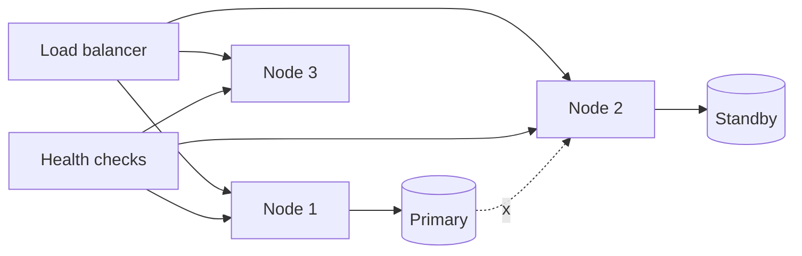

# Fault Tolerance

## 1. One-Line Definition
Fault tolerance is a system's ability to keep functioning — degraded or not — when some of its components fail, without corrupting data or serving whole-system outages.

## 2. Why Do We Need It?
Components *will* fail: disks, processes, racks, network links, and even datacenters. At scale, failures are not rare events but routine statistics. Fault tolerance is what separates a system that keeps its commitments through those failures from one that crashes entirely when a single node hiccups — with the follow-on benefit that each failure no longer requires a human to intervene.

## 3. Simple Intuition
An airplane has multiple engines not because it expects them all to fail, but because the engines are the kind of thing that does fail, and the aircraft must keep flying with one out. You design for "one engine out" scenarios, practice them, and accept that the plane is heavier for carrying the backups.

## 4. What Happens Without It?
Any single component failure becomes a total outage, and worse, some failures *corrupt*: a leader dies mid-write and the system can't tell what was acknowledged, a node goes half-consistent, a queue drops in-flight messages. Every incident becomes an emergency investigation; every dependency is a cliff.

## 5. Core Idea
Fault tolerance = **redundancy + isolation + detection + recovery**, applied so failure stays local:
- **Redundancy:** spare capacity to carry the work (extra nodes, replicas, spare components) — see [[redundancy|Redundancy]].
- **Isolation:** failure in one unit must not cascade — bulkheads, separate pools, per-shard replicas, cells (see [[tenancy-and-cells|Multi-Tenancy and Cell-Based Architecture]]).
- **Detection:** heartbeat/health checks, timeouts, validation that results are *correct*, not just present (see [[observability|Observability]]).
- **Recovery:** the surviving parts take over automatically — failover, retry, rebuilding — with the whole repair path rehearsed (see [[failover|Failover]], [[retry-and-timeout|Retry and Timeout]]).
- **Byzantine awareness:** most designs assume fail-stop faults (a node crashes, stops, is obviously wrong); tolerate *lying* or arbitrary behavior only where it can happen (see [[bft|Byzantine Fault Tolerance]]).

## 6. Important Terminology

| Term | Simple Meaning |
|------|----------------|
| Fault | A component misbehaves (crash, timeout, corruption) |
| Fail-stop | A node fails by halting cleanly (the common assumption) |
| Byzantine fault | A node behaves arbitrarily or maliciously |
| Redundancy | Extra capacity to cover a failure |
| Failover | Automatic switch to a standby (see [[failover|Failover]]) |
| Health check | Probe that tells load balancer a node is usable |
| Retry | Re-attempt after a likely-transient failure |
| Graceful degradation | Keep core features running while parts are down |
| Shed load | Refuse some work to protect the rest under overload |
| Blast radius | The scope a failure can touch |

## 7. Basic Architecture



## 8. Request or Data Flow
1. Load balancer routes to healthy nodes only — a node that fails health checks is removed from rotation.
2. When Node 2 gets a request that depends on the primary DB and the primary dies, the request fails fast or retries against the standby after failover.
3. Failed after retries? The request returns a degraded response rather than hanging — the system shed one case, not the whole service.
4. Monitoring sees the change; the standby is promoted, the failed node rebuilt, and the fleet returns to full redundancy.

## 9. Practical Example
**Video-sharing platform control path (assumptions):** 10 app nodes, 3 replicas of the metadata DB, an SLO of "no data loss on metadata writes".
- Two app nodes die: LB routes to the remaining 8; p99 rises slightly, service continues.
- Metadata DB leader dies: a quorum replica promotes via consensus (see [[raft-and-paxos|Raft and Paxos]]); in-flight writes are retried idempotently; the old leader is fenced.
- Two datacenters are assumed at risk from one storm: the write path requires quorum across AZs, so the loss of one AZ just slows writes for a while instead of ending them.

## 10. Scaling
Fault tolerance must *grow* with the system: more nodes mean more frequent failures, so redundancy, health checks, and automation must be designed in proportion. The economics change — at 10 nodes you add an extra node "just in case"; at 10,000 nodes you tolerate losing a dozen per minute and design procedures that never need a human. Cells and shard-local replication (see [[sharding|Sharding]]) keep failures proportional instead of global, and training (chaos drills — see [[adversarial-reliability|Adversarial Reliability]]) confirms it works.

## 11. Reliability and Failure Scenarios

| Failure | What Happens | Detection | Recovery | Trade-off |
|---------|--------------|-----------|----------|-----------|
| App node dies | Requests fail on that node only | Health check | LB routes around; auto-restart | Need 2+ nodes |
| Leader dies mid-write | Ambiguity about ack writes | Consensus leader timeout | Promote + fence old leader | Sync cost |
| Slow node (not dead) | Timeouts, retries amplify | Latency/error-rate | Circuit breaker isolates it | Fallback latency |
| Disk fills | Writes fail, logs damaged | Space/IO alert | Shed, expand, triage | Capacity planning |
| Unbalanced lane | One cell/shard overwhelmed | Skew metrics | Route away, resize cells | Cross-cell complexity |

## 12. Consistency and Correctness
A fault-tolerant system must fail *correctly*: no acknowledged write lost (see [[durability|Durability]]), no double-apply on retry (see [[idempotency|Idempotency]]), no stale leader still writing after a new leader is elected (fencing tokens — see [[distributed-locks|Distributed Locks]]). Every retry, failover, and rebalancing step is a possible inconsistency source, so the system's rules for who may write, and in what order, are as important as the redundancy itself.

## 13. Performance
Fault tolerance costs something on the happy path (sync ack, health checks, quorum) but its biggest cost is operational: extra capacity, rehearsals, and monitoring. A subtler performance trap is behavior under stress — retries storming (see [[retry-and-timeout|Retry and Timeout]]), a failing cluster metastasizing into cascading timeouts — which good circuit breakers and backpressure contain at the price of having them in the design.

## 14. Security
Failures and security interact: a compromised "failed" node can lie healthily (byzantine), so integrity and authentication matter even inside the fleet; failover should never silently weaken access controls (a replica promoting must still enforce tenant isolation); and degraded mode is when many apps relax checks — never drop authorization in "emergency mode".

## 15. Trade-Offs

| Choice | Advantages | Disadvantages | When to Use |
|--------|------------|---------------|-------------|
| 2+ nodes, LB, health checks | Cheap, big win | Extra capacity + infra | Any stateless tier |
| Replicated state store | Survives node loss | Sync cost, consistency discipline | Databases, queues, state |
| Failover (active-passive) | Simple, focused | Standby idle cost, RTO | Stateful systems |
| Graceful degradation | Availability during trouble | Feature loss, engineering | User-facing systems |
| Chaos drills | Proof it works | Risk, effort | Mature production systems |

## 16. Common Mistakes
- Designing for fail-stop only, then meeting a silent-slow node that fails health checks but still timeouts.
- Believing failover loses nothing — async replication implies a loss window; state the RPO.
- Retrying without limits and without a circuit breaker — the retry storm becomes a higher outage.
- No isolation: one hot tenant or shard bringing the entire service down.
- Never rehearsing: failover untested is a hope, not a plan.

## 17. HLD vs LLD Boundary
HLD: redundancy layout, isolation units (bulkheads/cells), failover strategy and RPO/RTO, retry policy, health-check semantics, degraded-mode design. LLD: the specific health-check probe implementation, retry library parameters, fencing token issuance in the DB driver, per-node watchdog code.

## 18. Interview Questions

### Beginner
- What is a fault-tolerant system, and when does it actually need redundancy?
- Why is detection as important as redundancy?

### Intermediate
- Design failover for a stateful service. What is at risk, and how do you fence the old leader?
- A retry storm took down your API. How do you prevent it?

### Advanced
- Make a video-platform control plane survive a single datacenter loss with zero metadata loss.
- How do you prove fault tolerance at scale without causing the very outage you're testing for?

## 19. Interview Memory Summary

> [!abstract]- Interview Memory Summary

### Remember

- Fault tolerance = redundancy + isolation + detection + recovery.
- Failures are expected at scale — design for "one engine out".
- Detection matters as much as redundancy: unprobed redundancy is decorative.
- Retries need limits, jitter, and idempotency; then throw in a circuit breaker.
- Failover must fence the old leader or you get split-brain writes.
- State the RPO of every failover honestly (async = a loss window).
- Isolate so one tenant/shard cannot take down the fleet.

### 30-Second Explanation

Put spare capacity everywhere critical (nodes, replicas, AZs), probe it so unused redundancy is actually proven, fail over automatically with fencing and known RPO, and contain failures by isolation, retry-with-backoff, and graceful degradation — then rehearse the whole story.

### Interview Traps

- "We have replicas, we're fault tolerant" — unmonitored/unprobed redundancy is a mirage.
- Claiming zero-loss failover with async replication.
- Retrying greedily until the system double-fails.
- Treating one hot shard as a "scaling" problem when the hit is really an isolation fault.

### Key Trade-Off

Every fault-tolerance feature spends capacity, latency, or complexity on the happy path to buy survival on the failure path — the design challenge is spending exactly as much as each data/feature tier deserves.

## 20. Related Concepts

### Prerequisites

- [[reliability|Reliability]]
- [[availability|Availability]]

### Commonly Used Together

- [[redundancy|Redundancy]]
- [[failover|Failover]]
- health checks (planned) — see [[load-balancing|Load Balancing]]
- [[retry-and-timeout|Retry and Timeout]]

### Alternatives

- [[resilience|Resilience]] (the broader property of bouncing back, where fault tolerance is the concrete mechanisms)

### Advanced Concepts

- [[bft|Byzantine Fault Tolerance]]
- [[consensus|Consensus]]
- [[tenancy-and-cells|Multi-Tenancy and Cell-Based Architecture]]
- [[adversarial-reliability|Adversarial Reliability]]

Related planned topics (not authored yet): bulkheads, load shedding, graceful degradation.

## 21. References
Google SRE Book (failure handling, rehearsal culture); Kleppmann ch. 8 (distributed failure assumption); standard fault-tolerant computing texts (fail-stop vs Byzantine). Verify all-or-nothing behaviors with current provider docs.

## 22. Active Recall

Test yourself before revealing each answer.

> [!question]- Redundancy without detection — what's the failure mode?
> Unprobed redundancy is decorative: if nothing watches the standby, the health of the fleet is assumed, and the first time a failover is needed it may not work. Detection (health checks, lag metrics, rehearsals) is what converts spare capacity into a *reliable* spare.

> [!question]- Why must you fence the old leader after promoting a new one?
> If the old leader recovers while still believing it's the leader, both nodes accept writes — split-brain with two divergent histories. Fencing (a monotonically increasing token the leader must hold) makes rejected, stale writes impossible.

> [!question]- What is a retry storm and how do you prevent it?
> When many clients retry as soon as a service fails, retries amplify load and delay recovery, possibly cascading to a whole cluster. Prevention: bounded retries with exponential backoff and jitter, circuit breakers that stop calling a failing dependency, and idempotency keys so a real retry is safe.

> [!question]- What is the honest RPO of an async-replication failover?
> Async replication means the standby can lag; a promotion loses whatever hadn't replicated. The RPO is roughly the lag window, which you should measure and state — "zero loss" only follows from sync/quorum replication, and that costs write latency and availability.

> [!question]- Trade-off: a hot shard is melting and taking traffic down. Is this scaling or fault tolerance?
> Both, but treat it as an isolation fault first: a single tenant/shard's failure must not pull the whole fleet down. Blast-radius controls (separate pools, celling, per-shard limits with callers failing elsewhere) are the fault-tolerance fix; resizing the shard is the scaling fix. Fix the blast radius before sizing.

> [!question]- Interview scenario: prove your fault-tolerance claims without causing the outage you're testing for.
> Use staged, low-blip chaos: start with a test/staging cluster running the same procedures, then canary one production cell with a carefully scoped fault injection after verify it all in staging, with kill switches, while monitoring golden signals. Log the result as evidence — rehearsed failure handling is the goal, not drama.

## 23. When Should I Use This?

### Use it when

- You have a few hard dependencies and losing any one would be an outage.
- State lives somewhere that can die (DB, queue, cache-of-record).
- You must keep an SLO while nodes churn at scale.
- Failure of one tenant/cell must not become failure of all.

### Avoid it when

- The system is best-effort with reconstructible data — redundancy there is waste.
- Adding failover machinery would be heavier (and riskier) than simply restarting workers on failure (crash-only, stateless workers).
- You can't operate the probes and drills — unverified redundancy is a false safety.

### What problem does it solve?

It keeps the system's commitments through component failure: work is carried by spare capacity, failures are detected rather than assumed, survivors take over automatically, the outcome is correct (fenced, idempotent, durable), and the blast radius stays local.

### What problem does it NOT solve?

It doesn't guarantee your *design* is right (fault tolerance protects a possibly-wrong system), doesn't make failures free (extra capacity, latency, complexity), doesn't handle malicious behavior unless you explicitly design for byzantine faults, and no amount of redundancy substitutes for actually rehearsing recovery.

## 24. Decision Connections

Decisions that go together with fault tolerance:

- [[reliability|Reliability]] — the goal this enables; correctness under faults.
- [[availability|Availability]] — the uptime the redundancy is meant to protect.
- [[redundancy|Redundancy]] — the spare capacity that's only useful when probed.
- [[failover|Failover]] — the automatic takeover that must fence to stay correct.
- [[retry-and-timeout|Retry and Timeout]] — safe, bounded retry as the first-line recovery.
- [[durability|Durability]] — failure must not erase acknowledged writes.
- [[tenancy-and-cells|Multi-Tenancy and Cell-Based Architecture]] — isolation that bounds blast radius.
- [[adversarial-reliability|Adversarial Reliability]] — proving the tolerance with rehearsed faults.

Decision tree:

```
A component will eventually fail — how is the system designed?
    |
    +-- Stateless workers?
    |      → restart / spawn on failure (crash-only)
    |      → 2+ nodes behind [[load-balancing|Load Balancing]] + health checks
    |
    +-- Stateful store?
    |      → [[database-replication|Database Replication]] + [[failover|Failover]]
    |      → fence the old leader
    |      → set explicit RPO (sync vs async)
    |
    +-- Callers of a flaky dependency?
    |      → [[retry-and-timeout|Retry and Timeout]] + circuit breaker
    |
    +-- Uneven load / tenants?
    |      → isolation, cells ([[tenancy-and-cells|Multi-Tenancy and Cell-Based Architecture]])
    |      → graceful degradation + load shedding
    |
    +-- Prove it?
           → [[adversarial-reliability|Adversarial Reliability]] chaos drills
```