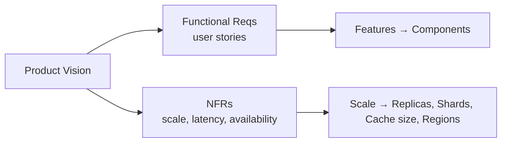

# Functional vs Non-Functional Requirements

## 1. One-Line Definition
Functional requirements describe **what** a system must do; non-functional requirements (NFRs) describe **how well** it must do it — scale, speed, availability, and safety.

## 2. Why Do We Need It?
Ambiguous requirements produce wrong architectures. "Build a chat app" tells you nothing about sharding, caching, or failover. The architecture is driven mostly by NFRs (how many users, how fast, how available), so collecting both types is the first and most important step of an HLD interview.

## 3. Simple Intuition
Ordering a taxi: "take me to the airport" (functional). "In under 20 minutes, safely, even if the first driver cancels" (non-functional). Two rides that are functionally identical can demand completely different routing, fleets, and backups.

## 4. What Happens Without It?
You build a system that does the job correctly for one small load, then fails the moment traffic arrives. Without explicit availability targets you cannot choose replicas; without latency targets you cannot choose a cache; without data-size estimates you cannot choose a storage tier.

## 5. Core Idea
- **Functional requirements** are user stories: "a user can post a photo", "a user can follow another user", "orders are paid with a card".
- **Non-functional requirements** add measurable attributes (the "ity" properties):
  - **Scalability** — how much traffic/data it must handle
  - **Availability** — uptime target, e.g., 99.99%
  - **Performance / latency** — e.g., p95 latency < 200 ms
  - **Durability** — no data loss
  - **Security, compliance** — encryption, residency
  - **Maintainability, observability**

In interviews: clarify **scope** (audience, geography), then bind NFRs with numbers, then reason from those numbers.

## 6. Important Terminology

| Term | Simple Meaning |
|------|----------------|
| Functional requirement | A capability: what the product does |
| Non-functional requirement | A property: how well, how fast, how safe |
| SLI/SLO | Measured indicator + target used to make NFRs concrete |
| Quantified NFR | E.g., "support 1M DAU" — without the number it is a vibe |
| Constraint | Hard limit (budget, compliance, existing stack) |

## 7. Basic Architecture (Requirements → Architecture Flow)



## 8. Request or Data Flow
Not a runtime flow — a **design-time** flow: functional requirements define the endpoints and data model; NFRs define redundancy (availability), caching/CDN (latency), sharding (scale), and encryption/audit (security).

## 9. Practical Example
**Design a payment service (assumptions):**
- Functional: card charge, refund, receipt, statement.
- NFRs: 99.99% uptime, charge latency < 500 ms p95, 5k TPS peak, zero data loss, PCI compliance, idempotent retries.
- Result: regionally replicated primary DB (durability + availability), synchronous auth calls with circuit breakers (latency + resilience), idempotency keys (correctness), and audit logs (compliance).

## 10. Scaling
NFRs define the scaling target. Write down: DAU, QPS, peak factor, read/write ratio, per-record size, growth rate. These numbers then decide how many app instances, cache size, number of DB replicas/shards, and CDN saturation.

## 11. Reliability and Failure Scenarios
Each NFR implies a failure mode to design against:
- Availability 99.99% → must survive node loss (replicas, failover).
- Latency target → must survive hot spots (cache sharding), and slow dependencies (timeouts, circuit breakers).
- Durability target → must survive disk loss (replication, backups), region loss (multi-region / RPO).

## 12. Consistency and Correctness
Functional requirements often imply correctness (payments cannot double-spend), while NFRs set the consistency budget — how stale is acceptable for a feed, a counter, a leaderboard.

## 13. Performance
NFRs must be **quantified**: p50/p95/p99 latency, sustained vs peak QPS, throughput in Gbps for data-heavy systems. Estimations in `02-estimation/capacity-estimation.md` convert these into concrete infrastructure counts.

## 14. Security
Security itself is usually an NFR: encryption in transit/at rest, authN/authZ, compliance (PCI, GDPR). Turning "be secure" into "TLS everywhere, data residency in EU, 2FA for admins" changes architecture (multi-region for residency).

## 15. Trade-Offs

| Choice | Advantages | Disadvantages | When to Use |
|--------|------------|---------------|-------------|
| Ambiguous NFRs | Faster to draft | Wrong architecture | Never in production |
| Tight latency + strong consistency | Predictable behavior | Slower, less available | Payments, inventory |
| Looser consistency | Fast and available | Stale reads, reconciliation | Feeds, counts |
| More redundancy | Higher availability | Cost, complexity | Core money paths only |

## 16. Common Mistakes
- Answering "what" without asking "how many" — always clarify scale.
- Treating every requirement as equally strict — rank: which NFRs are non-negotiable?
- Inventing NFRs (e.g., 99.999% availability "so we look good") that cost 10x for no user benefit.

## 17. HLD vs LLD Boundary
Requirements definition and their architecture implications are HLD. Translating a single requirement into classes and methods (e.g., the `PaymentService` interface) is LLD.

## 18. Interview Questions

### Beginner
- What is the difference between functional and non-functional requirements?
- Name five common non-functional requirements.

### Intermediate
- How do non-functional requirements change the architecture of a chat app?
- Convert "the system must be fast and reliable" into measurable requirements.

### Advanced
- How would you validate that a 99.99% availability target is feasible and affordable?
- Which NFRs force you to choose between consistency and availability, and how do you decide?

## 19. Interview Memory Summary

> [!abstract]- Interview Memory Summary

### Remember

- Functional = what the system does; non-functional = how well it does it.
- NFRs must have numbers — without numbers they are vibes.
- Scale numbers (DAU, QPS, storage) drive component counts.
- Availability numbers drive redundancy (replicas, regions).
- Latency numbers drive caching, CDN, and regions.

### 30-Second Explanation

Ask for DAU/QPS/latency/availability/durability; turn them into architecture choices.

### Interview Traps

- Writing NFRs like "high availability — 99.999%" without justifying cost — interviewers ask "why that target?"
- Answering "what" without asking "how many" — always clarify scale.
- Treating every requirement as equally strict — rank which NFRs are non-negotiable.
- Inventing NFRs that cost 10x for no user benefit.

### Key Trade-Off

Tight NFRs (strong consistency, extreme availability) cost latency, money, and complexity, so you must quantify each target and justify it against a real user need rather than declaring it.

## 20. Related Concepts

### Prerequisites

- [[system-design-fundamentals|System Design Fundamentals]]

### Commonly Used Together

- [[capacity-estimation|Capacity Estimation]]
- [[availability|Availability]]
- [[scalability|Scalability]]
- [[latency-vs-throughput|Latency vs Throughput]]

### Advanced Concepts

- [[sli-slo-sla|SLI / SLO / SLA]]

Related planned topics (not authored yet): trade-off-analysis.

## 21. References
Standard HLD interview methodology (Grokking System Design, Alex Xu). Verify exact industry NFR patterns with current cloud docs.

## 22. Active Recall

Test yourself before revealing each answer.

> [!question]- What problem do non-functional requirements solve that functional ones don't?
> "Build a chat app" describes what to build but nothing about sharding, caching, or failover. NFRs attach numbers (how many users, how fast, how available, how durable) which is what actually drives architecture — without them you build a system that works at small load and fails when traffic arrives.

> [!question]- What is the difference between functional and non-functional requirements?
> Functional = a capability, a user story (user can post a photo, orders are paid by card). Non-functional = a measurable property (99.99% uptime, p95 < 200 ms, no data loss, PCI compliance). The architecture is driven mostly by NFRs.

> [!question]- How do you turn "the system must be fast and reliable" into requirements an architect can use?
> Quantify them: DAU and requests/user/day → QPS; p50/p95/p99 latency targets; uptime percentage; durability/RPO; compliance scope. Example: 1M DAU, 20 req/day, p95 < 200 ms, 99.99% uptime, zero data loss, PCI-compliant.

> [!question]- When would you deliberately relax a non-functional requirement?
> When it costs more than the user benefit: 99.999% availability can cost 10x for no perceived gain, and strict latency plus strong consistency forces slow replicated writes. Rank NFRs — only the non-negotiable ones (payments, inventory) justify heavy costs.

> [!question]- What do you pay for a tight NFR like strong consistency under write load?
> Latency and availability: strong consistency means slower, less available writes (sync replication, quorum), so a feed or counter should accept looser consistency to stay fast and available, while money paths pay the cost.

> [!question]- What fails if an availability target is set without any failure analysis?
> You choose replicas without failover automation, or a "99.99%" system whose weakest dependency (DB, session store, payment provider) brings the whole chain down. High availability must be designed against each implied failure mode: node loss, latency spikes, disk loss, region loss.

> [!question]- Interview scenario: design a payment service; what requirements do you collect before drawing boxes?
> Functional: card charge, refund, receipt, statement. NFRs: 99.99% uptime, charge latency < 500 ms p95, 5k TPS peak, zero data loss, PCI compliance, idempotent retries. Those numbers then pick regionally replicated primary DB, synchronous auth calls with circuit breakers, idempotency keys, and audit logs.

## 23. When Should I Use This?

### Use it when

- You begin any HLD interview or architecture discussion — requirements are the first step.
- You must decide caching, replication, sharding, or regions and need targets to size them.
- A requirement is ambiguous and you need to force numbers from the interviewer.
- You want to validate that a proposed availability/latency target is feasible and affordable.

### Avoid it when

- The design is fixed and you are only optimizing one component's internals.
- You have no audience or scale information at all and cannot even estimate it (estimate with assumptions instead).
- The problem is purely a data-model or code-level question (LLD).

### What problem does it solve?

Problem: ambiguous requirements produce wrong architectures — "build a chat app" says nothing about sharding, caching, or failover. Solution: split requirements into functional (what) and non-functional (how well), quantify the NFRs (DAU, QPS, p95, uptime %), and let those numbers drive every component choice.

### What problem does it NOT solve?

Quantified requirements still need capacity math (capacity estimation), a bottleneck analysis, and trade-off judgment to become an architecture. It also cannot protect against invented or over-tight NFRs — those just produce expensive designs with no user benefit.

## 24. Decision Connections

Decisions that go together with defining functional vs non-functional requirements:

- [[system-design-fundamentals|System Design Fundamentals]] — the overall design flow that starts here.
- [[capacity-estimation|Capacity Estimation]] — converts the NFR numbers into nodes, storage, and bandwidth.
- [[availability|Availability]] — the uptime target that decides redundancy, failover, and regions.
- [[latency-vs-throughput|Latency vs Throughput]] — latency targets that decide caches, CDN, and hot-path design.
- [[scalability|Scalability]] — scale NFRs that decide app-node count and sharding.
- [[sli-slo-sla|SLI / SLO / SLA]] — makes the NFR targets measurable and monitorable in production.

Decision tree:

```
Start a design: clarify the product ask
    |
    +-- Functional: what must it do?
    |      → user stories, endpoints, data model
    |
    +-- Non-functional: how well? Quantify with numbers
    |      → [[capacity-estimation|Capacity Estimation]] (QPS, storage)
    |      → [[latency-vs-throughput|Latency vs Throughput]] (latency budgets)
    |      → [[availability|Availability]] (uptime %)
    |      → [[sli-slo-sla|SLI / SLO / SLA]] (measurable targets)
    |
    +-- Overall frame
           → [[system-design-fundamentals|System Design Fundamentals]]
```