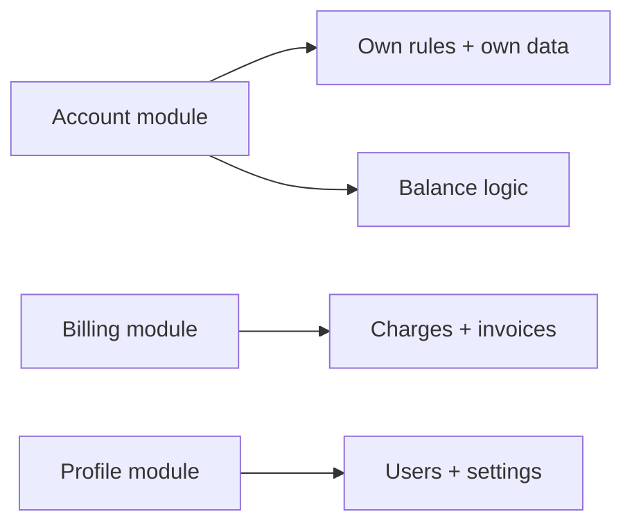

# High Cohesion

## 1. One-Line Definition
High cohesion means a component contains things that belong together — its responsibilities are closely related, focused on one purpose — so it changes for one reason, is easy to understand, and is hard to break by accident.

## 2. Why Do We Need It?
A component that does everything (auth + billing + avatar storage + logging) changes for many reasons, hides its invariants in a pile, and is understood by nobody and broken by everyone. High cohesion makes each unit *one job with its own data and rules*: small enough to reason about, changed for a single purpose, and naturally testable. It is the quality that makes the rest of good design — maintainability (see [[maintainability|Maintainability]]), loose coupling (see [[loose-coupling|Loose Coupling]]), testability — physically possible.

## 3. Simple Intuition
A clinic with one department per illness vs one doctor who does everything. The case drawer in the cardiology room has only cardiology files (cohesive); when a cardiology policy changes, one person, one drawer, one procedure changes. In the everything-doctor's room, changing any policy means reworking the whole room — and nobody can find anything.

## 4. What Happens Without It?
Components become god-objects: each change risks unrelated behavior, tests balloon into end-to-end epics, ownership blurs ("whose code is this?"), and the "one job" a module claims is actually eleven. Coupling to the god-object is high by definition (everything depends on it), so its changes ripple everywhere and its failures take everything down with it.

## 5. Core Idea
- **One reason to change:** a cohesive unit changes when its own concern changes (see single-responsibility thinking); it doesn't absorb neighboring concerns.
- **Its data lives with it:** the rules and the data they govern are together; cohesion is how you *know* where an invariant lives (the invoice total logic is owned by the invoice module, not scattered in five callers).
- **Nested cohesion levels:** the same idea applies at every scale — function (does one thing), module (one responsibility), service (one business capability, e.g., see [[microservices|Microservices]], [[modular-monolith|Modular Monolith]]).
- **Cohesion first, then coupling:** decide what belongs together first; only then draw the seams between the units (see [[loose-coupling|Loose Coupling]]). Cohesion without a plan for decoupling = a giant internal knot; decoupling without cohesion = disintegrated systems that send messages about nothing.
- **Change-localization test:** a requirement about X should touch components named X — if every requirement touches the same three with "and a bit of this", cohesion has failed.

## 6. Important Terminology

| Term | Simple Meaning |
|------|----------------|
| Cohesion | Whether the things inside belong together |
| Responsibility | One accountable job/behavior of a component |
| Change-localization | One requirement → one small change area |
| God object | A component that does too many things |
| Invariant | A rule that must always hold, owned somewhere |
| Bounded context | A business boundary owning its own model (see [[tenancy-and-cells|Multi-Tenancy and Cell-Based Architecture]]) |
| Interface | The small surface a cohesive unit exposes |
| Separation of concerns | Dividing by job, interleaving nothing |

## 7. Basic Architecture



## 8. Request or Data Flow
1. A business requirement arrives: "invoice should include a surcharge".
2. Because invoice logic, rules, and data are cohesive in the billing module, the change lands entirely there — one file-set, one test area.
3. Account, profile, and other modules change nothing; their contracts (interfaces) are untouched.
4. The billing module's own tests verify the invariant; callers see a stable interface.

## 9. Practical Example
**Modular checkout (assumptions):** cart, pricing, payments, fulfillment.
- Cart owns cart state and rules (min quantity, merge logic); pricing owns price rules (discounts, taxes); payments owns authorize/capture/refund and their invariants.
- A "new tax in region X" requirement touches pricing and nothing else; a "refund window" requirement touches payments and nothing else.
- Each module is understandable standing alone; each test is meaningful standing alone; each team owns a module (cohesion scaling into service ownership).

## 10. Scaling
Cohesion scales across *team* boundaries and *system* boundaries: small cohesive code inside grows into cohesive services; cohesive services compose into a fleet. The failure mode of scaling: a "service" that contains pricing, promotions, and gifting wraps its inner lack of cohesion in network clothes — a distributed god-object with all the god-object's problems and none of the monolith's visibility. True cohesion at every level (function → module → service → bounded context) is what keeps the fleet's seams meaningful.

## 11. Reliability and Failure Scenarios

| Failure | What Happens | Detection | Recovery | Trade-off |
|---------|--------------|-----------|----------|-----------|
| God object overflows | Any change breaks unrelated paths | Test coverage gaps, blast radius size | Refactor: extract cohesive modules | Refactor risk |
| Invariant not owned | Two modules each "half-handle" the rule | Mismatched results | Move rule + data together | Migration |
| Cohesion demanded too early | Over-fragmented modules | Cost of orchestration | Coalesce until seams pay | Deferral vs clarity |
| Service owns two concerns | One concern's deploy risks the other | Ownership confusion | Split along concern lines | Second service cost |

## 12. Consistency and Correctness
Cohesion is a correctness enabler: when the rule and its data co-locate, the invariant has one owner and one place to be enforced transactionally (see [[transactions-and-acid|Transactions and ACID]]). Fragmented invariants (the discount logic split across cart and pricing) are where subtle divergence lives — the two halves compute different answers and nobody owns the contradiction. At the service level, this is exactly why one bounded context owns its model and exposes only a contract (see [[contract-first-design|Contract-First Design]], [[consistency|Consistency]]).

## 13. Performance
Cohesion has a performance payoff: one module doing one job keeps hot code compact, cache-friendly, and free of cross-module indirection. Over-fragmentation has a real cost: naively split modules in one process become services that pay serialization, network hops, and distributed coordination for work that belonged together (see [[synchronous-processing|Synchronous Processing]] on chain latency). The performance art is cohesion *at the right grain* — tight inside, seams only where independence earns the hop.

## 14. Security
Cohesion concentrates security boundaries: a cohesive account module is where authorization rules for account data live once — not replicated-and-drifting in six callers. When an invariant includes security (who may read what, see [[authentication-vs-authorization|Authentication vs Authorization]]), its single owner is the difference between "checked here" and "checked three places, forgotten at the fourth". Fragmentation is where authorization gaps like tenant leaks (see [[tenancy-and-cells|Multi-Tenancy and Cell-Based Architecture]]) go unnoticed.

## 15. Trade-Offs

| Choice | Advantages | Disadvantages | When to Use |
|--------|------------|---------------|-------------|
| Cohesive module (one job) | Understandable, change-local, testable | Splitting effort, naming discipline | Everything, at the right grain |
| Functional cohesion (top-level) | Clarity for small units | — | Functions, small classes |
| Communicational cohesion (same data) | Data travels coherently | Can hide mixed jobs | Related operations on one record |
| Coincidental cohesion (random pile) | No; anti-pattern | — | Never |
| Premature fine-splitting | — | Orchestration, naming tax | Avoid until seams pay |
| Bounded-context cohesion | Fleet-scale ownership | Cross-context eventual work | Microservices, multi-team |

## 16. Common Mistakes
- Cohesion theater: extracting "cohesive" classes that merely wrap the same coupled code — the god object survives a costume change.
- Optimal-at-the-wrong-grain: a five-file service because "Separation of Concerns", then a config/hop/ops tax nobody budgeted.
- Data divorced from its rules: the rules in one module, the data in another, and the invariant promised by neither.
- Fragmented invariants as "optimization" — discount logic copied into three places "for response time".
- Ignoring that god-objects grow: today's "for now, put auth in the existing service" is next quarter's five-months-to-move-auth.

## 17. HLD vs LLD Boundary
HLD: the cohesion decisions at system scale — service/module boundaries by business capability, which concerns may legitimately join (communicational) and which must split, contract surfaces. LLD: the within-module cohesion — class responsibilities, function size, "one reason to change" verified in code review and tests.

## 18. Interview Questions

### Beginner
- What makes a component cohesive, and what does "one reason to change" mean?
- Why does cohesion matter *before* you can decouple anything?

### Intermediate
- A checkout service does cart, pricing, and payments. Walk how you'd split it and what cohesion you require of each part.
- Cohesion vs localization: a requirement changes pricing, and the diff touches five modules. What does that tell you?

### Advanced
- Design a fleet where cohesion is enforced at the bounded-context level. What does each context own, and what crosses boundaries?
- When is "combined" cohesion actually correct (e.g., one module owns everything a record needs), and why isn't that a god object?

## 19. Interview Memory Summary

> [!abstract]- Interview Memory Summary

### Remember

- Cohesion = the things inside a component belong together.
- One reason to change per unit; one job, one owner.
- Rules and their data live together (invariants have a home).
- Cohesion first, then seams ([[loose-coupling|Loose Coupling]]).
- Applies at every scale: function → module → service → bounded context.
- God object = the anti-cohesion smell; it concentrates blast radius.
- Fragmented invariants are where divergence and security gaps hide.
- Grain matters: over-fragmenting costs hops and oracle churn.

### 30-Second Explanation

First decide what genuinely belongs together — the rules, their data, and one responsibility — and keep them in one cohesive unit; then draw seams around those units and decouple what's outside them. A requirement about X should touch only modules named X, and every invariant (including security) must have exactly one owner.

### Interview Traps

- Refactoring into "cohesive" classes that still share all the state (costume change).
- Splitting so fine that the org pays a hop/config/ops tax for units that belonged together.
- Saying "it's a god object but it works" — it works until a change touches its other half.
- Copying invariant logic for "speed" — divergence is a future correctness incident.

### Key Trade-Off

Cohesion buys change-locality, understandability, and reliable invariants at the price of disciplined boundaries — and the discipline is getting the *grain* right, because over-fragmentation costs as much as under-cohesion.

## 20. Related Concepts

### Prerequisites

- [[maintainability|Maintainability]]
- [[system-design-fundamentals|System Design Fundamentals]]

### Commonly Used Together

- [[loose-coupling|Loose Coupling]] (cohesion first, then decouple)
- [[modular-monolith|Modular Monolith]] (cohesion inside one process)
- [[microservices|Microservices]] (cohesion at service scale)
- [[hexagonal-clean-architecture|Hexagonal and Clean Architecture]]

### Alternatives

- [[layered-architecture|Layered / N-Tier Architecture]] (cohesion by layer instead of by capability — the classic contrast)

### Advanced Concepts

- [[tenancy-and-cells|Multi-Tenancy and Cell-Based Architecture]] (bounded-context cohesion across a fleet)
- bounded context (planned) — see [[data-patterns|Data Access Patterns]]

## 21. References
Coad & Yourdon on cohesion types; classic module-design literature (Stevens-Myers-Constantine cohesion scale); Domain-Driven Design (bounded contexts) for service-scale cohesion. Reconcile with current module/system guidance in your language's docs.

## 22. Active Recall

Test yourself before revealing each answer.

> [!question]- What does "one reason to change" actually predict about a module's future?
> The number of distinct reasons maps to the number of independent change streams it absorbs. One reason → each change is local, tests are targeted, reviewers understand the whole diff. Many reasons → every requirement drags this module along, its tests balloon, and any change risks its unrelated halves. Cohesion is a forecast of maintenance cost, not a stylistic preference.

> [!question]- Why must cohesion come before decoupling, not after?
> Because coupling decisions are *where to cut*, and cuts only make sense once you know what belongs together. If you decouple first, you're drawing arbitrary seams through the middle of what should be one unit — every operation now crosses a boundary it shouldn't, paying hops and coordination. Cohesion defines the units; coupling then decides what sits outside them.

> [!question]- A checkout "service" is split into cart/pricing/payments, but the code splits are purely cosmetic. How do you know?
> Check the invariants: does money correctness live in one place enforced once, or is the "pricing" module calling back into "cart" internals and drifting? Run the change-localization test — a pricing requirement that diff-touches cart and payments means the seams are decoration. Cohesion isn't the folder structure; it's whether each unit can change, run, and be right alone.

> [!question]- Trade-off: split into cohesive services, or cohere inside one monolith?
> Cohesion inside the monolith gives you tight, cheap, local change (see [[modular-monolith|Modular Monolith]]); services give you team-scale independence but every cross-boundary call costs a hop, serialization, and distributed consistency. The grain that pays is the one where the unit's independence (team, deploy, scale) exceeds the coordination cost — so cohesion by capability with module boundaries, upgraded to services only where independence earns it.

> [!question]- Interview scenario: a "tax rules" requirement lands, and the PR touches cart, pricing, payments, and analytics. Walk the diagnosis.
> The invariant "what tax applies" is fragmented across four modules — that's a cohesion failure (and a divergence risk: four modules will compute taxes differently eventually). The fix is consolidation: tax ownership lives in the pricing capability (rules + data + tests), and the others read the result through contracts. Change-localization means one requirement → one diff → one place where the answer is defined.

> [!question]- When is fused/seemingly-mixed cohesion not a god object?
> When the combined responsibilities genuinely share the same data and change together — communicational cohesion: an "Orders" module that owns order record, its state transitions, and its validation changes as one and is read together (see [[data-patterns|Data Access Patterns]]). It's a god object when the joined concerns have *independent reasons to change* — auth glued to avatar storage. The test is always "do they change for the same reasons?"

## 23. When Should I Use This?

### Use it when

- You draw module/service boundaries and need them to outlast their authors.
- Invariants (pricing, balances, authorization) must have exactly one owner.
- The change-localization test matters: requirements should be one-diff, not five-module touches.
- You're designing at any scale — function, module, service, bounded context — and want understandability.

### Avoid it when

- Splitting cohesion *early* for "purity": adding seams, modules, and naming tax for units with one consumer and no independence needed.
- You'd rather cohere pragmatically: a monolith with clear internal modules outperforms a prematurely-disintegrated fleet (see [[monolith|Monolith]]).

### What problem does it solve?

It makes units understandable and change local: each component is one job with its own rules and data, changes for a single reason, and carries its invariants — including security — in exactly one place, so requirements land in small, safe diffs instead of rippling through five modules.

### What problem does it NOT solve?

It doesn't remove the need for decoupling (a pile of cohesive modules with no seams still knots), doesn't fix bad grain (over-fragmentation costs as much as god-objects), and it can't force good *data* boundaries at network scale alone — cohesive services still need the cross-context consistency discipline (see [[consistency|Consistency]], [[distributed-transactions|Distributed Transactions]]) once their cohesive units split apart.

## 24. Decision Connections

Decisions that go together with high cohesion:

- [[loose-coupling|Loose Coupling]] — the partner rule: cohere first, then cut seams.
- [[maintainability|Maintainability]] — the payoff: change-locality and understandability.
- [[modular-monolith|Modular Monolith]] — cohesion inside one deployment, before the network.
- [[microservices|Microservices]] — cohesion promoted to the fleet scale.
- [[hexagonal-clean-architecture|Hexagonal and Clean Architecture]] — ports/adapters as the seam around a cohesive core.
- [[data-patterns|Data Access Patterns]] — how cohesive ownership shapes reads/writes.
- [[tenancy-and-cells|Multi-Tenancy and Cell-Based Architecture]] — bounded-context cohesion across cells.

Decision tree:

```
Draw the seams between components
    |
    +-- Do the responsibilities change for the same reason?
    |      → +-- yes → keep them one cohesive unit (communicational)
    |      → +-- no  → split (different reasons = different fates)
    |
    +-- Do the rules and their data live together?
    |      → no → move rule + data to one owner (invariant home)
    |
    +-- Independent team/deploy/scale worth the hop?
    |      → yes → service boundary ([[microservices|Microservices]])
    |      → no  → module boundary in-process ([[modular-monolith|Modular Monolith]])
    |
    +-- Change-localization test passed?
    |      (one requirement → one diff → one owner)
    |      → no → fuse or re-split until yes
    |
    +-- Beyond each unit?
           → [[loose-coupling|Loose Coupling]] the seams you kept
```