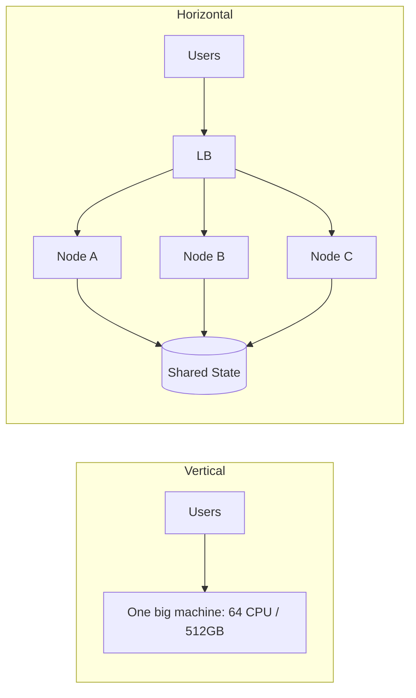

# Horizontal vs Vertical Scaling

## 1. One-Line Definition
Vertical scaling (scale up) makes a single machine bigger; horizontal scaling (scale out) adds more machines and splits the work between them.

## 2. Why Do We Need It?
Every system eventually outgrows one machine. Choosing the right scaling direction determines cost, complexity, and future ceiling. Vertically you are limited by the largest machine on the market; horizontally you are limited only by your ability to make work independent.

## 3. Simple Intuition
Your kitchen is overwhelmed. **Vertical:** buy a bigger oven, a taller fridge, a sturdier counter — same kitchen, more capacity, but you can only buy what exists and expansions mean closing the restaurant for a day.
**Horizontal:** open a second kitchen, split the recipes between them — you can keep adding kitchens, but dishes that need both kitchens (shared state) now require coordination and delivery between them.

## 4. What Happens Without It?
A single server's capacity is fixed at purchase time. As DAU grows, requests queue, latency spikes, and errors appear. The moment-of-truth: your DB connection pool, disk, or CPU saturates and the only "fix" (a bigger box) has a hard ceiling and requires downtime to install.

## 5. Core Idea
- **Vertical (scale up):** increase CPU/RAM/disk/network of one node. 
  - Simple, no code changes, no distributed complexity.
  - Bounded (biggest instance), nonlinear cost, single point of failure, and upgrades mean downtime (unless the provider offers zero-downtime resize).
- **Horizontal (scale out):** add more nodes.
  - **Stateless tiers** scale trivially behind a load balancer.
  - **Stateful tiers** need replication (reads) and partitioning/sharding (writes/storage).
  - New curse: consistency, coordination, distributed transactions, rebalancing.

**Best practice:** vertical where trivial (burst capacity, early growth), horizontal where growth is sustained (demand-driven). Most mature systems are a mix: modest vertical sizing per node + horizontal for capacity.

## 6. Important Terminology

| Term | Simple Meaning |
|------|----------------|
| Scale up / vertical | Bigger single machine |
| Scale out / horizontal | More machines, split work |
| Load balancer | Spreader of requests across nodes |
| Stateless workload | Any node can do any request |
| Stateful workload | Requires replication/sharding to grow |
| Elasticity | Add/remove nodes automatically with load |
| Capacity ceiling | Max throughput of one node |
| SPOF | One machine = one point of failure |

## 7. Basic Architecture



## 8. Request or Data Flow
- **Vertical:** all requests to one machine; capacity = machine size.
- **Horizontal:** LB picks a healthy node → node serves using shared state. Adds and removes of nodes are runtime events. Shared state (DB/cache) becomes the growth-plan focus.

## 9. Practical Example
**Product catalog (assumptions):** 2000 QPS reads now, projected 20,000 QPS in 12 months.
- Start: single large DB instance (vertical) — fast to build, plenty for now.
- Growth: add read replicas (horizontal reads) behind the app tier; cache hot catalog pages.
- Later: partition catalog by category/tenant (horizontal writes/storage). Each step is validated by measured QPS/latency, not guesses.

## 10. Scaling
- **Vertical scaling:** cheapest engineering, real ceiling, more expensive per unit of capacity; ideal for databases early on (they benefit from fast single-connection-heavy workloads) and burst capacity.
- **Horizontal scaling:** app tier first (stateless, free), then cache tier, then DB reads (replicas), then DB writes (shards), then multi-region.
- **The stateful ceiling:** you can add 10,000 stateless nodes in an hour; a single DB/RAC cluster has a hard ceiling. Horizontal at the data tier is where sharding and consistent hashing come in.
- **Hotspot risks:** horizontal data splitting still concentrates on hot keys (one user, one tenant) — plan for hot-shard handling.

## 11. Reliability and Failure Scenarios
- **Vertical:** single machine = single point of failure; a failure kills everything; recovery = restore/reboot.
- **Horizontal:** node loss is routine (LB reroutes); but adds consistency issues — a DB failover may lose recent writes (async replication), a cache loss causes a read-miss storm, shard loss degrades a slice of data.
- **Network partition:** more nodes = more links = higher partition probability; may need quorum to avoid split brain in the data tier.

## 12. Consistency and Correctness
Horizontal data scaling forces a consistency discussion (read replicas lag; shards break cross-shard transactions). Vertical scaling keeps a single view of the data — simpler and more consistent, at a price. The naive "add more nodes and stay strongly consistent with no coordination" is impossible; state those limits explicitly.

## 13. Performance
- **Vertical:** add CPU/RAM → good for CPU- or memory-bound single-connection-heavy workloads (in-memory stores, vertical DB scaling helps when join-heavy).
- **Horizontal:** more nodes → aggregate throughput; per-request latency may *increase* if it now needs cross-node coordination. Measure p99, not just QPS, when scaling out.

## 14. Security
More machines = more credentials, more patch surface, more blast radius. Keep horizontal growth paired with least-privilege service identities, secrets management, and network segmentation so one stolen node doesn't unlock the fleet.

## 15. Trade-Offs

| Choice | Advantages | Disadvantages | When to Use |
|--------|------------|---------------|-------------|
| Vertical | Simple, no code change | Bounded, expensive, SPOF, downtime | Early growth, DB, burst |
| Horizontal (stateless) | Elastic, cheap, easy | Requires LB + no node state | App tier, workers |
| Horizontal (replicas) | Scale reads | Lag, extra storage | Read-heavy DB |
| Horizontal (shards) | Scale writes/storage | Rebalancing, cross-shard ops | Very large data |
| Mixed | Right-sized per tier | More operational surface | Most mature products |

## 16. Common Mistakes
- Saying "we scale horizontally" while the database is one vertical box that never changes — name the tier.
- Scaling vertically past the cost-effective point when the same money buys 10 nodes.
- Assuming horizontal is automatically high-availability — added nodes need their own failover story.
- Forgetting the shared state always bounds you: adding nodes around one Redis is scaling the *clients*, not the system.

## 17. HLD vs LLD Boundary
HLD: decide scale direction per tier, replica/shard counts, elasticity policy. LLD: how one service uses the pool, connection settings, node-local tuning.

## 18. Interview Questions

### Beginner
- What is the difference between vertical and horizontal scaling?
- Why is horizontal scaling impossible for a service with in-memory sessions?

### Intermediate
- When should a database scale vertically instead of horizontally?
- You scale an app tier to 100 nodes but throughput stops growing. What's wrong?

### Advanced
- Design write scaling beyond a single database instance — where does vertical still make sense?
- Compare the consistency properties of a single huge DB vs a sharded cluster for a bank account.

## 19. Interview Memory Summary

> [!abstract]- Interview Memory Summary

### Remember

- Vertical = bigger box, capped/expensive; horizontal = more boxes, elastic.
- Stateless tiers scale out freely.
- Stateful tiers need replicas first, then shards.
- Horizontal adds consistency/coordination costs.
- Most mature systems mix both per tier.

### 30-Second Explanation

App = horizontal stateless; DB = vertical first, then replicas for reads, shards for writes, replicating semantics carefully.

### Interview Traps

- Claiming horizontal solves everything — the minute everyone talks to the same DB/line, you've just scaled clients around one shared point.
- Saying "we scale horizontally" while the database is one vertical box that never changes — name the tier.
- Scaling vertically past the cost-effective point when the same money buys 10 nodes.
- Assuming horizontal is automatically high-availability — added nodes need their own failover story.

### Key Trade-Off

Horizontal scaling buys unbounded capacity at the price of distributed-systems complexity (consistency, coordination, rebalancing), so you scale vertically where trivial and horizontally where growth is sustained.

## 20. Related Concepts

### Prerequisites

- [[scalability|Scalability]]

### Commonly Used Together

- [[stateless-vs-stateful-services|Stateless vs Stateful Services]]
- [[load-balancing|Load Balancing]]
- [[database-replication|Database Replication]]
- [[sharding|Sharding]]
- [[consistent-hashing|Consistent Hashing]]

### Advanced Concepts

- [[strong-vs-eventual-consistency|Strong vs Eventual Consistency]]

Related planned topics (not authored yet): auto-scaling.

## 21. References
Standard HLD scaling material (Grokking System Design, cloud provider scaling docs). Confirm instance ceiling/pricing with current provider docs.

## 22. Active Recall

Test yourself before revealing each answer.

> [!question]- What problem does choosing a scaling direction solve?
> Every system eventually outgrows one machine. Vertical (bigger box) is simple but bounded by the largest machine on the market; horizontal (more boxes) is bounded only by your ability to make work independent. Choosing wrong determines cost, complexity, and your future ceiling.

> [!question]- What is the difference between vertical and horizontal scaling?
> Vertical (scale up) increases CPU/RAM/disk/network of one node — simple, no code change, but bounded, nonlinear cost, single point of failure, and downtime for upgrades. Horizontal (scale out) adds more nodes and splits the work — requires stateless app tiers behind an LB and partitioned/replicated data.

> [!question]- Why is horizontal scaling impossible for a service with in-memory sessions?
> Any node's session is invisible to other nodes, so users must be pinned by sticky sessions — load can't spread freely. State must be externalized (shared store) before adding nodes does anything; "scaling clients around one shared Redis/DB" is not scaling the system.

> [!question]- When should a database scale vertically instead of horizontally?
> Early growth and burst capacity, and workloads that love big single instances (in-memory stores, join-heavy DBs, single-connection-heavy tasks). Vertical is the cheapest engineering for the data tier at first; you go horizontal (replicas, then shards) when vertical stops being cost-effective or hits the ceiling.

> [!question]- What do you give up when you scale a data tier horizontally?
> Consistency: read replicas lag, shards break cross-shard transactions, and more nodes mean more partitions that need quorum decisions. The naive "add nodes and stay strongly consistent with no coordination" is impossible — you exchange the simple single-view vertical DB for coordination costs.

> [!question]- You scaled the app tier to 100 nodes but throughput stopped growing. What's wrong and how do you prove it?
> Suspect a single shared point: one DB, one Redis, one lock, or a hot shard. Prove it by measuring the shared resource's utilisation and QPS growth across node count — throughput flatlines when the shared component saturates, regardless of app nodes.

> [!question]- Interview scenario: a product catalog at 2k QPS reads, projected 20k QPS in 12 months.
> 1. Start: single large DB instance (vertical) — fast to build, plenty for now.
> 2. Growth: add read replicas (horizontal reads) behind the app tier; cache hot catalog pages.
> 3. Later: partition the catalog by category/tenant (horizontal writes/storage).
> 4. Validate each step with measured QPS/latency, not guesses.

> [!question]- Your "horizontally scalable" system's database is a single vertical box. What's the real picture?
> The app tier scales out but the data tier doesn't — you've scaled clients around one shared point, and the DB is both a capacity ceiling and an SPOF. Name the tier: each tier gets its own direction, and a horizontal data tier needs replicas, sharding, and consistent hashing.

## 23. When Should I Use This?

### Use it when

- You're choosing per tier: app nodes horizontal, DB vertical first then replicas/shards.
- Traffic is growing and you must decide between a bigger machine vs more machines.
- You want burst/headroom capacity cheaply (vertical) or sustained growth (horizontal).
- You're comparing single huge DB vs sharded cluster for a given workload.

### Avoid it when

- Vertical cost is past its effective point but you keep buying bigger instances.
- The shared state isn't ready (single Redis, one DB, sticky sessions) — horizontal will just pile clients on the same point.
- The team isn't ready for consistency/coordination costs that horizontal data scaling introduces.
- Maturity matters more than ceiling — horizontal adds operational surface that a small system shouldn't carry.

### What problem does it solve?

Problem: a single server's capacity is fixed at purchase time; as DAU grows, the connection pool, disk, or CPU saturates and the only "fix" (a bigger box) is capped and requires downtime. Solution: a per-tier strategy — vertical where trivial (burst, early growth, DB), horizontal where growth is sustained (stateless app nodes, replicas for reads, shards for writes) — so capacity can grow with the business.

### What problem does it NOT solve?

It doesn't make horizontal scaling free — added nodes need their own failover/availability story and introduce consistency and coordination costs. It doesn't remove the shared-state ceiling (one Redis still bounds everyone), and it doesn't fix hotspots: a horizontal data split still concentrates on hot keys that need shard-key design and hot-shard handling.

## 24. Decision Connections

Decisions that go together with horizontal vs vertical scaling:

- [[scalability|Scalability]] — the parent concept this direction choice realizes.
- [[stateless-vs-stateful-services|Stateless vs Stateful Services]] — stateless tiers scale out freely; stateful tiers need replicas then shards.
- [[load-balancing|Load Balancing]] — the router that makes scale-out app tiers work.
- [[database-replication|Database Replication]] — the read-scaling step for a vertically-sized DB.
- [[sharding|Sharding]] — the write/storage-scaling step after replicas.
- [[consistent-hashing|Consistent Hashing]] — keeps resharding cheap when shard count changes.
- [[strong-vs-eventual-consistency|Strong vs Eventual Consistency]] — the consistency cost horizontal data scaling imposes.
- [[capacity-estimation|Capacity Estimation]] — produces the QPS/storage numbers that choose direction per tier.

Decision tree:

```
Pick a scaling direction for a tier
    |
    +-- Small scale / burst / early growth?
    |      → vertical (bigger machine) — simple, capped, downtime for upgrades
    |
    +-- Sustained concurrency on the app tier?
    |      → stateless nodes behind [[load-balancing|Load Balancing]] (horizontal)
    |
    +-- DB reads growing?
    |      → [[database-replication|Database Replication]] (read replicas, horizontal reads)
    |
    +-- DB writes or storage growing?
    |      → [[sharding|Sharding]] (horizontal writes/storage)
    |         +-- Must reshard cheaply?   → [[consistent-hashing|Consistent Hashing]]
    |         +-- Cross-shard txns?       → accept [[strong-vs-eventual-consistency|Strong vs Eventual Consistency]] cost or keep vertical
    |
    +-- Size first
           → [[capacity-estimation|Capacity Estimation]] (QPS, storage, growth)
```