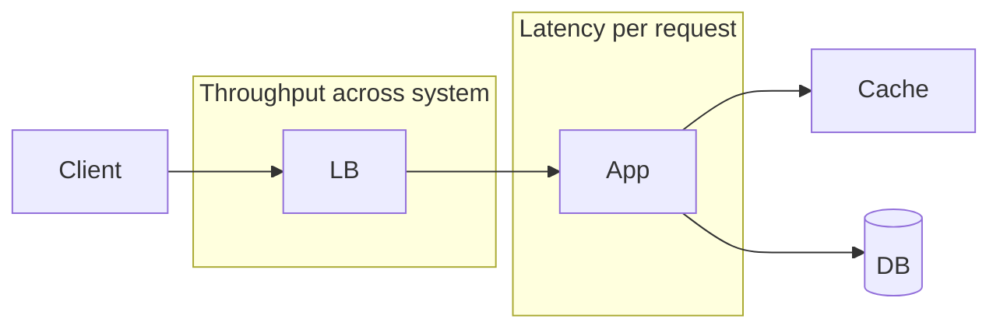

# Latency vs Throughput

## 1. One-Line Definition
Latency is the time one request takes from start to finish; throughput is how many requests the system completes per unit of time.

## 2. Why Do We Need It?
They are twin measurements of performance, and they are easy to confuse. A system can have great latency and poor throughput (fast single request, crashes under load) or great throughput and poor latency (lots of work done, each one slow). You must measure both to find the real bottleneck.

## 3. Simple Intuition
Latency is the time a single car takes on a road trip; throughput is how many cars the highway moves per hour. A Ferrari (1 ms per request) on a two-lane road delivers fewer cars/day than a bus lane (10 ms per request) that carries 100 people at once.

## 4. What Happens Without It?
Optimising only latency → you add aggressive caching, then discover the cache itself becomes a bottleneck under heavy concurrency. Optimising only throughput → you batch aggressively, then every interactive user experiences slow responses. Both measures need a target.

## 5. Core Idea
- **Latency** = time from request start to response end, usually measured in milliseconds. Report percentiles: **p50** (typical), **p95** (most users), **p99** (slowest 1%). The tail (p99/p999) is what users actually feel because an app is only as fast as its slowest required request.
- **Throughput** = requests (or operations, bytes) per second (QPS/TPS). Limited by the bottleneck resource: CPU, I/O, DB connections, network.
- **Relationship (Little's Law):** concurrent_in_flight = latency × throughput. At fixed latency, doubling throughput needs double concurrency. This is why latency spikes under load — queuing.

## 6. Important Terminology

| Term | Simple Meaning |
|------|----------------|
| p50 / p95 / p99 | Percentiles of latency distribution |
| Tail latency | Slowest requests (p99/p999) |
| QPS / TPS | Queries / transactions per second |
| Concurrency | Requests in flight at once |
| Little's Law | concurrency = latency × throughput |
| Queuing delay | Time spent waiting for a busy resource |
| Bandwidth | Bytes per second the network can carry |

## 7. Basic Architecture



Latency = time through the chain on a single path. Throughput = how many paths the whole system can run in parallel.

## 8. Request or Data Flow
A request spends time on the network, in the queue, in processing, waiting on the cache/DB, and on the response path. Throughput is measured by putting load on the system and counting completions per second; latency is measured per request and bucketed into percentiles.

## 9. Practical Example
**URL shortener (assumptions):** 
- 100k redirects/sec, p50 latency 5 ms target.
- A DB round-trip per redirect (~10-30 ms in-region) would blow the budget → put resolved mappings in cache/edge; throughput then scales with cache nodes, not with a single DB.

## 10. Scaling
- **Latency scaling:** shorten the hot path — cache, replica locality, CDN, protocol upgrades, avoid serial round-trips (parallel fan-out).
- **Throughput scaling:** add independent nodes (stateless apps, DB shards, worker pools) so more work runs concurrently.
- **Relationship trap:** adding nodes can *raise* p99 latency if work needs coordination (joins across shards, distributed locks). Watch both numbers when scaling.

## 11. Reliability and Failure Scenarios
- **Queue overload:** latency balloons (queuing theory), then timeouts, then failures.
- **Tail amplification:** a fan-out request waiting on 5 shards is as slow as its slowest shard (p95^5). Hedge or cap waiting time.
- **Retry storms:** failed slow requests get retried, doubling load → need backoff + jitter + circuit breakers.
- **Hotspot:** one hot shard becomes the single slow path for the whole system.

## 12. Consistency and Correctness
Consistency choices trade against latency: sync replication adds write latency; quorum reads/writes add a round; strong consistency on a distributed store is slower than serving from cache. Choose per-operation, don't make everything strongly consistent "to be safe".

## 13. Performance
Target your metric before tuning: some products optimise p50 (batch, ETL), interactive products optimise p95/p99. Always measure under realistic load — a system that hits latency targets at 10% of expected QPS may collapse at 90%.

## 14. Security
Security checks add latency (TLS handshake, authN calls, WAF scanning). Mitigate: TLS session resumption, CDN/WAF offload, cached auth decisions with TTL.

## 15. Trade-Offs

| Choice | Advantages | Disadvantages | When to Use |
|--------|------------|---------------|-------------|
| Optimise p50 | Feels fast "most of the time" | Misses user-perceived slowness | Batch systems, background jobs |
| Optimise p99 | Real user experience | Expensive (hedges, replicas) | Interactive products |
| Cache for latency | Big latency win | Staleness, invalidation cost | Hot reads |
| More nodes for throughput | Capacity scales | Cost, coordination overhead | Stateless workloads |
| Coalescing/batching | Raised throughput | Raised latency per item | Logs, metrics, bulk analytics |

## 16. Common Mistakes
- Reporting "average latency" — one big outlier hides the story; always use percentiles.
- Optimising throughput while p99 worsens, and calling it an improvement.
- Forgetting queuing: "our DB takes 5 ms" is true at idle, false at 80% utilisation.
- Assuming lower p50 means better UX — p99 is what users feel.
- Confusing **bandwidth** (bytes/sec) with **throughput** (requests/sec).

## 17. HLD vs LLD Boundary
HLD: target percentiles, replica/cache placement for latency, system QPS ceiling, tier sizing. LLD: in-function timing, algorithmic choice, thread/async internals, JIT tuning.

## 18. Interview Questions

### Beginner
- What is the difference between latency and throughput?
- Why do we report p95/p99 instead of just the average?

### Intermediate
- A service is 10% faster in p50 but 2x worse in p99 after a change. What happened?
- How does the tail latency of one component affect a fan-out that depends on many?

### Advanced
- Using 100 nodes you see throughput saturate. How do you know if it's latency, concurrency, or a bounded resource?
- Design a low-latency system for a global audience; what are the p99 budgets per hop?

## 19. Interview Memory Summary

> [!abstract]- Interview Memory Summary

### Remember

- Latency = time for one request; throughput = completions/sec.
- Report percentiles, never averages.
- Tail latency (p99/p999) is what users actually feel.
- Little's Law: concurrency = latency × throughput.
- Scaling can worsen both if coordination grows.

### 30-Second Explanation

Measure both, use percentiles, shorten hot paths for latency, add independent nodes for throughput, and expect queuing under load.

### Interview Traps

- "We cache everything so we're fast" — you've moved the latency problem to cache consistency and cold-miss tail; quantify the miss path.
- Reporting "average latency" — one big outlier hides the story; always use percentiles.
- Optimising throughput while p99 worsens and calling it an improvement.
- Confusing bandwidth (bytes/sec) with throughput (requests/sec).
- Forgetting queuing: "our DB takes 5 ms" is true at idle, false at 80% utilisation.

### Key Trade-Off

Latency and throughput pull in opposite directions (batching/caching raise throughput or one metric at the expense of the other), so you pick the metric the product actually feels — and percentiles over averages — before tuning.

## 20. Related Concepts

### Prerequisites

- [[capacity-estimation|Capacity Estimation]]

### Commonly Used Together

- [[caching|Caching]]
- [[bottleneck-identification|Bottleneck Identification]]
- [[distributed-tracing|Distributed Tracing]]

### Advanced Concepts

- [[cdn|CDN]]
- [[golden-signals|Golden Signals]]

Related planned topics (not authored yet): latency-budget, performance.

## 21. References
Google SRE Book (latency/SLO), standard queuing theory (Little's Law). Verify against current load-testing guidance.

## 22. Active Recall

Test yourself before revealing each answer.

> [!question]- Why do we need both latency and throughput as measurements?
> They are easy to confuse and show different failures: great latency + poor throughput (fast single request, crashes under load), or great throughput + poor latency (lots of work, each slow). Measuring only one hides the real bottleneck.

> [!question]- What is the difference between latency and throughput?
> Latency is the time one request takes start to finish (measured in ms). Throughput is how many requests the system completes per unit time (QPS/TPS), limited by the bottleneck resource — CPU, I/O, DB connections, network.

> [!question]- Why do we report p95/p99 instead of just the average?
> One big outlier skews an average and hides the story. The tail (p99/p999) is what users actually feel — an app is only as fast as its slowest required request. Some products optimise p50 (batch/ETL), interactive products optimise p95/p99.

> [!question]- What does Little's Law tell you about a system under load?
> concurrent_in_flight = latency × throughput. At fixed latency, doubling throughput needs double concurrency. This is why latency spikes under load — requests queue behind a busy resource and queuing delay grows non-linearly toward 100% utilisation.

> [!question]- What do you trade when you batch or coalesce work for throughput?
> You raise throughput (logs, metrics, bulk analytics) but raise latency per item — a single item waits for its batch to fill. Not acceptable for interactive requests. The pair forms the classic latency-vs-throughput trade-off.

> [!question]- A fan-out request waits on 5 shards. Why is it as slow as its slowest shard?
> Tail amplification: if each shard's p95 is 95 ms, the chance any shard is slow grows with the fan-out (roughly p95^N), so the parallel call is dominated by the slowest peer. Hedge by racing redundant calls or capping wait time.

> [!question]- Interview scenario: a URL shortener must do 100k redirects/sec at p50 5 ms.
> A DB round-trip per redirect (~10-30 ms in-region) blows the latency budget and the DB caps throughput. Put resolved mappings in cache/edge; then throughput scales with cache nodes, not a single DB, and the p50 stays in budget.

> [!question]- What happens when a queue overfills and retries pile on at 80% utilisation?
> Latency balloons (queuing theory), requests time out, and failed slow requests get retried — a retry storm that doubles load and cascades. Mitigate with backoff + jitter + circuit breakers, and note that a "5 ms DB" is only 5 ms at idle.

## 23. When Should I Use This?

### Use it when

- You're setting performance targets for a system (p50 for batch, p95/p99 for interactive).
- You must decide between optimising latency (shorten hot path, cache, CDN) and throughput (more nodes, batching).
- You're debugging why adding nodes didn't raise throughput (shared bottleneck) or raised p99 (coordination).
- You design fan-out paths and must budget for tail amplification.

### Avoid it when

- You have no load scenario — measurements without realistic load (e.g., at 10% of QPS) prove nothing.
- The decision is about correctness/availability, not speed.
- You're tempted to report a single number — you always need both measures plus percentiles.

### What problem does it solve?

Problem: teams optimise one number and make the system worse — caching for latency creates cache-contention bottlenecks; aggressive batching for throughput makes every interactive user slow. Solution: measure the two dimensions separately with percentiles, then choose per product: shorten the hot path for latency, add independent nodes for throughput.

### What problem does it NOT solve?

It doesn't find *which* tier is the bottleneck (that's bottleneck identification), doesn't decide consistency or availability trade-offs, and measuring well still requires capacity estimates and load testing — the numbers alone don't design the system.

## 24. Decision Connections

Decisions that go together with latency vs throughput:

- [[capacity-estimation|Capacity Estimation]] — converts target QPS/latency into nodes, cache, and bandwidth.
- [[caching|Caching]] — the primary lever for read latency, with a stale-data and cold-miss cost.
- [[bottleneck-identification|Bottleneck Identification]] — the saturated resource that caps throughput.
- [[cdn|CDN]] — moves static delivery close to users to cut latency and egress.
- [[distributed-tracing|Distributed Tracing]] — measures latency per hop to find the slow path.
- [[golden-signals|Golden Signals]] — latency is one of the four signals to monitor along with throughput (traffic/errors/saturation).

Decision tree:

```
Optimising performance — which metric matters?
    |
    +-- Interactive users (feels slow)?
    |      → optimise p95/p99 latency
    |         +-- Hot reads?       → [[caching|Caching]]
    |         +-- Global static?   → [[cdn|CDN]]
    |         +-- Find slow hop?   → [[distributed-tracing|Distributed Tracing]]
    |
    +-- Throughput-bound (batch, high QPS)?
    |      → add independent nodes, batching (pay per-item latency)
    |      → find what saturates?  → [[bottleneck-identification|Bottleneck Identification]]
    |
    +-- Size the targets first?
           → [[capacity-estimation|Capacity Estimation]] (QPS, bytes)
    +-- Monitor?
           → [[golden-signals|Golden Signals]] (latency + traffic + errors + saturation)
```