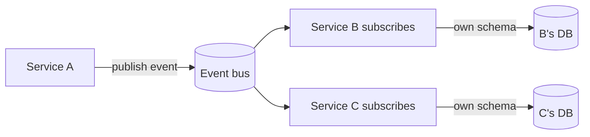

# Loose Coupling

## 1. One-Line Definition
Loose coupling is a design property where components interact through minimal, stable interfaces and know as little as possible about each other's internals, so a change or failure in one rarely forces a change or failure in another.

## 2. Why Do We Need It?
Coupled components become one big component: a schema change in service A forces changes across the fleet, a deploy of A must be coordinated with everything that reads its data, and A's outage takes down its consumers. Loose coupling is what allows teams to move independently — deploy, scale, and evolve at different speeds — and what prevents one change from turning into a fleet-wide incident. It is the structural basis of the service- and event-driven styles (see [[microservices|Microservices]], [[event-driven-architecture|Event-Driven Architecture]]).

## 3. Simple Intuition
A lamp and its wall socket. The lamp knows only "plug in, get power, an interface that doesn't care which power plant produced the current." You swap the lamp (change the consumer), you swap the provider at the click of a fuse (change the implementation), and neither touches the other — all because both parties agreed on the sockets' shape and don't reach into each other's wiring.

## 4. What Happens Without It?
Change becomes a cartel deal: every upgrade needs everyone's presence, every deploy is a shared-peak event, and the hottest chain-link — the most-coupled service — turns a minor change into a moment-of-truth. Failures travel too: a slow or dead dependency isn't contained, it drags down everyone who touches it (see [[single-point-of-failure|Single Point of Failure]], [[resilience|Resilience]]). Time-to-market decays to the slowest negotiator.

## 5. Core Idea
- **Stable contracts, minimal surface:** components exchange only what's needed through a documented interface (see [[contract-first-design|Contract-First Design]]), versioned so change is additive (see [[api-versioning|API Versioning]], [[backward-compatibility|Backward Compatibility]]).
- **No shared internals:** consumers don't reach into another service's schema, config, or DB; ownership of schema/state stays private per component.
- **Asynchronous over synchronous where possible:** events and queues (see [[asynchronous-processing|Asynchronous Processing]]) decouple producers from consumers in *time* and *fate* — the producer doesn't wait and doesn't die with the consumer.
- **Discovery instead of hardcoding:** endpoints come from a registry (see [[service-discovery|Service Discovery]]), not from compiled-in addresses.
- **Failure containment:** timeouts, circuit breakers, and fallbacks (see [[circuit-breaker|Circuit Breaker]], [[resilience|Resilience]]) ensure a partner's problems don't become yours.
- **The tests of coupling:** can I deploy one side alone? Can it die without the other noticing? Can an interface evolve without a coordinated global change?

## 6. Important Terminology

| Term | Simple Meaning |
|------|----------------|
| Interface | The agreed contract between components |
| Contract | Schema + semantics consumers rely on |
| Temporal coupling | One side must exist/be-fast *when* the other acts |
| Causal coupling | A's change forces B's change |
| Event notification | "X happened" — no assumption about who reacts |
| Point-to-point glue | Each pair writes bespoke integration |
| Discovery | Finding endpoints at runtime, not by hardcode |
| Fate sharing | Failure of one component equals failure of the other |

## 7. Basic Architecture



## 8. Request or Data Flow
1. Service A performs a business action, commits its own data, and publishes an event ("order created") — it knows nothing about who cares.
2. Each subscriber holds the contract (see [[contract-first-design|Contract-First Design]]), maintains its *own* projection/state, and reacts on its own schedule.
3. A new subscriber D joins by subscribing; A changes nothing — decoupled in time, space, and fate.
4. When a subscriber fails, A is unaffected; when A changes version, subscribers that honor the versioned contract are unaffected (see [[backward-compatibility|Backward Compatibility]]).

## 9. Practical Example
**Order service + inventory + analytics (assumptions):** 40 teams, many deploys per team per day.
- Ordering publishes "OrderPlaced v1" and owns order schema exclusively; inventing a new order field is `v2`, additive, coexisting.
- Inventory subscribes and updates its own store; analytics subscribes separately. Neither sees the other's tables; neither deploys in lockstep with ordering.
- Result: ordering ships 20×/day, inventory ships on its cadence, and overnight "order handling broke" is renamed "the inventory consumer lagged" — contained, observable, fixable alone (see [[consumer-lag|Consumer Lag]]).

## 10. Scaling
Loose coupling is how *teams* scale (independent ownership, deploy, and scale) and how *load* scales (services auto-scale separately; queues buffer bursts — see [[asynchronous-processing|Asynchronous Processing]], [[autoscaling|Autoscaling]]). Its costs grow too: distributed tracing becomes mandatory (see [[distributed-tracing|Distributed Tracing]]), contract governance and versioning become a discipline (see [[api-versioning|API Versioning]]), and more moving parts raise operational complexity — the coupling you remove from *between* components you pay for in *around* the system.

## 11. Reliability and Failure Scenarios

| Failure | What Happens | Detection | Recovery | Trade-off |
|---------|--------------|-----------|----------|-----------|
| Consumer dies | Producer unaffected | Consumer lag/health | Consumer restarts, reprocesses | At-least-once obligations |
| Producer breaks contract | Consumers misbehave | Contract tests | Version/revert producer | Governance overhead |
| Discovery stale | Wrong endpoints | Registry health | Re-register / dual-read | Discovery machinery |
| Queue backlog | Late reactions | Lag metric | Scale consumers | Freshness trade-off |

## 12. Consistency and Correctness
Removing coupling moves consistency responsibility to the boundaries: the producer can't guarantee the consumer saw anything, so the contract must be *eventual and observed* — at-least-once delivery plus idempotent consumers (see [[delivery-semantics|Delivery Semantics]], [[idempotency|Idempotency]]), the outbox pattern so events aren't lost at the commit (see [[outbox-pattern|Outbox Pattern]]), and versioned events so old consumers decode new payloads correctly. Loose coupling does not mean "no correctness story"; it means the correctness story lives at every boundary.

## 13. Performance
Decoupling costs a hop: the event/queue path adds serialization and a broker round trip versus a direct call, and eventual visibility means reactions lag (see [[consumer-lag|Consumer Lag]]). It *buys* performance where it matters: the request path stays short (producer returns after enqueue), burst absorption flattens spikes, and each service scales to its own traffic shape. Size the coupling boundary — don't push a two-millisecond hot read through a queue to gain decoupling nobody needs.

## 14. Security
A loosely coupled fleet needs per-boundary security: service identity and mTLS between services and to the broker (see [[encryption-and-keys|Encryption and Keys]]), authorization at *every* consumer (deferred delivery ≠ deferred authorization, see [[authentication-vs-authorization|Authentication vs Authorization]]), schema validation of everything inbound (hostile payloads), and audit at the boundaries. And decoupling must never bypass tenant isolation: subscribers must enforce the same per-tenant scoping as the producers (see [[tenancy-and-cells|Multi-Tenancy and Cell-Based Architecture]]).

## 15. Trade-Offs

| Choice | Advantages | Disadvantages | When to Use |
|--------|------------|---------------|-------------|
| Event/queue decoupling | Independent deploy + failure isolation | Lag, eventual visibility, broker ops | Cross-team, evolvable flows |
| Direct calls (contract) | Simple, fast, traceable | Temporal coupling, deploy coordination | Tight internal hot paths |
| Versioned contracts | Additive change | Governance tax | Any shared boundary |
| Shared nothing (state) | Full independence | No shared transactions | True service ownership |
| Shared database | Transaction-simple | Coupling returns fully | Single-team small products |

## 16. Common Mistakes
- Sharing the database to make it "easy" — the strongest coupling there is: schema, load, and failure all shared.
- Publishing events without a versioned, tested contract — a silent producer change breaks every consumer.
- Queue-everything: decoupling a hot path that would be better as a direct call, paying latency and broker ops for no independence.
- Synchronous-only integration with no outbox: crash between commit and publish loses events.
- Discovery-ignored hardcoding: a fleet of compiled-in endpoints means "deploy A at 3am with everyone else".

## 17. HLD vs LLD Boundary
HLD: coupling strategy per boundary (event vs call), contract + versioning policy, discovery model, failure containment per dependency, outbox/DLQ decisions. LLD: the specific OpenAPI/proto definition, event schema fields, consumer idempotency-key handling, per-client circuit-breaker tuning.

## 18. Interview Questions

### Beginner
- What does "loosening coupling" concretely change about how two services interact?
- Why is a shared database a form of extreme coupling?

### Intermediate
- An order service must be deployable 20x/day while consumers progress at their own pace. Design the boundary.
- How do you keep a versioned event contract from becoming a versioned elephant?

### Advanced
- When is synchronous coupling actually the right trade-off, and what defines that boundary?
- Design a fleet where a misbehaving producer physically cannot break a consumer.

## 19. Interview Memory Summary

> [!abstract]- Interview Memory Summary

### Remember

- Loose coupling = minimal, stable interfaces + private internals.
- Decoupled in time, space, and fate.
- Events/queues decouple; direct calls couple but are simple.
- Versioned contracts make change additive.
- Shared state/DB is the strongest coupling.
- Failure containment: timeouts, breakers, fallbacks.
- Consistency moves to the boundaries: idempotency, outbox, eventual.

### 30-Second Explanation

Make components agree only on a minimal, versioned contract; keep each component's state private; let cross-team flows ride events or queues so timing and failure stay independent; discover endpoints instead of hardcoding; and put the correctness discipline (idempotency, outbox, delivery semantics) at each boundary rather than assuming one transaction covers the world.

### Interview Traps

- Claiming decoupling while sharing the database.
- Events with no contract/versioning — "the schema is whatever I sent".
- Queueing hot paths that deserve direct calls.
- Saying "we're decoupled" while one deploy requires three teams' lockstep.

### Key Trade-Off

Loose coupling buys independent evolution, deploy, and failure across components at the price of distributed correctness work, extra hops, and eventual visibility — spend it where independence pays, not as a default costume.

## 20. Related Concepts

### Prerequisites

- [[contract-first-design|Contract-First Design]]
- [[high-cohesion|High Cohesion]] (cohesion first — cohere *before* decoupling, or you decouple everything from everything)

### Commonly Used Together

- [[event-driven-architecture|Event-Driven Architecture]]
- [[message-queue|Message Queue]]
- [[api-versioning|API Versioning]]
- [[backward-compatibility|Backward Compatibility]]

### Alternatives

- [[monolith|Monolith]] / [[modular-monolith|Modular Monolith]] (coupling inside one process, but cheap and traceable)

### Advanced Concepts

- [[microservices|Microservices]]
- [[outbox-pattern|Outbox Pattern]]
- [[saga-and-strangler|Saga and Strangler Fig]]

## 21. References
Fowler on event-driven integration and the "decoupling in time/space" rule from enterprise integration literature; hexagonal-architecture discussions of ports and adapters (see [[hexagonal-clean-architecture|Hexagonal and Clean Architecture]]); Kleppmann ch. 11 on event streams. Verify current broker semantics with vendor docs.

## 22. Active Recall

Test yourself before revealing each answer.

> [!question]- What are the three dimensions decoupling operates on, concretely?
> Time (a producer and consumer don't need to act at the same moment — a queue buffers), space (they don't need to know where each other lives — discovery), and fate (one's failure doesn't cause the other's — buffered work + retries). If any dimension couples you, you're coupled there regardless of "we use events".

> [!question]- Why is a shared database the strongest possible coupling?
> Because it couples the worst dimensions at once: schema (a change breaks every reader), load (one query pattern's spike is everyone's latency), and availability (one tenant/query taking the DB down hurts all). Even "just reads" couples timing and evolution. A private schema per component is the *precondition* for the rest of loose coupling.

> [!question]- How does the outbox pattern serve loose coupling rather than fight it?
> The outbox makes the producer's commit and event-publish atomic (see [[outbox-pattern|Outbox Pattern]]), so the producer can honestly decouple in time: it enqueues, returns, and the event objectively happened. Without it, "committed but never published" is a lost event — a quiet breach of the boundary's correctness story. Decoupling must be *safe to be apart*, and the outbox is the safety mechanism.

> [!question]- Trade-off: event/queue decoupling vs a direct call between two services.
> Events: independent deploy/failure/timing, but eventual, less traceable, broker ops. Direct calls: instant, simple, traceable, but the two share timing and deploy fate (temporal coupling) and a dead partner is a live failure. Decision rule: if the consumer needs the *result now* and the pair can deploy in step, a direct contract call is fine; if they must evolve or fail independently, events earn their cost.

> [!question]- Interview scenario: "we decoupled everything with events" — audit the claim.
> Check all three: (1) are schema/state private per service, or is a shared DB the reality? (2) is the event contract versioned and tested, or does "schema" mean whatever the producer last sent? (3) is correctness at boundaries (outbox, idempotent consumers, delivery semantics) actually implemented, or is eventual just a hope? Loose coupling is a set of disciplines; the word is easy, the boundaries are where the work lives.

> [!question]- When should you deliberately keep two things coupled via direct calls?
> When the two are genuinely one behavior — they deploy together, one result feeds the other immediately, and no independence is needed — direct calls win on simplicity, latency, and traceability. Properly scoped, that's not a coupling smell; it's *high cohesion* (see [[high-cohesion|High Cohesion]]) at the right size: cohere tightly inside, decouple at the seams that earn it.

## 23. When Should I Use This?

### Use it when

- Teams must deploy, scale, and evolve at different cadences.
- A failure/change in one component must not ripple to consumers.
- Flows span many stakeholders who don't need the same timing.
- The boundary can carry a versioned contract that outlives implementations.

### Avoid it when

- Two components are really one behavior that needs a result *now* (sync hot path).
- The team/estate is small and single-ownership — the governance cost of boundaries isn't justified yet.
- The "decoupling" would be theater: events over a shared database, contracts unversioned, consumers unloved.

### What problem does it solve?

It makes change and failure local: components interact through minimal stable contracts, keep their internals private, communicate asynchronously where independence matters, and contain each other's failures — so the fleet evolves at many speeds and one team's weekend deploy doesn't become everyone's incident.

### What problem does it NOT solve?

It doesn't remove the consistency/ordering problem (things are now eventually consistent across boundaries — see [[consistency|Consistency]]), doesn't make tracing free (add observability), doesn't survive contract neglect, and it can't decouple what shares state — if two components permanently share a resource, that resource is their coupling no matter how clean the messages look.

## 24. Decision Connections

Decisions that go together with loose coupling:

- [[high-cohesion|High Cohesion]] — couple nothing until you've cohered; cohesion shapes where the seams go.
- [[contract-first-design|Contract-First Design]] — the interface is the decoupling mechanism.
- [[api-versioning|API Versioning]] and [[backward-compatibility|Backward Compatibility]] — how contracts evolve without binding partners.
- [[event-driven-architecture|Event-Driven Architecture]] — the async style that maximizes decoupling.
- [[message-queue|Message Queue]] — the time/fate-buffered transport.
- [[outbox-pattern|Outbox Pattern]] — the atomicity that makes decoupling safe.
- [[circuit-breaker|Circuit Breaker]] — failure containment at the boundary.
- [[microservices|Microservices]] — the architecture that formalizes decoupling as policy.

Decision tree:

```
Two components interact — decouple them?
    |
    +-- Same behavior, need result now, can deploy in step?
    |      → direct contract call (couple tightly, ship it)
    |
    +-- Independent teams/lifecycles or failure isolation required?
    |      → versioned [[contract-first-design|contract]] boundary
    |      → discover endpoints ([[service-discovery|Service Discovery]])
    |      → +-- Timing independence needed?
    |      |      → queue/event transport ([[message-queue|Message Queue]])
    |      |      → outbox for atomic publish ([[outbox-pattern|Outbox Pattern]])
    |      |      → idempotent consumers ([[delivery-semantics|Delivery Semantics]])
    |      +-- Must not share failure fate?
    |             → [[circuit-breaker|Circuit Breaker]] + timeout + fallback
    |
    +-- Same database today?
           → split ownership first; no messaging can decouple a shared schema
```