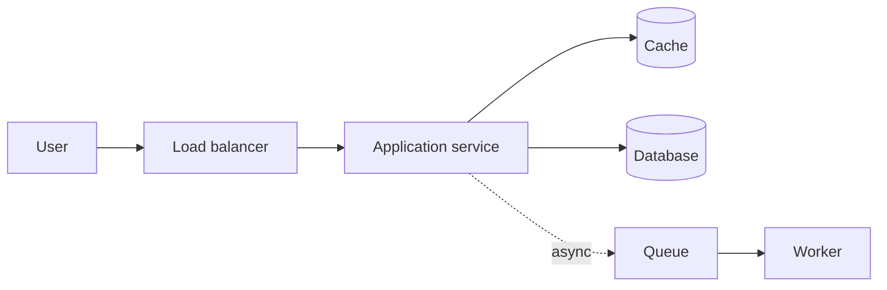

# Performance

## 1. One-Line Definition
Performance is how fast and how much a system responds — the latency of each request, the throughput it sustains, the resource efficiency it shows — measured against the load and latency budget the business actually needs.

## 2. Why Do We Need It?
Latency is a business metric: a slower page costs conversions, engagement, and even hard money per hundred milliseconds. Throughput determines cost — the same traffic on fewer, better-used machines is a direct savings line. But performance engineering also produces waste when done on the wrong bottleneck, so it must be driven by measurement, not vibes.

## 3. Simple Intuition
A restaurant's performance is two numbers: how long a table waits for its food (latency) and how many tables are served per hour (throughput). Speeding up the kitchen (reducing latency) and seating more tables (raising throughput) are different levers — and there's no point buying a faster fryer if the bottleneck is the single cashier.

## 4. What Happens Without It?
Slow responses drive users away and hurt engagement; runaway costs blow budgets on idle capacity; hotspots melt a single service while the fleet sits half-idle. Without measurement you guess, optimize the wrong layer (usually the one that feels clever, not the one that matters), and discover the real bottleneck only in a production incident.

## 5. Core Idea
- **Latency** — time for one operation end to end (p50, p99, p999). It's dominated by *tails*: queuing, unlucky scheduling, and slow peers decide the worst experience.
- **Throughput** — completed operations per second; system throughput is set by its narrowest component (see [[bottleneck-identification|Bottleneck Identification]]).
- **Utilization and queues** — when utilization approaches 100%, queues grow superlinearly and latency explodes (Little's Law: L = λ × W).
- **Find the bottleneck first** — profile, trace, measure the real constraining resource (CPU, disk IOPS, network, DB connections) before changing anything (see [[observability|Observability]], [[distributed-tracing|Distributed Tracing]]).
- **Rightsize per layer** — cache hot reads, async slow work, add nodes, index queries, avoid N+1, compress payloads. Every optimization moves the bottleneck; the game is to keep moving it in the right direction.

## 6. Important Terminology

| Term | Simple Meaning |
|------|----------------|
| Latency | Time for one request to complete |
| Throughput | Operations per second |
| p50 / p99 | Median / 99th-percentile latency |
| Tail latency | Slowest slice of requests, often the p99+ |
| Little's Law | In-flight work = rate × time |
| Bottleneck | The resource that caps total throughput |
| Saturation point | Load where queues form and latency jumps |
| Load testing | Pushing load to observe behavior before prod |
| Latency budget | Allowed end-to-end time, sliced across steps |

## 7. Basic Architecture



## 8. Request or Data Flow
1. User request enters; LB adds negligible latency, but a misconfigured one can queue.
2. Service checks the cache (fast path) for hot reads; cache miss goes to DB.
3. The service holds a DB connection — connection-pool saturation is a classic latency cliff.
4. Slow work goes to a queue and is processed by workers, keeping the request path crisp.
5. Every hop contributes to the total; the p99 of the sum is driven by the worst hop.

## 9. Practical Example
**Timeline read (assumptions):** 10M users, 5k reads/sec, 200ms latency budget. A p50 is 40ms, but p99 spikes to 950ms because one hot follower fans out 200 reads serially. Fix: parallelize the fan-out, cache the hot users, and reduce the serially-read set — p99 drops under 200ms with no extra hardware.

## 10. Scaling
- Performance and scaling are inseparable: adding nodes (see [[horizontal-vs-vertical-scaling|Horizontal vs Vertical Scaling]]) only helps if the bottleneck is shardable — stateless replicas scale reads, sharding scales writes/storage, queues smooth bursts.
- Utilization must stay off the cliff: auto-scaling on a *pre-saturation* signal (see [[autoscaling|Autoscaling]]) beats reacting to full saturation.
- As traffic grows, watch amplification: fan-out multiplies load per request (see [[fanout-and-aggregation|Fan-Out/Fan-In]]), and tail latency compounds across parallel calls.

## 11. Reliability and Failure Scenarios

| Failure | What Happens | Detection | Recovery | Trade-off |
|---------|--------------|-----------|----------|-----------|
| DB connection pool saturates | Latency cliff, timeouts | Pool exhaustion metric | Pool sizing, pooling in-app, replica reads | Wasted capacity vs risk |
| Retry storm | Failed requests amplified | Error-rate spike | Backoff + jitter, circuit breaker | Bounded retries |
| Hot key overloads one cache node | One node melts | Skew metric | Replicate/cache the key, split | Cost + freshness |
| GC / event-loop stall | Tail latency spikes | P99 trace, GC metrics | Tuning, off-thread work, async IO | Complexity |

## 12. Consistency and Correctness
Performance pressure tempts shortcuts that break correctness: serving stale cache as truth, weak consistency for reads that must be strong (see [[strong-vs-eventual-consistency|Strong vs Eventual Consistency]]), dropping writes to go faster. Keep the semantics explicit: cache is a derived view, replicas may lag (see [[replication-lag|Replication Lag]]), and idempotent retries (see [[idempotency|Idempotency]]) are how you retry safely.

## 13. Performance
Design the latency budget up front and measure the contribution of each hop (see [[latency-vs-throughput|Latency and Throughput]]). Tune in this order: measure → fix the biggest tail → re-measure. Frequently decisive levers: caching (see [[caching|Caching]]), read replicas, connection pooling (see [[database-connection-pooling|Database Connection Pooling]]), indexed queries (see [[database-indexing|Database Indexing]]), data denormalization, compression (see [[compression|Compression and Serialization]]), and asynchronous offload.

## 14. Security
Performance and security interact both ways: TLS costs bytes and round trips (balance cipher choice), rate limiting protects capacity (see [[rate-limiter|Rate Limiter]]), and careful caching must never leak per-tenant data via shared cache keys — cache isolation is both a performance and a correctness/security decision. Slowloris-style attacks exploit queuing; admission control (load shedding, planned) and timeouts keep queues from becoming weapons.

## 15. Trade-Offs

| Choice | Advantages | Disadvantages | When to Use |
|--------|------------|---------------|-------------|
| Caching | Big latency/throughput win | Staleness, invalidation, cold-start | Hot, read-mostly data |
| Async offload | Fast request path | Extra state, weaker guarantees | Slow side effects, fan-out |
| Replicas | Read scale without touching primary | Lag, staleness | Read-heavy workloads |
| Denormalization | Fewer joins, faster reads | Write cost, consistency burden | Read-heavy aggregates |
| Vertical scaling | Immediate, simple | Expensive ceiling, single node | Quick relief, small scale |

## 16. Common Mistakes
- Optimizing before measuring — "obviously" fixing the wrong layer.
- Tuning the average instead of the tail: p50 great, p99 terrible, users notice the p99.
- Ignoring queues: utilization at 95% with a tiny buffer, then a spike flips the system into seconds of latency.
- Treating cache as a source of truth — fast, stale, and eventually wrong.
- Forgetting amplification: a 5ms fan-out to 100 nodes is 5s of system time even if the user sees one request.

## 17. HLD vs LLD Boundary
HLD: latency budget, architecture levers (cache, replicas, queues, sharding), and the load/throughput targets per tier. LLD: the specific profiling results, the exact query plan chosen, code-level microoptimizations, and which indexes were added.

## 18. Interview Questions

### Beginner
- What's the difference between latency and throughput, and which should you improve first?
- Why is p99 more interesting than p50 for user experience?

### Intermediate
- A service is p50-fast but p99-slow. Walk the diagnosis path.
- How do you size caches and read replicas from real numbers?

### Advanced
- Design a warming strategy so a cache cluster doesn't cold-start into a database stampede at peak.
- Your fan-out service is slow under load. Trace the amplification and protect it.

## 19. Interview Memory Summary

> [!abstract]- Interview Memory Summary

### Remember

- Latency = one request's time; throughput = completed ops per second.
- The tail (p99+) shapes user experience, not the median.
- Utilization close to 100% means queues, and queues mean latency cliffs.
- Find the bottleneck before improving anything.
- The levers: cache, replicas, async, indexes, compression, sharding.
- Amplification: fan-out multiplies work per user request.
- Measure → fix the biggest tail → re-measure.

### 30-Second Explanation

Set a latency budget, measure each hop (p50/p99, throughput, utilization), find the real bottleneck, then apply the matching lever — cache hot reads, replica out reads, offload slow work async, index the queries — and keep the utilization signal pre-saturation, because queues decide the tail.

### Interview Traps

- "It's slow, add servers" — only true if the bottleneck is shardable CPU; DB/connection/cache bottlenecks need different fixes.
- Tuning median only — the p99 is what users feel.
- Ignoring Little's Law: high in-flight work is the real latency killer.
- Saying cache is free — staleness and invalidation are its price.

### Key Trade-Off

Every performance lever trades another property — cache trades freshness, replicas trade consistency, async trades immediacy, denormalization trades write complexity — so the fastest design is also the one that accepts the clearest semantic trade.

## 20. Related Concepts

### Prerequisites

- [[latency-vs-throughput|Latency and Throughput]]
- [[bottleneck-identification|Bottleneck Identification]]
- [[capacity-estimation|Capacity Estimation]]

### Commonly Used Together

- [[caching|Caching]]
- [[database-connection-pooling|Database Connection Pooling]]
- [[database-indexing|Database Indexing]]
- [[horizontal-vs-vertical-scaling|Horizontal vs Vertical Scaling]]

### Alternatives

- [[scalability|Scalability]] (performance under more load — the growth axis)

### Advanced Concepts

- [[tail-latency|Predictable Tail Latency]]
- [[distributed-rate-limiter|Distributed Rate Limiter]]
- [[elasticsearch|Elasticsearch]] (search-side performance)

## 21. References
Brendan Gregg *Systems Performance* for the bottleneck-driven methodology; Google SRE Book chapters on utilization/queuing; Little's Law from queueing theory texts. Numbers and provider specs should be re-verified with current vendor documentation.

## 22. Active Recall

Test yourself before revealing each answer.

> [!question]- Why does a system "suddenly" degrade when utilization passes ~80%?
> Queues. As capacity approaches saturation, incoming work waits rather than completes — Little's Law (in-flight = rate × time) means the same throughput now carries inflated latency. The curve is nonlinear: a few percent more load flips milliseconds into seconds.

> [!question]- You have p50 = 40ms and p99 = 950ms. Where do you start?
> Measure the p99's composition: trace the slowest requests. Typical causes: one hot follower, a serial N+1 fan-out, GC/event-loop stalls, or a saturated connection pool. Then fix the biggest tail-contributor and re-measure — never optimize the median while the tail dominates experience.

> [!question]- "The system is slow, let's add more servers." When is this wrong?
> When the bottleneck isn't shardable-wisely CPU: a saturated database, a single cache node, slow queries, or connection-pool limits don't heal from more app nodes. Adding servers moves the bottleneck instead of fixing it. Identify the constraining resource first.

> [!question]- Trade-off: cache or read replicas for a hot read path?
> Cache: lowest latency, but stale and requires invalidation; best for very hot, mostly-static data. Replicas: fresher within replication lag, but one database round trip; best when reads must be reasonably current. Composable too — cache sits in front of the replica to absorb the hottest hits.

> [!question]- Interview scenario: a feature fans out to 100 friends per request, each hitting the DB. What's the actual load and fix?
> Every user request generates ~100 DB queries — systemic amplification, even if each is fast. Fix: parallelize the 100 calls, cache friend-feed state, precompute the merged feed, or cap fan-out with pagination. Measure system-wide load reduction, not just the single-request latency.

> [!question]- How do you avoid a cold-start cache stampede at peak?
> Warm the cache before traffic surges, use request coalescing/read-through so one DB load backs many waiters, add a light negative cache, and allow stale-while-revalidate so a single recompute refreshes a visible stale value. Prevent hundreds of threads re-populating the same key simultaneously.

## 23. When Should I Use This?

### Use it when

- You have a latency budget or SLO to meet (see [[sli-slo-sla|SLI/SLO/SLA]]).
- You need to decide where to spend capacity/cost (cache vs replicas vs nodes).
- Load will grow and you must know which tier saturates first.
- An incident showed latency or error-rate SLO breaches.

### Avoid it when

- You're optimizing before you can measure, or the "bottleneck" is speculation.
- The real problem is correctness or availability, which performance tuning can disguise.
- The optimization trades clearly beyond its semantic budget (stale as truth, dropping writes).

### What problem does it solve?

It meets business latency/throughput targets at defensible cost by finding and relieving each real bottleneck in order — cache, replicas, async offload, index and data-shape, and finally hardware — instead of guessing at the "obviously slow" layer.

### What problem does it NOT solve?

It doesn't create capacity for free (everything has a cost), it doesn't fix availability or correctness (fast-but-wrong is worse), and it can't beat a fundamentally wrong architecture — over-caching a design that needs sharding just delays the wall.

## 24. Decision Connections

Decisions that go together with performance:

- [[latency-vs-throughput|Latency and Throughput]] — the two axes everything else tunes.
- [[bottleneck-identification|Bottleneck Identification]] — the step that decides where to act.
- [[capacity-estimation|Capacity Estimation]] — the numbers that set targets before tuning.
- [[caching|Caching]] — the first big lever for read latency.
- [[database-connection-pooling|Database Connection Pooling]] — the resource where latency cliffs form.
- [[horizontal-vs-vertical-scaling|Horizontal vs Vertical Scaling]] — the capacity axis behind the levers.
- [[sli-slo-sla|SLI/SLO/SLA]] — the contract that says how good is good enough.
- [[tail-latency|Predictable Tail Latency]] — the advanced frontier of the p99 problem.

Decision tree:

```
Meeting latency and throughput targets?
    |
    +-- No? Measure first
    |      → [[bottleneck-identification|Bottleneck Identification]]
    |      → [[distributed-tracing|Distributed Tracing]] each hop
    |
    +-- Read-heavy hot path?
    |      → [[caching|Caching]] then read replicas
    |
    +-- Slow side effects blocking the path?
    |      → async offload via queue ([[message-queue|Message Queue]])
    |
    +-- Query-bound?
    |      → [[database-indexing|Database Indexing]]
    |      → denormalization / materialized views
    |
    +-- Single node saturated at capacity?
           → [[horizontal-vs-vertical-scaling|Horizontal vs Vertical Scaling]]
           → [[autoscaling|Autoscaling]] on pre-saturation signal
    |
    +-- Write-heavy beyond one node?
           → [[sharding|Sharding]]
```