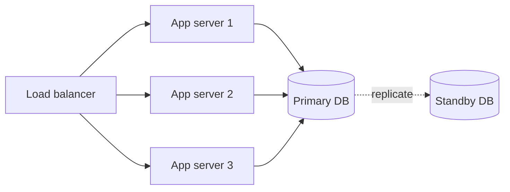

# Redundancy

## 1. One-Line Definition
Redundancy is having more of a critical component than strictly needed — extra servers, replicas, paths, or power — so that when one fails, another carries the load and the system keeps working.

## 2. Why Do We Need It?
Components are not reliable enough on their own to reach the availability businesses need: a single server has maybe 99.9% uptime, but users and SLAs expect 99.99%. Redundancy is how you get from the reliability of a single component to the reliability of the *group* — the arithmetic works because failures are usually independent, so two machines failing at once is rarer than one (see [[availability|Availability]] and [[fault-tolerance|Fault Tolerance]]).

## 3. Simple Intuition
Two spare tires in the trunk? No — you run one, one spare: the spare almost never fails (it's resting), and the worked tire rests while the spare works. Redundancy is owning one more of everything critical so you can always keep moving while the broken piece is fixed.

## 4. What Happens Without It?
The system has exactly the components it needs at peak — so a single disk, server, or link failure drops capacity below demand: service goes down, data becomes unreachable, and every failure is an outage. At scale, the odds of "no failure right now" are astronomically bad, so a non-redundant system is out of service almost constantly.

## 5. Core Idea
- **Active redundancy (N+1+):** all units serve traffic in parallel; load balances over the healthy ones (see [[load-balancing|Load Balancing]]).
- **Standby redundancy:** one unit works, another is ready (hot/cold standby; see [[standby-models|Standby Models]]).
- **Data redundancy:** multiple copies of data — through replication (see [[database-replication|Database Replication]]) or erasure coding (see [[erasure-coding|Erasure Coding]]).
- **Path/zone redundancy:** redundant network paths, AZs, regions, power (see [[cloud-infrastructure|Cloud Infrastructure]]).
- **The numbers:** N+1 vs N+2 vs N+0 derive from the required availability and component MTBF. More redundancy also means more surface area — redundant parts can be misconfigured, lag, and drift — so redundancy must be verified, not assumed.
- **Composition:** redundancy works when failures are independent and the failover is automatic; shared dependencies (same power plane, same config) cancel the benefit.

## 6. Important Terminology

| Term | Simple Meaning |
|------|----------------|
| N+1 | One more unit than needed |
| Active-active | All units serving at once |
| Active-passive | One serving, one ready |
| Hot standby | Standby that's fully running and caught up |
| Cold standby | Standby that must be started and restored |
| Replica | Extra copy of data or service |
| Failover | Automatic switch to a redundant unit |
| Independent failure | One failure not correlated with another |
| Availability math | Group availability = 1 − (failure of all units) |

## 7. Basic Architecture



## 8. Request or Data Flow
1. Load balancer distributes requests across three active app servers — any one can fail without losing service.
2. When a server fails health checks, the LB stops sending it work; the other two absorb the traffic (that's the +1).
3. Data lives in the primary, replicated to the standby; on primary failure, failover promotes the standby.
4. The redundant server is rebuilt, re-added, and the group returns to full N+1 posture.

## 9. Practical Example
**Checkout API (assumptions):** needs 3 healthy app servers to carry peak traffic; 99.99% availability target.
- Run 4 (N+1). Availability dominated by the DB, so it gets a synchronous standby in another AZ + a single replica.
- Availability math: one app server = 99.9%; four with independent failures ≈ 99.9999% for that tier. The DB pair with automatic failover removes the last single-operator heroics.
- Verification built in: steady failover drill — the standby is failure-tested, so the +1 is proven, not decorative.

## 10. Scaling
Redundancy and scaling use the same muscles: horizontal scale-out (see [[horizontal-vs-vertical-scaling|Horizontal vs Vertical Scaling]]) is *also* active-active redundancy — more nodes means both more capacity and more tolerance. As you scale, keep redundancy proportional (fleet-wide autoscaling keeps the +1 margin) but watch redundancy *cost*: near idle spare capacity is expensive at scale, so tier the redundancy — money and control paths get strict +1/+2, while cheap reconstructible tiers run best-effort (see [[autoscaling|Autoscaling]], [[standby-models|Standby Models]]).

## 11. Reliability and Failure Scenarios

| Failure | What Happens | Detection | Recovery | Trade-off |
|---------|--------------|-----------|----------|-----------|
| One app server dies | No service loss | Health checks | LB routes around it | Extra node cost |
| Primary DB dies | Writes pause for failover | Replication/failover alert | Promote standby | Failover window (RTO), possible RPO |
| Standby was never tested | Failover fails when needed | Drill results | Fix the run | Drill effort |
| Shared dependency fails | All "redundant" units die together | Dependency health | Shed/redundancy beyond it | Cost of true independence |
| Config drift on standby | Standby is silently stale | Drift checks | Redeploy from infra-as-code | IaC discipline |

## 12. Consistency and Correctness
Redundant copies must agree, or the failover serves wrong data: async replication means possible loss of recent writes (state the RPO), stale standbys must not be promoted without checks, and split-brain (two primaries both accepting writes after a failed failover) must be prevented with fencing and quorum (see [[failover|Failover]], [[consistency|Consistency]]). Redundancy multiplies copies — it does not by itself make them consistent.

## 13. Performance
Redundant active servers *share* the load, and that lowers latency at high utilization (each node runs at lower load, below the queuing cliff). Data redundancy costs write amplification and replication bandwidth. The hot-standby is idle capacity — the price you pay for failover; the active-active alternative puts the capacity to work (see [[load-balancing|Load Balancing]] for spread algorithms).

## 14. Security
A redundant copy is a second attack surface: replicas and standbys need the same access control, encryption, and monitoring as the primary (see [[authentication-vs-authorization|Authentication vs Authorization]]). Also redundant *control paths* — no single network link, admin credential, or config system should be the thing whose absence takes down the fleet; and failover must never bypass tenant isolation when a standby takes over.

## 15. Trade-Offs

| Choice | Advantages | Disadvantages | When to Use |
|--------|------------|---------------|-------------|
| Active-active | Capacity + tolerance | Load-balancing complexity | Stateless tiers |
| Active-passive hot standby | Simple, proven state | Idle capacity | Stateful stores |
| Cold standby | Cheap | Slow RTO | DR, rarely-needed copies |
| N+1 app nodes | Cheap insurance | N/A | Nearly any production tier |
| Replicas everywhere | Read scale + durability | Write cost, lag | Data tiers |
| Erasure coding | Same durability, less storage | Repair complexity | Object storage at scale |

## 16. Common Mistakes
- Building redundancy with shared everything (same rack, same power, same config) — correlated failures cancel the math.
- Never testing the standby — unverified redundancy is a false safety (same sin as an untested backup).
- Mistaking replicas for always-current: an async lagging copy isn't ready to fail over without RPO.
- Redundant everything including disposable tiers — paying two machines for data that could just be rebuilt.
- Split-brain: no fencing, so "failover" opens two primaries.

## 17. HLD vs LLD Boundary
HLD: redundancy topology (N+1, active-passive vs active-active), replica counts and modes per tier, AZ/region placement, failover policy, who promotes what. LLD: the specific failover client logic, health-check probe code, fencing token configuration in the driver, the exact LB health-check interval.

## 18. Interview Questions

### Beginner
- Why does "one more server" raise availability so much more than the server's own uptime?
- What's the difference between active-active and active-passive redundancy?

### Intermediate
- You add a hot standby DB but never test it. What is actually guaranteed?
- Why is redundancy across the same rack/power plane not real redundancy?

### Advanced
- Design redundancy for a money-store with a 5-second RTO and zero-loss RPO. What topology achieves this and what does it cost?
- How do you decide which tiers get N+1 vs N+2 vs none at the scale of a big platform?

## 19. Interview Memory Summary

> [!abstract]- Interview Memory Summary

### Remember

- Redundancy = one more critical component than strictly needed.
- Group availability grows from component reliability: failure must be independent.
- Active-active = capacity + tolerance; active-passive = standby ready to promote.
- Data redundancy via replication or erasure coding.
- Shared dependencies (power, rack, config) cancel the redundancy math.
- Unverified/untested redundancy is decorative.
- Failover must fence to avoid split-brain and must state RPO.

### 30-Second Explanation

Add +1 to every critical tier (servers, replicas, paths, zones), place copies on independent failure domains, route over the healthy set automatically, test the failover — and for stateful copies keep them consistent enough to promote with a known RPO, else redundancy is furniture.

### Interview Traps

- Redundant but correlated: "two machines" in the same rack/plane.
- "Replicas mean it's safe" — async replica = possible loss window, and stale = wrong promotion.
- Never-drilled failover presented as a plan.
- Adding redundancy to tiers that should be disposable.

### Key Trade-Off

Redundancy buys availability and survival at the price of extra capacity, replication cost, and surface area — and it only pays off when failures are independent and the spare is actually proven.

## 20. Related Concepts

### Prerequisites

- [[availability|Availability]]
- [[reliability|Reliability]]

### Commonly Used Together

- [[failover|Failover]]
- [[standby-models|Standby Models]]
- [[load-balancing|Load Balancing]]
- [[database-replication|Database Replication]]

### Alternatives

- [[erasure-coding|Erasure Coding]] (redundancy without full copies)

### Advanced Concepts

- [[single-point-of-failure|Single Point of Failure]]
- [[cloud-infrastructure|Cloud Infrastructure]]
- [[multi-region-models|Active-Active vs Active-Passive Regions]]

## 21. References
Standard reliability-engineering texts on redundancy topologies and availability algebra (N+1, N+2); cloud provider documentation on AZ/region redundancy. Verify current failover and SLA specifics with vendor docs.

## 22. Active Recall

Test yourself before revealing each answer.

> [!question]- Why does the group availability beat the component availability?
> Because failures are usually independent: the group fails only when *all* units fail at once, which for independent parts is the product of failure probabilities. Two 99.9% servers give roughly 1-(0.001*0.001) ≈ 99.9999% for active requests — but this math dies the moment failures are correlated.

> [!question]- When is two machines NOT redundant?
> When they share a failure domain: same rack, same power plane, same network uplink, same config, or the same deploy. Any shared dependency becomes the single thing whose failure takes down "both" — that's the real [[single-point-of-failure|Single Point of Failure]] hiding behind the illusion of +1.

> [!question]- A hot standby DB was added a year ago and never touched. What's actually guaranteed?
> Almost nothing measurable: it may be silently stopped, lagging by hours, or drift-configured. Redundancy is only demonstrated by exercising it — health checks, lag monitors, and rehearsed failover drills. Untested spare = hypothesis, exactly like an untested backup.

> [!question]- Trade-off: hot standby vs active-active for a stateful store?
> Hot standby (active-passive): simplest, predictable failover, but the standby is idle capacity paying for nothing while healthy. Active-active: capacity earns its keep and failover is seamless, but writes must be coordinated (conflict resolution, quorums) and the consistency story is far harder. Choose by whether reads/writes can be safely split between the two.

> [!question]- Interview scenario: you must fail over a money store with zero loss and ~5s RTO. What topology?
> Zero loss means the ack boundary spans both sites: sync/quorum replication so the surviving site holds all acknowledged data (RPO = 0), an active-passive standby in another AZ with pre-warmed state, automated failover with fencing, and rehearsals proving the 5s promotion. Cost: cross-site write latency and the always-idle standby — that's the explicit price of the guarantee.

> [!question]- Which tiers of a big platform should NOT be redundant?
> Disposable, reconstructible tiers: caches (rebuild from source), ephemeral jobs (restart), and derived data (recompute). Redundancy there pays twice for data that can be regenerated, when the source-of-truth tier (the DB, the queue) is where redundancy is actually load-bearing.

## 23. When Should I Use This?

### Use it when

- The availability target exceeds a single component's reliable uptime.
- A tier is load-bearing (serves traffic, holds data, routes requests).
- Failure of one component would exceed your RTO/RPO (see [[rpo-rto|RPO and RTO]]).
- You're designing active-active regions or multi-AZ deployments (see [[cloud-infrastructure|Cloud Infrastructure]]).

### Avoid it when

- The tier is disposable and reconstructible — redundancy there is wasted spend.
- You can't test the spare; an untested spare is worse than none because you've assumed safety.
- The "redundant" copies would share the very dependency you're trying to survive.

### What problem does it solve?

It converts single-component fragility into group resilience: capacity to absorb a loss, copies that survive data loss, and automatic takeover — so availability comes from the design of the *set*, not the perfection of any one part.

### What problem does it NOT solve?

It doesn't solve correctness or consistency of the copies (see [[consistency|Consistency]]), doesn't stop a shared-dependency cascade, doesn't give zero loss unless the replication mode says so, and no amount of spare parts substitutes for rehearsed failover.

## 24. Decision Connections

Decisions that go together with redundancy:

- [[availability|Availability]] — the target that sets how much +1 you need.
- [[fault-tolerance|Fault Tolerance]] — redundancy is the core mechanism it leans on.
- [[failover|Failover]] — how the spare actually takes over when needed.
- [[standby-models|Standby Models]] — hot vs warm vs cold: RTO decides.
- [[load-balancing|Load Balancing]] — spreading work across the active set.
- [[database-replication|Database Replication]] — copies of data, sync/async decides RPO.
- [[erasure-coding|Erasure Coding]] — redundancy without whole duplicates, for large stores.
- [[single-point-of-failure|Single Point of Failure]] — the thing redundancy removes.

Decision tree:

```
A tier must survive component loss
    |
    +-- Stateless serving tier?
    |      → N+1 nodes behind [[load-balancing|Load Balancing]]
    |      → active-active, all serve
    |
    +-- Stateful store?
    |      → [[database-replication|Database Replication]]
    |      → +-- zero-loss needed? → sync/quorum
    |      → +-- loss window OK?    → async, measure lag
    |      → +-- fast RTO?          → [[standby-models|hot]] standby + [[failover|Failover]]
    |      → +-- huge data?         → [[erasure-coding|Erasure Coding]]
    |
    +-- Whole site can be lost?
           → extra region ([[multi-region-models|Active-Active vs Active-Passive Regions]])
    |
    +-- Disposable/reconstructible tier?
           → skip redundancy; rebuild instead
```