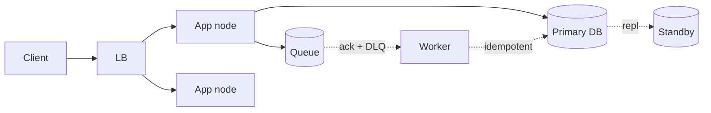

# Reliability

## 1. One-Line Definition
Reliability is the probability that a system keeps working **correctly** — doing the right thing, not just being up — under normal and fault conditions over time.

## 2. Why Do We Need It?
Availability says the service is reachable; reliability says its answers are right and data is not lost. An "available" system that occasionally loses a payment or serves corrupted data is unreliable, which is worse than downtime for trust and correctness. Systems that silently fail are the most dangerous.

## 3. Simple Intuition
A car that always starts is *available*. A car that starts but sometimes brakes incorrectly is *unreliable*. Reliability is about trust: you need both the car to be running and to behave correctly every single time.

## 4. What Happens Without It?
Correctness failures are insidious: a duplicate charge, a lost message, a corrupted cache entry, a ledger that doesn't add up. They surface weeks later at reconciliation time, are expensive to unwind, and destroy customer confidence. without reliability engineering, failures are found by users, not by systems.

## 5. Core Idea
Reliability = **correct behavior under faults**, measured over time. It has four pillars:
1. **Fault tolerance** — design so components can fail without corrupting outcomes (redundancy, isolation).
2. **Durability** — data survives process/machine/disk failure (replication, WAL, backups, RPO).
3. **Correctness** — no duplicate/lost/incorrect work (idempotency, transactional boundaries, at-least-once + dedup).
4. **Recovery** — bounded, testable return to normal (restore drills, failover, rollback).

Key practices: automated tests + canary verification, chaos engineering, monotonic and idempotent operations, monitoring that detects *wrong* results (not just down/up), and postmortems.

## 6. Important Terminology

| Term | Simple Meaning |
|------|----------------|
| Fault | A component misbehaves (disk fails, bug, timeout) |
| Error | A fault produces a wrong state/result |
| Failure | The system can't serve correctly |
| Fault tolerance | Survive faults gracefully |
| Durability | Data survives once acknowledged |
| Availability | Uptime percentage (related but not equal) |
| RPO | How much data you can lose on disaster |
| RTO | How long to recover a service |
| Idempotency | Running an operation twice = running it once |

## 7. Basic Architecture (Reliability Pillars Overlaid on a System)



Every arrow above is a potential reliability point: LB health checks, MQ acks + dead-letter queue, DB replication, worker idempotency.

## 8. Request or Data Flow (Reliability View)
1. Client request → LB only forwards to healthy nodes.
2. App writes to DB in a transaction; on failure it can retry **idempotently**.
3. App publishes to a queue with a producer ack — if the broker didn't ack, retry (at-least-once).
4. Worker dedups by message ID/operation key so re-delivery doesn't double-apply.
5. If a worker exhausts retries, message goes to a dead-letter queue for inspection — nothing is silently lost.

## 9. Practical Example
**Payment service (assumptions):** zero tolerance for duplicate or lost charges.
- Idempotency key per attempt (client-generated UUID).
- DB transaction: reserve funds then commit; on ambiguous network failure, look up by idempotency key instead of retrying blindly.
- Outbox pattern: DB commit and message publication are one transaction; a relay publishes the outbox row (no lost events).
- Drills: restore-from-backup tests and region-failover rehearsals run quarterly with a documented RPO/RTO.

## 10. Scaling
Reliability must scale with the system: more nodes mean faults are routine, so fault injection becomes part of normal testing (chaos engineering). Automated canaries and progressive rollouts verify correctness continuously as the fleet grows.

## 11. Reliability and Failure Scenarios

| Failure | What Happens | Detection | Recovery | Trade-off |
|---------|-------------|-----------|----------|-----------|
| DB loses data | Acknowledged write is gone | Replica checksums, audits | Replicate first; restore from backup | Sync repl = slower writes |
| Message lost | Business event never processed | Gap monitoring, DLQ | Idempotent redelivery, reconciliation | At-least-once = possible duplicates |
| Duplicate process | Double charge/insert | Idempotency key violations | Skip/merge by state | Always pay the key cost |
| Corrupt cache | Bad data served fast | Hash checks, short TTL | Invalidate; recompute from source of truth | Cache as best-effort only |
| Wrong code released | Wrong results everywhere | Canary + metrics on result quality | Fast rollback / feature flag off | Progressive rollout cost |

## 12. Consistency and Correctness
Reliability demands the system converges to a correct, single logical truth. Techniques: transactional writes, idempotent operations (retry-safe), versioned writes, checksums on replicas, and reconciliation jobs that compare stored counts against the source of truth daily.

## 13. Performance
Faults degrade performance first (timeouts, retries, overloaded peers). Reliability tuning adds latency (sync replication, fsync, dedup lookups) — size those costs explicitly against the correctness requirement.

## 14. Security
Reliable systems are also secured: integrity (tamper detection via checksums/hashes), authentication of every party in a flow, and audit trails so "what actually happened" can be reconstructed after a fault.

## 15. Trade-Offs

| Choice | Advantages | Disadvantages | When to Use |
|--------|------------|---------------|-------------|
| Sync replication | Zero loss | Slow writes, availability hit if replica down | Money, critical ledger |
| Async replication | Fast writes | Possible loss of recent data | Non-critical data, feeds |
| At-least-once + dedup | No loss, simpler | Duplicates require idempotency | Almost everywhere with queues |
| Exactly-once effort | No duplicates in effect | Complex, slower | Kafka transactions, money |
| Chaos engineering | Real reliability | Risk, effort | Mature production systems |

## 16. Common Mistakes
- Equating reliability with availability — an up-but-wrong system is unreliable.
- Believing a queue gives you "exactly once" — brokers give at-least-once; dedup makes it effectively-once.
- Testing happy paths only — a reliable system is designed for the unions of its failures.
- Trusting backups without restore drills — an unverified backup is a hypothesis.

## 17. HLD vs LLD Boundary
HLD: redundancy topology, delivery semantics, replication mode, RPO/RTO, DR strategy. LLD: retry libraries, transaction boundaries in code, unit/integration tests, specific watchdog threads.

## 18. Interview Questions

### Beginner
- What is the difference between reliability and availability?
- What does it mean for an operation to be idempotent?

### Intermediate
- A message queue gives at-least-once delivery; how do you make processing effectively-once?
- What is the difference between an RPO of 5 minutes and 1 hour?

### Advanced
- Design a system that never loses an acknowledged payment event. Which trade-offs did you accept?
- How would you verify your system's reliability claims in production?

## 19. Interview Memory Summary

> [!abstract]- Interview Memory Summary

### Remember

- Reliability = correct behavior under faults — up but wrong is unreliable.
- Four pillars: fault tolerance, durability, correctness, recovery.
- Idempotency turns retries safe.
- At-least-once + dedup ≈ effectively-once.
- Verify with restore drills, canaries, chaos engineering.

### 30-Second Explanation

Redundant + idempotent + measured; every critical path has a detected, recoverable failure mode with bounded RPO/RTO.

### Interview Traps

- Equating reliability with availability — an up-but-wrong system is unreliable.
- "We use a queue, so nothing is lost" — brokers can drop messages and consumers crash mid-process; always state the delivery semantics and dedup story.
- Believing a queue gives "exactly once" — brokers give at-least-once; dedup makes it effectively-once.
- Trusting backups without restore drills — an unverified backup is a hypothesis.

### Key Trade-Off

Every reliability mechanism (sync replication, fsync, dedup lookups) buys correctness at a latency and complexity cost, so you must size the investment against the actual correctness requirement of each path.

## 20. Related Concepts

### Prerequisites

- [[availability|Availability]]

### Commonly Used Together

- [[rpo-rto|RPO and RTO]]
- [[outbox-pattern|Outbox Pattern]]
- [[delivery-semantics|Delivery Semantics]]
- [[message-queue|Message Queue]]

### Alternatives

- [[availability|Availability]] (uptime vs correctness — different goal, complements)

### Advanced Concepts

- [[disaster-recovery|Disaster Recovery]]
- [[observability|Observability]]
- [[retry-and-timeout|Retry and Timeout]]

Related planned topics (not authored yet): exactly-once-effect.

## 21. References
Google SRE Book (reliability + SLO framing); standard fault-tolerant design texts. Confirm current cloud backup/DR guarantees with provider docs.

## 22. Active Recall

Test yourself before revealing each answer.

> [!question]- What problem does reliability solve that availability does not?
> Availability says the service is reachable; reliability says the answers are right and no data is lost. An "available" system that occasionally loses a payment or serves corrupted data is unreliable — worse than downtime because the failures surface weeks later at reconciliation.

> [!question]- What is the difference between reliability and availability?
> A car that always starts is *available*; a car that starts but sometimes brakes incorrectly is *unreliable*. You need both: uptime percentage (availability) and correct behavior under faults over time (reliability).

> [!question]- What does it mean for an operation to be idempotent?
> Running it twice equals running it once — the operation carries an idempotency key (client UUID) so a retry after an ambiguous failure can't double-charge or double-insert. This is what makes retries safe under at-least-once delivery.

> [!question]- A message queue gives at-least-once delivery. How do you make processing effectively-once?
> Accept the duplicate redelivery and dedup on the consumer: store a message/operation ID, skip if already processed, or make the update idempotent. At-least-once + dedup ≈ effectively-once; true exactly-once (e.g., Kafka transactions) is more complex and slower.

> [!question]- What do you give up to guarantee "no acknowledged write is ever lost"?
> Latency and availability: sync replication or fsync-on-forward blocks on the replica and slows writes, and if the replica is down writes must halt to keep the guarantee. That's why money paths use reliable replication while feeds tolerate async with a possible loss window (RPO).

> [!question]- The payment DB silently loses an acknowledged write. What happens and how is it caught?
> A charge never exists but was acknowledged — the most dangerous failure because it isn't visible. Detection: replica checksums, audit totals, reconciliation jobs comparing stored counts against the source of truth daily. Recovery: replicate first to prevent it, restore from verified backup, and reconcile the difference.

> [!question]- Interview scenario: you must never lose a published event when the DB commits and the queue publish succeed each on their own.
> Use the outbox pattern: write the event into an outbox table inside the same DB transaction as the business change, and a relay publishes outbox rows. Now the commit and the publish are atomic — no lost events, no double-publish without dedup.

## 23. When Should I Use This?

### Use it when

- Correctness matters: payments, ledgers, order state — a duplicate or lost operation is unacceptable.
- You're designing queues and need to state delivery semantics + the dedup story.
- You define RPO/RTO for disaster recovery and must pick replication mode (sync vs async).
- You want to verify claims with canary rollouts, restore drills, and chaos engineering.

### Avoid it when

- The data is disposable/reconstructable (caches, ephemeral logs) — best-effort is fine.
- The latency cost of sync replication or dedup lookups destroys the product experience for non-critical data.
- The team can't operate the verification (drills, canaries, monitoring of *wrong* results) — reliability without verification is a claim.

### What problem does it solve?

Problem: correctness failures (duplicate charge, lost message, corrupted cache, ledger that doesn't add up) are silent and expensive, found by users not systems. Solution: four pillars — fault tolerance (components fail without corrupting outcomes), durability (data survives acknowledged), correctness (idempotency, transactional boundaries, dedup), and recovery (bounded, tested return to normal with RPO/RTO).

### What problem does it NOT solve?

It doesn't remove the availability question (you can be reliable yet often down), it doesn't guarantee exactly-once for free (only effective once via dedup), and it can't protect against wrong code released everywhere without canaries and rollback. Every reliability technique also costs latency — size the cost against the requirement.

## 24. Decision Connections

Decisions that go together with reliability:

- [[availability|Availability]] — uptime is the sibling axis; reliability is about being right while up.
- [[rpo-rto|RPO and RTO]] — the numeric bounds that choose replication mode and DR strategy.
- [[delivery-semantics|Delivery Semantics]] — at-least-once vs exactly-once: the contract a reliability design builds on.
- [[outbox-pattern|Outbox Pattern]] — makes DB commit + message publish atomic so events are never lost.
- [[message-queue|Message Queue]] — the durable pipeline where reliability (acks, DLQ, dedup) lives.
- [[retry-and-timeout|Retry and Timeout]] — safe retries need backoff, jitter, and idempotency to avoid storming.
- [[disaster-recovery|Disaster Recovery]] — the region-failure layer of durability and recovery.
- [[observability|Observability]] — detection of *wrong results*, the prerequisite for recovery.

Decision tree:

```
Correctness under faults required?
    |
    +-- Can tolerate a lost acknowledged write?
    |      → async replication (fast) + verify with reconciliation
    |
    +-- Zero loss required (payments, ledger)?
    |      → sync replication / WAL-first writes
    |      → [[outbox-pattern|Outbox Pattern]] for DB + queue atomicity
    |
    +-- Queues involved?
    |      → [[delivery-semantics|Delivery Semantics]]: at-least-once + idempotent consumer
    |      → DLQ for exhausted retries (nothing silently lost)
    |
    +-- Disaster (region) loss possible?
           → [[rpo-rto|RPO and RTO]] → [[disaster-recovery|Disaster Recovery]]
    +-- Prove it?
           → restore drills, [[observability|Observability]] of wrong results, chaos testing
```