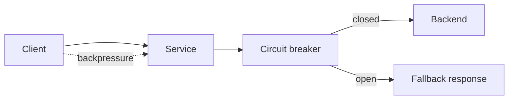

# Resilience

## 1. One-Line Definition
Resilience is a system's ability to absorb faults, stress, and surprises — degrade gracefully, recover on its own, and return to full health — rather than toppling over at the first shock.

## 2. Why Do We Need It?
Systems are subjected to things no one models at design time: dependency epidemics, traffic that doubles in two minutes, cascading timeouts, a config mistake, a database thundering herd. Resilience is what keeps the system *upright through the surprise* — an umbrella property that makes graceful degradation, quick recovery, and bounded blast radius ordinary rather than heroic.

## 3. Simple Intuition
A bridge built with redundancies and flexible joints sways in a storm and survives; a rigid bridge, overbuilt but with no give, shatters at the first resonance it was never modeled for. Resilience is about designing in the bend — the capacity to absorb shock and spring back — not just the strength to stand normal loads.

## 4. What Happens Without It?
A single overloaded dependency cascades into a fleet-wide timeouts: retries double the load, queues pile up, backups in the queue expire, and the "minor" incident becomes a multi-hour outage. Without resilience, systems fail in spikes and cascades rather than gently degrading, and every surprise is a full investigation.

## 5. Core Idea
Resilience stacks a set of concrete mechanisms:
- **Isolation and containment:** failures can't cross boundaries — bulkheads (separate pools per dependency/customer), circuit breakers (see [[circuit-breaker|Circuit Breaker]]), per-tenant limits (see [[tenancy-and-cells|Multi-Tenancy and Cell-Based Architecture]]).
- **Defense in depth at the edge:** timeouts everywhere (see [[api-timeouts|API Timeouts]]), bounded retries with backoff and jitter (see [[retry-and-timeout|Retry and Timeout]]), load shedding and admission control (planned), fail-fast.
- **Graceful degradation:** under stress, serve *less* instead of *nothing* — fallbacks, cached stale data, degraded features, shedding the cheap-to-skip work.
- **Backpressure:** let upstream slowdowns propagate honestly instead of buffering forever (queue depth is a load signal).
- **Recovery as a designed path:** automated restore, self-healing, and rehearsed playbooks.
- **Learnability:** every incident improves the system (see [[adversarial-reliability|Adversarial Reliability]], postmortems).

## 6. Important Terminology

| Term | Simple Meaning |
|------|----------------|
| Circuit breaker | Stop calling a failing dependency briefly (see [[circuit-breaker|Circuit Breaker]]) |
| Bulkhead | Separate resource pools so one failure can't drain all |
| Timeout | How long you wait before giving up |
| Backpressure | Flow control signaling "slow down" to upstream |
| Graceful degradation | Serve reduced capability instead of outage |
| Load shedding | Deliberately refuse work to protect the system |
| Fallback | A degraded-but-available response on failure |
| Cascading failure | Failure of one component triggers more failures |
| Thundering herd | Too many clients retrying at once after a failure |

## 7. Basic Architecture



## 8. Request or Data Flow
1. Request enters; a global timeout bounds the whole call.
2. If the backend is failing, the circuit breaker opens after errors cross a threshold — calls fail fast to the fallback instead of waiting.
3. Retries re-enter with backoff and jitter, spreading instead of stampeding.
4. Under memory/load pressure, the service sheds cheap work first (e.g., skip enrichment), so core features keep serving.
5. When the backend recovers, the breaker closes gradually (half-open probe) and the system returns to full service.

## 9. Practical Example
**Social feed during a viral event (assumptions):** 5x traffic, the ranking service starts timing out.
- Timeouts + circuit breaker: after the threshold, calls short-circuit to a cache-based ranking (degraded but fast); no one waits on the sick service.
- Bulkheads: ranking's retries pool is separate from the timeline pool, so timeline reads don't starve.
- Load shedding: profile refresh and enrichment are dropped; core feed serving continues.
- Result: users see a slower but working feed; the ranking service drains, recovers, and the breaker closes.

## 10. Scaling
Resilience *improves* with scale if it's designed in — more nodes = more redundancy and easier load shedding (see [[horizontal-vs-vertical-scaling|Horizontal vs Vertical Scaling]], [[autoscaling|Autoscaling]]). But scale also creates resilience enemies: cascading failures travel across shared dependencies, and the cross-team blast radius grows (one misconfigured service can degrade many — see [[kubernetes|Kubernetes]] capacity, [[service-discovery|Service Discovery]] health). Cells and isolation (see [[tenancy-and-cells|Multi-Tenancy and Cell-Based Architecture]]) keep resilience proportional to the region being affected.

## 11. Reliability and Failure Scenarios

| Failure | What Happens | Detection | Recovery | Trade-off |
|---------|--------------|-----------|----------|-----------|
| Dependency times out | E2E latency blows up | Latency/timeout metrics | Timeout + fallback, breaker | Slightly more complex logic |
| Dependency dies | All dependent calls fail | Error-rate spike | Breaker opens; fallback path | Degraded responses during outage |
| Traffic spike | Queue, memory grows | Load/queue depth | Shed load, auto-scale | Some work refused |
| Thundering herd | Recovery never happens | Retry-rate metrics | Jitter + breaker + backoff | Bigger retry window |
| Config error | Wrong behavior everywhere | Canary metrics | Flag reverse + rollback | Progressive rollout cost |

## 12. Consistency and Correctness
Degraded modes must not silently corrupt: a cache-based fallback serves *stale*, which may be wrong for money paths — choose fallbacks that keep correctness (idempotent retries, read-only fallbacks, dedup). At-least-once semantics (see [[delivery-semantics|Delivery Semantics]]) and idempotency (see [[idempotency|Idempotency]]) become mandatory once you're comfortably retrying and shedding, because the same event may arrive multiple times from different paths.

## 13. Performance
Resilience features pay a steady toll: extra timeout/breaker checks are cheap, but aggressive degradation *looks* like performance loss (fallback latency, shed requests). The performance argument is competitive: a system that sheds instead of melting keeps p99 acceptable under overload, while an unresilient one topples from milliseconds to unavailability. SLOs must be defined for the degraded mode too (see [[sli-slo-sla|SLI/SLO/SLA]]).

## 14. Security
Degradation is a classic security seam: teams drop auth "to keep serving". Never disable authorization or validation in degraded mode; instead shed less-critical work (caching, analytics, enrichment). Rate limiting and admission control (see [[rate-limiter|Rate Limiter]]) double as abuse resistance and resilience, and fallback caches must keep per-tenant isolation when serving stale data under pressure.

## 15. Trade-Offs

| Choice | Advantages | Disadvantages | When to Use |
|--------|------------|---------------|-------------|
| Circuit breaker | Stops cascade fast | Adds complexity, can drop transient success | Every flaky external dependency |
| Fail-fast + timeout | Keeps latency bounded | Requests refused early | When waiting won't succeed |
| Fallback/stale cache | Keeps serving degraded | Staleness risk | Read-heavy, correctness-tolerant paths |
| Load shedding | Protects core capacity | Non-core work lost | Saturated systems |
| Backpressure | Honest flow, no runaway buffering | Couples upstream to downstream pace | Queued pipelines |

## 16. Common Mistakes
- Timeouts everywhere but a shared retry storm that re-creates the outage it's trying to survive.
- Degraded mode that drops security or validation "just this once".
- Fallbacks that serve stale data on paths where stale is dangerous, with no staleness watermark.
- Shedding so aggressively the "resilient" mode becomes worse than the outage.
- No rehearsal — resilience is designed but never actually exercised until a real incident.

## 17. HLD vs LLD Boundary
HLD: where timeouts/breakers/bulkheads/shedding are placed, which degradations each dependency gets, SLO for degraded mode, recovery ordering. LLD: the specific breaker thresholds and timeouts in code, the exact fallback implementations, per-tenant limit injection, the queue-depth backpressure wiring.

## 18. Interview Questions

### Beginner
- What does "graceful degradation" mean concretely?
- Why can a timeout that's too long be as dangerous as a crash?

### Intermediate
- A dependency is failing and clients retry instantly. Design the protection.
- How do you decide what gets shed first when a service is overwhelmed?

### Advanced
- Design a feed that survives 10x traffic with a ranking service down. What trade-offs are visible to the user?
- How do you test resilience without taking production down?

## 19. Interview Memory Summary

> [!abstract]- Interview Memory Summary

### Remember

- Resilience = absorb, degrade, recover — survive the unmodeled surprise.
- Timeouts, circuit breakers, bulkheads, fallbacks, shedding, backpressure.
- Containment: a failure in one lane must not cascade.
- Retry storms and thundering herds are how overloads become outages.
- Degraded mode must keep correctness and security.
- Recovery should be automatic and rehearsed.
- Define SLO for the degraded state too.

### 30-Second Explanation

Bound every call with a timeout, contain failures with circuit breakers and isolated pools, degrade by serving stale-but-safe fallbacks while shedding cheap work, spread retries with backoff and jitter, and rehearse — so a spiking dependency bends, the system reloads, and nobody dies in a cascade.

### Interview Traps

- "More replicas = resilience" — cascades travel across replicas through shared dependencies.
- Shedding/fallback that drops auth — unusable and embarrassing.
- Retrying forever "to make sure it wasn't transient".
- Designing for the modeled failure and nothing else — the whole point is the surprise.

### Key Trade-Off

Resilience trades happy-path simplicity and some capacity for the ability to stay upright during surprises; the right amount is visible as graceful degradation with correctness intact, not as a second system you only remember in emergencies.

## 20. Related Concepts

### Prerequisites

- [[reliability|Reliability]]
- [[fault-tolerance|Fault Tolerance]]

### Commonly Used Together

- [[circuit-breaker|Circuit Breaker]]
- [[retry-and-timeout|Retry and Timeout]]
- [[resilience-patterns|Resilience Patterns]]
- [[rate-limiter|Rate Limiter]]

### Alternatives

- [[fault-tolerance|Fault Tolerance]] (the mechanisms vs this broader property of bouncing back)

### Advanced Concepts

- [[adversarial-reliability|Adversarial Reliability]]
- [[tenancy-and-cells|Multi-Tenancy and Cell-Based Architecture]]
- [[tail-latency|Predictable Tail Latency]]

Related planned topics (not authored yet): bulkheads, load shedding, graceful degradation, backpressure.

## 21. References
Google SRE Book (load, cascading failure, overload handling); Akka/Linux reference architecture for bulkheads and backpressure; Michael Nygard *Release It!* for the resilience patterns language. Verify with current tooling docs.

## 22. Active Recall

Test yourself before revealing each answer.

> [!question]- Why does a timeout that's too long cause *cascading* failure?
> A long timeout makes callers hold connections and threads while waiting on a dead dependency; capacity fills with hopeless waits, new requests queue, adjacent services fed by the same pool stall, and latency everywhere climbs. Short timeouts + fail-fast release capacity and stop the wave before it starts.

> [!question]- What exactly does a circuit breaker do that a timeout doesn't?
> A timeout bounds a *single* call. A breaker watches a *window* of failures and, past a threshold, short-circuits all calls to the dependency for a cooldown, then probes with a trickle (half-open). It stops the constant re-hitting that timeouts alone allow, which is what protects the ailing dependency from a herd.

> [!question]- Your feed's ranking service is down and serving degraded ranking from cache. What can go wrong if it's a correctness-sensitive path?
> The cache is stale — customers may see rankings that no longer match pricing/eligibility, or the system may ack actions it can't actually honor. Fix: explicit staleness watermark, degrade only paths where stale reads are acceptable, and make any write path remain correct (idempotent, validated) even when reading degraded data.

> [!question]- Trade-off: shed work or buffer it?
> Buffering (queueing) keeps work but masks load and grows memory until a burst flips into meltdown; shedding refuses the marginally-important work now and protects the core. Decision rule: buffer what you must retry, shed what's skippable (enrichment, analytics, refresh), and always keep core writes correct. Both need a measured capacity signal, e.g., queue depth or utilization.

> [!question]- Interview scenario: 10x flash traffic, one flaky backend, retries doubling load. Design the defense.
> 1. Global timeout bounds E2E; per-dependency timeouts are tighter.
> 2. Circuit breaker on the flaky backend with fallback (cache/stale/degraded).
> 3. Retries: bounded, exponential backoff, randomized jitter; idempotency keys so retries are safe.
> 4. Load shedding of enrichment/refresh + admission control at the edge.
> 5. Auto-scale the healthy tiers. Rehearse this exact drill.

## 23. When Should I Use This?

### Use it when

- You depend on anything outside your control (quotes, payments, third parties, other teams).
- Traffic or load can spike beyond capacity.
- You can't afford a full outage for every dependency hiccup.
- You operate at scale where a cascade is a real, modeled possibility.

### Avoid it when

- Every dependency is internal, load is flat, and the blast radius is one tiny team — start simple, add containment as the surface grows.
- The added machinery (breakers, shedding, fallbacks) has no one owning it, so it rots into a worse second-system.

### What problem does it solve?

It keeps the system serving through surprises: timeouts and breakers isolate faults, bulkheads bound blast radius, fallbacks and shedding degrade gracefully, backpressure keeps queues honest, and rehearsals make recovery automatic — the bend absorbs the shock instead of shattering.

### What problem does it NOT solve?

It doesn't make the system correct (a resilient wrong answer is still wrong — keep safety and idempotency), it doesn't remove the need for capacity planning and scaling, it can't help if the whole design is a shared-dependency spiderweb, and it won't repair data the failure already corrupted.

## 24. Decision Connections

Decisions that go together with resilience:

- [[reliability|Reliability]] — the umbrella this serves.
- [[fault-tolerance|Fault Tolerance]] — the concrete twin: mechanisms to survive whose failure, where.
- [[circuit-breaker|Circuit Breaker]] — the signature resilience mechanism for flaky dependencies.
- [[retry-and-timeout|Retry and Timeout]] — safe retry discipline is the difference between recovery and storm.
- [[resilience-patterns|Resilience Patterns]] — the catalogue to reach for when designing containment.
- [[rate-limiter|Rate Limiter]] — admission control at the edge as a resilience + abuse measure.
- [[tenancy-and-cells|Multi-Tenancy and Cell-Based Architecture]] — isolation so one tenant can't cascade.
- [[sli-slo-sla|SLI/SLO/SLA]] — the contract that defines "degraded but acceptable" and "down".

Decision tree:

```
The system must survive surprises
    |
    +-- External/flaky dependency involved?
    |      → tight timeout + [[circuit-breaker|Circuit Breaker]]
    |      → bounded retries, backoff + jitter
    |      → [[delivery-semantics|Delivery Semantics]] + [[idempotency|Idempotency]] on retries
    |
    +-- Load can spike past capacity?
    |      → [[rate-limiter|Rate Limiter]] + load shedding
    |      → [[autoscaling|Autoscaling]] the healthy tiers
    |
    +-- One tenant/dependency must not take down all?
    |      → bulkheads, cells ([[tenancy-and-cells|Multi-Tenancy and Cell-Based Architecture]])
    |
    +-- Must keep serving when a path fails?
    |      → fallback / stale-cache degraded mode
    |      → golden-signals SLO for the degraded state
    |
    +-- Prove and rehearse?
           → [[adversarial-reliability|Adversarial Reliability]] drills
```