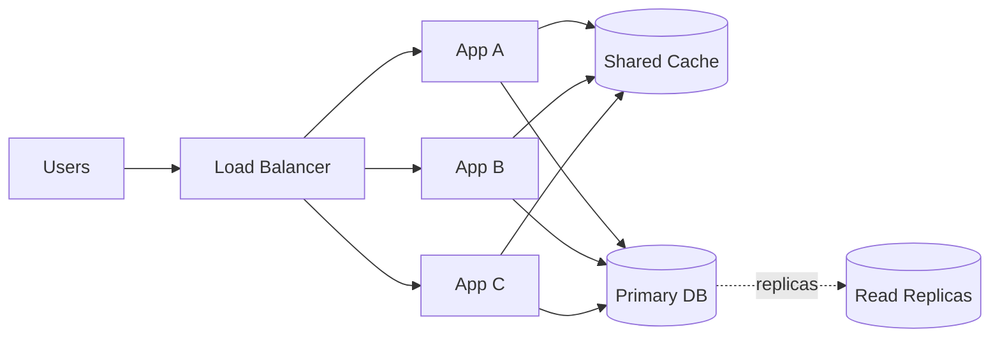

# Scalability

## 1. One-Line Definition
Scalability is a system's ability to handle growing load (more users, more data, more throughput) by adding resources, without redesigning the core architecture.

## 2. Why Do We Need It?
Products grow. A system built for 10k users will choke at 1M. Scalability lets the business grow without rewriting the system after every milestone — it is the ability to pay in hardware for what you get back in capacity.

## 3. Simple Intuition
A single checkout counter serves one line. When the queue grows you either make that counter faster (vertical scaling) or open more counters, each with its own line (horizontal scaling). Scalability is not "the counters exist" — it is knowing how to add counters without the aisles, signs, or stockroom (shared state, DB, backplane) becoming the new bottleneck.

## 4. What Happens Without It?
One server + one database is perfectly correct but single-threaded in effect: CPU saturates, DB connection pool saturates, disk I/O saturates. Latency climbs, errors appear, and no amount of code optimisation fixes it — you have hit the ceiling of one machine.

## 5. Core Idea
Two axes:
- **Vertical scaling (scale up):** buy a bigger machine (more CPU/RAM/disk). Simple, no code change, but expensive and bounded by the biggest machine that exists.
- **Horizontal scaling (scale out):** add more machines and spread load. Requires **stateless** application servers behind a load balancer, and partitioned/replicated data.

The painful part of horizontal scaling is **state**: sessions in memory, databases, caches, files. State must be moved to a shared, partitioned, or replicated store. Capacity grows linearly with machines only when work is independent (no shared locks, no hot shards).

## 6. Important Terminology

| Term | Simple Meaning |
|------|----------------|
| Load | Traffic and data volume (QPS, concurrent users, bytes) |
| Vertical scaling | Bigger single machine |
| Horizontal scaling | More machines |
| Stateless server | Server holding no user state; any request to any node works |
| Stateful server | Server owning session/data; requires session affinity or shared store |
| Load balancer | Router that spreads requests across nodes |
| Hotspot | One node/shard receiving disproportionate load |
| Superlinear / sublinear scaling | Throughput growing faster / slower than nodes added |

## 7. Basic Architecture



## 8. Request or Data Flow
Any user's request can land on any app node (stateless) → read from shared cache → read/write DB through the pool → scale each tier independently: more app nodes for CPU, more replicas/cache for reads, shards for write+storage growth.

## 9. Practical Example
**E-commerce (assumptions):** 100 QPS now, 1M DAU in a year, reads 10:1 writes.
- App tier: 3 stateless nodes → auto-scale to 30.
- Read tier: 1 primary + 2 replicas → add replicas and Redis for hot catalog reads.
- Write tier: primary DB → shard by tenant/region when write QPS or storage demands it.

## 10. Scaling
- **Low scale:** one app + one DB; vertical scaling buys time.
- **First bottleneck:** app CPU, then DB connections, then DB disk I/O.
- **Vertical scaling:** memory/CPU upgrades — instant, capped.
- **Horizontal scaling:** app nodes first (easiest, stateless); then cache layer; then DB reads (replicas); then DB writes (sharding); then global scale (multi-region).
- **Read scaling:** replicas + CDN + cache.
- **Write scaling:** queue+async writes, partitioning, sharding.
- **Storage scaling:** object storage, lifecycle tiering.
- **Network scaling:** CDN offload, protocol upgrades (HTTP/2/3), compression.
- **Hotspot risks:** one popular user/tenant/shard — consistent hashing, replica reads for that key, local cache.

## 11. Reliability and Failure Scenarios
- **Server failure:** LB health-checks and routes elsewhere; auto-scaling replaces it.
- **DB failure:** replica promotion (failover); recent asynchronous writes may be lost.
- **Network failure:** LB requires healthy backend; consider cross-region standby.
- **Retry storm:** retries multiply load during an outage — use backoff + jitter + circuit breakers.
- **Hotspot:** a single shard saturates while others idle — choose shard key carefully, split hot keys.

## 12. Consistency and Correctness
Scaling reads via replicas and caches introduces stale reads (replication lag). Scaling writes via sharding moves single-row transaction scope to per-shard — cross-shard transactions get expensive. Design so most transactions stay within one shard.

## 13. Performance
Scalability is about **capacity**; performance is about **speed**. Good scaling keeps per-request latency flat as load grows. If p95 spikes when you add a 10th node, you likely introduced a shared bottleneck (DB pool, lock, hot shard) — investigate.

## 14. Security
More nodes = larger attack surface and more credentials to leak. Scale security with the system: centralized authN/authZ, secrets manager, network segmentation, per-service API keys least-privilege.

## 15. Trade-Offs

| Choice | Advantages | Disadvantages | When to Use |
|--------|------------|---------------|-------------|
| Vertical scaling | Simple, no code change | Cost ceiling, downtime for upgrades | Early stage, burst capacity |
| Horizontal app nodes | Cheap, elastic, easy | Needs statelessness, LB | Sustained concurrency |
| Read replicas | Cheap read scaling | Freshness lag | Read-heavy systems |
| Sharding | Scales writes & storage unbounded | Cross-shard complexity, rebalancing | Very large data / write QPS |
| Multi-region | Global latency, DR | Expensive, consistency costs | Global user base |

## 16. Common Mistakes
- Saying "it scales horizontally, so it's scalable" while the DB is a single SPOF.
- Adding cache/replicas for a system that is write-heavy (the writes remain the bottleneck).
- Ignoring hotspots — perfectly even sharding is a myth; always discuss hot keys.
- Believing "no downtime" equals "scales automatically" — deploys, data migrations, and DNS propagation are separate concerns.

## 17. HLD vs LLD Boundary
Scalability lives at HLD: how many nodes, how data is split, where caches sit. The LLD side is in-process optimisations (async I/O, locking granularity, code-level caches) — those matter but are not how you scale past one machine.

## 18. Interview Questions

### Beginner
- What is the difference between vertical and horizontal scaling?
- Why must app servers be stateless to scale horizontally?

### Intermediate
- A database is the bottleneck; how do you scale reads? How do you scale writes?
- Your system scaled to 10 nodes but throughput flatlined; what do you suspect?

### Advanced
- Design a system whose writes scale beyond a single database.
- How do you scale storage for petabytes with hot and cold access patterns?

## 19. Interview Memory Summary

> [!abstract]- Interview Memory Summary

### Remember

- Vertical = bigger box; horizontal = more boxes.
- A stateless app tier behind a load balancer scales freely by adding nodes.
- State (DB, cache, sessions) is the hard part of scaling.
- Reads scale with cache, replicas, and CDN.
- Writes scale with asynchronous processing and sharding.
- Capacity grows linearly only when work is independent — no hot shards, no shared locks.

### 30-Second Explanation

Stateless app behind LB; scale reads first, then writes; watch for hotspots and shared state.

### Interview Traps

- Proposing sharding when reads are the bottleneck — sharding helps writes/storage, not raw read QPS; replicas and cache come first.
- Claiming "it scales horizontally" while the DB is a single SPOF.
- Adding cache/replicas for a write-heavy system — writes remain the bottleneck.
- Ignoring hotspots — perfectly even sharding is a myth.

### Key Trade-Off

You buy capacity with hardware, but only until a shared point (DB, lock, hot shard) becomes the next bottleneck — scalability is the ability to keep adding resources without redesigning around state.

## 20. Related Concepts

### Prerequisites

- [[horizontal-vs-vertical-scaling|Horizontal vs Vertical Scaling]]
- [[stateless-vs-stateful-services|Stateless vs Stateful Services]]

### Commonly Used Together

- [[load-balancing|Load Balancing]]
- [[caching|Caching]]
- [[database-replication|Database Replication]]
- [[sharding|Sharding]]
- [[capacity-estimation|Capacity Estimation]]

### Advanced Concepts

- [[consistent-hashing|Consistent Hashing]]

Related planned topics (not authored yet): auto-scaling.

## 21. References
Standard HLD syllabi (Grokking System Design, Alex Xu). Verify current cloud scaling limits with provider docs.

## 22. Active Recall

Test yourself before revealing each answer.

> [!question]- What problem does scalability solve?
> Products grow: a system built for 10k users chokes at 1M. Without scaling ability you must rewrite the architecture after every milestone. Scalability lets you pay in hardware for capacity — more CPU/RAM for vertical, more machines for horizontal.

> [!question]- What is the difference between vertical and horizontal scaling?
> Vertical (scale up) buys a bigger single machine — simple, no code change, but capped by the largest machine and expensive. Horizontal (scale out) adds machines and spreads load — requires stateless app servers behind an LB and partitioned/replicated data.

> [!question]- Why must app servers be stateless to scale horizontally?
> If a node holds sessions or in-memory state, not every node can serve every request — users must be pinned (sticky sessions), which kills elastic scaling. With state externalized to a shared store, any node can take any request, so adding/removing nodes is trivial.

> [!question]- A database is the bottleneck. How do you scale reads and how do you scale writes?
> Reads: caches, CDN, and read replicas (freshness lag is the cost). Writes: queues plus async writes, partitioning, and sharding — because replicas still funnel every write through one primary and can't grow write QPS or storage.

> [!question]- What do you give up when you scale a system horizontally?
> Shared state forces a consistency story: replicas and caches introduce stale reads (replication lag), and sharding moves transaction scope to per-shard so cross-shard transactions get expensive. You also spread the failure surface and add shared points that can become new bottlenecks.

> [!question]- Your system scaled to 10 nodes but throughput flatlined. What do you suspect?
> A shared bottleneck beyond the app tier: the DB connection pool, a single cache node, a lock, or a hot shard. Capacity grows linearly only when work is independent — investigate p95 and the shared resource's utilisation, not just node count.

> [!question]- Interview scenario: an e-commerce API slows as traffic grows (100 QPS now, 1M DAU in a year).
> 1. Confirm stateless app tier behind an LB — auto-scale app nodes 3 → 30.
> 2. Reads 10:1: add read replicas and Redis for hot catalog reads.
> 3. When write QPS or storage demands it: shard by tenant/region.
> 4. Watch hotspots (a popular tenant/shard) — consistent hashing, replica reads for that key, local cache.

> [!question]- What happens if a hot shard or popular key saturates one node while others idle?
> Overall latency degrades even though most capacity is idle — the system's throughput is capped by that hotspot. Rapid scale-out won't fix it. Mitigate: choose the shard key carefully, split hot keys, serve that key from replicas/cache.

## 23. When Should I Use This?

### Use it when

- Traffic or data is growing and you must predict how capacity scales with resources.
- You need to decide between a bigger machine vs more machines per tier.
- Users are complaining about latency/errors near a single node's capacity ceiling.
- You need an escalation ladder: app nodes → cache → replicas → shards → multi-region.

### Avoid it when

- The system is small and the cost/complexity of distributed state exceeds the benefit — scale later with evidence.
- The real problem is performance tuning inside one machine (LLD).
- A single shared component (one Redis, one DB) is actually the bottleneck and you're not ready to partition it.

### What problem does it solve?

Problem: one server + one database caps at CPU, connection-pool, and disk-I/O ceilings — more code or money buys nothing past that point. Solution: an architecture (stateless app tier behind LB, shared cache, replicas, shards) where adding resources increases capacity, so growth doesn't require a rewrite.

### What problem does it NOT solve?

It does not guarantee availability (nodes need their own failover story), it does not fix a badly chosen shard key or a single shared point, and naive horizontal scaling can raise latency (cross-node coordination) and introduce consistency costs. Never treat "no downtime" migrations or deploys as the same thing as scaling.

## 24. Decision Connections

Decisions that go together with scalability:

- [[horizontal-vs-vertical-scaling|Horizontal vs Vertical Scaling]] — the two directions and when each fits a tier.
- [[stateless-vs-stateful-services|Stateless vs Stateful Services]] — statelessness is what makes the app tier scale freely.
- [[load-balancing|Load Balancing]] — the router that spreads requests across scale-out nodes.
- [[caching|Caching]] — the first and cheapest read-scaling lever.
- [[database-replication|Database Replication]] — read scaling via replicas, the sibling of scaling.
- [[sharding|Sharding]] — the write/storage scaling lever when data outgrows one primary.
- [[consistent-hashing|Consistent Hashing]] — keeps adding/removing shards cheap during rebalancing.
- [[capacity-estimation|Capacity Estimation]] — produces the numbers that drive node, cache, and shard counts.

Decision tree:

```
Load is growing
    |
    +-- Single machine still OK with more power (burst, early growth)?
    |      → vertical scaling (bigger box)
    |
    +-- Sustained concurrency on the app tier?
    |      → stateless nodes behind [[load-balancing|Load Balancing]]
    |
    +-- Reads are the bottleneck?
    |      → [[caching|Caching]] → [[database-replication|Database Replication]] (replicas) → CDN
    |
    +-- Writes or total storage exceed one primary?
    |      → [[sharding|Sharding]] (key choice + [[consistent-hashing|Consistent Hashing]])
    |
    +-- Every tier saturating evenly?
           → [[capacity-estimation|Capacity Estimation]] to size the next band
```