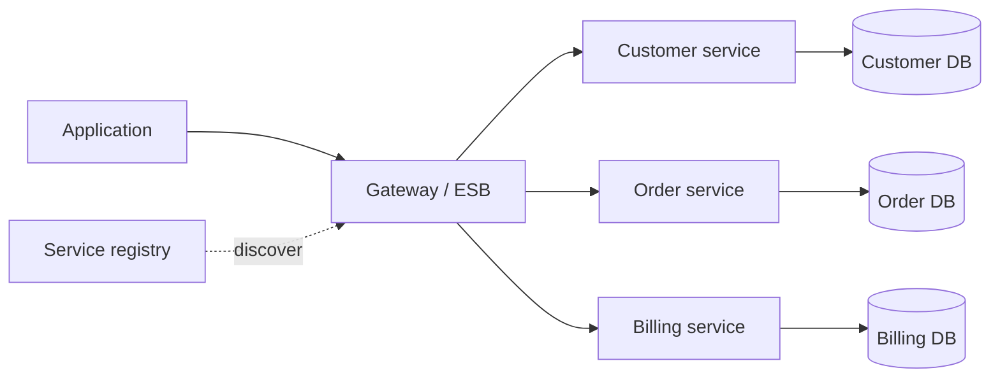

# Service-Oriented Architecture

## 1. One-Line Definition
Service-Oriented Architecture (SOA) is a design philosophy that organizes a system as a set of coarse-grained, independently deployable business services that discover and communicate with each other over standard enterprise protocols — often mediated, in classic SOA, by an enterprise service bus.

## 2. Why Do We Need It?
Before SOA, "integration" meant point-to-point spaghetti: every system talked to every other through bespoke transport, every consumer hard-coded its endpoints, and replacing one legacy system required rewiring everything. SOA offers semantic, reusable business services (CustomerService, OrderService) with formal contracts, registry-based discovery, and orchestration — so a new process (request for quote spanning CRM+ERP+billing) can be assembled from existing services instead of being written as new glue.

## 3. Simple Intuition
A hotel front desk (the registry) in a large hotel: every department — kitchen, laundry, maintenance, concierge — is a specialist service with a well-defined job and a standard request form. Guests (applications) never carry towels to the laundry; they ask the front desk, the front desk knows who does what and the format each accepts. Adding a spa (a new service) requires one registration entry, not re-teaching every guest.

## 4. What Happens Without It?
Enterprise estates become a ball of mud: N systems with N² point-to-point integrations, no reuse (each new app re-implements customer lookup), no way to swap a legacy system without a rewrite of every caller, and contracts reinvented per pair. Change is glacial, every upgrade is a big bang, and "can we add a new product line?" is a multi-quarter project regardless of how well the underlying data already exists.

## 5. Core Idea
- **Services are coarse-grained and business-shaped:** a service owns a business capability (customer, inventory, billing) and exposes an *interface contract* (schema + semantics), not implementation details (see [[contract-first-design|Contract-First Design]]).
- **Discoverable, not hardwired:** a registry/lookup tells consumers where a service lives and what contract it speaks (see [[service-discovery|Service Discovery]]).
- **Reuse and composition:** processes are orchestrated by composing services (a canonical choreography or a central orchestrator), so business change = new orchestration, not new systems.
- **Standard enterprise plumbing:** classic SOA leans on heavy middleware (ESB) for routing, transformation, and protocol mediation; modern SOA leans on HTTP/REST or message brokers + lightweight gateways.
- **Layered autonomy:** services run independently (deploy, scale, fail) while coordinating through contracts — the same autonomy goal microservices later took to the extreme (see [[microservices|Microservices]]).

## 6. Important Terminology

| Term | Simple Meaning |
|------|----------------|
| Service | A coarse-grained business capability with a contract |
| Contract | Schema + semantics consumers can rely on |
| Orchestration | A central process coordinating service calls |
| Choreography | Services coordinate via events, no central director |
| ESB | Enterprise service bus: hub for routing/transformation |
| Registry | Directory of services and their endpoints |
| Canonical model | A shared data schema services exchange |
| SOA governance | Standards: contracts, security, versioning, reuse |

## 7. Basic Architecture



## 8. Request or Data Flow
1. An application needs a customer name + open orders + invoice status for a single screen.
2. It calls the orchestration API (or the gateway), which resolves each service from the registry and calls them under their contracts.
3. The services respond with their canonical schemas; the gateway composes/transforms into the screen's view.
4. A new service registers itself; consumers who follow the contract don't change — and a client that breaks the contract fails the governance check before it ships.

## 9. Practical Example
**Insurance quote-to-bind (assumptions):** quoting touches customer, policy, pricing, and document services — no single service owns the whole flow.
- Each capability is an existing service with a contract; the quote flow is *orchestrated* in a process layer that sequences calls and handles the "decline" branches.
- Adding a new insurer product line: new pricing service + registration + orchestration step — none of the other services change.
- Versioned contracts (v1/v2) let old consumers keep binding while new ones enjoy richer policies (see [[backward-compatibility|Backward Compatibility]]).

## 10. Scaling
SOA scales like any service split: independent services scale independently (billing grows without touching customer), teams take ownership per service, and reuse prevents repeated code. Its classic scaling tax is the **central hub**: the ESB/gateway becomes a bottleneck and a SPOF (see [[single-point-of-failure|Single Point of Failure]]), orchestration layers interleave latency, and coarse-grained services often contain internally inconsistent workloads (the customer service holds both hot lookups and cold batch processes). Modern SOA mitigations: gateway farms instead of one bus, event choreography instead of deep synchronous orchestrations, and finer granularity where splits pay.

## 11. Reliability and Failure Scenarios

| Failure | What Happens | Detection | Recovery | Trade-off |
|---------|--------------|-----------|----------|-----------|
| ESB/gateway fails | All composition stops | Hub health | Gateway cluster, failover | SPOF removed at cost |
| A service goes down | Consumers using it degrade | Health + error rate | Standby/failover within service | Service-level HA needed |
| Slow orchestration chain | Process latency compounds | Tracing | Parallelize/shrink the chain | Correctness of composition |
| Contract drift | Consumers break silently | Contract tests, registry checks | Version + migrate | Governance overhead |
| Registry stale | Wrong/disappeared endpoints | Registry heartbeat | Auto-registration/dereg | Discovery complexity |

## 12. Consistency and Correctness
Each service owning its own database makes cross-service consistency the central problem: an order spanning customer+billing services cannot be one transaction (see [[distributed-transactions|Distributed Transactions]]). The SOA answer is process-level correctness: sagas and compensations (see [[saga-and-strangler|Saga and Strangler Fig]]), idempotent service calls under retries (see [[idempotency|Idempotency]]), event-based finalization, and eventual agreement where "the process completed" replaces "everything updated in one shot" (see [[consistency|Consistency]]).

## 13. Performance
Service decomposition costs performance on routes that cross services: serialization, gateway hops, and orchestration add latency vs a monolith's in-process call (see [[synchronous-processing|Synchronous Processing]] for chain budgeting). The design counters: co-locate hot paths in one service, parallelize independent service calls, cache composed views (see [[caching|Caching]]), and push event-driven flows off the synchronous path (see [[asynchronous-processing|Asynchronous Processing]]). Pay the network only where split autonomy buys real independence.

## 14. Security
SOA scales security-admin problems: many services, many contracts, many callers. Centralize authentication/authorization at the gateway (see [[authentication-vs-authorization|Authentication vs Authorization]]) while authorizing per-service too (defense in depth); use service identities + mutual TLS between services (see [[encryption-and-keys|Encryption and Keys]]); govern who may consume which contract; and never let the "trusted internal bus" bypass tenant isolation or audit (see [[tenancy-and-cells|Multi-Tenancy and Cell-Based Architecture]]).

## 15. Trade-Offs

| Choice | Advantages | Disadvantages | When to Use |
|--------|------------|---------------|-------------|
| ESB-mediated | Central routing/transformation | Hub is bottleneck/SPOF | Many heterogeneous legacy systems |
| Direct service calls | No hub latency/SPOF | Point-to-point drift returns | Fewer, healthy services |
| Orchestration | Simple to follow, explicit | Central director coupling | Sequential business processes |
| Choreography/events | Decoupled, resilient | Hard to trace end-to-end | Many independent reaction flows |
| Coarse services | Fewer hops, easier ops | Internal mixing of hot+cold | Established business capabilities |
| Fine services (micro) | Independent scale, team fit | More network, ops | Large orgs needing team autonomy |

## 16. Common Mistakes
- Building a heavyweight ESB that becomes both bottleneck and SPOF, then calling the site down "SOA's fault".
- Services that leak their database — every consumer queries through the contract, not the schema, or coupling returns immediately.
- Orchestration depth: a 9-service synchronous call for a "quick" operation, no budget, no tracing.
- Contract drift with no governance: versioning ignored until a consumer breaks in production.
- Confusing services with simply "deploying the monolith to the cloud" — a distributed monolith is the worst of both.

## 17. HLD vs LLD Boundary
HLD: service boundaries, contracts and their versioning, orchestration vs choreography, registry/gateway topology, cross-service consistency strategy, security/identity model. LLD: the WSDL/OpenAPI definitions, the actual orchestration workflow code, ESB route/protocol details, per-service handler and DB access implementations.

## 18. Interview Questions

### Beginner
- How is SOA different from a "decentralized monolith"?
- What does a service interface contract protect, and who breaks first without it?

### Intermediate
- An insurance flow spans four services. Compare orchestration vs choreography, and pick one with a rationale.
- The ESB now owns all traffic. Identify the risks and redesign the hub away.

### Advanced
- Design a "quote to bind" process that must stay eventually consistent across services, with a clear compensation path.
- When is classical SOA with an enterprise bus actually the right answer in 2026, and when is it legacy baggage?

## 19. Interview Memory Summary

> [!abstract]- Interview Memory Summary

### Remember

- SOA = coarse-grained, business-shaped services with contracts.
- Discovery via registry; composition via orchestration or choreography.
- Reuse through contracts; process change = new composition, not new systems.
- Classic ESB centralizes routing — and bottlenecks.
- Services own their data; cross-service consistency is sagas/idempotency, not transactions.
- Contracts must be versioned and governed.
- Microservices are SOA's granular, decentralized sequel.

### 30-Second Explanation

Organize the estate as discoverable, contract-bound business services, compose processes by orchestration or events, own data per service, and solve cross-service correctness with idempotency and sagas — keep the middleware hub a redundant farm so it mediates without becoming the point of failure.

### Interview Traps

- Presenting a distributed monolith as SOA.
- ESB as unquestioned centerpiece (bottleneck + SPOF).
- Cross-service transactions promised at scale (that path leads to sagas).
- No contract versioning: "the interface is the /docs page."

### Key Trade-Off

SOA buys reuse, autonomy, and integration discipline at the price of network hops, distributed consistency work, and governance overhead — the granularity sweet spot is where autonomy pays more than the coordination costs.

## 20. Related Concepts

### Prerequisites

- [[loose-coupling|Loose Coupling]]
- [[contract-first-design|Contract-First Design]]
- [[layered-architecture|Layered / N-Tier Architecture]]

### Commonly Used Together

- [[service-discovery|Service Discovery]]
- [[api-gateway|API Gateway]]
- [[event-driven-architecture|Event-Driven Architecture]]
- [[saga-and-strangler|Saga and Strangler Fig]]

### Alternatives

- [[microservices|Microservices]] (the decentralized, granular descendant)
- [[monolith|Monolith]] / [[modular-monolith|Modular Monolith]] (when the coordination tax isn't worth it)

### Advanced Concepts

- [[distributed-transactions|Distributed Transactions]]
- [[tenancy-and-cells|Multi-Tenancy and Cell-Based Architecture]]
- [[control-plane-vs-data-plane|Control Plane vs Data Plane]] (the same hub-and-spoke lesson in infrastructure clothing)

## 21. References
Classical SOA texts (Thomas Erl) for ESB/orchestration terminology; Fowler's essays contrasting SOA and microservices; current integration guidance (Kong/AWS/Confluent) replacing "ESB" with gateway + event broker tooling. Verify current vendor capabilities before relying on specifics.

## 22. Active Recall

Test yourself before revealing each answer.

> [!question]- What does a service contract actually protect?
> It protects consumers from implementation change, and services from having to stabilize at every consumer whim. With a versioned contract (schema + semantics), the service can swap internals, databases, or hosts without breaking callers; a breaking change must be a *new version* with a migration, not a silent edit. Without it, the "integration standard" is whichever consumer complains loudest.

> [!question]- Orchestration vs choreography — pick one for a four-service quote flow and defend it.
> Orchestration (one process layer calling the four in sequence) wins when the business flow is a *well-defined sequence* with explicit decisions: easy to trace, easy to reason about, simple to change as a flowchart. Choreography (each service reacts to events) wins when flows are fragmented, need to evolve independently, or must tolerate component absence — at the price of end-to-end traceability. Choose by whether the flow is one decision chain or a web of reactions.

> [!question]- Why is "SOA without data ownership" a contradiction?
> The core of SOA is that each service owns its business capability *and its data*. Once services share a database, they share coupling — schema changes ripple, "transactions" cross logical boundaries, and the contract becomes a fiction. Data ownership per service is what makes independent deploy, scale, and evolution real; shared storage immediately re-monolithizes the design.

> [!question]- Trade-off: the ESB centralizes routing. What precisely does it centralize that hurts?
> It centralizes the *blast radius*: one hub for all composition means one failure, one bottleneck, and one scale unit for everything. Modern design keeps the hub's job (routing, transformation, auth) but makes it a *redundant farm* like the rest of the tier — and pushes what can be event-driven off the synchronous axis, so the hub mediates only what genuinely needs mediation.

> [!question]- Interview scenario: an order spans customer, inventory, and billing; none shares a DB. How is it made atomic?
> It isn't, transactionally — that's the honest answer. The correct path is a saga: a process that treats each step as a local transaction with a compensator (reserve → if billing fails, release the reservation and refund), plus idempotent service calls so retries never double-apply, plus a durable process record. "The order completed" becomes an observable convergence, not an ACID moment (see [[saga-and-strangler|Saga and Strangler Fig]]).

> [!question]- Your "SOA" is a monolith split into services that still call one shared database. What is the actual problem?
> It's a distributed monolith: all the coordination cost of services (network, tracing, partial failure) with none of the autonomy (schema coupling, deploy coupling, one bottleneck DB). Both failure modes compound. The fix is service-owned data (or a deliberate step back to a modular monolith for capabilities that genuinely don't scale apart) — choose autonomy honestly or don't pay for it.

## 23. When Should I Use This?

### Use it when

- You have/expect many systems needing integration under formal contracts.
- Business processes are compositions of existing capabilities (quote, order, bill, notify).
- Different parts of the estate have different lifecycles or vendors and must interop.
- Teams need to own business capabilities independently.

### Avoid it when

- The entire system fits well as one product with internal modules — a modular monolith gives the boundaries without the network tax.
- The org won't run the governance: contracts, versioning, security per service — SOA without governance is a distributed monolith.
- There's no second service to compose — a single bounded system needs internal modules, not a bus.
- Every "service" is one code function shipped separately — that's microservice theater at higher cost.

### What problem does it solve?

It standardizes integration: business services with contracts replace point-to-point glue, discovery replaces hardwired endpoints, composition replaces big-bang rewrites, and cross-service correctness gets an explicit discipline (idempotency, sagas, events) — so the enterprise can change processes and swap systems without ripping out wiring.

### What problem does it NOT solve?

It doesn't remove the distributed-systems tax (network, consistency, ops — it concentrates it), doesn't fix services that share databases (that's a distributed monolith), doesn't protect correctness without active work (sagas, DLQs, versioning), and — if built around a single ESB — it can make the hub the new single point of failure.

## 24. Decision Connections

Decisions that go together with service-oriented architecture:

- [[microservices|Microservices]] — its granular, decentralized descendant; same values, smaller slices.
- [[modular-monolith|Modular Monolith]] — the "same boundaries without the network" alternative.
- [[contract-first-design|Contract-First Design]] — the discipline that makes contracts live up to their promise.
- [[api-versioning|API Versioning]] — how contracts evolve without breaking consumers.
- [[service-discovery|Service Discovery]] — the registry mechanism modern SOA uses.
- [[api-gateway|API Gateway]] — the modern, redundancy-friendly successor to the ESB's routing role.
- [[saga-and-strangler|Saga and Strangler Fig]] — the correctness patterns for cross-service processes.
- [[event-driven-architecture|Event-Driven Architecture]] — choreography as the decoupled alternative to orchestration.

Decision tree:

```
Many systems must interoperate on shared business capabilities?
    |
    +-- One cohesive product, small/one team?
    |      → [[modular-monolith|Modular Monolith]] (skip the network)
    |
    +-- Capabilities need independent deploy/scale/teams?
    |      → SOA principles: contracts + discovery
    |      → fine-grain them → [[microservices|Microservices]]
    |
    +-- Standardize integration across legacy estate?
    |      → [[api-gateway|API Gateway]] farm (modern ESB role)
    |      → [[contract-first-design|Contract-First Design]] + [[api-versioning|API Versioning]]
    |      → [[service-discovery|Service Discovery]] + service identity
    |
    +-- Flows are long cross-service sequences?
    |      → orchestration + [[saga-and-strangler|Saga]] for correctness
    |
    +-- Flows are reactive / event-driven?
           → [[event-driven-architecture|Event-Driven Architecture]] (choreography)
```