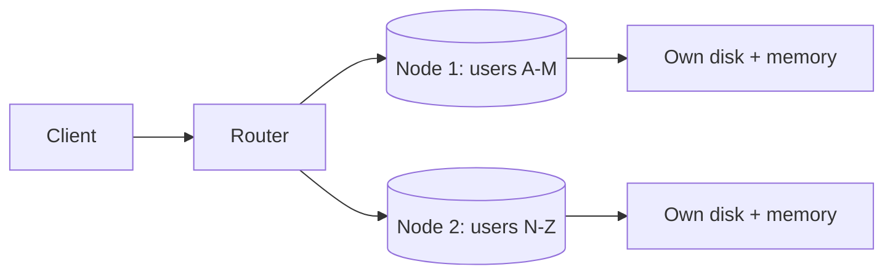

# Shared-Nothing Architecture

## 1. One-Line Definition
Shared-nothing architecture is a design where each node owns its CPU, memory, and disk and serves its slice of work entirely from its own resources — communicating only by messages over the network, with no shared disk, shared memory, or shared state to contend for.

## 2. Why Do We Need It?
Shared resources (one disk, one shared memory cache, one shared file system) become the wall: every node's work eventually queues behind them, they cap throughput no matter how many nodes you add, and they are single points of failure (see [[single-point-of-failure|Single Point of Failure]]). Shared-nothing removes the shared thing — each node scales independently, adds its own resources, and fails alone — which is what makes horizontal scaling (see [[horizontal-vs-vertical-scaling|Horizontal vs Vertical Scaling]]) actually linear up to the coordination overhead.

## 3. Simple Intuition
A chain of food trucks vs one central kitchen. A central kitchen that serves every truck has one stove: trucks wait, one kitchen fire stops all vendors, and adding trucks doesn't add ovens. Food trucks are shared-nothing: every truck brings its own stove and pantry, orders are independent, and the fleet grows by adding whole trucks — the only shared thing is the walkie-talkie channel (the network) they use to coordinate.

## 4. What Happens Without It?
Add 100 web servers and keep one shared database disk: all 100 queue behind that disk's I/O, throughput flatlines at the disk's limit, and a disk failure stops all 100 at once. Shared caches, shared locks, shared file mounts — every shared component is a single bottleneck and a single point of failure and a scale ceiling, no matter how many nodes surround it.

## 5. Core Idea
- **Each node owns its slice:** data is partitioned by a key (see [[sharding|Sharding]], [[shard-key|Shard Key]]) so a request targets one node and its own disk/memory; there is no central storage to ask.
- **Communication is messages only:** nodes coordinate over the network (RPC, events — see [[asynchronous-processing|Asynchronous Processing]]); there is no shared structure both write into.
- **State is partitioned or externalized:** persistent state either lives with the slice owner or in a replicated store that *itself* is shared-nothing (see [[database-replication|Database Replication]], [[consistent-hashing|Consistent Hashing]]). Stateless sides keep no local state at all (see [[stateless-vs-stateful-services|Stateless vs Stateful Services]]).
- **Scaling = adding nodes:** capacity, memory, and I/O all grow with the fleet because nothing binds them together.
- **The honest tax:** partitioning makes cross-node operations (joins, transactions, global order) expensive — locality and co-location design decide how much you pay (see [[partitioning-vs-sharding|Partitioning vs Sharding]]).

## 6. Important Terminology

| Term | Simple Meaning |
|------|----------------|
| Shared-nothing | Each node owns all its own resources |
| Data locality | Work and its data on the same node |
| Partition key | The attribute that decides ownership |
| Co-location | Related data on one node so ops stay local |
| Cross-node operation | Needs coordination between nodes |
| Stateless node | Holds no durable state at all |
| Scatter-gather | Ask all nodes, then merge |
| Rebalancing | Moving slices when the fleet changes |

## 7. Basic Architecture



## 8. Request or Data Flow
1. A request arrives with a key (e.g., `user_id`).
2. The router hashes/routes the key to exactly one node — the one owning that slice.
3. That node serves from its own memory/disk with zero coordination — fast, no contention.
4. A request that needs several keys fans out (scatter-gather) or is redesigned (denormalized/co-located) so the hot path stays single-node.

## 9. Practical Example
**Chat platform (assumptions):** all of a user's conversation state should live together.
- Shard by `user_id`: user A's messages, metadata, and presence all co-locate on node 1; every chat operation is a single-node, shared-nothing read/write.
- Fan-out reads (e.g., "search all my conversations") run against a separate search index (see [[search-engine|Search Engine]]), not scatter-gather on the hot path.
- Adding a node = consistent-hash the keyspace over N+1 nodes; only ~1/N of keys move (see [[consistent-hashing|Consistent Hashing]]).

## 10. Scaling
Shared-nothing is the *enabler* of horizontal scaling: more nodes → more aggregate CPU/RAM/disk, roughly linearly, because nothing is shared to saturate. The brakes appear at coordination: rebalancing where keys move (see [[sharding|Sharding]]), hot keys that overload one slice, routing metadata that must stay consistent, and cross-node questions. Mitigations: consistent hashing + virtual nodes for cheap rebalance, split hot keys, cache the routing table locally, and keep global operations in derived stores.

## 11. Reliability and Failure Scenarios

| Failure | What Happens | Detection | Recovery | Trade-off |
|---------|--------------|-----------|----------|-----------|
| One node dies | Its slice is unavailable | Health checks | Rebuild slice from replicas | Need replication per slice |
| Hot shard melts | One slice saturated | Skew metrics | Split/cache/move keys | Complexity |
| Router metadata stale | Wrong routing, bad reads | Meta check | Dual-read during migration | Consistency of the map |
| Rebalance mid-flight | Keys temporarily in two places | Migration state | Dual-read, then switch | Added load |

## 12. Consistency and Correctness
Shared-nothing moves consistency *to the partition boundaries*: within a node, ACID-ish local transactions are easy (see [[transactions-and-acid|Transactions and ACID]]); across nodes, every operation is a distributed one (see [[distributed-transactions|Distributed Transactions]], [[consistency|Consistency]]). The design discipline: choose the shard key so the operations that need atomicity stay on one node (co-location), and where cross-node correctness is unavoidable, use the standard tools — outbox, saga, idempotency — instead of pretending the partition doesn't exist.

## 13. Performance
The payoff is scalability + low contention: single-node operations need no lock, no shared I/O, no coordination round trip. The costs: data movement (a slice's data must travel when state isn't local), replicate-amplification (per-node replicas multiply write traffic), and rebalancing I/O. Hot keys are the performance killer — evenness of the partition key is a performance decision as much as a correctness one (see [[shard-key|Shard Key]]).

## 14. Security
Isolation is enforced by key ownership: requests must only ever reach the node owning their data, and routers must enforce tenant scoping (a cross-tenant key leak is an isolation breach — see [[tenancy-and-cells|Multi-Tenancy and Cell-Based Architecture]]). Per-node credentials mean a compromised node doesn't unlock the fleet; lease keeping the shard map itself permissioned, since who-owns-what is the whole security model.

## 15. Trade-Offs

| Choice | Advantages | Disadvantages | When to Use |
|--------|------------|---------------|-------------|
| Shared-nothing sharding | Linear scale, zero contention | Cross-node ops cost | Large data/writes |
| Shared disk/storage | Simple, no partitioning | Ceiling, contention, SPOF | Manageable single-node loads |
| Stateless app + external store | Simplicity (state elsewhere) | The store becomes the wall | Read-first, moderate data |
| Co-located data | Single-node hot ops | Denormalization, duplicates | Chat, per-user/pin state |
| Global index store | Clean cross-slice queries | Fan-out or dual writes | Search, reporting |

## 16. Common Mistakes
- Picking a partition key with bad cardinality — hot keys negate the whole "nothing shared" promise.
- Treating shared-nothing as permission to ignore consistency — cross-node reads/writes still need rules.
- A "shared-nothing" app tier over one shared database: the database is the shared thing; the wall is just relocated.
- Ignoring rebalancing until nodes must change — then paying the full migration tax at go-live.
- Global queries on the hot path (scatter-gather every request).

## 17. HLD vs LLD Boundary
HLD: the keyspace and its partitioning, node count, co-location design, routing layer, per-slice replication, rebalancing strategy, which operations may go cross-node. LLD: the exact hash/range function, router lookup implementation, key-derivation in the DAO, and per-node migration scripts.

## 18. Interview Questions

### Beginner
- What specifically must a system avoid to be called "shared-nothing"?
- Why does one shared disk defeat an otherwise horizontally scaled fleet?

### Intermediate
- A chat system wants every conversation to be single-node. What does the shard key need to guarantee?
- Your hot key sits on one node at peak. Mitigations before and after the fact.

### Advanced
- Design shared-nothing chat that also supports global admin search. Where does search live and what does it cost?
- Rebalance N→2N nodes with reads and writes live. Walk the protocol and the traps.

## 19. Interview Memory Summary

> [!abstract]- Interview Memory Summary

### Remember

- Each node owns all its resources; only messages are exchanged.
- No shared disk/memory/state = no single wall to saturate.
- Scale = add nodes (the enabler of linear horizontal scaling).
- Data must be partitioned well and co-located for hot ops.
- Cross-node work is the tax: joins, transactions, global order.
- Hot keys break the scheme; evenness is a design goal.
- Rebalancing and routing metadata are the operational dragons.
- Stateless sides keep no state; the store is the wall they share.

### 30-Second Explanation

Partition the data by a carefully chosen key so each node owns its slice and serves it from local resources with zero contention; co-locate related data so hot operations stay single-node; route by consistent hashing so adding nodes moves only ~1/N of keys — and push anything global (search, reporting) into derived stores instead of scatter-gather.

### Interview Traps

- "We scaled horizontally" while one shared DB silently caps everything.
- A low-cardinality shard key that creates the hotspots you're avoiding.
- Global queries on the hot path.
- Claiming shared-nothing removes the need for consistency discipline.

### Key Trade-Off

Shared-nothing buys linear scalability and contention-free single-node operations by pushing complexity into partitioning, co-location, and cross-node correctness — you are trading coordination for the absence of a shared wall.

## 20. Related Concepts

### Prerequisites

- [[sharding|Sharding]]
- [[horizontal-vs-vertical-scaling|Horizontal vs Vertical Scaling]]
- [[stateless-vs-stateful-services|Stateless vs Stateful Services]]

### Commonly Used Together

- [[shard-key|Shard Key]]
- [[consistent-hashing|Consistent Hashing]]
- [[partitioning-vs-sharding|Partitioning vs Sharding]]
- [[load-balancing|Load Balancing]]

### Alternatives

- [[scalability|Scalability]] (goal behind the architecture)

### Advanced Concepts

- [[distributed-transactions|Distributed Transactions]]
- [[distributed-systems|Distributed Systems]]
- [[tenancy-and-cells|Multi-Tenancy and Cell-Based Architecture]]

## 21. References
Stonebraker's "The Case for Shared Nothing" (1986); standard database architecture surveys contrasting shared-memory/shared-disk/shared-nothing; consistent-hashing literature (Karger et al.). Verify current managed-DB clustering models (which are shared-nothing vs shared-disk) with vendor docs.

## 22. Active Recall

Test yourself before revealing each answer.

> [!question]- Why does one shared disk defeat the whole point of horizontal scaling?
> Because every node's I/O waits on that disk: throughput caps at the disk's bandwidth and IOPS no matter how many nodes you add, cost-per-QPS stops improving, and the disk is a single point of failure for everything that reads it. Shared-nothing's entire premise is that memory and I/O scale with the fleet — a shared wall breaches that premise.

> [!question]- What must a chat system's shard key guarantee for "every operation single-node"?
> The key must co-locate everything a chat operation touches: the conversation's messages, metadata, and participants' state must hash to the same node. Practically that means keying by conversation (or a user-alias mapping) rather than by individual message — so the read/write path needs no node other than the owner. The key defines the transaction scope.

> [!question]- Trade-off: scatter-gather vs a derived store for a global query.
> Scatter-gather asks every node then merges — simple, correct-at-read-time, but O(nodes) latency and load per query, never viable on the hot path. A derived store (search index / analytics warehouse, see [[search-engine|Search Engine]]) is prebuilt asynchronously, gives one-hit reads, but is stale by design and costs dual-write or streaming machinery. Rule: hot global reads → derived store; occasional one-off → scatter-gather.

> [!question]- A celebrity lands on one shard and melts it at peak. Diagnose and fix.
> The key has a skewed high-frequency value — one slice holds disproportionate traffic. Fixes: split the hot key into K subshards (suffix the key), cache the hot entity aggressively at a fan-out layer, replicate the slice's reads, or move the tenant to its own grouping. Prevention lives in key cardinality and monitored skew — evenness is a maintained property, not a one-time choice.

> [!question]- Interview scenario: rebalance from 8 to 16 nodes with reads and writes live. What breaks and what's the protocol?
> What breaks: keys move mid-request, so reads can hit the old or new owner, and writes can duplicate or be lost during the cutover. Protocol: consistent hashing + virtual nodes (only 1/16th of keys move); mark in-flight keys, dual-read old+new, write to both briefly, verify parity, then flip routing and backfill. Pause per-key only during its cutover window. Rebalancing is a state-machine, not a batch job.

> [!question]- Why is "shared-nothing" still a consistency discipline, not a consistency escape?
> The absence of a shared wall removes *contention and single ceilings*, not the multi-node reality: a write that co-locates is local, but anything spanning partitions (moving money between users on different nodes, global counts, fan-out writes) is a distributed operation with the usual obligations — idempotency, outbox, sagas, versioning (see [[consistency|Consistency]]). Partitioning changes *where* consistency work happens, never erases it.

## 23. When Should I Use This?

### Use it when

- Dataset or write volume exceeds one node and needs to scale roughly linearly.
- Operations can be pinned to an owning node by a high-cardinality key.
- Nodes must fail independently without sharing a fate.
- Read-hot slices can be replicated per-node instead of globally.

### Avoid it when

- Workloads are inherently global (every query spans everything) — every query pays scatter-gather.
- The data fits one node with headroom — partitioning is premature complexity.
- You can't pick a key with both evenness and co-location.
- The team can't run rebalancing and hot-key monitoring operations.

### What problem does it solve?

It removes the shared resource that would otherwise cap and fragile-ize the fleet: by partitioning data into node-owned slices with co-located hot operations, capacity, memory, and I/O all scale by adding nodes, and no single disk or cache is the wall every request queues behind.

### What problem does it NOT solve?

It doesn't make global queries cheap (those need derived stores), doesn't remove cross-node correctness work (idempotency, sagas), doesn't fix bad key choice or hot keys (it concentrates them into single-node meltdowns), and it doesn't provide availability by itself — each slice still needs its own replication.

## 24. Decision Connections

Decisions that go together with shared-nothing architecture:

- [[sharding|Sharding]] — the canonical way to give each node its own slice.
- [[shard-key|Shard Key]] — the single choice that determines evenness and co-location.
- [[consistent-hashing|Consistent Hashing]] — the routing/rebalancing technology that keeps node changes cheap.
- [[horizontal-vs-vertical-scaling|Horizontal vs Vertical Scaling]] — the growth axis shared-nothing unlocks.
- [[stateless-vs-stateful-services|Stateless vs Stateful Services]] — stateless sides keep no wall; stateful sides must be partitioned.
- [[partitioning-vs-sharding|Partitioning vs Sharding]] — slicing within a node vs across nodes.
- [[database-replication|Database Replication]] — per-slice copies for availability (shard × replica).
- [[distributed-systems|Distributed Systems]] — the broader coordination rules the architecture must obey.

Decision tree:

```
More nodes should mean more capacity
    |
    +-- State must live somewhere
    |      → partition it: [[sharding|Sharding]]
    |      → +-- Even + co-located key? → [[shard-key|Shard Key]] design
    |      → +-- Cheap node changes?    → [[consistent-hashing|Consistent Hashing]]
    |
    +-- Operations must span slices?
    |      → hot path: co-locate / denormalize
    |      → global reads: derived store ([[search-engine|Search Engine]])
    |      → cross-node writes: [[distributed-transactions|Distributed Transactions]]
    |
    +-- Slice must survive node loss
    |      → per-slice replication ([[database-replication|Database Replication]])
    |
    +-- Stateless work?
           → no local state; all state in the partitioned store
```