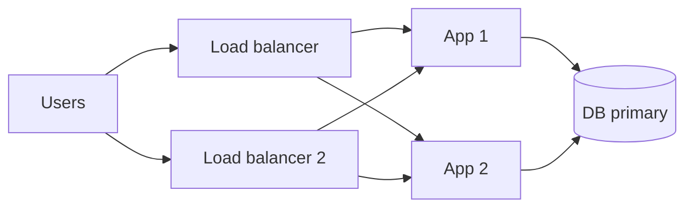

# Single Point of Failure

## 1. One-Line Definition
A single point of failure (SPOF) is any component, dependency, or link whose failure brings down or blocks more than the system can absorb — usually the whole service.

## 2. Why Do We Need It?
Every component fails eventually. A system is only as strong as its least-redundant link: one shared database, one hardcoded IP, one scheduler, one DNS record can silently nullify all the redundancy you put elsewhere. Hunting and removing SPOFs is the cheapest availability engineering there is, because removing one removes a whole class of single-cause outages.

## 3. Simple Intuition
A chain is only as strong as its weakest link — but worse, a chain with a single metal link fails exactly when that one link breaks, no matter how strong every other link is. You can strengthen the chain a lot (many strong links) and still lose everything to one weak link you didn't notice as a single point.

## 4. What Happens Without It?
You get the classic outage pattern: "the database was fine, but the reverse proxy was the only one and died", or "we have 100 servers but they all read config from one file source that went down", or "the failover script is hosted on the very server it exists to fail over from". Every SPOF is a lottery ticket that eventually pays out as a full incident.

## 5. Core Idea
- **Find them systematically:** walk the request path and the control path; anything only-one-of becomes a candidate — load balancer, DNS record, database, queue, orchestrator, config source, credential, physical rack, region.
- **Remove or tolerate them:** add redundancy (see [[redundancy|Redundancy]]), add a fallback, or make the component optional (degraded mode).
- **Watch hidden SPOFs:** shared control planes (one config/secret/CDN), correlated dependencies (every server mounts the same NFS), and *the spares themselves* — a DNS record is a SPOF even with two nameservers if it's a single record, and a single failover coordinator is a SPOF for the redundancy.
- **Distributed systems make it subtle:** leader-election coordinators, a single message queue, a lock service, a service-registry, a shard router — each can be HA as a cluster but a single logical unit whose loss stops everyone (see [[consensus|Consensus]], [[service-discovery|Service Discovery]]).
- **Degrees matter:** not all SPOFs are equal. A single stateless app node is a cheap SPOF (route around it, restart); a single money DB is an expensive SPOF (needs replication + failover + region story).

## 6. Important Terminology

| Term | Simple Meaning |
|------|----------------|
| SPOF | One component whose failure breaks the system |
| Request path | The components a user request passes through |
| Control path | The components that govern the system itself |
| Hidden SPOF | Shared dependency disguised as redundancy |
| Hard-coded endpoint | A fixed IP/DNS with no fallback |
| Fencing | Making a failed component unable to act |
| Failover unit | The redundant thing that takes over |
| Correlated failure | One cause killing many "independent" parts |

## 7. Basic Architecture



## 8. Request or Data Flow
1. Users come through either load balancer (each is duplicated, and DNS round-robins between them) — no single LB is life-or-death.
2. Each LB reaches both app servers — no single app server is life-or-death.
3. Both app servers write to the DB primary. If the audit stops here, the DB is a SPOF: one disk/process/network failure ends traffic.
4. The design must then add the DB standby + failover to remove that SPOF too — and keep checking for the next one (config, DNS, region).

## 9. Practical Example
**Notification service (assumptions):** everything is HA except one thing at a time, found by a request-path walkthrough:
- Found: a single Redis is the only place pending notifications live; it's a SPOF for queued mail.
- Removed: Redis becomes a cluster with replicas; notifications become reconstructible from the source-of-truth store (rebuild path) as a second fallback.
- Found: a single "best SMTP provider" dependency — SMTP outage pauses the queue; adding a second provider + failover config removes that SPOF.
- Now the service survives one-anything-down, with a documented degraded mode.

## 10. Scaling
SPOF hunting scales up in ambition: at single-region scale, the region itself is a SPOF for availability, so multi-AZ then multi-region become the next frontiers (see [[cloud-infrastructure|Cloud Infrastructure]], [[multi-region-models|Active-Active vs Active-Passive Regions]]). Growing fleets also create *new* SPOFs — the orchestrator, the config pipeline, the shared cache, the CDN, the identity provider — so the discipline is continuous, not a one-time audit.

## 11. Reliability and Failure Scenarios

| Failure | What Happens | Detection | Recovery | Trade-off |
|---------|--------------|-----------|----------|-----------|
| Single reverse proxy dies | All routing stops | Proxy health | Had a second? route around | Covers only if present |
| Hardcoded DB endpoint | App can't find DB after failover | Config scan | Service discovery / VIP | Discovery complexity |
| Single config source down | New deploys all break | Config pipeline health | Second source, local cache | Drift risk |
| Shared object store (NFS) dies | All app servers stall together | Mount health | Detach: object/blob storage | Migration effort |
| Failover script on the primary | Nothing to fail over with | Audit the path | Move it out-of-band | Extra infra |

## 12. Consistency and Correctness
A failed SPOF doesn't just cost availability — it can corrupt: a single writer holding un-fenced authority writes stale data after failover (split-brain risk), a single lock service losing its lock mid-operation breaks the invariant it protected (see [[distributed-locks|Distributed Locks]]). Removing a SPOF with replication changes the consistency rules (async = possible loss), so every "make it redundant" decision is also a consistency decision (see [[consistency|Consistency]]).

## 13. Performance
Removing a SPOF usually costs a little: replication and failover add write latency and idle capacity (see [[durability|Durability]] for the exact trade-offs). The availability win normally dwarfs the latency adder, but a poorly placed failover path — a standby on a slower network, a VIP that routes around the world — can silently inflate the p99, so verify the failover path with the latency budget in hand.

## 14. Security
Security SPOFs are real: one hardcoded credential in the fleet, single key shared everywhere (see [[encryption-and-keys|Encryption and Keys]]), one identity provider, one CA/TLS secret. Redundancy also creates new attack surface — the failover path and the standby must enforce the same auth. And the classic trick: "two servers" sharing one secret means one secret compromise is a fleet compromise.

## 15. Trade-Offs

| Choice | Advantages | Disadvantages | When to Use |
|--------|------------|---------------|-------------|
| +1 of the component | Removes the SPOF | Cost, surface area | Critical tiers |
| Failover/standby | Keeps control in one writer | RTO/RPO, complexity | Stateful components |
| Fallback/degraded mode | Survive without a spare | Feature loss | Low-frequency paths |
| Accept the SPOF | Cheap, simple | Single-cause outage | Rarely-touched, easily-rebuilt |
| Region redundancy | Survive a site loss | Cost, latency, conflicts | Availability-driven |

## 16. Common Mistakes
- Confusing "two servers" with "no SPOF" when they share rack/power/config — a correlated SPOF in disguise.
- Treating the control plane as exempt: orchestrator, config, secrets, DNS are all SPOFs too.
- A failover whose own trigger (monitor, runbook, script) is a single point.
- Making the *redundancy coordinator* a SPOF (one lock service; one ha-proxy; one "manager" node the whole recipe requires).
- Auditing once and stopping — new features and new dependencies create new SPOFs continuously.

## 17. HLD vs LLD Boundary
HLD: the SPOF inventory, redundancy topology per tier, failover strategy and budget, which components may explicitly stay single (with rationale). LLD: the concrete failover scripts and triggers, the config-reload path, per-component health probes and their wiring.

## 18. Interview Questions

### Beginner
- What is a single point of failure, and why is removing it the cheapest availability win?
- Name three classic SPOFs in a web service that aren't just "the server".

### Intermediate
- Walk a request path and find the SPOFs; then decide which to remove, which to make degraded.
- Your "HA" system has a single failover coordinator. What's the failure mode and fix?

### Advanced
- Design a control plane (config, secrets, deployment, orchestration) with no single point of failure.
- How can redundancy itself create a single shared dependency? Give an example and the fix.

## 19. Interview Memory Summary

> [!abstract]- Interview Memory Summary

### Remember

- A single chain-link fails the whole chain regardless of the rest.
- Walk request paths AND control paths to find them.
- Hidden SPOF: redundancy sharing one dependency isn't redundancy.
- The spares and the failover-mechanism can be the SPOF.
- Distributed systems: coordinators, locks, registries are logical SPOFs.
- Degraded mode is a legitimate alternative to a spare.
- Re-audit continuously as the system grows.

### 30-Second Explanation

Audit every request and control path for anything there is exactly one of; make critical ones redundant with independent failure domains, add fallbacks for the rest, and verify the failover itself isn't the single point — repeat the audit as the fleet grows, because new dependencies mean new SPOFs.

### Interview Traps

- Claiming "no SPOF" while two servers share power/rack/config.
- Forgetting the control plane and the failover mechanism.
- Making redundancy the SPOF (one coordinator, one lock).
- Accepting an expensive SPOF silently when a degraded mode would do.

### Key Trade-Off

Removing a SPOF always costs capacity, latency, or complexity; the discipline is removing the ones that pay for themselves and consciously accepting — with a documented degraded mode — the ones that don't.

## 20. Related Concepts

### Prerequisites

- [[availability|Availability]]
- [[fault-tolerance|Fault Tolerance]]

### Commonly Used Together

- [[redundancy|Redundancy]]
- [[failover|Failover]]
- [[load-balancing|Load Balancing]]
- [[standby-models|Standby Models]]

### Alternatives

- [[high-cohesion|High Cohesion]] (a systems view: SPOF is the reliability lens on the same "one module owns too much" smell)

### Advanced Concepts

- [[consensus|Consensus]]
- [[service-discovery|Service Discovery]]
- [[multi-region-models|Active-Active vs Active-Passive Regions]]

## 21. References
Standard reliability references (the availability-algebra treatment of N+1, correlated failures); Google SRE Book chapter on identifying assumptions/failure domains. Verify control-plane HA specifics with current platform docs.

## 22. Active Recall

Test yourself before revealing each answer.

> [!question]- Why is removing a SPOF "the cheapest availability engineering"?
> Because availability math: any single link's failure rate is a floor under the whole group. With one chain-link at 99.9%, the system can't beat 99.9% no matter how redundant everything else is. Removing the single link lifts the whole ceiling, often at far lower cost than hardening an already-redundant tier.

> [!question]- "We have two app servers, so we have no SPOF." When is that wrong?
> If they share a failure domain — same rack, same power plane, same network uplink, same config, same dependency, or the same deployment. Then the good-fortune is one shared single point with two faces on it; the actual SPOF is the shared thing.

> [!question]- Your failover coordinator is the single source of truth for promotion. What's the trap?
> The coordinator itself is a SPOF: if it dies or is partitioned from the replicas, there is no failover at all. The fix is a redundant coordinator backed by a consensus protocol (see [[consensus|Consensus]]) — a *quorum*, not one special node — and the same reasoning applies to lock services, registries, and shard-map holders.

> [!question]- Trade-off: add a spare or define a degraded mode?
> A spare buys automatic availability but costs capacity and must be maintained/tested. Degraded mode (fallback, stale-cache, reduced features) costs less and is fine where the system can serve a reduced but acceptable experience for a limited window — pick a spare for load-bearing tiers, degrade for paths rarely hit or easily rebuilt.

> [!question]- Interview scenario: notifications hang because the only inbound SMTP provider is down. Find and fix the SPOF.
> The provider is a dependency-of-one: no alternative route. Fix: a second provider with its own config, failover by feature-flag-level routing, and a queue that holds the mail (reconstructible) so nothing is lost meanwhile. Also check whether the queue itself and its leader have their own single points — the audit doesn't stop at the first find.

> [!question]- Why is "one hardcoded credential" a SPOF even before any outage?
> It's a single point of *security* failure: one key compromised is the whole fleet compromised, no matter how many nodes. The fix is per-node/per-service secrets with rotation, and secrets distributed through encrypted channels (see [[encryption-and-keys|Encryption and Keys]]), so no single secret or door blocks everything.

## 23. When Should I Use This?

### Use it when

- You can name a tier whose loss would stop traffic or block operations entirely.
- You're reviewing an architecture for "what happens if this one thing dies?".
- A system is being hardened: failover, DR, multi-AZ/region.
- A new dependency or shared control plane is being introduced.

### Avoid it when

- The component is disposable and easily rebuilt — a spare for it would be waste; define "restart it" as the plan.
- You can't actually operate the extra redundancy — an unmanaged spare is a second SPOF, not a fix.

### What problem does it solve?

It finds and eliminates single-cause outages: by auditing request and control paths for anything that exists exactly once, adding independent redundancy or a degraded mode to the load-bearing ones, and keeping the audit alive as the system grows — so the fleet's availability isn't a lottery ticket on one component.

### What problem does it NOT solve?

It doesn't fix *correlated multi-component* outages (a bad deploy can break all redundant nodes at once — see [[deployment-strategies|Deployment Strategies]], [[feature-flags|Feature Flags]]), doesn't guarantee consistency of the copies (see [[consistency|Consistency]]), and can't remove the SPOF that is "the whole architecture is one bad decision" — redundancy protects a sound design, it doesn't fix a wrong one.

## 24. Decision Connections

Decisions that go together with single point of failure:

- [[redundancy|Redundancy]] — the primary remedy: +1 in an independent failure domain.
- [[fault-tolerance|Fault Tolerance]] — the broader system making removal-or-degrade a design norm.
- [[failover|Failover]] — how a redundant component actually takes over, and how that mechanism itself must be non-single.
- [[load-balancing|Load Balancing]] — spreading the request path so no node is life-or-death.
- [[consensus|Consensus]] — replacing the single coordinator SPOF with a quorum.
- [[service-discovery|Service Discovery]] — removing hardcoded-endpoint SPOFs.
- [[cloud-infrastructure|Cloud Infrastructure]] — AZs/regions as independent failure domains.
- [[feature-flags|Feature Flags]] — the escape route when the "redundant" fleet shares a bad config.

Decision tree:

```
Find anything that exists exactly once on a critical path
    |
    +-- Request path (servers, LB, DB, queue, DNS)?
    |      → add +1 with independent failure domain ([[redundancy|Redundancy]])
    |      → or define a degraded mode fallback (see [[resilience|Resilience]])
    |
    +-- Control path (config, secrets, deploy, orchestration)?
    |      → redundant config/secrets channels
    |      → coordinator quorum via [[consensus|Consensus]]
    |
    +-- Logical single unit (lock, registry, shard router)?
    |      → cluster it; never let one node arbitrate for all
    |
    +-- Endpoint hardcoded somewhere?
    |      → [[service-discovery|Service Discovery]]
    |
    +-- Rebuilt cheaply?
           → accept the SPOF and automate "restart and rebuild"
```