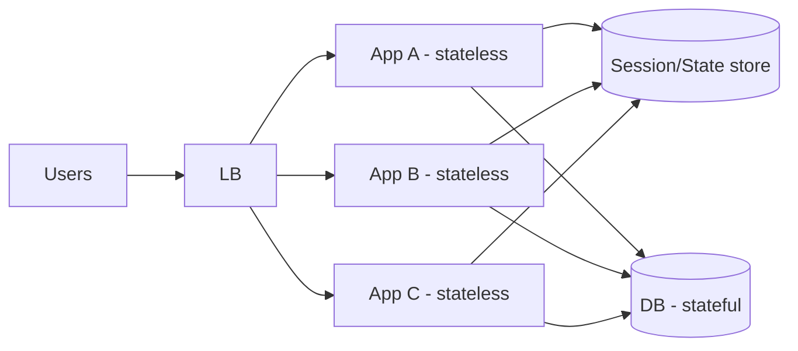

# Stateless vs Stateful Services

## 1. One-Line Definition
A **stateless** service stores no per-user or per-session data inside itself (any instance can serve any request); a **stateful** service owns durable or in-memory state that must survive (or be drained) when instances change.

## 2. Why Do We Need It?
Statelessness is what makes horizontal scaling and rolling deploys easy: you can add, remove, and replace instances freely because no instance "owns" anything. Stateful services (databases, caches, queues) are where state actually lives, and they are the hard part of scaling — they determine failover, sharding, and consistency design.

## 3. Simple Intuition
**Stateless:** a reception desk with a shared computer — any receptionist can help any customer because all the records are in the shared system.
**Stateful:** a bank vault — only the vault "has" the money; you cannot just add a second vault and hope the totals balance. State is sticky.

The desk staff can be swapped on a whim; the vault cannot be.

## 4. What Happens Without It?
If the app tier stores sessions in memory:
- User logs in on node A, next request hits node B → "not logged in." 
- You must pin users to nodes (sticky sessions), which destroys elastic scaling.
- A node restart logs out every user it was serving and loses in-memory queues/state.

## 5. Core Idea
- **Stateless services:** treat the instance as disposable. All shared state lives in external stores (DB, cache, object storage, queue). Requests are interchangeable. Stateful *within* a request (a local transaction) is fine; holding it across requests is not.
- **Stateful services:** own the data. They handle their own durability (WAL, replication), consistency, failover, and partitioning. Examples: SQL primary, Redis, Kafka brokers, Zookeeper, stateful containers.

**Where "stateful app" sneaks in:** sessions, in-process caches, WebSocket connections, rate-limit counters, config that changes per node, upload temp files. Each either moves to a shared store or forces sticky routing.

## 6. Important Terminology

| Term | Simple Meaning |
|------|----------------|
| Stateless | Instance holds no user state between requests |
| Stateful | Instance owns durable/in-memory state |
| Session | Per-user context, usually auth/user id and preferences |
| Sticky session | LB pins a user to a specific node |
| Externalized state | State stored in a shared store instead of the node |
| Redis/DB | Typical homes for externalized state |
| Drain | Let an instance finish in-flight work before removal |

## 7. Basic Architecture



Session data lives in Redis; DB owns canonical data. App nodes have zero state → freely replaceable.

## 8. Request or Data Flow
1. User authenticates; the session token points to a Redis key (or a signed cookie).
2. Any LB-assigned node reads the session from Redis and serves the request.
3. Mutations hit the DB (stateful), caches are invalidated/written.
4. Node restarts/replaced → Redis and DB unaffected → no user-visible impact.

## 9. Practical Example
**Chat backend (assumptions):** users expect their session to survive.
- App tier stateless; sessions in Redis.
- Chat **connections** are stateful (WebSocket per node). Approach: gateway layer tracks which node owns a connection (a connection registry in Redis), messages are routed there; or use a pub/sub fan-out. This shows the correct HLD framing: keep what can be stateless stateless, and give the rest a home (registry + broker).

## 10. Scaling
- **Stateless tier:** add/remove instances freely → scale with traffic (ideal for HPA/spot instances). 
- **Stateful tier:** scale by replication (reads), partitioning/shards (writes), and multi-region strategy. Because state lives in a finite set of nodes, capacity, failover, and hot spots all concentrate here.
- **Failure:** stateless node loss = reroute traffic; stateful node loss = failover algorithm (leader election, replica promotion) + possible data-loss window (RPO).

## 11. Reliability and Failure Scenarios
- **Node loss (stateless):** health check → removed → new node joins. No data impact.
- **Session store loss:** everyone logged out / sessions dropped → mitigate with signed tokens (stateless session) or a replicated session store; trade-offs: signed cookie can't be revoked server-side easily.
- **Stateful DB failure:** requires failover; async replicas may be stale (RPO > 0).
- **Sticky-session failure:** if you must pin (in-progress upload, websocket), a node loss force-drops everyone it pinned — reduce stickiness scope to "just this request/connection," not the whole session.

## 12. Consistency and Correctness
Moving state out of app nodes makes the **external store** the source of truth, which is exactly what you want — one writer per key, transactions where needed. But external stores have their own consistency (replication lag, cache staleness) — the stateless app must tolerate/correct for that.

## 13. Performance
Stateless tiers can run as many instances as needed, but every piece of shared state costs a network hop to the store. Trade a fast in-memory session for an extra Redis round-trip; use signed, self-contained tokens to skip the session-store read for reads (at the cost of revoked-token staleness).

## 14. Security
Stateless services must not hold secrets in memory/disk longer than needed (tokens, keys). Sessions externalised to Redis need encryption + TTL + rotation. Signed tokens (JWT) avoid server-side session storage but require careful key management and revocation strategy.

## 15. Trade-Offs

| Choice | Advantages | Disadvantages | When to Use |
|--------|------------|---------------|-------------|
| Stateless app + Redis sessions | Easy scale, easy failover | Extra hop, Redis is a SPOF unless replicated | Most web APIs |
| Signed token (JWT) | Zero server state, cheap | Hard revocation, client stores secrets | Auth/authz, low write sessions |
| Sticky sessions | Simple, no shared store | Breaks elastic scaling, node loss = logout | Legacy, stateful migrations |
| Stateful app (monolith early) | Fast to build | Scaling ceiling | Tiny traffic, prototype |

## 16. Common Mistakes
- Thinking "no session in memory" is enough — in-process caches, background queues, and WebSocket registries are also state.
- Using sticky sessions to dodge the issue and then expecting smooth scaling.
- Treating Redis as stateless because it's "a cache" — it's a stateful service with its own failover/consistency story.
- Shipping state (uploads, temp files) on the node's disk instead of object storage.

## 17. HLD vs LLD Boundary
HLD: what is stateless vs stateful, where state lives (Redis/DB/object store/registry), sticky vs non-sticky routing, failover of stateful tiers. LLD: how a handler scopes its in-request state, transaction boundaries in one service, thread-local vs shared state in code.

## 18. Interview Questions

### Beginner
- Why must the application tier be stateless to scale horizontally?
- Give three examples of state that "sneaks into" stateless apps.

### Intermediate
- A user's session keeps getting lost after deploys. What is happening and what are the fixes?
- How do you handle WebSocket connections when app nodes are stateless and replaceable?

### Advanced
- Design a system where a stateful database undergoes the same elasticity as stateless nodes.
- You must keep some state. What are the trade-offs between sticky sessions and externalizing to Redis?

## 19. Interview Memory Summary

> [!abstract]- Interview Memory Summary

### Remember

- Stateless = no per-user state in the instance; any instance serves any request.
- A stateless tier scales freely behind an LB.
- State belongs to dedicated stores (DB, Redis, registry).
- Stateful stores own failover, consistency, and sharding.
- Sneak-state (sessions, caches, sockets) is the trap.

### 30-Second Explanation

App nodes are pure; any state moves to a shared, replicated store — Redis for sessions, DB for data, registry + broker for connections.

### Interview Traps

- "Our cache makes us stateless" — a cache is a stateful component; losing it loses cached state and it can be a SPOF. Describe its replication/eviction plan.
- Thinking "no session in memory" is enough — in-process caches, background queues, and WebSocket registries are also state.
- Using sticky sessions to dodge the issue and then expecting smooth elastic scaling.
- Shipping state (uploads, temp files) on the node's disk instead of object storage.

### Key Trade-Off

Statelessness buys elasticity and painless failover at the cost of a network hop to the shared state store for every request — so you trade latency against the ability to add, remove, and replace nodes freely.

## 20. Related Concepts

### Prerequisites

- [[system-design-fundamentals|System Design Fundamentals]]

### Commonly Used Together

- [[load-balancing|Load Balancing]]
- [[caching|Caching]]
- [[database-replication|Database Replication]]
- [[horizontal-vs-vertical-scaling|Horizontal vs Vertical Scaling]]

### Advanced Concepts

- [[sharding|Sharding]]
- [[oauth-oidc-jwt|OAuth 2.0 / OIDC / JWT]]

Related planned topics (not authored yet): session-management, sticky-sessions.

## 21. References
Standard HLD material (Grokking System Design, AWS architecture docs). Confirm current best practice for sessions/tokens with auth provider docs.

## 22. Active Recall

Test yourself before revealing each answer.

> [!question]- What problem does statelessness solve?
> If app nodes held sessions in memory, a user logged in on node A would be "not logged in" on node B — forcing sticky sessions, which destroys elastic scaling, and a node restart would log out everyone it served. Statelessness makes add/remove/replace of nodes a non-event.

> [!question]- What is the difference between a stateless and a stateful service?
> Stateless stores no per-user/per-session data inside itself — any instance can serve any request. Stateful owns durable or in-memory state that must survive instance changes (databases, caches, queues, brokers) and handles its own durability, consistency, failover, and partitioning.

> [!question]- Give three examples of state that "sneaks into" a supposed stateless app.
> Sessions, in-process caches, WebSocket connections, rate-limit counters, per-node config, and upload temp files. Each either moves to a shared store or forces sticky routing — "no session in memory" alone is not enough.

> [!question]- When would you deliberately use a sticky session anyway?
> When state is short-lived but unavoidable on the node (an in-progress upload, a live WebSocket). Keep the stickiness scope to "just this request/connection," not the whole session — then a node loss drops only that in-flight unit, not every user it pinned.

> [!question]- What do you trade for statelessness with Redis-backed sessions?
> An extra network round-trip per request to the session store, and a new SPOF unless Redis is replicated. The alternative — a signed, self-contained token (JWT) — skips the store read for reads but is hard to revoke server-side. Either way state moved out of the node, which is the point.

> [!question]- The session store (Redis) dies and takes everyone's sessions with it. What happens and how is it mitigated?
> Users are logged out mid-session. Mitigate: replicate the session store, or use signed tokens so sessions are self-contained and don't depend on the store being up (paying with revocation staleness). Trade-offs: signed cookie can't be revoked server-side easily.

> [!question]- Interview scenario: a chat backend with WebSocket connections and stateless app nodes.
> Connections are stateful (a WebSocket lives on one node). Correct HLD framing: a gateway layer tracks which node owns each connection (a connection registry in Redis) and routes messages there, or use a pub/sub fan-out. Keep what can be stateless stateless, and give the rest a home — registry + broker.

> [!question]- What happens if a stateful DB node fails in a stateless architecture?
> Stateless node losses are invisible (health check → removed → new node). Stateful DB failure requires a failover algorithm (leader election, replica promotion) and may lose recent async writes — an RPO > 0 window. That's why the stateful tier is the hard part: capacity, failover, and hot spots all concentrate there.

## 23. When Should I Use This?

### Use it when

- You're designing the app tier and want elastic scaling, rolling deploys, and cheap node swaps.
- Sessions, caches, or connection registries need a home and you're deciding Redis vs DB vs broker.
- You must explain sticky vs non-sticky routing and what each costs.
- You're deciding what to externalize (sessions, temp files) vs keep on the node.

### Avoid it when

- State is inherently tied to a node for the request's lifetime (WebSockets, in-progress uploads) — plan a registry instead of forcing statelessness.
- Paying a store round-trip per request destroys latency for a path that could use a signed, self-contained token.
- You treat "stateless" as an excuse to ignore the stateful stores — Redis and DB still need their own failover/consistency story.

### What problem does it solve?

Problem: sessions and in-memory state inside app nodes pin users to nodes, kill elastic scaling, and log everyone out on restart — and a scaled-out system inherits this failure. Solution: keep the app tier stateless (all shared state in external stores — DB, Redis, object storage, registry) so nodes are freely replaceable, and give the stateful tier a proper home with its own failover, consistency, and sharding.

### What problem does it NOT solve?

It doesn't make the stateful stores (DB, Redis, broker) elastic — those still concentrate capacity, failover, and hot spots. It doesn't eliminate the network-hop latency to shared state, and signed tokens only move the problem to revocation semantics. Stateless-land is simple; the complexity is just relocated to the stateful tier.

## 24. Decision Connections

Decisions that go together with stateless vs stateful services:

- [[scalability|Scalability]] — statelessness is the precondition for horizontal app-tier scaling.
- [[load-balancing|Load Balancing]] — freely distributes requests only when any node can serve any request.
- [[caching|Caching]] — a common home for externalized state, and itself a stateful component needing replication.
- [[database-replication|Database Replication]] — how the stateful data tier gains durability and failover.
- [[horizontal-vs-vertical-scaling|Horizontal vs Vertical Scaling]] — stateless tiers scale out freely; stateful tiers scale by replicas then shards.
- [[sharding|Sharding]] — the stateful tier's answer when write/storage growth exceeds one node.
- [[oauth-oidc-jwt|OAuth 2.0 / OIDC / JWT]] — signed tokens let sessions be self-contained, trading server-side revocation.

Decision tree:

```
Design the app tier: where does state live?
    |
    +-- State exists mostly per-user/session?
    |      → externalize to a shared, replicated store
    |         +-- Sessions            → replicated session store (e.g., Redis)
    |         +-- Connections         → registry + pub/sub broker
    |         +-- Temp files/uploads  → object storage
    |
    +-- Can requests be fully interchangeable?
    |      → stateless nodes → elastic scale behind [[load-balancing|Load Balancing]]
    |
    +-- State unavoidably stuck on a node (WebSocket, upload)?
    |      → narrow sticky-scope: pin only that request/connection
    |
    +-- No server-side session stored at all?
    |      → signed tokens [[oauth-oidc-jwt|OAuth 2.0 / OIDC / JWT]] (hard revocation)
    |
    +-- Data tier growth?
           → [[database-replication|Database Replication]] (reads) → [[sharding|Sharding]] (writes/storage)
```