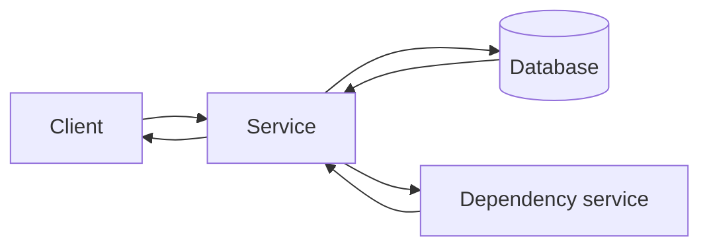

# Synchronous Processing

## 1. One-Line Definition
Synchronous processing means the caller makes a request and blocks until the result is returned — the response is the product of that same call, and the caller's next action depends on it.

## 2. Why Do We Need It?
Some operations produce a result the user immediately needs: log in, load a profile, calculate a quote, charge a card. For these, the caller *must* wait, because there's nothing useful to show without the answer. Synchronous processing is the simplest correctness model — the caller sees the outcome of its own operation directly, sees errors directly, and can retry directly — and for a large class of requests it's the right design.

## 3. Simple Intuition
Ordering pizza at the counter: you wait while the kitchen makes it, and you leave with the pizza. The transaction is "place order, get pizza, pay — done." You can't get a pizza by ordering and walking away; the process is, by nature, the two of you coordinating until the product exists.

## 4. What Happens Without It?
If you make a *slow* thing synchronous by force — a file conversion, a 1000-recipient email, an ML inference — you hold the request thread for seconds or minutes, the caller's timeout fires, and the user sees a spinner or an error that may have actually succeeded. Synchronous-only thinking makes fast paths slow and long operations unusable. The failure mode is not "async", it's mis-scaled sync: a request that should not hold the caller hostage.

## 5. Core Idea
Synchronous processing is the *immediate* path: request carries everything, service does the work, response carries the result, and the caller's control flow continues only on receipt. It is best when:
- The result is needed to proceed (auth, lookup, validation, short writes).
- The operation completes in well under the caller's timeout budget.
- The workload can be served within capacity (sync ties capacity to *in-flight threads/connections*).

Its corollaries:
- **Latency budget discipline:** the whole path must fit the caller's timeout; each hop in a synchronous chain adds to it (see [[latency-vs-throughput|Latency and Throughput]]).
- **Capacity = concurrent flights:** bounded by threads/connections/DB pools, not by total throughput — long sync calls eat capacity physically (see [[bottleneck-identification|Bottleneck Identification]]).
- **Failure is visible:** an error comes back; nothing is "invisible lost work".
- **When it fails, add timers:** timeouts on the client, server-side cancellation, idempotent retry for ambiguous failures (see [[api-timeouts|API Timeouts]], [[idempotency|Idempotency]]).

## 6. Important Terminology

| Term | Simple Meaning |
|------|----------------|
| Blocking | Caller waits for the response |
| Round trip | Full request → response cycle |
| Timeout | Upper bound a caller will wait |
| In-flight request | A request currently being processed |
| Thread/connection pool | The scarce resource sync calls occupy |
| Latency budget | Total time a sync chain may spend |
| Fail-fast | Return error quickly rather than wait |
| Idempotent retry | Safe to re-send the same request |

## 7. Basic Architecture



## 8. Request or Data Flow
1. Client sends "get profile" and blocks.
2. Service reads the DB (one round trip), calls a dependency only if needed, collects the answer.
3. Service returns the profile; the client proceeds.
4. If any step exceeds budgets, the call fails fast or times out with a clear error; a safe retry may re-issue the whole request.

## 9. Practical Example
**Login flow (assumptions):** user clicks log in; the UI can't render anything meaningful without the auth result.
- Auth service validates credentials synchronously — the response *is* the session token.
- Budget: 200ms client timeout; auth runs ~80ms, so there's headroom for a retry.
- On ambiguous failure (timeout), the app retries with an idempotency key so login can't double-issue.
- Contrast: sending a "you logged in on a new device" email is shoved into an async queue — it's not needed to satisfy the request, so holding the user for it would be wrong.

## 10. Scaling
Sync scales by adding in-flight capacity: more nodes, more threads, more connections — until a downstream (usually DB or a hot dependency) saturates, then the pool fills and latency explodes (see [[horizontal-vs-vertical-scaling|Horizontal vs Vertical Scaling]], [[database-connection-pooling|Database Connection Pooling]]). The scaling lever for sync is *short p99*: operations that stay cheap can be massively parallel; operations that take seconds should not be sync at all. Queues (see [[asynchronous-processing|Asynchronous Processing]]) exist precisely for the work whose scale sync can't hold.

## 11. Reliability and Failure Scenarios

| Failure | What Happens | Detection | Recovery | Trade-off |
|---------|--------------|-----------|----------|-----------|
| Dependency hangs | Threads tie up, pool saturates | Timeout + pool gauges | Fail-fast, circuit breaker at the client | Bounded wait vs success odds |
| Service crash mid-request | Caller gets timeout/error | Client error rate | Idempotent retry | Retries must be safe |
| Slow endpoint sync chain | Latency budget exceeded | p99 trace | Caching, parallel calls, async refactor | Freshness/simplicity cost |
| Caller timeout too short | Repeated "hang then retry" | Client logs | Longer budget or faster path | Timeout vs UX trade |

## 12. Consistency and Correctness
Synchronous calls return exactly the state after *their own* operation — strong, immediate, no propagation delay — which makes them attractive for anything where correctness must be visible right now (reserve, transfer, confirm). The danger is the sync chain: calling A-then-B synchronously forbids atomicity across them, exactly why multi-service operations often need async compensation (see [[distributed-transactions|Distributed Transactions]]) or an outbox instead of a fragile synchronous ladder.

## 13. Performance
Sync's performance law: total latency = sum of hops, and throughput = pool size / average duration. So performance tuning is about shrinking hop count and duration (caching, parallel independent calls, indexed queries), and, when unavoidable duration is long, moving the operation to async rather than holding the thread. Watch the tail: one slow dependency inflates the whole chain's p99 (see [[tail-latency|Predictable Tail Latency]], [[distributed-tracing|Distributed Tracing]]).

## 14. Security
Synchronous authentication/authorization (see [[authentication-vs-authorization|Authentication vs Authorization]]) is the strongest pattern because the decision is made and returned before any privileged action — never degrade it to a "we'll check later" async call. Input validation and rate limiting also run synchronously at the edge (see [[rate-limiter|Rate Limiter]]) because they gate the rest of the pipeline; and timeout logic must not make the security layer skip its checks under pressure.

## 15. Trade-Offs

| Choice | Advantages | Disadvantages | When to Use |
|--------|------------|---------------|-------------|
| Sync processing | Immediate, simple, correct-by-construction | Capacity bound, latency sensitivity | Fast, result-needed requests |
| Async processing | Long work off the hot path, scales | Latency for consumer, retry/delivery story | Side effects, slow work |
| Sync + caching | Fast repeats | Staleness | Hot reads with tolerance |
| Sync + parallel calls | Cuts chain latency | Complexity, partial-failure handling | Fan-outs that can run together |
| Sync + retry | Survives transient failures | Storm risk, duplicates | Idempotent, budgeted retries |

## 16. Common Mistakes
- Doing slow work synchronously because it's easier, holding threads and blowing pools (a 30s conversion on an API thread).
- A sync chain so long the caller timeout fires mid-flight — every hop added must stay inside the budget.
- No client timeout: a dead server hangs the caller forever.
- Retrying without idempotency — the ambiguous timeout double-applies an order.
- Blocking on a dependency that should be parallelized or made optional with a fallback.

## 17. HLD vs LLD Boundary
HLD: which operations are synchronous vs async, the latency budget per sync path, capacity equation (pool vs duration), timeout strategy, parallel-call choices. LLD: the specific client timeout constants, the connection-pool sizes, the async/await call structure in code, the retry-with-backoff wiring in a specific framework.

## 18. Interview Questions

### Beginner
- What does it mean for a processing to be synchronous, and when is it the right choice?
- Why can a slow synchronous call hurt capacity even with plenty of servers?

### Intermediate
- A login flow must return within 200ms. Which steps are sync, which should become async, and why?
- Design a service whose sync read path calls three dependencies. How do you keep the p99 in budget?

### Advanced
- A "create document + notify all watchers" flow currently blocks the caller on notifications. Redesign it with the correct split and argue the trade-offs.
- When is a synchronous building block still correct inside an overall async architecture (e.g., event-driven systems)?

## 19. Interview Memory Summary

> [!abstract]- Interview Memory Summary

### Remember

- Sync = caller blocks; response is the product of the request.
- Right when: result needed to proceed, fast operation, correct-by-construction.
- Capacity is concurrent flights, not total throughput — long sync eats pools.
- Every hop adds to the latency budget; the chain must fit the timeout.
- Timeouts, fail-fast, idempotent retries are the sync failure toolkit.
- Parallelize independent calls; cache repeats; async-ize long work.
- Never offload auth/validation from a sync gate.

### 30-Second Explanation

Keep synchronous the requests whose result the user immediately needs and that complete well within the latency budget; size capacity by in-flight concurrency, bound every hop with timeouts, retry idempotently, and push any slow side effect into async instead of holding a thread hostage.

### Interview Traps

- "It's simpler to do it synchronously" as justification for 30s work on a request thread.
- Chains that blow the caller timeout (p99 forgotten, only p50 budgeted).
- Retries that aren't idempotent.
- Confusing "sync = simpler" with "sync = scalable".

### Key Trade-Off

Synchronous processing buys immediacy and a simple correctness story at the price of holding caller capacity; the skill is knowing which operations are short enough to deserve that hold and which must be handed to the async path.

## 20. Related Concepts

### Prerequisites

- [[latency-vs-throughput|Latency and Throughput]]
- [[api-timeouts|API Timeouts]]
- [[system-design-fundamentals|System Design Fundamentals]]

### Commonly Used Together

- [[asynchronous-processing|Asynchronous Processing]]
- [[database-connection-pooling|Database Connection Pooling]]
- [[idempotency|Idempotency]]
- [[retry-and-timeout|Retry and Timeout]]

### Alternatives

- [[asynchronous-processing|Asynchronous Processing]] (the sibling pattern for long work)

### Advanced Concepts

- [[distributed-transactions|Distributed Transactions]]
- [[tail-latency|Predictable Tail Latency]]
- [[bulk-and-long-running-apis|Bulk and Long-Running APIs]]

## 21. References
Standard system-design texts on request patterns and latency budgets; Gil Tene's talks on latency/response-time for the tail arguments; REST/API design docs on synchronous semantics. Verify current framework timeout defaults.

## 22. Active Recall

Test yourself before revealing each answer.

> [!question]- What makes synchronous processing "capacity-bound" instead of throughput-bound?
> Sync ties capacity to *concurrent in-flight* requests (threads, connections, pool slots), and in-flight count = throughput × duration. Same throughput at 10x longer duration needs 10x more concurrent capacity — so slow sync operations eat pools. That's why sync is cheap for fast ops and terrible for slow ones, independent of how much CPU is free.

> [!question]- A login must return in 200ms total. Which steps stay sync and which don't, and why?
> Keep sync: credential check and session issue (needed to render, ~100-150ms). Move out: "send login alert email", "update last-login analytics" — async, because their output isn't needed for the user to proceed. The rule: anything whose result the caller must act on stays sync; everything else leaves the hot path.

> [!question]- Your read path calls three dependencies serially. How do you keep p99 in budget?
> 1. Shorten the chain: cache the stable pieces, make optional calls (fallback) instead of mandatory, 2. Parallelize the independent calls so they cost max, not sum. 3. Bound each hop's own timeout. The chain's p99 is dominated by its worst hop and their serialization — attack both.

> [!question]- Trade-off: fire-and-forget notifications vs synchronous "created and notified" confirmation?
> Sync guarantees "the caller sees when everyone was notified" — but holds the request for however long notifications take and couples them to the create's failure modes. Async makes create fast and notifications independent, at the price of eventual delivery, a delivery story (at-least-once, retries), and the caller learning "later". Decision rule: does the user need the notification *result* to proceed?

> [!question]- Interview scenario: one API does "create order, charge card, send receipt, update dashboards" — all synchronously. Walk the fix.
> 1. Keep sync: create + charge — the user must know the order exists and cleared payment before proceeding. 2. Make async: receipt email, dashboard/analytics updates — no one needs them to finish the request. 3. Protect the sync part: timeout budget, idempotent retry of the charge, and a queue for the async part with a reliable delivery story. The dividing line is "does the caller's next step depend on this result?"

> [!question]- Why must auth never be moved to "check later" async?
> Because the decision ("who is this and are they allowed?") gates every privileged action that follows. Deferring it invites a window where unauthorized actions begin before the check lands, and it converts a crisp security boundary into a race. Synchronous, in-path, fail-closed auth is the strongest pattern — latency pressure must be relieved by caching *the check result*, not by postponing the decision.

## 23. When Should I Use This?

### Use it when

- The caller must act on the result (auth, validation, quotes, index lookups, short writes).
- The operation completes comfortably within the latency budget.
- You want the simple, correct-by-construction model: response = product.
- The hot path needs strong, immediate consistency (see [[consistency|Consistency]]).

### Avoid it when

- The work is inherently slow (conversions, batch, cold ML, email to thousands) — hold the thread and you hold the bill.
- The result isn't needed to proceed — it belongs on an async path.
- Downstream capacity can't absorb in-flight concurrency (DB pool, third-party rate), and you won't/can't scale it.

### What problem does it solve?

For the class of requests where the answer is the deliverable, sync gives the simplest correct behavior: the caller sees its own operation's outcome and failures directly, retries cleanly, and the design's invariant model (result follows request in the same call) holds without extra machinery.

### What problem does it NOT solve?

It doesn't scale slow work (capacity is concurrent, not cumulative), doesn't provide cross-service atomicity when several sync calls are chained (no transaction spans them — see [[distributed-transactions|Distributed Transactions]]), and it's fragile under a long chain whose p99 blows the budget — all of which are exactly the async pattern's home turf.

## 24. Decision Connections

Decisions that go together with synchronous processing:

- [[asynchronous-processing|Asynchronous Processing]] — the sibling you split sync work with at the "needed now?" line.
- [[latency-vs-throughput|Latency and Throughput]] — the budget that decides how much sync the chain can afford.
- [[api-timeouts|API Timeouts]] — the guardrail every sync call needs.
- [[database-connection-pooling|Database Connection Pooling]] — the capacity sync consumption actually uses.
- [[retry-and-timeout|Retry and Timeout]] — safe, bounded retry for ambiguous sync failures.
- [[idempotency|Idempotency]] — what makes those retries safe.
- [[distributed-transactions|Distributed Transactions]] — what you reach for when a sync chain must be atomic (and usually fail).
- [[message-queue|Message Queue]] — the async destination for the work sync must not hold.

Decision tree:

```
Does the caller need this result to proceed?
    |
    +-- Yes, and it's fast?
    |      → keep it synchronous (immediate + strong [[consistency|Consistency]])
    |      → stay within [[api-timeouts|timeout budget]]
    |      → retry idempotently ([[idempotency|Idempotency]])
    |
    +-- Yes, but it's slow (conversion, batch)?
    |      → 500-with-job-id / polling pattern
    |      → [[bulk-and-long-running-apis|Bulk and Long-Running APIs]]
    |
    +-- No, it's a side effect (email, analytics)?
    |      → [[asynchronous-processing|Asynchronous Processing]]
    |      → [[message-queue|Message Queue]]
    |
    +-- Several services, must be atomic?
    |      → NOT a sync chain
    |      → [[distributed-transactions|Distributed Transactions]] or outbox + saga
```