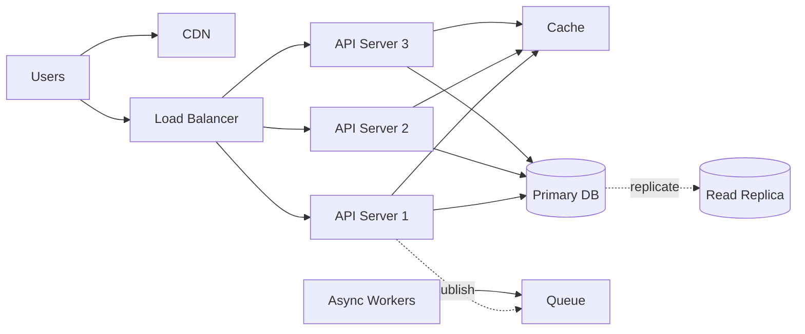

# System Design Fundamentals

## 1. One-Line Definition
System design is the process of defining the architecture, components, modules, interfaces, and data for a distributed system that satisfies functional requirements while meeting non-functional requirements like scale, availability, and latency.

## 2. Why Do We Need It?
A single machine cannot serve billions of users, process petabytes of data, or stay up 99.99% of the time. System design is the discipline of turning a product's requirements into a concrete architecture of servers, databases, queues, caches, and networks that can grow with the business.

## 3. Simple Intuition
Think of a restaurant. One cook in one kitchen can serve a small town. As the town grows you need multiple kitchens (services), a reservation system (queues), a menu (APIs), specialised chefs (specialised services), and backup ovens (redundancy). System design is deciding how to organise the kitchen so customers never wait too long and the kitchen never burns down.

## 4. What Happens Without It?
Without design, you run one server + one database. It works for thousands of users, then fails at thousands of concurrent requests, loses data when the disk fills or the machine dies, and every new feature causes a global outage. Growth becomes a series of emergencies.

## 5. Core Idea
Start from **requirements**, not from technology. First decide the functional requirements (what the system must do) and non-functional requirements (how well it must do it: scale, latency, availability, durability). Then choose components that solve a specific problem:
- **Web/API layer** — serve requests
- **Load balancing** — spread traffic
- **Cache** — make reads fast
- **Database** — durable source of truth
- **Message queue** — decouple producers and consumers
- **CDN** — serve static content close to users
- **Observability** — know what is happening

Every component must justify its existence with a problem it solves.

## 6. Important Terminology

| Term | Simple Meaning |
|------|----------------|
| Architecture | The overall shape of the system and how parts connect |
| Component | A deployable unit (service, cache, DB, queue) |
| Requirement | Something the system must do (functional) or must satisfy (non-functional) |
| Bottleneck | The single component that limits total throughput |
| Single point of failure (SPOF) | One component whose loss takes down the whole system |
| Trade-off | Choosing one property at the cost of another |
| Distributed system | Many machines cooperating over a network |

## 7. Basic Architecture



## 8. Request or Data Flow
1. User request enters via CDN for static assets, or load balancer for dynamic APIs.
2. Load balancer picks a healthy API server.
3. API server checks the cache first for hot reads.
4. On cache miss, API server reads the database (primary for writes, replica for reads).
5. Long-running or side-effect work is published to a queue and processed asynchronously.
6. Every step logs metrics/traces so the team can observe latency and errors.

## 9. Practical Example
**Instagram-style feed (assumptions):**
- 1M daily active users, 5% posting A photo daily.
- Reads vastly outnumber writes (~20:1).
- Cache user profiles and popular posts; shard the posts database by user ID; push new posts to followers via a fan-out queue; store media in object storage behind a CDN.

## 10. Scaling
- **Low scale:** single app server + single DB + local cache.
- **First bottleneck:** usually the database (connections, CPU) or single app server CPU.
- **Vertical scaling:** bigger machine — easy, expensive, has a ceiling.
- **Horizontal scaling:** more machines behind an LB; requires statelessness.
- **Read scaling:** read replicas + cache.
- **Write scaling:** sharding, queues, async writes.
- **Storage scaling:** object storage, tiering, archiving.
- **Hotspot risks:** a celebrity's profile or a single hot shard consumes disproportionate traffic.

## 11. Reliability and Failure Scenarios
| Failure | What Happens | Detection | Recovery | Trade-off |
|---------|-------------|-----------|----------|-----------|
| App server dies | Requests fail on that node | Health checks | LB routes around it, auto-restart | Need 2+ servers |
| DB dies | All reads/writes fail | Replication monitoring/alert | Failover to replica | Failover can lose recent async writes |
| Network partition | Nodes cannot talk | Heartbeat timeout | Quorum/leader election; serve degraded | Availability vs consistency |
| Timeout → retries | Retry storm amplifies load | Error-rate spike | Backoff + jitter, circuit breakers | Adds latency, needs idempotency |

## 12. Consistency and Correctness
The source of truth is the primary database. Caches and replicas are derived views that may lag. Choose consistency per operation: payments demand strong consistency; likes and view counts tolerate eventual consistency (with idempotency to avoid double counting).

## 13. Performance
Performance is judged by latency (time per request), throughput (requests per second), and resource use (CPU, memory, disk, bandwidth). Design for tail latency — the slowest 1% of requests often decide the user-visible experience.

## 14. Security
Design security in from the start: authentication + authorization at the edge, TLS in transit, encryption at rest, input validation, rate limiting against abuse, secrets management, and least privilege between services.

## 15. Trade-Offs

| Choice | Advantages | Disadvantages | When to Use |
|--------|------------|---------------|-------------|
| Monolith | Simple, fast to build | Hard to scale independently | Small team, low traffic |
| Microservices | Independent scaling/deploys | Distributed-systems complexity | Large org, high traffic |
| Strong consistency | Correct reads always | Slower, less available | Payments, inventory |
| Eventual consistency | Fast, highly available | Stale reads possible | Feeds, counts, likes |
| Cache | Very fast reads | Stale data, invalidation complexity | Hot reads |

## 16. Common Mistakes
- **"We'll use Kafka/Redis/K8s" without a problem statement** — components must answer a real problem.
- **Ignoring numbers** — always estimate QPS, storage, bandwidth before choosing architecture.
- **Designing for millions before the problem requires it** — start simple, scale with evidence.
- **Confusing cache with persistence** — a cache can lose data; never treat it as the source of truth.

## 17. HLD vs LLD Boundary
**HLD:** boxes and arrows — how many servers, which DB, which patterns, how data flows, how it scales and fails.
**LLD:** inside a box — classes, interfaces, design patterns, code organisation, sequence diagrams for one service (e.g., an elevator system's classes). This knowledge base is HLD; class diagrams belong to LLD.

## 18. Interview Questions

### Beginner
- What is system design and why is it important?
- What is the difference between a functional and non-functional requirement?

### Intermediate
- Walk through scaling a single server to millions of users.
- What is a single point of failure and how do you remove one?

### Advanced
- Design a system where reads and writes scale independently.
- How do you decide microservices vs monolith vs modular monolith for a given product?

## 19. Interview Memory Summary

> [!abstract]- Interview Memory Summary

### Remember

- Requirements first — decide functional and non-functional before any technology.
- Every component must map to a problem it solves (problem → component).
- Reads vs writes drive architecture: cache/replicas for reads, queues/sharding for writes.
- Every design is a trade-off — nothing is free.
- Numbers beat adjectives: estimate QPS, storage, and bandwidth before choosing components.
- Remove single points of failure (SPOF) and keep components stateless where possible.

### 30-Second Explanation

Define requirements, pick components that solve specific problems, then optimise reads (cache/replicas) and decouple work (queues), always failing gracefully.

### Interview Traps

- Adding microservices/Kafka "because they scale" with no bottleneck identified — interviewers punish technology-first answers.
- Ignoring numbers — always estimate QPS, storage, bandwidth before choosing architecture.
- Confusing cache with persistence — a cache can lose data; never treat it as the source of truth.
- Designing for millions before the problem requires it — start simple, scale with evidence.

### Key Trade-Off

Every component you add buys one capability (scale, speed, decoupling) at the price of moving parts, so each one must justify its existence with a named problem.

## 20. Related Concepts

### Commonly Used Together

- [[functional-vs-non-functional-requirements|Functional vs Non-Functional Requirements]]
- [[capacity-estimation|Capacity Estimation]]
- [[scalability|Scalability]]
- [[availability|Availability]]
- [[reliability|Reliability]]
- [[bottleneck-identification|Bottleneck Identification]]

Related planned topics (not authored yet): monolith, microservices.

## 21. References
- Based on standard system-design syllabi (Alex Xu *System Design Interview*, Grokking System Design). Revisit with current cloud-provider docs before final revisions.

## 22. Active Recall

Test yourself before revealing each answer.

> [!question]- What problem does system design solve?
> A single machine cannot serve billions of users, process petabytes of data, or stay up 99.99% of the time. System design turns a product's requirements into a concrete architecture of servers, databases, queues, caches, and networks that can grow with the business.

> [!question]- What is the difference between a functional and a non-functional requirement?
> Functional requirements describe what the system must do (post a photo, follow a user). Non-functional requirements describe how well it must do it — scale, latency, availability, durability — and they drive most architecture choices like replicas, caches, and shards.

> [!question]- When do you choose a cache, a queue, or a shard?
> Cache when the bottleneck is read latency on hot data. Queue when producers and consumers must be decoupled or work is slow. Shard when write QPS or total storage exceeds one node. Each must answer a named problem.

> [!question]- When should you NOT add a component like Kafka or Redis?
> When you cannot name the bottleneck it removes. Using them "because they scale" fails the problem → component rule: a cache is not persistence, a queue adds delivery complexity, and sharding is only for writes/storage — not raw read QPS.

> [!question]- What do you give up moving from monolith to microservices?
> You gain independent scaling and deploys, but pay distributed-systems complexity: network failures, data consistency across services, more security surface (credentials, blast radius), and harder debugging. Small team + low traffic should stay monolith.

> [!question]- What happens if the primary database dies in the basic architecture?
> All writes and in-cache-miss reads fail. Recovery depends on replication: promote a read replica or standby (failover), which can lose recent asynchronous writes. The mitigation is 2+ app servers health-checked by the LB and an automated DB failover path — otherwise it is a full outage.

> [!question]- Interview scenario: walk the decision chain for a brand-new system.
> 1. Clarify functional requirements and quantify NFRs (DAU, QPS, latency, availability).
> 2. Estimate numbers — QPS, storage, bandwidth.
> 3. Start simple: one app tier behind an LB, one DB.
> 4. Add cache/replicas when reads dominate, queues for async work, shards only when writes/storage demand it.
> 5. Always discuss failure modes and re-measure after each change.

## 23. When Should I Use This?

### Use it when

- You are starting a design and need a disciplined order: requirements → estimates → components → failure analysis.
- You must justify every component choice against a concrete problem.
- You need to communicate a whole architecture (app tier, LB, cache, DB, queue, CDN, observability) at a high level.
- You are asked "how would you approach this system?" and want a repeatable narrative.

### Avoid it when

- The question is about deep internals of one component (that is LLD territory).
- You know exactly which single problem to solve and need only that component's details.
- The discussion is a code-level design (classes, interfaces, sequence diagrams).

### What problem does it solve?

Problem: one server + one database works for thousands of users, then fails at concurrent load, loses data, and turns every new feature into a global outage. Solution: a layered architecture (LB, stateless app nodes, cache, replicated DB, queues, CDN, observability) where each component removes a specific ceiling and no single machine is indispensable.

### What problem does it NOT solve?

It does not turn vague ideas into correct code, it does not pick implementation frameworks or class-level structure (that is LLD), and it is only as good as the requirements and estimates fed in — garbage in, garbage out.

## 24. Decision Connections

Decisions that go together with system design fundamentals:

- [[functional-vs-non-functional-requirements|Functional vs Non-Functional Requirements]] — the input: what the system must do and how well.
- [[capacity-estimation|Capacity Estimation]] — turns those requirements into node, cache, and storage numbers.
- [[bottleneck-identification|Bottleneck Identification]] — decides which tier actually deserves the next dollar of investment.
- [[scalability|Scalability]] — the growth axis behind every "how many nodes" choice.
- [[availability|Availability]] — the uptime axis behind redundancy and failover choices.
- [[reliability|Reliability]] — the correctness axis behind idempotency and delivery semantics.
- [[caching|Caching]] — the read-performance component introduced in the base architecture.
- [[message-queue|Message Queue]] — the decoupling component for async work in the base architecture.

Decision tree:

```
Design a new system from scratch
    |
    +-- Start with requirements?
    |      → [[functional-vs-non-functional-requirements|Functional vs Non-Functional Requirements]]
    |
    +-- Quantify scale (DAU, QPS, storage)?
    |      → [[capacity-estimation|Capacity Estimation]]
    |
    +-- Which tier limits growth as traffic climbs?
    |      → [[bottleneck-identification|Bottleneck Identification]]
    |         +-- Read-heavy?            → [[caching|Caching]] + read replicas
    |         +-- Write/data-heavy?      → [[sharding|Sharding]]
    |         +-- Slow async work?       → [[message-queue|Message Queue]]
    |
    +-- Define the quality axes up front
           → [[scalability|Scalability]]
           → [[availability|Availability]]
           → [[reliability|Reliability]]
```