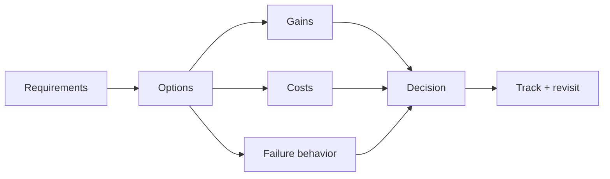

# Trade-Off Analysis

## 1. One-Line Definition
Trade-off analysis is the discipline of making architecture decisions by naming what you gain, what you give up, what it costs under failure, and what would have to be true otherwise — instead of picking a component because it's fashionable.

## 2. Why Do We Need It?
There is no free lunch in systems: stronger consistency costs availability, cache lines cost staleness, durable writes cost latency, microservices cost distributed complexity. A design that ignores trade-offs usually inherits them anyway — invisibly, in the worst corner (a "fast" write path that silently loses data; a "simple" monolith that can't take an outage). Explicit trade-off analysis keeps every choice a *decision* with an owner and a rationale, which is also exactly what interviewers and senior reviews test for.

## 3. Simple Intuition
Buying a car means trading: fuel economy vs power, price vs features, warranty vs cool factor. Nobody buys "the best car"; they buy the car that best matches their priorities. A great architect behaves like a buyer who can *name* the priorities: "for this product, latency beats freshness, so we cache aggressively and accept seconds of staleness, because X, and when stale is unacceptable we do Y instead."

## 4. What Happens Without It?
Teams adopt technologies "because they're standard", then discover the hidden cost at the worst time: the consistent DB that can't take brief partitions, the "fast" in-memory layer that is actually the source of truth and loses data, the microservice fleet that multiplies every deploy into a coordination problem. Worst of all, decisions made implicitly are hard to revisit — nobody remembers why each piece exists, so the architecture fossilizes.

## 5. Core Idea
A repeatable trade-off analysis frame:
1. **Name the requirement** being served (latency? availability? cost? time-to-market?) — the decision must connect to a requirement, not to taste.
2. **List the options** — including the non-choice (do nothing, keep the current design).
3. **Name what each gains** and **what each gives up** — a two-column cost: the happy path and the failure path.
4. **Find the hidden coupling** — every trade-off has side effects: opting for eventual consistency affects retries, compensation, and reporting; opting for sharding affects every global query (see [[sharding|Sharding]], [[consistency|Consistency]]).
5. **State the decision rule** — "we choose X because the failure mode we must survive is Y, and X makes Y cheap". This is what surviving senior scrutiny looks like.
6. **Revisit it** — when load, requirements, or operational maturity change, a recorded decision that no longer fits is a landmine (this is why recorded-then-reviewed beats unrecorded).

## 6. Important Terminology

| Term | Simple Meaning |
|------|----------------|
| Non-functional requirement | The "how well" that trade-offs are judged against |
| Constraint | A non-negotiable (cost cap, compliance, latency budget) |
| Opportunity cost | What you can't do because you chose X |
| Blast radius | How far a failure of this choice reaches |
| Hidden coupling | A side effect of a choice in another dimension |
| Decision rule | The test that separates acceptable from unacceptable |
| Reversible vs irreversible | How expensive it is to undo the decision |
| YAGNI | "You aren't gonna need it" — resisting speculative complexity |

## 7. Basic Architecture



## 8. Request or Data Flow
1. A requirement appears (e.g., "reads must be <50ms at 5k QPS").
2. Options are listed (cache, read replicas, in-memory compute, bigger hardware).
3. Each option is scored on gains (latency), costs (staleness, write cost, money), and failure behavior (cold-start stampede? lag windows?).
4. The decision rule is applied — only the options whose failure mode is acceptable pass.
5. The chosen option is implemented with its trade-off recorded, monitored, and scheduled for review when load changes.

## 9. Practical Example
**News feed reads (assumptions):** 20:1 read/write ratio; feed must render in 150ms.
- Option A: read replica pool. Gains: no staleness beyond ms. Costs: DB cost, connection pool. Failure: replica lag at peak, p95 grows.
- Option B: Redis cache with write-through invalidation. Gains: sub-10ms, absorbs spikes. Costs: invalidation bugs, cold-start stampede, staleness under write bursts.
- Option C: fixed fan-out precompute (see [[fanout-and-aggregation|Fan-Out/Fan-In]]). Gains: reads are pure cache-hits. Costs: latency to *produce* a post, requires per-user stores.
- Decision rule: "most users see new posts within seconds; rendering must be fast and cheap at peak." → B as primary with A as fallback; precompute only for hyper-active users. The recorded answer states exactly which failure ("a spike with cold cache") it absorbs and how.

## 10. Scaling
Trade-offs change with scale, so analysis is load-dependent: a monolith that was "obvious" at 100 DAU becomes a burn-risk at 10M (see [[monolith|Monolith]], [[microservices|Microservices]]); eventual consistency that was invisible becomes visible when reporting and money cross service boundaries; caching that was free becomes an operational system. Scaling reviews every recorded decision and marks the ones whose assumptions (traffic shape, latency budget, team size) were breached.

## 11. Reliability and Failure Scenarios

| Failure | What Happens | Detection | Recovery | Trade-off |
|---------|--------------|-----------|----------|-----------|
| Chosen option fails at peak | The exact anticipated cost | Golden signals | Intermediate fallback (option B→A) | Fallback systems must exist |
| Assumption drifted (QPS changed) | Recorded decision no longer fits | Review cadence | Re-run the analysis | Review cost |
| Hidden coupling fires | Side-effect outage (cache→stale money) | Cross-domain metrics | Explicit compensation | Often invisible pre-incident |

## 12. Consistency and Correctness
Most painful trade-offs are consistency-shaped: strong vs eventual is the classic "gain speed, lose reading-your-own-writes-momentum" pair (see [[strong-vs-eventual-consistency|Strong vs Eventual Consistency]], [[cap-theorem|CAP Theorem]]). The discipline says: when you trade away strong consistency, name *which* guarantee survives (eventual, read-your-writes, monotonic) and which consumer is allowed to rely on it — staleness that leaks into auth or money paths is a consistency-and-correctness bug, not a queueing artifact.

## 13. Performance
Performance is usually the currency being traded: every "gain latency" option spends coherence, durability, money, or complexity. The analysis must therefore include a **latency budget** (see [[latency-vs-throughput|Latency and Throughput]]) and count the p99, not just the median — a cache that is fast at p50 and catastrophic at p99 (cold stampede) is a poor trade even when it feels quick.

## 14. Security
Security is a non-negotiable side of trade-offs: "less validation for speed", "cache shared across tenants", "raise caching TTL for freshness" are each a security trade-off. Rule: security-sensitive reads must not be the thing you trade for latency — if a trade-off weakens auth, isolation, or audit, it is a decision that itself requires sign-off (see [[authentication-vs-authorization|Authentication vs Authorization]], [[tenancy-and-cells|Multi-Tenancy and Cell-Based Architecture]]).

## 15. Trade-Offs

| Choice | Gains | Costs | Decision Rule (example) |
|--------|-------|-------|--------------------------|
| Cache hot reads | Latency, peak absorption | Staleness, invalidation, cold-start | "Stale by <10s is acceptable for this view" |
| Read replicas | Read scale | Money, lag windows | "Writes-to-read spread of <1s is fine" |
| Async processing | Fast request path | Delayed visibility, retry story | "The user doesn't need the result 'now'" |
| Sharding | Write/storage scale | Query complexity | "Hot operations stay single-shard" |
| Microservices | Team-scale, independence | Network, ops, consistency | "≥3 teams will own this independently" |
| Exactly-once effect | No duplicates | Latency, complexity | "A duplicate here is a money error" |

## 16. Common Mistakes
- Choosing a technology before writing down the two options and their costs — "we used Kafka because..." is not an analysis.
- Ignoring the *failure path* of the choice — every option must also be scored "what happens when this dies at peak?".
- Expanding scope: keeping requirements vague so the analysis can't be judged ("make it scale").
- Treating reversible decisions as irreversible and vice versa — spending months of analysis on something a feature flag could undo (see [[feature-flags|Feature Flags]]).
- Forgetting the recurrence rule: decisions made once must be re-run when assumptions change.

## 17. HLD vs LLD Boundary
HLD: the option matrix and decision rules at the architecture level (consistency model, cache topology, deployment strategy, coupling). LLD: the same discipline at code level — which data structure, which algorithm, which interface — but the frame (name options, name costs, name the failure path, record) is identical.

## 18. Interview Questions

### Beginner
- Give one example of a classic system-design trade-off and defend both sides.
- Why must every component choice answer to a named requirement?

### Intermediate
- You need fast reads that can be briefly stale. Walk options, costs, and the decision rule.
- How do you decide between upgrading one big machine and adding more small ones?

### Advanced
- A recorded trade-off you made six months ago now fails at peak. What is your revisiting process?
- Design a decision framework an org can follow so architecture choices are comparable across teams.

## 19. Interview Memory Summary

> [!abstract]- Interview Memory Summary

### Remember

- Every choice: name the gain, the cost, and the failure behavior.
- Connect every decision to a requirement; vague requirements → undecidable analysis.
- Include the non-choice (accept current design).
- Failure path matters as much as happy path.
- Watch hidden couplings (consistency, durability, security) that leak into other dimensions.
- Record and revisit: decisions have a shelf life set by assumptions.
- Reversible decisions deserve quick analysis; irreversible deserve care.

### 30-Second Explanation

For each decision, list options, score them on gains, real costs, and failure-at-peak behavior, apply an explicit decision rule tied to a requirement, record it, and schedule a review — so every component is a justified, reversible-when-wrong choice rather than a fashion.

### Interview Traps

- Technology-first answers ("use Kafka" with no problem it solves).
- Discussing only the happy path of the chosen solution.
- Claiming a choice is "obviously right" for the wrong requirement.
- Ignoring that consistency, durability, and security are the dimensions that leak.

### Key Trade-Off

The entire discipline is that every architecture dollar spends at least one other property — the quality of an architect is measured by being explicit about which dollar bought which requirement and which property was consciously spent.

## 20. Related Concepts

### Prerequisites

- [[system-design-fundamentals|System Design Fundamentals]]
- [[functional-vs-non-functional-requirements|Functional vs Non-Functional Requirements]]

### Commonly Used Together

- [[capacity-estimation|Capacity Estimation]]
- [[latency-vs-throughput|Latency and Throughput]]
- [[availability|Availability]]
- [[scalability|Scalability]]

### Alternatives

- [[bottleneck-identification|Bottleneck Identification]] (the evidence that picks which decision to make)

### Advanced Concepts

- [[cap-theorem|CAP Theorem]]
- [[strong-vs-eventual-consistency|Strong vs Eventual Consistency]]
- [[monolith|Monolith]] vs [[microservices|Microservices]]

## 21. References
Standard system-design syllabi (Alex Xu *System Design Interview*, Grokking) for decision frames; CAP/PACELC literature; Werner Vogels on effectively-once and event-driven trade-offs. Current cloud pricing documents make the cost side concrete — re-verify before relying.

## 22. Active Recall

Test yourself before revealing each answer.

> [!question]- Why must a trade-off be tied to a named requirement?
> Without a requirement, there is no test for which option is better — "scalable", "fast", and "simple" are undecidable adjectives. With "reads under 50ms at 5k QPS", a cache beats a replica, but with "zero stale data on the money path", it loses. The requirement is the decision rule's foundation.

> [!question]- What's the difference between scoring the happy path and scoring the failure path of an option?
> Happy-path scoring says "cache hits are 1ms" — that's the marketing. Failure-path scoring asks "what happens at peak with a cold cache?" (a stampede that craters the DB), "what happens if invalidation has a bug?" (stale money). Options are only comparable when you score both — most architecture regrets are happy-path decisions.

> [!question]- Give an example of a hidden coupling between two dimensions.
> Choosing eventual consistency for a money path silently couples to retries, compensation logic, and reconciliation — a "latency" decision that becomes an "accounting correctness" decision. Or: caching shared keys across tenants couples a "performance" choice to a "tenant isolation" security choice. Hidden couplings are the expensive part of trade-offs.

> [!question]- How do you decide whether a decision needs deep analysis before this decision?
> Measure reversibility: if a feature flag, a config flip, or a day of work undoes it, decide fast and move on. If the choice is structural — the data model, the consistency contract, the coupling, the deployment topology — it's expensive to undo and deserves the full frame: options, costs, failure behavior, decision rule.

> [!question]- Interview scenario: "make our service scale" is the only requirement you're given. What do you do?
> Turn the vague goal into judgeable numbers first: what band of QPS, what latency budget, what availability target, what cost envelope? Then, each option (bigger machine vs replicas vs shards vs queues) is scored against those numbers, its failure path scored too, and a decision with a recorded rule comes out. If the interviewer won't give numbers, state the assumptions and proceed — an assumption-laden analysis is better than a slogan.

> [!question]- When does a once-correct trade-off become wrong, and what's the signal?
> When its assumptions drift: traffic shape changes (reads → writes), latency budgets tighten, team size crosses a coupling threshold, or operational maturity arrives/languishes. The signal is either the change itself or an incident in the failure path it was supposed to absorb — which is why recorded decisions with their decision rules and a review cadence beat tribal memory.

## 23. When Should I Use This?

### Use it when

- You're about to pick a component, pattern, or topology that commits the design (cache, queue, shard, service split, consistency model).
- A requirement (latency, availability, cost) has a number attached and several ways to meet it.
- Your design must survive senior review or an interview — "here are my options and my rule" is the standard of evidence.
- A recorded decision is past its review date or an assumption changed.

### Avoid it when

- The decision is trivial and fully reversible — analysis there is waste; decide and move on.
- The requirement is so vague that no option could fail the test — nail the requirement first.
- You'd be analyzing "fashion" choices with no problem statement — that's the trap, not the discipline.

### What problem does it solve?

It turns architecture from taste into evidence: every component maps to a requirement, every choice states gains and costs including the failure path, hidden couplings are surfaced, and decisions are recorded and re-reviewable — so designs are defensible, comparable, and able to bend when assumptions change.

### What problem does it NOT solve?

It doesn't produce "correct" trade-offs (the numbers you feed it decide that), it can't substitute for operating the system (a recorded decision is only as good as the monitoring that proves it still holds), and it doesn't protect a design whose underlying data or business understanding is wrong.

## 24. Decision Connections

Decisions that go together with trade-off analysis:

- [[functional-vs-non-functional-requirements|Functional vs Non-Functional Requirements]] — the requirements every decision rule is anchored to.
- [[capacity-estimation|Capacity Estimation]] — the numbers that make options comparable.
- [[latency-vs-throughput|Latency and Throughput]] — the performance currency most trade-offs spend.
- [[cap-theorem|CAP Theorem]] — the canonical "cannot have all three" frame for consistency trade-offs.
- [[scalability|Scalability]] — the growth axis that most decisions are trading for.
- [[availability|Availability]] and [[reliability|Reliability]] — the quality axis trade-offs must protect.
- [[monolith|Monolith]] / [[modular-monolith|Modular Monolith]] / [[microservices|Microservices]] — the classic coupling trade-off at the heart of many analyses.

Decision tree:

```
A decision is on the table
    |
    +-- Fully reversible by a flag / day of work?
    |      → decide fast, move on
    |
    +-- Structural, costly to reverse?
    |      → name the requirement (with numbers)
    |      → list options (include the non-choice)
    |      → score gains AND failure-at-peak costs
    |      → apply the decision rule
    |      → record it + review date
    |
    +-- Which dimension is it really about?
    |      → latency? → [[latency-vs-throughput|Latency and Throughput]]
    |      → consistency? → [[cap-theorem|CAP Theorem]]
    |      → growth? → [[scalability|Scalability]]
    |      → coupling? → [[modular-monolith|Modular Monolith]] vs [[microservices|Microservices]]
```