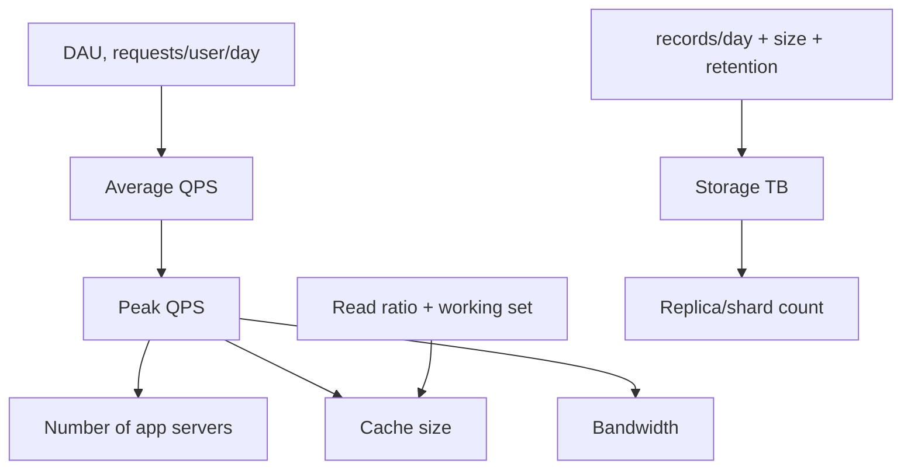

# Capacity Estimation (Back-of-the-Envelope)

## 1. One-Line Definition
Back-of-the-envelope capacity estimation turns rough assumptions (DAU, QPS, record sizes) into approximate numbers for servers, storage, bandwidth, and cache size using simple arithmetic and known constants.

## 2. Why Do We Need It?
Interviewers and architects estimate because the architecture depends on the numbers: 1k QPS and 100k QPS lead to totally different designs. Estimation is not prediction — it is a sanity check that your component choices (replicas, shards, cache size, CDN, regions) are at least in the right ballpark.

## 3. Simple Intuition
Before building a stadium, you don't need the architect's blueprints — you need a rough check: 80,000 seats, each person about half a square metre, that's ~40,000 m² plus aisles and exits. Rough arithmetic first; fine design second. Same for systems.

## 4. What Happens Without It?
You guess "we'll need load balancing and sharding" with no size, choose wrong tiers (cache too small, DB undersized, bandwidth overkill), or massively overpay. During design reviews, the first question after "how many users?" is "so how much QPS/storage?" — no answer means no architecture.

## 5. Core Idea
The estimation recipe:

1. **Audience size:** DAU → MAU (often 3-10x DAU). Convert DAU to QPS:
   - `QPS = DAU × median requests per user per day / 86,400`
   - Example: 10M DAU × 20 req/day / 86,400 ≈ 2,315 QPS average.
2. **Peak factor:** peak QPS = average × factor (2-10x depending on product; assume 3-5 for the general internet, more for event-driven spikes).
3. **Read/write split:** most products are read-heavy (10:1 or 20:1) — that drives cache + replicas.
4. **Storage:** `records/day × bytes/record × retention days`. Include growth (× 1.2-2x/yr is common; data doubles).
5. **Bandwidth:** `QPS × bytes/response`; scale up with video/images. In bits: `QPS × size × 8` → bps.
6. **Memory/cache:** cache the hot subset: `read QPS × time-you-want-to-serve-from-cache × bytes` or `% of working set that is hot`.
7. **Server count:** `peak QPS / QPS-per-server` + headroom, e.g., server handles 1k sustained QPS → 10k peak → ~10-15 nodes (leaving 30% headroom).

**Constants to remember:** 1 day = 86,400 s; 1 M = 10^6; 1 G = 10^9; 1 TB = 10^12 bytes (approx) ; 1 million requests/day ≈ 11.6 QPS.

## 6. Important Terminology

| Term | Simple Meaning |
|------|----------------|
| DAU / MAU | Daily / monthly active users |
| QPS / TPS | Queries / transactions per second |
| Peak factor | Ratio of peak to average QPS |
| Read/write ratio | Reads per write (drives replication/cache) |
| Working set | The data actually touched by users in a time window |
| Headroom | Extra capacity beyond expected peak (20-50%) |
| Retention | How long data is kept |
| Growth | Yearly rate of data/usage increase |

## 7. Basic Architecture (Estimation → Tier Sizing)



## 8. Request or Data Flow
Estimation is done **before** the boxes are drawn. Each number feeds a tier:
- QPS → number of app nodes and LB.
- Read ratio → cache + replicas.
- Bytes/record + retention + growth → DB storage, shard count.
- Response bytes × peak QPS → outbound bandwidth → CDN need.

## 9. Practical Example
**Twitter-ish feed (assumptions):** 100M MAU, ~50M DAU, each user 10 timeline reads and 2 posts/day.
- Reads QPS = 50M × 10 / 86,400 ≈ 5,787 QPS; peak ≈ 20k QPS.
- Writes QPS = 50M × 2 / 86,400 ≈ 1,157 QPS; peak ≈ 4.6k QPS.
- Post size 2 KB → storage/day = 100M posts × 2 KB = 200 GB/day → ~73 TB/year; with replica ×3 ≈ 219 TB.
- Media in object storage (CDN-backed), metadata in DB.
- Timeline reads are the hot path → cache popular timelines + fan-out into per-user feeds.

## 10. Scaling
Estimation identifies *where* to scale:
- **Read scaling:** replicas/cache absorb most traffic (10:1 reads).
- **Write scaling:** if writes grow, shard by user ID; estimate shard count = `projected storage per year / comfortable per-shard size`.
- **Storage:** tier — hot in SSD, warm in object storage, cold archived.
- **Cache size:** hot-working-set estimate (e.g., 20% of homes fetched daily) → memory requirement per edge/region.
- **Bandwidth:** video at 3 Mbps × peak viewers → CDN egress — usually the deal-breaker number for media products.

## 11. Reliability and Failure Scenarios
Estimates must include failure headroom: N+1 replicas, redundant LB, and a DR site. Failure costs scale with the gap between estimate and reality — underestimating peak (Super Bowl, flash sale) saturates tiers and causes cascade outages. Always validate estimates with load tests before launch spikes.

## 12. Consistency and Correctness
Capacity estimates should not assume you can read the primary for everything (that caps at primary capacity). If strong consistency is required per request, the **primary** hosts those reads — that is usually a bottleneck and forces a decision: relax consistency for the bulk of reads, or split those reads into their own strongly-consistent store.

## 13. Performance
Estimates tie to budget: latency budget per hop (DNS 10-50 ms, TLS handshake, app 50-200 ms, DB 5-30 ms in-region). Throughput per instance (an app server realistically handles hundreds to a few thousand QPS) converts system QPS into node counts with headroom.

## 14. Security
Capacity planning accounts for attack traffic: rate-limiting, WAF, and DDoS scrubbers must handle the peak × a multiplier. Never size for "normal" only.

## 15. Trade-Offs

| Choice | Advantages | Disadvantages | When to Use |
|--------|------------|---------------|-------------|
| Over-provision | Absorbs spikes | Wastes money | Cheap infra, unpredictable |
| Right-size + autoscale | Efficient | Can lag spikes | Predictable growth |
| Aggressive caching | Massive read capacity | Staleness, cold-start | Read-heavy, hot keys |
| CDN offload | Kills egress cost + latency | Not dynamic, purge lag | Static/media |
| Archive tiering | Cheap storage | Cold access latency | Old, rarely read |

## 16. Common Mistakes
- Forgetting the **peak factor** — an average-QPS-based design melts at launch.
- Mixing MB and Mb (bytes vs bits) — bandwidth is usually bits!
- Ignoring **replication multiplier** and growth — 2 TB/yr becomes 6 TB stored with 3 replicas and doubles yearly.
- Guessing request counts without sanity: "each user makes 1000 requests/day" is absurd; cross-check totals (1000 × 50M DAU = a huge number).
- Presenting estimates as facts — always state assumptions.

## 17. HLD vs LLD Boundary
Capacity math is HLD — tier sizing, node counts, shard numbers, cache RAM. LLD is per-instance tuning (thread pool sizes, connection pool settings, index choice) which *uses* the HLD numbers.

## 18. Interview Questions

### Beginner
- How do you go from DAU to QPS?
- Why use 86,400 (seconds/day) in these calculations?

### Intermediate
- Estimate storage for a 5-year photo backup service with 2M DAU.
- How many servers do we need for 100k peak QPS if one server sustains 2k QPS?

### Advanced
- Estimate cache size and CDN egress for a video service with 10M DAU.
- What assumptions would you revisit after the first month of production data?

## 19. Interview Memory Summary

> [!abstract]- Interview Memory Summary

### Remember

- DAU × requests/day ÷ 86,400 = average QPS.
- Peak = average × 3-10x.
- Bytes × records × retention × replicas × growth = storage.
- QPS × bytes = bandwidth (bits, not bytes!).
- Always state assumptions + headroom.

### 30-Second Explanation

Turn audience → QPS → peak → nodes/cache/storage/bandwidth; sanity-check every total.

### Interview Traps

- Using GB and Gb interchangeably in front of an interviewer, or ignoring the replication multiplier — two classics that sink otherwise-fine estimates.
- Forgetting the peak factor — an average-QPS-based design melts at launch.
- Mixing MB and Mb (bytes vs bits) — bandwidth is usually bits!
- Guessing request counts without sanity-checking totals (1000 requests/day × 50M DAU = absurd).
- Presenting estimates as facts — always state assumptions.

### Key Trade-Off

An estimate buys ballpark accuracy (enough to size tiers) at the cost of precision — and every number is an assumption, so a wrong assumption (peak factor, size, growth) scales the error into the whole design.

## 20. Related Concepts

### Prerequisites

- [[functional-vs-non-functional-requirements|Functional vs Non-Functional Requirements]]

### Commonly Used Together

- [[latency-vs-throughput|Latency vs Throughput]]
- [[bottleneck-identification|Bottleneck Identification]]
- [[sharding|Sharding]]
- [[caching|Caching]]
- [[cdn|CDN]]

Related planned topics (not authored yet): cache-size-estimation, cost-estimation, latency-budget.

## 21. References
"Numbers everyone should know" (Jeff Dean); Alex Xu *System Design Interview* estimation chapters. Verify current pricing/sizing with cloud provider documentation.

## 22. Active Recall

Test yourself before revealing each answer.

> [!question]- What problem does back-of-the-envelope estimation solve?
> 1k QPS and 100k QPS lead to totally different designs. Estimation is a sanity check that your component choices (replicas, shards, cache size, CDN, regions) are in the right ballpark before you commit — done from rough assumptions, not prediction.

> [!question]- How do you go from DAU to average QPS?
> QPS = DAU × median requests per user per day ÷ 86,400. Example: 10M DAU × 20 req/day ÷ 86,400 ≈ 2,315 QPS average. Then apply a peak factor (3-5x typical; more for event spikes) to size for peak.

> [!question]- Why use 86,400 in these calculations?
> It's the number of seconds in a day — DAU × requests/day is a daily total, and dividing by seconds/day converts it to a rate (requests per second). 1 million requests/day ≈ 11.6 QPS.

> [!question]- How do you size storage for a 5-year photo backup service?
> Storage = records/day × bytes/record × retention days, then multiply by replicas and growth. Per-file bytes matter (a photo MBs), retention = 5 × 365 days, replicas ×3 for durability, and growth ×2/yr is common — small assumptions multiply fast, so state each one.

> [!question]- How many servers do you need for 100k peak QPS if one server sustains 2k QPS?
> 100,000 ÷ 2,000 = 50 servers, plus headroom (typically 20-50%) → ~65 servers (or ~10-15 if your actual peak is 10k). Always leave headroom so the design survives the peak without saturating.

> [!question]- What goes wrong if you ignore the replication multiplier or mix bytes with bits?
> 2 TB/yr of raw data becomes 6 TB stored with 3 replicas, and doubles yearly with growth — ignoring that undersizes storage badly. Mixing MB and Mb flips bandwidth by 8x: bandwidth is usually measured in bits (bps), so QPS × size × 8 → bps.

> [!question]- Interview scenario: a video service with 10M DAU — which estimate is usually the deal-breaker?
> Bandwidth (CDN egress): video at ~3 Mbps × peak concurrent viewers. It routinely dwarfs compute and storage costs for media products, and it's what you must size the CDN and egress budget against. Memory/cache sizing for the hot working set is second.

> [!question]- Your design was built on average QPS and melts at launch. What did you skip and how do you fix it?
> The peak factor: average-QPS-based design saturates every tier at a 3-10x spike (Super Bowl, flash sale). Fix: load test to validate before launch spikes, dimension for peak × a multiplier, and keep N+1 redundancy for failure headroom — estimates must include failure headroom too.

## 23. When Should I Use This?

### Use it when

- You start any HLD interview: DAU → QPS → peak → nodes/cache/storage/bandwidth.
- You must choose between tiers (cache vs replicas) and the read/write ratio decides it.
- You need shard counts, cache RAM, CDN egress, or server counts and have rough assumptions.
- You want to sanity-check an existing design ("is 50 servers plausible?").

### Avoid it when

- You need precision, not ballpark — estimation is not a budget (costing needs real sizing).
- Latency-per-hop matters more than capacity (use a latency budget instead).
- You're tempted to present the numbers as facts — estimates without stated assumptions mislead.

### What problem does it solve?

Problem: "we'll need load balancing and sharding" with no size picks wrong tiers (cache too small, DB undersized, bandwidth overkill) or massively overpays — and in reviews "how many users?" demands a follow-up "so how much QPS/storage?" with no answer meaning no architecture. Solution: a recipe (DAU → QPS → peak → storage/bandwidth/nodes) producing ballpark numbers that bound the design.

### What problem does it NOT solve?

It doesn't decide *which* bottleneck to fix (that's bottleneck identification), it doesn't design latency performance (latency budget + tracing), and it can't forecast real costs or a precise working set. Estimates only work if the assumptions are sane — validated later against production data and load tests.

## 24. Decision Connections

Decisions that go together with capacity estimation:

- [[functional-vs-non-functional-requirements|Functional vs Non-Functional Requirements]] — the NFR numbers are the input to every estimate.
- [[latency-vs-throughput|Latency vs Throughput]] — QPS targets and latency budgets that estimates must feed.
- [[bottleneck-identification|Bottleneck Identification]] — estimates give expected ceilings; measurement finds where reality diverges.
- [[sharding|Sharding]] — estimated storage/write QPS decides shard count and key choice.
- [[caching|Caching]] — the hot working set estimate sizes cache RAM.
- [[cdn|CDN]] — peak egress (bits/sec) decides CDN strategy and bandwidth costs.
- [[database-replication|Database Replication]] — the replication multiplier turns raw storage into stored capacity.

Decision tree:

```
Estimate capacity for a system
    |
    +-- Start from audience?
    |      DAU × requests/day ÷ 86,400 → average QPS
    |      average × peak factor (3-10x) → peak QPS
    |
    +-- Size the tiers
    |      +-- App servers:      peak QPS ÷ QPS-per-server + headroom
    |      +-- Storage:          bytes × records × retention × replicas × growth → [[sharding|Sharding]] decision
    |      +-- Cache:            hot working set → [[caching|Caching]] RAM
    |      +-- Bandwidth:        peak QPS × bytes × 8 (bits!) → [[cdn|CDN]] decision
    |      +-- Reads vs writes:  10:1 ratio → read replicas via [[database-replication|Database Replication]]
    |
    +-- Validate?
           → [[bottleneck-identification|Bottleneck Identification]] after launch, load tests before spike
    +-- Targets come from?
           → [[functional-vs-non-functional-requirements|Functional vs Non-Functional Requirements]]
```