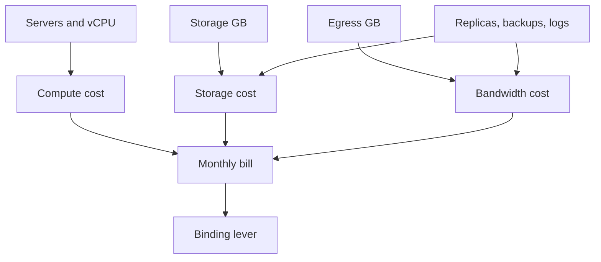

# Cost Estimation

## 1. One-Line Definition
Cost estimation attaches real prices to a capacity plan — compute × instance price, storage × tier price, egress × byte price — to turn QPS and node counts into a monthly operating bill and expose which component actually drives the money.

## 2. Why Do We Need It?
Scale decisions are really price decisions: sharding, CDNs, multi-region replicas, and cache tiers each trade money for capability. An interview or review that ends at "17 servers" has not ended — the follow-up is always "and what does that cost?" because a design that is architecturally perfect and financially impossible is not a design. Cost estimation is how you catch the hidden levers: one region, one egress-heavy piece, or one replication factor is often half the bill.

## 3. Simple Intuition
Restaurant menu budgeting: you planned dishes (architecture) and now you price them per ingredient (compute per vCPU-hour, storage per GB-month, egress per GB out). Cheap onions but truffle oil appears once and doubles the plate — egress and replicas are your truffle oil: small in the diagram, enormous on the bill.

## 4. What Happens Without It?
The cheapest-sounding design on paper (no CDN, no replicas, single region) turns out to be the most expensive in practice because egress and peak compute dwarf everything else; or the "obviously right" design (replicas everywhere) quietly prices the company out of the feature. Without a cost line, architects argue about elegance while the money leaks through unmentioned components.

## 5. Core Idea
- **The three unit levers:** compute (per vCPU-hour / server-hour), storage (per GB-month, tiered: hot SSD > standard > archive), and egress/bandwidth (per GB out; the notorious number — several cents per GB, often exceeding storage).
- **The recipe mirrors capacity math:** start from [[capacity-estimation|Capacity Estimation]] numbers, apply per-unit prices:
  `monthly = nodes × instance-price/hr × 730 hrs + storage-GB × tier-price + egress-GB × egress-price + extra services`.
- **Turnover sources most people miss:** replicas multiply storage and egress; logs and traces grow unbilled data; backups add a full dataset copy; autoscaling bursts bill at peak widths (see [[autoscaling|Autoscaling]]); cold-start cost of serverless is per-invocation overhead on top of tenant pricing.
- **The question is always "what is the binding term?"** — run the ledger and find the 80% item; the architecture then bends around that lever (CDN to kill egress, tiering to kill storage, local cache to kill compute).
- **Classify spend:** infra (per QPS), storage (per byte retained), egress (per byte delivered) — three different growth rates; a column with a steeper growth rate than revenue is the design's expiry date.

## 6. Important Terminology

| Term | Simple Meaning |
|------|----------------|
| Unit cost | Price per vCPU-hour, GB-month, or GB egress |
| 730 hours | Rough hours in a month (24 × 30.4) |
| On-demand vs reserved | Pay per hour vs committed discount |
| Egress | Data leaving a region/provider — priced per GB |
| Ingress | Data entering — often free |
| Storage tier | Hot/standard/archive with different prices |
| Data transfer multiplier | Replicas × copy + backups + logs on top of raw |
| Unit economics | Cost per user/request/GB — the sanity check |

## 7. Basic Architecture



## 8. Request or Data Flow
1. Take the capacity output: node count, storage GB, egress GB (see [[capacity-estimation|Capacity Estimation]]).
2. Price compute: nodes × instance price × 730 hours/month.
3. Price storage: raw GB × replicas × tier price per GB-month, plus backup copies.
4. Price egress: delivered GB (peak × bytes, CDN-scaled) × egress price — usually the shocker.
5. Add extras (managed DB, logs, load balancer, monitor costs), then divide by DAU to get per-user cost for the unit-economics check.

## 9. Practical Example
**Video-preview API (assumptions):** 30k peak QPS app layer on 15 eight-vCPU instances (say $0.40/hr); 4 TB hot data × 3 replicas; 60 TB/month egress at $0.09/GB; one managed DB.
- Compute: 15 × 30 instances-visible only at peak, say ~8 avg → 8 × $0.4 × 730 ≈ $2,340/mo.
- Storage: 4 TB × 3 × $0.10/GB-mo ≈ $1,228/mo.
- Egress: 60 TB × $0.09 ≈ $5,400/mo — the binding term.
- Verdict: cut egress (CDN for thumbnails, compression) and storage stays cheap; the architecture's money decision is the CDN, not the compute.

## 10. Scaling
- **Compute scales with QPS linearly** (stateless) — the one cost that grows with success predictably; reserved/spot pricing bends it.
- **Storage scales with retention × replicas** (see [[replication-overhead|Replication Overhead]]) — the growth lever is policy, not hardware.
- **Egress scales with bytes × popularity** — viral growth exponentiates it; this is why [[cdn|CDN]] negotiation and caching are architecture decisions, not ops ones.
- **Cloud pricing curves are non-linear:** tiers, reserved commitments, and volume discounts mean unit cost *drops* with footprint — cost-per-request usually declines until a class-change (new region, new tier) steps it up.

## 11. Reliability and Failure Scenarios

| Failure | What Happens | Detection | Recovery | Trade-off |
|---------|--------------|-----------|----------|-----------|
| Autoscale storm at launch | Peak-width billing on every node | Cost anomaly alarm | HPA thresholds, commit reserved base | base cost prepaid |
| Replica added casually | Storage ×N silently | Cost line per replica | Budget per replica like hardware | fewer copies |
| Egress surprise (viral) | Bill balloons overnight | Egress meter | CDN, cache headers, compression | latency/freshness |
| Orphaned resources | Sprawling, idle pay | Cost explorer | Tagging + terminate | tagging discipline |

## 12. Consistency and Correctness
Cost math must respect the same consistency constraints as capacity: strong-consistency reads pin to primaries and multiply the serving cost; replicas added for freshness multiply storage. Garbage data (expired sessions, dead indexes) is a correctness-adjacent cost leak — retention policy is where storage spend is won and lost, and it is a design decision, not a cleanup chore.

## 13. Performance
Cost and performance trade at the edge: a larger cache buys latency at RAM price, local compute buys egress savings, and compression trades CPU for megabytes. The juncture to decide is the unit-economics table per requirement — each ms of p95 and each GB of egress has a price, and the cost estimate is where performance requirements stop being idealistic and become line items.

## 14. Security
- Breaches have a direct cost velocity: unencrypted or insufficiently-scoped egress is both a security hole and a bill multiplier (replication streams, per-tenant fan-out).
- Logging everything "just in case" balloons storage — security needs its own retention budget, sized like any other tier, not a default of "keep forever".

## 15. Trade-Offs

| Choice | Advantages | Disadvantages | When to Use |
|--------|------------|---------------|-------------|
| On-demand | No prepayment, flex | Peak-price on every hour | Unpredictable startup load |
| Reserved/commitments | 30-60% off base | Locked capacity | Stable baseline |
| CDN/edge | Kills egress + latency | Complexity, purge lag | Any bytes delivered |
| Storage tiering | Cheap cold retention | Cold-access latency | Old, rarely read data |
| Spot/serverless | Near-zero idle cost | Churn, cold starts, harder ops | Batch/stateless tails |

## 16. Common Mistakes
- Forgetting the 730-hour multiplier or pricing per-second into monthly lines incorrectly.
- Treating egress as free — the single most common cost surprise.
- Pricing storage without replicas, backups, and logs.
- Costing a single region then adding replicas without re-running the ledger.
- Confusing per-unit price with total spend; the binding term is a total, not a rate.

## 17. HLD vs LLD Boundary
HLD: node count, storage/replica tiers, egress path (CDN vs direct), retention policy, unit-economics target. LLD: specific instance families, reservation optimization, billing alerts, per-region tagging, commit math.

## 18. Interview Questions

### Beginner
- Price out compute for 10 nodes at $0.40/hr for one month.
- Why does egress often dominate a content bill?

### Intermediate
- Build the monthly ledger for a 50 TB-media app with 3 replicas and 200 TB egress.
- Which lever — compute, storage, or egress — do you attack first and why?

### Advanced
- A viral product triples egress overnight. Design the cost-mitigation architecture.
- Argue reserved vs on-demand vs spot for a new feature whose load profile you only suspect.

## 19. Interview Memory Summary

> [!abstract]- Interview Memory Summary

### Remember

- Monthly costs = compute + storage + egress; find the binding term.
- 730 hours/month, GB-tier prices, egress per GB out.
- Stand up replicas × storage, backups, logs.
- Egress is the usual shocker — CDN and caching answer it.
- Divide by DAU for the unit-economics sanity check.

### 30-Second Explanation

Take the capacity plan's node count, storage GB, and egress GB, price each at per-unit rates (compute × 730 hrs, storage × tier and replicas, egress × bytes delivered), add backups/logs, and locate the single term that is the majority of the bill. Then the architecture bends around that lever — usually the CDN/egress path.

### Interview Traps

- Quoting instance price as a monthly total without the 730 multiplier.
- Ignoring egress until the bill arrives.
- Pricing one copy of the data, not replicas + backups + logs.
- Checking the total but not the per-user unit economics.

### Key Trade-Off

Cost estimation trades a defensible monthly number for honest architecture — most designs resolve into a single binding term (almost always egress or replication), and the whole plan is either justified by, or rebuilt around, that one line item.

## 20. Related Concepts

### Prerequisites

- [[capacity-estimation|Capacity Estimation]] — the QPS/storage/egress numbers being priced.
- [[server-capacity|Server Capacity]] — node count is the compute-side input.

### Commonly Used Together

- [[cloud-infrastructure|Cloud Infrastructure]] — instance families, tiers, regions the prices index into.
- [[storage-tiering|Storage Tiering]] — hot/standard/archive is where storage spend is won.
- [[cdn|CDN]] — the egress-killer and price variable in one component.
- [[autoscaling|Autoscaling]] — burst billing shape; the cost of a spike is peak-width pricing.
- [[replication-overhead|Replication Overhead]] — the ×N storage and stream costs being tallied.

### Advanced Concepts

- [[data-residency|Data Residency]] — compliance copies multiply regions, and regions multiply cost.

Related planned topics (not authored yet): cost-per-request benchmarks, reserved-vs-spot decision tables.

## 21. References
Cloud provider pricing pages (compute, storage, egress) and CDN egress pricing are the reference source; unit numbers go stale fast, so always price from current documentation and state the date. Standard HLD sources cover the estimation recipe behind it.

## 22. Active Recall

Test yourself before revealing each answer.

> [!question]- Why is egress the usual cost shocker in a content-heavy design?
> Compute and storage grow predictably with QPS and retention, but egress grows with bytes delivered × popularity — a viral hit multiplies it overnight. It is priced per GB out (several cents), routinely rivaling or exceeding storage, and teams forget to include it because it is invisible in the architecture diagram.

> [!question]- Price compute: 10 nodes at $0.40/hr for a month.
> 10 × $0.40 × 730 hours ≈ $2,920/month. The traps: forgetting ×730 (24 × 30.4 ≈ 730 hours in a month) and costing peak instance count instead of the realistic average width.

> [!question]- Design decision: 3 replicas of 4 TB at $0.10/GB-month.
> Storage = 4 TB × 3 × $0.10 = $1,228/month just for replication copies, before backups and logs. The question the answer surfaces: is that availability/read win priced at $1.2k/mo, or should fewer/smaller replicas or tiering win?

> [!question]- Interview scenario: a product triples egress overnight. What's your cost-mitigation plan?
> 1) Put a CDN in front of bytes (negotiated egress + edge hits), 2) tighten cache headers so more requests hit the edge, 3) compress and size down payloads, 4) cap hot static at cache and move dynamic data next to users. Egress is a design lever, not an ops bill — this plan is the architecture answer.

> [!question]- Trade-off: reserved vs on-demand vs spot for a new feature.
> On-demand prices the unknown fairly but expensively; reserved cuts the stable baseline 30-60% at prepay cost; spot drops the variable tail to near-zero at eviction risk. The sensible shape is usually: reserved for the base, on-demand for the peak, spot for batch. Name the split before the bill does.

> [!question]- What is the unit-economics check and why run it?
> Monthly total ÷ DAU (or ÷ requests) gives cost per user/request — the number that determines whether the feature can ever pay for itself. An architect can defend $100k/month of infrastructure to zero decimal places and still the right question is "$0.04 per user — does the product have margin for that?"

> [!question]- Failure scenario: an autoscaling storm during launch spikes the bill 20x.
> Kind of billing is peak-width: every node autoscaled in bills for the full hour, so a 10x QPS burst at one hour costs like nights of infrastructure. Recover by right-sizing base capacity, cap autoscale to a budget ceiling, and using reserved commitments so the storm hits discounted capacity.

> [!question]- Why multiply storage by replicas, backups, and logs before comparing prices?
> Raw GB is never the stored GB: replicas × the dataset, backups × an extra full copy, logs and traces add their own tier, and growth doubles yearly. Ignoring the multiplier makes storage look 3-6x cheaper than it is, which then mis-quotes the total ledger the whole architecture was justified on.

## 23. When Should I Use This?

### Use it when

- You move from capacity math to a budget or an interview's "what would this cost" question.
- Deciding CDN vs direct egress, replica counts, storage tiers, or region count.
- Evaluating a design's unit economics against revenue per user.

### Avoid it when

- The question is pure capacity (no pricing intent) — costing prematurely distracts.
- Prices in your context change constantly and nobody has current tables.
- The design is hypothetical; cost estimates without a capacity plan are fiction on top of fiction.

### What problem does it solve?

Problem: architects optimize for elegance while the money leaks through unmentioned components — egress, replicas, backups, logs — and "correct" designs price themselves out. Solution: a three-line ledger (compute, storage, egress, plus extras) from the capacity plan, which surfaces the binding term and lets the design bend around it.

### What problem does it NOT solve?

It does not set performance targets (latency budgets do), does not decide the architecture's correctness (it only prices it), and unit prices go stale — the estimate is a snapshot of current rates, not a forecast of contract negotiations or cloud price cuts.

## 24. Decision Connections

Decisions that go together with cost estimation:

- [[capacity-estimation|Capacity Estimation]] — the node/storage/egress numbers being priced.
- [[server-capacity|Server Capacity]] — the compute-side input to the ledger.
- [[replication-overhead|Replication Overhead]] — the ×N storage and stream multiplier being totaled.
- [[cdn|CDN]] — the egress-killer; usually the single biggest cost lever.
- [[storage-tiering|Storage Tiering]] — where hot/standard/archive pricing wins storage spend.
- [[cloud-infrastructure|Cloud Infrastructure]] — instance families and regions the prices index into.
- [[autoscaling|Autoscaling]] — peak-width billing shape; cost of spikes.

Decision tree:

```
How much does this design cost?
    |
    +-- Start from the capacity plan
    |      nodes, storage GB, egress GB → [[capacity-estimation|Capacity Estimation]]
    |
    +-- Price the three levers
    |      +-- Compute: nodes × price/hr × 730
    |      +-- Storage: GB × tier × replicas + backups ([[replication-overhead|Replication Overhead]])
    |      +-- Egress:  GB out × price → [[cdn|CDN]] decision
    |
    +-- Which term dominates?
    |      +-- Egress?  → CDN + caching + compression
    |      +-- Storage? → [[storage-tiering|Storage Tiering]], retention policy
    |      +-- Compute? → reserved base + [[autoscaling|Autoscaling]] ceiling, then unit economics
    |
    +-- Sanity: cost ÷ DAU fits product margin?
           else redesign or argue for the spend
```