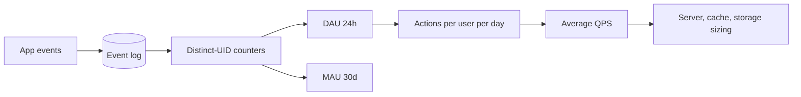

# DAU and MAU

## 1. One-Line Definition
DAU (daily active users) counts distinct users who used a product in a 24-hour window and MAU (monthly active users) counts distinct users over a trailing 30-day window; together with per-user engagement they convert an audience size into the request load that drives every capacity estimate.

## 2. Why Do We Need It?
Every HLD starts with "how many users?" — but "20 million users" is meaningless until you say active in *what period* and active *how often*. DAU/MAU are the two most common denominators interviewer and architect use to go from a product to a number: DAU × requests-per-user-per-day ÷ 86,400 gives average QPS, the root of server, cache, and storage sizing. Getting the metric wrong (saying MAU when you mean DAU, or measuring registrations instead of usage) quietly multiplies every downstream estimate in the wrong direction.

## 3. Simple Intuition
A city's transit stats: DAU is "how many people rode today", MAU is "how many different people rode at least once this month". Stickiness (DAU ÷ MAU) is "of everyone who ever shows up, how many come back daily". A metro card system with 10M riders a month but only 1M a day is a very different capacity problem than one with 9M a day — same MAU, ten times the load.

## 4. What Happens Without It?
You provision for a vanity total instead of real load. Using MAU (which can be 3-10x DAU) as your QPS base creates servers 3-10x too big — expensive but survivable. The worse failure is using *signups* or *downloads* as activity: a product can have millions of registrations and a few thousand daily active users, so your "100k QPS" design melts if it was built on registered users rather than real daily usage.

## 5. Core Idea
- **Definitions first.** DAU = distinct users with at least one "active event" (launch, page view, action) in the day; MAU = distinct users over the trailing 30 days. Both are *distinct* counts, not event counts — one user doing 100 actions counts once.
- **Stickiness ratio:** `DAU / MAU` — typically 10-50% for consumer products (higher for habitual apps like messaging/social, ~30-50%; lower for occasional tools), much higher implies strong retention. It directly converts MAU statements to daily load.
- **Engagement:** `actions per DAU per day` — the second multiplier. Social feed users may do 20-100 read actions; a weather app 2-3.
- **From audience to QPS:** `QPS = DAU × actions-per-DAU-per-day ÷ 86,400`, then a peak factor (2-5x typical) for sizing.
- **Distribution matters, not just totals:** usage concentrates in specific hours (evening, lunch, timezone peak); the *peak-hour* QPS = daily QPS spread over ~4-8 active hours instead of 24.
- **Definition discipline:** what counts as "active" must be fixed (launch? logged-in? kept a session live?). Every variant gives a different, still-valid number — state it.

## 6. Important Terminology

| Term | Simple Meaning |
|------|----------------|
| DAU | Distinct users active in one day |
| MAU | Distinct users active in the trailing 30 days |
| WAU | Weekly active users (trailing 7 days) |
| Stickiness | DAU ÷ MAU — fraction of monthly users back daily |
| Engagement | Actions per active user per day |
| Peak-hour share | Fraction of daily activity in the busiest hour |
| Cohort | A group of users tracked over time (e.g., signed up in March) |
| Retention | Fraction of a cohort still active after N days |
| Instrumentation | Logging events so activity can be counted |

## 7. Basic Architecture



## 8. Request or Data Flow
1. Client emits events (`launch`, `view`, `post`) with a user id.
2. Streaming counter dedupes by user id per window → DAU; a windowed distinct count gives MAU.
3. DAU × actions-per-user-per-day = total daily requests.
4. Total ÷ 86,400 = average QPS; apply peak factor → peak QPS.
5. Feed with DAU's per-user action mix into read/write split for cache and replica sizing.

## 9. Practical Example
**Social feed app (assumptions):** 40M MAU, stickiness 30% → 12M DAU; each DAU does 25 feed actions/day; 12M × 25 = 300M requests/day; ÷ 86,400 ≈ 3,470 avg QPS; peak factor 5x ≈ 17k QPS. If feed actions are 90% reads, reads are ~15k peak QPS (cache-first design) and writes ~1.7k. If instead the interviewer says "40M users" without period and you build for 40M × 25, you'd size ~3.3x too big.

## 10. Scaling
- **Counting infrastructure:** per-day distinct counts over billions of events need rollups — hourly/time-bucketed maps of uid sets, then unioned nightly into DAU/MAU. Streaming aggregation beats recomputing from raw logs.
- **Sampling at scale:** beyond a size, exact distinct counts get expensive; many products sample events or use approximate distinct-count structures for *internal* trending while keeping exact DAU for billing/RR.
- **World coverage:** global products get two or three timezone peaks (Asia morning, Europe evening, US evening) — DAU is one number but load has multiple interior peaks; size autoscaling to the widest peak, not the day average.

## 11. Reliability and Failure Scenarios

| Failure | What Happens | Detection | Recovery | Trade-off |
|---------|--------------|-----------|----------|-----------|
| Event double-sent | UIDs overcounted (DAU inflated) | Reconcile vs login-id set | Dedupe on user id + event id | dedupe cost |
| Counter node down | Missing window → undercount | Gap in hour rollup | Recompute from raw log replay | replay lag |
| Tracking SDK updated | Metric definition shift | Step change in graphs | Freeze definition, dual-emit both | schema complexity |
| Instrumentation bug (no events) | DAU near zero, silent | Drop alerts on counts | Fix SDK, backfill | delayed visibility |

## 12. Consistency and Correctness
DAU/MAU are counts, so correctness is about **definition consistency and dedupe**, not DB transactions. Counts must be idempotent (a retried event counts the user once), timezone-windowed consistently (UTC vs local day — pick one and document it), and device/user dedupe must hold (same person on phone + web = one distinct user via a stable user id, not device id). Version the definition: re-word the "active" rule and the number jumps even though the product didn't.

## 13. Performance
Counting is the performance driver: exact distinct counts need memory proportional to distinct users per window (hence the appeal of approximations/sampling at 100M+ scale), while *event* volume (not user volume) drives the pipeline's throughput. DAU/MAU dashboards are batch/rollup consumers — they must not read raw event logs on the hot path.

## 14. Security
- Counting must be robust to fake/scripted users inflating DAU (fraud detection on generated events); conversely valid users must not be dropped.
- Metrics are computed on personal identifiers — aggregate before publishing, constrain access to raw uid logs.

## 15. Trade-Offs

| Choice | Advantages | Disadvantages | When to Use |
|--------|------------|---------------|-------------|
| Exact distinct counts | Trustworthy, auditable | Memory/CPU scale with distinct users | Billing, investor reporting |
| Approximate/sampled counts | Constant memory, cheap | Error bars, not audit-grade | Internal trend dashboards |
| DAU as base | Reflects real load | Misses long-tail/no-login users | Most capacity math |
| MAU as base | Shows reach | 3-10x over-sizes everything | Reach/marketing context |

## 16. Common Mistakes
- Using MAU (or worse, registered users) as the QPS base — over-sizes 3-10x.
- Forgetting stickiness entirely and assuming "all of them are active today".
- Counting events, not distinct users, and calling it DAU.
- A single "average requests/user/day" hiding a 100x-variance population.
- Ignoring timezones and averaging over 24 hours when usage has sharp interior peaks.

## 17. HLD vs LLD Boundary
HLD: choosing the metric set (DAU vs MAU vs WAU), the active-event definition, engagement assumptions, and the multiplier chain into QPS. LLD: building the distinct-count pipeline, the dedupe keys, the hourly rollup jobs, and the dashboard SQL that implements a chosen definition.

## 18. Interview Questions

### Beginner
- Define DAU and MAU and the difference between them.
- How do you convert DAU into average QPS?

### Intermediate
- A product has 10M MAU and 20% stickiness: what is the DAU, and if each user makes 30 requests/day, what is peak QPS?
- Which daily total do you trust more, DAU from a device-id count or DAU from account-id count, and why?

### Advanced
- How would you count DAU exactly for 200M daily events, and when would you switch to approximation?
- Your DAU suddenly drops 40% after a new SDK release. Define your debugging path.

## 19. Interview Memory Summary

> [!abstract]- Interview Memory Summary

### Remember

- DAU = distinct users active in a day; MAU = trailing 30-day distinct.
- Stickiness = DAU ÷ MAU, typically 10-50%.
- QPS = DAU × actions/day ÷ 86,400, then peak factor.
- Count distinct users, never events, or you inflate the metric.
- Fix the "active" definition and timezone before any number means anything.

### 30-Second Explanation

Pick the daily-active denominator (usually DAU, from MAU × stickiness), multiply by a defensible per-user daily action count, divide by 86,400 for average QPS, apply a peak factor, and state the "active" definition and timezone — that chain is the audience side of every capacity estimate.

### Interview Traps

- Quoting MAU as if it were daily load — interviewer divides by 3-10x silently.
- Using signups/downloads as the activity base.
- Not stating the "active" definition when defining the metric.
- Ignoring timezone peaks and sizing for a flat 24-hour average.

### Key Trade-Off

DAU is the truthful load denominator but hides long-tail reach; MAU shows reach but over-sizes capacity — so pick DAU for sizing and keep MAU for scope, and decide which before numbers fly around the room.

## 20. Related Concepts

### Prerequisites

- [[capacity-estimation|Capacity Estimation]] — the recipe this metric feeds into.

### Commonly Used Together

- [[functional-vs-non-functional-requirements|Functional vs Non-Functional Requirements]] — DAU/MAU are the quantified audience NFR.
- [[latency-vs-throughput|Latency vs Throughput]] — once you have QPS, you set latency targets.
- [[horizontal-vs-vertical-scaling|Horizontal vs Vertical Scaling]] — what you decide once QPS is known.
- [[availability|Availability]] — audience size shapes the availability target you promise.

### Advanced Concepts

- [[oltp-vs-olap|OLTP vs OLAP]] — DAU/MAU aggregations live in the analytical side of the stack.

Related planned topics (not authored yet): acquisition funnel metrics, cohort retention.

## 21. References
Standard HLD estimation material (Alex Xu *System Design Interview* estimation chapter) for the DAU-to-QPS recipe; mobile-analytics standards for definition guidance. Verify current metric definitions with the analytics provider docs.

## 22. Active Recall

Test yourself before revealing each answer.

> [!question]- Define DAU and MAU and describe stickiness.
> DAU = distinct users with an active event in a day; MAU = distinct users over the trailing 30 days; stickiness = DAU ÷ MAU. It is the fraction of your monthly audience that comes back daily and the bridge between "how many users" statements and real daily load.

> [!question]- Why is counting events instead of distinct users a bug?
> If one user performs 50 actions, event counts score them 50 times while distinct counting scores them once. DAU/MAU are head-counts of people, so totals must dedupe on a stable user id or the metric quietly multiplies by engagement variance.

> [!question]- Interview scenario: the interviewer says "20 million users" and the product is a social app. What do you ask before estimating?
> 1. Active in what period — DAU, MAU, or registered? 2. What counts as active — launch, login, or a specific action? 3. How many actions does a typical daily user do? Then apply stickiness (20-40% for a consumer social app) before any QPS math — the answer can move the design 10x.

> [!question]- Why must the "active" definition and timezone be frozen?
> A metric is only comparable if the rule is fixed — moving from "app launch" to "logged-in action" or from UTC to local-midnight windows changes counts 20-50% with zero product change. Versioned definitions prevent every release from silently rewriting history.

> [!question]- Trade-off: exact distinct counts vs approximate counts.
> Exact gives audit-grade numbers at memory cost proportional to distinct users per window; approximation/sampling gives constant memory and cheap scaling with error bars, fine for dashboards, not for billing. Switch only when exact cost is real and the consumers can tolerate edges.

> [!question]- Your DAU drops 40% right after an SDK release. Walk the failure path.
> Check instrumentation first — a tracking change silently stops emitting events and every downstream count collapses; then check definition drift, event dedupe, and timezone window before concluding real user loss. Alerts on raw event volume catch this before the metric does.

> [!question]- 10M MAU at 20% stickiness, 30 requests per DAU per day. Peak QPS?
> DAU = 10M × 20% = 2M; daily requests = 2M × 30 = 60M; average QPS = 60M ÷ 86,400 ≈ 694; with a peak factor of 5 → ~3.5k peak QPS. If you had used MAU (10M × 30) you'd have sized ~5x larger than reality.

> [!question]- Why is the peak-hour number sometimes more useful than the day average?
> Consumers cluster activity in a few evening/lunch hours, so the busiest hour can hold 3-5x the day-average rate. Autoscaling and capacity must absorb the interior peak, not just the flat average — a single 24-hour mean under-sizes the systems 2-5x at the hour that matters.

## 23. When Should I Use This?

### Use it when

- Any HLD starts and you need an audience denominator.
- You are defining product analytics and need activity metrics that hold still.
- You must turn marketing headcount into engineering load (QPS, storage, servers).

### Avoid it when

- The load is dominated by machines, not people (cron pipelines, external feeds) — DAU is irrelevant there.
- You need real-time per-second load (use direct traffic telemetry, not daily rollups).
- Approximate order-of-magnitude is the goal and the product has no clear user-per-day denominator.

### What problem does it solve?

Problem: "20 million users" is not an engineering number — the same statement spans a 3-10x range of real load depending on period and engagement. Solution: DAU (or MAU × stickiness) plus actions-per-DAU-per-day gives a defensible request total that, divided by 86,400 and multiplied by a peak factor, seeds every downstream capacity estimate.

### What problem does it NOT solve?

It does not give you the read/write split (that's a separate workload assumption), does not forecast retention-driven growth (cohort math, not a current count), and cannot cover machine/traffic sources. It is an audience measurement, not a workload measurement — honest but narrow.

## 24. Decision Connections

Decisions that go together with defining DAU/MAU:

- [[capacity-estimation|Capacity Estimation]] — DAU × engagement ÷ 86,400 is the starting input of the whole estimation recipe.
- [[functional-vs-non-functional-requirements|Functional vs Non-Functional Requirements]] — quantified audience is the NFR that constrains every other number.
- [[latency-vs-throughput|Latency vs Throughput]] — the QPS derived from DAU sets the throughput half of the target.
- [[horizontal-vs-vertical-scaling|Horizontal vs Vertical Scaling]] — the load cone from DAU decides whether scale-out is needed at all.
- [[oltp-vs-olap|OLTP vs OLAP]] — counts are analytics; store rollups in the OLAP side, not production.
- [[availability|Availability]] — the size of the audience and its tolerance shapes the nines you target.

Decision tree:

```
"How many users?" asked in a design
    |
    +-- Period: daily load?  → [[dau-mau|DAU and MAU]] → DAU = MAU × stickiness
    |      +-- Engagement known? → DAU × actions/user/day → [[capacity-estimation|Capacity Estimation]]
    |      +-- Global audience?  → add timezone peak, size to busiest hour
    |
    +-- Reach/marketing number? → MAU, keep out of capacity math
    |
    +-- Machines not people?
           → measure traffic directly, not DAU
```