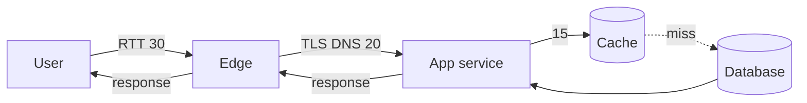

# Latency Budget

## 1. One-Line Definition
A latency budget allocates a target end-to-end response time (for example, 200 ms p95) across the hops of a request — client network, DNS/TLS, edge, app service, and database — so every component owns an explicit slice and the sum stays within the user-facing target.

## 2. Why Do We Need It?
End-to-end latency is a product promise, but nobody ships "end-to-end" — teams ship services, each adding its own milliseconds. Without a budget, services each take "whatever they need", the sum overshoots the target, and the fix is a firefight during a latency review instead of a decision made up front. A budget makes the p95 a designed number: it tells you where to spend engineering (the app service eating 100 ms is the lever), where to buy (a CDN/edge slice), and which hop is already over its allowance.

## 3. Simple Intuition
A family day-trip has a 40-minute window to catch a train: 15 min to the breakfast walk, 10 min for the traffic jam you know will happen, 10 min parking and gates, and 5 min of slack. If breakfast takes 25, the math breaks somewhere. A latency budget is that plan for a request — every hop gets an allowance, and the slack exists for reality but belongs to nobody in particular.

## 4. What Happens Without It?
Per-service "fast" engineering still misses the user target: p95 stacks silently (edge 30 ms, app 80 ms, DB 40 ms, a retry adding 200 ms) until the product visibly lags, then the fix is a panic project instead of a designed decision. Worse, without a budget nobody owns the end-to-end number, so it degrades silently for months and surfaces as user complaints instead of metrics.

## 5. Core Idea
- **Set the user-facing target first.** Rules of thumb: web interaction p95 ~200 ms feels instant, ~500-1000 ms is noticeable, over 1 s loses users; the budget starts from a product/UX decision (or an SLA — see [[sli-slo-sla|SLI / SLO / SLA]]).
- **Subtract fixed costs early:** client RTT + DNS + TLS handshake + edge/CDN round trip are mostly physics; the remainder is the serving budget for your own code, and it is usually small.
- **Split by hop with slack:** network 20-40 ms, TLS/DNS on first load, edge cache-miss 5-15 ms, app service 30-80 ms, DB/cache 5-30 ms, plus jitter. The p95 — not the p50 — is the currency; p95 runs 2-4x above the median.
- **Synchronous hops budget against the slowest chain:** a request that reads cache after DB after service *adds* latencies; a page firing five parallel calls budgets the *max*, not the sum — fan-out helps you here.
- **The budget is a contract:** each service gets an allocation, [[distributed-tracing|Distributed Tracing]] reports actuals against it, and overshoot forces a design change (cache, async, fan-in) rather than silent acceptance.

## 6. Important Terminology

| Term | Simple Meaning |
|------|----------------|
| End-to-end latency | Total time from user action to response |
| p50 / p95 / p99 | Median / 95th / 99th percentile latency |
| Budget hop | One segment of a request with an allowance |
| Fixed cost | Physics — RTT, TLS, DNS, edge round trip |
| Slack | Unallocated headroom for variance and spikes |
| Fan-out / fan-in | Parallel calls; budget is the max, not the sum |
| Tail latency | The slowest requests that dominate the p95 |
| Deadline / timeout | A hop's enforced cap, killing it at its slice |

## 7. Basic Architecture



Slices stack for a sequential request; the app service, cache, and database share the budget left after network and edge are subtracted.

## 8. Request or Data Flow
1. Fix the target: 200 ms p95 for the interactive path.
2. Subtract fixed costs: client-to-edge RTT 30, DNS/TLS 20-40 on first load. Serving budget left ≈ 130-150 ms.
3. Allocate: edge 10, app 60, cache 10, DB 20, slack 30.
4. Enforce: per-hop timeouts (DB 30 ms, downstream 50 ms) so a stalled hop costs only its slice, plus a global deadline at the edge/browser.
5. Measure with tracing; compare actual p95 per hop against the slice and rebalance the budget as a weekly engineering action, not a launch-day surprise.

## 9. Practical Example
**Search API (assumptions):** UX target p95 = 300 ms.
- Fixed: user RTT 25 ms, edge overhead 15 ms → ~260 ms left.
- Budget: auth 5, service logic 30, search backend 120, result re-ranking cache 10, response assembly 20, slack 30.
- Enforced: search-backend timeout at 120 ms (returns a degraded page rather than blowing the budget), cache timeout 15 ms, service deadline 250 ms.
- The lever: if search p95 runs 180 ms, you either shave it (precomputed results) or accept a longer global target — the budget made the trade visible before anyone shipped.

## 10. Scaling
- **Fleet width does not fix budget overshoot:** adding servers changes throughput, not per-request latency; a budget violation usually needs architecture (caching, parallelism, fewer hops), not more nodes.
- **Fan-out is the latency-scaling lever:** splitting one 200 ms serial chain into three 80 ms parallel calls cuts p95 sharply; but fan-out couples tail risk — the group's p95 is the worst child's tail, so budget the max, and hedge the loser.
- **Regions change fixed costs:** a user 300 ms RTT from your region spends the budget before reaching your code; the answer is geography ([[geo-dns-anycast|Geo-DNS and Anycast]], [[cdn|CDN]]), not code — budget fixed cost per region and allocate serving accordingly.
- **Load inflates p95 at the margins:** as utilization climbs, tail latency grows even when the median holds; the budget must be re-measured at peak load or the p95 slice silently runs over.

## 11. Reliability and Failure Scenarios

| Failure | What Happens | Detection | Recovery | Trade-off |
|---------|--------------|-----------|----------|-----------|
| One hop stalls | Its slice blows; chain overshoots | Per-hop tracing p95 | Per-hop timeout + fallback | degraded data |
| Retries stack | Budget eaten by abandoned attempts | Retry count in trace | Timeboxed retry budget | lost success odds |
| Cache cold | Miss path costs the whole slice | Miss ratio + p95 | Warm cache, accept one cold spike | warming complexity |
| Dependency melts | Every child slow; fan-out tail explodes | Child p95 alarm | Stale/cached fallback, degrade | availability vs freshness |

## 12. Consistency and Correctness
Latency budgets interact with consistency: forcing every read to the primary (strong consistency) pins traffic to a slower path and eats the DB slice; eventually-consistent replica reads fit the budget better (see [[strong-vs-eventual-consistency|Strong vs Eventual Consistency]]). Correctness here is *temporal*: a timed-out hop must not silently return a partial answer as if complete — deadline semantics (respond only with what is proven within the slice) must be explicit, and a timeout must map to defined degradation, never a silent wrong answer.

## 13. Performance
The budget is the performance contract: throughput says how much work fits the fleet, latency says whether it reaches the user in time. Tail latency dominates the p95 — hedge with parallelism, timeouts, and idempotent fallbacks (see [[retry-and-timeout|Retry, Timeout, Exponential Backoff, Jitter]]), and treat the p99-p95 spread as a design target, not an excuse.

## 14. Security
- Budgets and security trade directly: TLS handshakes, signature verification, and heavy parsing all eat slices — size the auth hop explicitly so security does not silently blow the budget.
- A global deadline is itself a security property: time-bounded handlers stop slowloris-style workers from being pinned indefinitely.

## 15. Trade-Offs

| Choice | Advantages | Disadvantages | When to Use |
|--------|------------|---------------|-------------|
| Tight p95 (200 ms) | Competitive UX | Forces caching, parallelism, bg work | Interactive core paths |
| Relaxed p95 (1 s) | Cheap, simple design | Perceived slowness | Background/admin/reporting |
| Deep per-hop budgets | Precise ownership | Admin burden, brittle to rewiring | Mature distributed systems |
| Single global budget | Simple, one owner | Nobody knows where to cut | Startups, early design |
| Fallbacks vs strict | Degrades gracefully | Freshness loss | Resilience-sensitive paths |

## 16. Common Mistakes
- Budgeting p50 while declaring p95 — the tail is where the user notices.
- Forgetting fixed costs (RTT, TLS, DNS) and discovering the serving budget was half the target.
- Summing latencies of parallel calls instead of taking the max.
- No global deadline — a long chain of "fast" hops still overruns.
- Designing the budget, never measuring it: no tracing, no per-hop actuals, no adjustment loop.

## 17. HLD vs LLD Boundary
HLD: the user-facing p95 target, hop allocations, slack, per-hop timeouts as allowances, region/edge placement. LLD: wiring a deadline into a specific RPC client, tuning one client's retry budget, choosing which exact cache read returns within its slice.

## 18. Interview Questions

### Beginner
- Break a 200 ms p95 target into network, TLS, app, and DB slices.
- Why budget the max of parallel calls rather than the sum?

### Intermediate
- Your search p95 is 900 ms though each service reports a p50 under 100 ms. Diagnose.
- A dependency eats 180 ms of a 200 ms budget. Reallocate with a trick from the budget toolkit.

### Advanced
- Design a budget that survives a "read-your-writes must hit the primary" consistency constraint.
- You must ship p95 150 ms with users 200 ms RTT away. Full plan.

## 19. Interview Memory Summary

> [!abstract]- Interview Memory Summary

### Remember

- Budget the p95, not the p50.
- Target TTL = fixed costs (RTT/TLS/DNS) + serving budget + slack.
- Sequential hops add; parallel hops budget the max.
- Each hop gets a slice and a timeout; a global deadline caps the chain.
- Measure per hop with tracing; overshoot forces design, not excuses.

### 30-Second Explanation

Pick the user-facing p95 (200 ms typical), subtract the physics — RTT, DNS, TLS, edge — and hand the remainder to your real code as slices with slack. Enforce each slice with a per-hop timeout, cap the whole chain with a global deadline, and measure actuals per hop with distributed tracing so the budget is a living contract.

### Interview Traps

- Selling p50 as "fast".
- Ignoring fixed costs until the budget is already shot.
- Summing parallel calls like serial ones.
- No deadline, so the "budget" was never enforced.
- Never validating with tracing — the design and reality drift apart.

### Key Trade-Off

A latency budget trades per-service freedom for a guaranteed user-perceived number: every hop surrenders "as fast as I want" for an explicit slice, and in return the system can prove (and defend) its p95 — the enforcement and measurement are the cost of that proof.

## 20. Related Concepts

### Prerequisites

- [[latency-vs-throughput|Latency vs Throughput]] — what a latency target is and why it trades against QPS.

### Commonly Used Together

- [[distributed-tracing|Distributed Tracing]] — the measurement loop that validates the budget.
- [[golden-signals|Golden Signals]] — latency is the first SLO this budget feeds.
- [[sli-slo-sla|SLI / SLO / SLA]] — the p95 contract the budget realizes.
- [[retry-and-timeout|Retry, Timeout, Exponential Backoff, Jitter]] — the enforcement primitives per hop.
- [[cdn|CDN]] and [[geo-dns-anycast|Geo-DNS and Anycast]] — how fixed-cost geography is bought down.

### Advanced Concepts

- [[tail-latency|Predictable Tail Latency]] — the discipline that makes the p95 small enough to budget.
- [[observability|Observability]] — the actuals platform the budget is measured against.

Related planned topics (not authored yet): deadline propagation, client-side synthetic latency budgets.

## 21. References
Standard latency references (Alex Xu, system-design course material) for per-hop numbers; product/UX latency guidance (e.g., Jakob Nielsen response-time literature) for the targets. Verify per-hop assumptions with your own tracing before committing.

## 22. Active Recall

Test yourself before revealing each answer.

> [!question]- Why is p95, not p50, the currency of a latency budget?
> The median hides the tail: a service with a 30 ms p50 can still miss a 200 ms p95 because GC, contention, and slow dependencies push the tail out 3-10x. Users feel both — but the p95 is the one that fails budgets and gets complained about, so the budget is defined against it.

> [!question]- 300 ms p95 target, 25 ms RTT, 20 ms TLS/DNS, and an edge hop of 10 ms. Serving budget?
> Fixed = 25 + 20 + 10 = 55 ms, leaving ~245 ms for app + cache + DB + slack. Subtract another ~40-50 ms of slack and you have ~200 ms across the serving hops — smaller than most engineers assume, which is exactly why you subtract fixed costs before committing to a design.

> [!question]- A page calls five services in parallel. How do you budget it?
> Budget the max, not the sum: parallel calls overlap, so the page's latency is the slowest child plus amplification of its tail. Reserve a length of the worst-child's slice, e.g., 4 slow children × 90 ms → ~90-120 ms page cost with hedging, not 4 × 90 = 360 ms.

> [!question]- Interview scenario: search API p95 = 900 ms while every service p50 < 100 ms. Diagnose.
> The tail stack: retries and timeouts cascade (each retry adds its timeout), a slow dependency inflates every fan-out child, and there is no global deadline to cut the chain. Fix with per-hop timeouts, a time-boxed retry budget, a global deadline, and tracing to name the worst child.

> [!question]- Design decision: read-your-writes reads must hit the primary inside a 200 ms budget.
> Decide the freshness exception explicitly: route only that user's own recent reads to the primary (the consistency-split), keep the rest on replicas/cache, and reserve a dedicated primary-trip slice in the budget. Doing it silently spends the whole budget on primary traffic.

> [!question]- Trade-off: synchronous accurate hops vs cached/fallback leads.
> Synchronous accurate paths cost wall-clock milliseconds the budget may not own; cached/stale responses fit the budget but trade freshness. The budget decides where degradation is acceptable — e.g., recommendations from cache within 10 ms vs fresh-recompute at 180 ms — turning a freshness decision into an allocation.

> [!question]- Why must the budget be enforced with deadlines, not just written down?
> A budget without timeouts is a wish: a slow downstream will take as long as it wants, blowing the sum no matter how carefully the slices were chosen. Per-hop timeouts guarantee each slice's worst case, and a global deadline guarantees the chain's — enforcement is what makes the budget real.

> [!question]- Failure scenario: a dependency degrades to 150 ms extra across all children.
> The fan-out max's tail inflates the whole page: series chains absorb it hop by hop, parallel pages feel it once but worse. Recover by making the child cheap (cache/stale fallback), hedging with a timeboxed attempt, cutting the chain at the global deadline, and raising the alert so the SLO case is handled — not silently extended.

## 23. When Should I Use This?

### Use it when

- You owe the user an end-to-end response time (interactive paths, APIs).
- You are deciding where caching, parallelism, or async should be applied.
- You set SLOs or SLAs and need a mechanism to guarantee the p95.

### Avoid it when

- Latency is not a product constraint (batch jobs, internal pipelines).
- A single service owns the whole path — budgeting is pointless overhead.
- You cannot measure per-hop actuals yet; a budget without tracing is fiction.

### What problem does it solve?

Problem: end-to-end latency degrades silently because nobody owns it — each service was "fast" and the sum still misses the user target. Solution: fix the p95, subtract the fixed costs, hand every hop a slice with slack, enforce each slice with timeouts and the chain with a deadline, and measure actuals with tracing so the budget is a living contract.

### What problem does it NOT solve?

It does not improve throughput (that is capacity estimation), does not lower fixed RTT/TLS costs by itself (that is edge/geography engineering), and cannot survive honestly without per-hop measurement — a budget that is never traced becomes the document that designed the wrong system.

## 24. Decision Connections

Decisions that go together with a latency budget:

- [[latency-vs-throughput|Latency vs Throughput]] — the target this budget operationalizes.
- [[distributed-tracing|Distributed Tracing]] — the measurement loop that keeps the budget honest.
- [[golden-signals|Golden Signals]] / [[sli-slo-sla|SLI / SLO / SLA]] — the contract the budget guarantees.
- [[retry-and-timeout|Retry, Timeout, Exponential Backoff, Jitter]] — the enforcement primitives per hop.
- [[cdn|CDN]] / [[geo-dns-anycast|Geo-DNS and Anycast]] — how the fixed-cost geography slice is bought down.
- [[strong-vs-eventual-consistency|Strong vs Eventual Consistency]] — the consistency-split that decides which reads may use the cheap budget path.
- [[tail-latency|Predictable Tail Latency]] — the engineering that keeps the p95 small enough to budget.

Decision tree:

```
End-to-end latency must be guaranteed
    |
    +-- Fix the user-facing p95 from the product
    |      → [[sli-slo-sla|SLI / SLO / SLA]]
    |
    +-- Subtract fixed costs: RTT, TLS, DNS, edge
    |      +-- Users far from region?  → [[cdn|CDN]], [[geo-dns-anycast|Geo-DNS and Anycast]]
    |      → handout remaining budget as slices + slack
    |
    +-- Enforce per hop: timeouts, global deadline
    |      → [[retry-and-timeout|Retry, Timeout, Exponential Backoff, Jitter]]
    |
    +-- Measure and rebalance actuals
           → [[distributed-tracing|Distributed Tracing]] vs the allocated slices
```