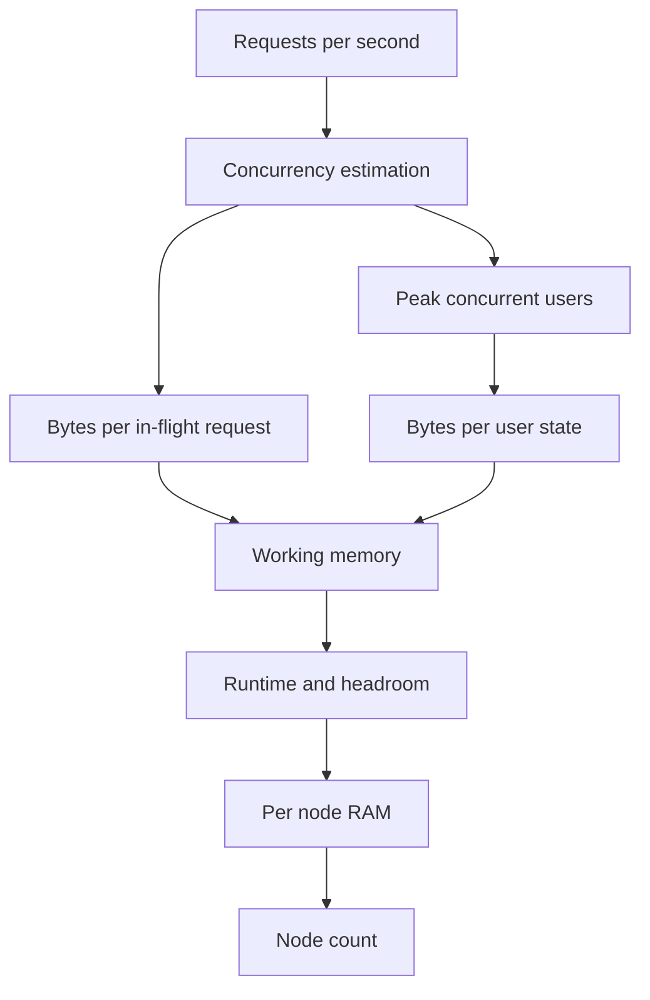

# Memory Estimation

## 1. One-Line Definition
Memory estimation computes how much RAM an application layer will need by counting per-object sizes, per-user/task allocations, connection buffers, and framework overhead, then multiplying by concurrency and adding headroom — the same arithmetic that sizes servers, caches, and in-memory stores.

## 2. Why Do We Need It?
RAM is the most expensive thing you routinely run out of. A machine that is 70% memory-bound at 5k concurrent users either needs fewer users, more nodes, or a redesign; the estimator decides which. It also sizes caches (see [[cache-size-estimation|Cache Size Estimation]]), in-memory data stores, and per-node heaps before you buy hardware — because the number of nodes you need is often "how much memory fits on one node" rather than "how much CPU".

## 3. Simple Intuition
Memory estimation is like packing for a trip: count the suitcases (objects), what you put in each (fields and overhead), how often you swap bags (concurrency and churn), and leave room to move (headroom). Under-pack and you borrow luggage mid-trip; over-pack and you pay for bags you never carry.

## 4. What Happens Without It?
Runtime surprises: the JVM/Node process OOMs at a load test you assured was fine, Redis is patched with an extra replica only to die on allocation, or "3 nodes should be plenty" turns into an all-night firefight at a predictable peak. Memory failures are disproportionately common because CPU estimates look fine while each request quietly allocates several MB of intermediate objects.

## 5. Core Idea
- **Start from working memory per request/element, not just from the heap ceiling.**
  - Numbers: an 8-char string in ASCII is ~8 B; in a managed runtime with object header, hash table, and JVM/Swift overhead, a "small" record routinely eats 100-400 B.
  - Per-user state in a stateful service: session objects, per-connection buffers (TCP buffers 4-64 KB each), sockets, WebSocket frames.
  - Cached value size = key bytes + value bytes + structure overhead + clustering/alignment.
- **The core formula:**
  `RAM = working set × bytes per item × replicas/churn factor, plus a constant for runtime, buffers, and jit/GC overhead`.
- **Per-node, concurrency drives it:** `peak concurrent requests × bytes per in-flight request` is often the biggest and most forgotten term (an 8 KB response object with JSON serialization stack can be 100 KB in flight).
- **Managed runtimes add overhead:** JVM heap layout, object headers (~12-16 B), pointers, GC headroom (often 1.2-1.5x live set), language-level boxing.
- **Churn determines average vs peak:** request-scoped garbage means bursty `bytes/sec` allocation matters more than the steady-state heap.

## 6. Important Terminology

| Term | Simple Meaning |
|------|----------------|
| Working set | Memory actively referenced in a window |
| In-flight request | A request being processed right now |
| Per-object overhead | Headers/pointers beyond the useful fields |
| Runtime overhead | JIT, GC, threads, pools, framework globals |
| Headroom | Extra RAM beyond expected peak (20-50%) |
| Churn rate | How fast objects are created/destroyed |
| Allocation rate | Bytes of new objects per second |
| Heap vs RSS | Managed heap vs all resident pages a process uses |

## 7. Basic Architecture



## 8. Request or Data Flow
1. Derive peak QPS and, from it, peak concurrency (typically QPS × average per-request latency; e.g., 10k QPS at 200 ms = ~2,000 in-flight).
2. Estimate bytes per request in memory: request DTO + serialization buffers + response assembly + per-connection overhead.
3. Add stateful per-user state if the service is stateful, plus caches hosted on the node.
4. Add the managed-runtime constant (heaps, GC headroom, thread pools) and 20-50% headroom.
5. Divide by per-node RAM to get node count — then sanity-check CPU and network, which may dominate.

## 9. Practical Example
**Message service (assumptions):** 20k peak QPS, avg latency 250 ms → ~5,000 in-flight.
- Each in-flight request holds ~50 KB of buffers/objects → 5,000 × 50 KB = 250 MB in-flight.
- 100k concurrent WebSocket connections × 16 KB socket/buffer each = 1.6 GB connection memory.
- A 128-node fleet on 8 GB RAM: framework + JVM + caches ≈ 4 GB resident per node, leaving 3+ GB usable ≈ 400+ GB fleet headroom — comfortable, so the binding constraint is CPU/network, not RAM. If rooms were held fully in memory (1M rooms × 2 KB), that adds 2 GB fleet-wide and changes the answer.

## 10. Scaling
- Memory does not scale by adding replicas for free: caches and session state replicate (see [[replication-overhead|Replication Overhead]]), so per-user/heap memory multiplies across nodes unless you shard by user.
- Stateful per-node caches shrink per-node memory as you scale out — local vs distributed cache is a memory-estimation fork.
- Managed heaps need proportional GC headroom; scaling out reduces per-heap size and GC pauses.
- Watch the "user is a number" trap: memory per user usually shrinks with scale (users share nodes), but concurrency bursts set the peak node count.

## 11. Reliability and Failure Scenarios

| Failure | What Happens | Detection | Recovery | Trade-off |
|---------|--------------|-----------|----------|-----------|
| Heap exhausts at peak | OOM kill, node restarts in a loop | Heap/GC metrics, OOM logs | Scale out, lower per-request footprint | cost |
| Memory leak | Slow RSS growth, restarts | Trend of RSS vs heap | Leak fix, canary deploy | debugging time |
| Node OOM during failover | Replicas absorb load, spike | Instance health | Pre-sized headroom for failover | extra RAM |
| Cold caches after deploy | RAM fine, cache empties → DB | Miss rates | Warming + single-flight | cache not the constraint |

## 12. Consistency and Correctness
Memory estimates must reflect the *consistency model*: replicating caches or session state across N nodes multiplies memory by N and creates inversion costs, while strong-consistency reads pin more traffic to primaries and change where memory must sit. If clients must always read their own writes, the stateful replica memory is not free to shed.

## 13. Performance
Memory and performance are joined: GC pauses and swap-bound latency are symptoms of a memory math failure, and the allocation rate (bytes/sec) sets how hard the GC works. A design can be CPU-fine and memory-miserable — always convert "bytes per request × requests/sec" into an allocation rate and compare it against what the runtime's GC can digest.

## 14. Security
- Memory explosion is a DOS vector: an attacker forces huge per-request allocations (deep nesting, giant string payloads) that blow the heap — cap request sizes and payload depth.
- In-memory caches of sensitive data require the same access control as the source; memory estimates must not amortize away the space needed for per-tenant isolation.

## 15. Trade-Offs

| Choice | Advantages | Disadvantages | When to Use |
|--------|------------|---------------|-------------|
| Bigger per-node RAM | Fewer nodes, simpler | Cost, single-node blast radius | Predictable moderate load |
| More nodes, smaller heaps | Isolation, GC pause relief | Distributed state overhead | Unpredictable peaks |
| State held in memory | Fast everything | Replication + recovery complexity | Sessions, hot caches |
| State pushed to external store | Small stateless nodes | Extra hop, latency | Scale-out-friendly |

## 16. Common Mistakes
- Estimating only the heap and forgetting connection buffers, socket state, and in-flight request objects.
- Using the *rounded* ASCII size of a string and ignoring managed-runtime overhead (pointer graph, headers).
- Forgetting headroom and failover memory (N+1 must be sized too).
- Treating average concurrency as peak concurrency.
- Ignoring allocation rate — GC dies on bursty churn even when the steady heap looks small.

## 17. HLD vs LLD Boundary
HLD: per-node RAM, concurrency-to-memory math, cache/session placement, headroom, node count. LLD: profiling a specific request for its exact object graph, tuning GC flags, choosing a serializer that allocates less.

## 18. Interview Questions

### Beginner
- Estimate the RAM for 10k concurrent WebSocket users with 16 KB buffers.
- What is the difference between heap size and actual process memory?

### Intermediate
- A service does 50k QPS at 200 ms avg latency. Estimate in-flight request memory at 80 KB each and the node count on 8 GB machines.
- When does a local per-node cache store *more* total memory than one shared cache, and when less?

### Advanced
- An in-memory feed store holds 100M feed items at ~500 B on 3 replicas. Size the cluster with headroom and argue the constraining resource.
- Your node memory doubles every month but the heap is flat. Diagnose.

## 19. Interview Memory Summary

> [!abstract]- Interview Memory Summary

### Remember

- RAM = working set + in-flight + connection buffers + runtime + headroom.
- Peak concurrency = QPS × average latency.
- Managed objects cost 2-4x their logical size in RAM.
- Allocation rate matters as much as live heap.
- Size replicas into the estimate; failover RAM is real.

### 30-Second Explanation

Convert load to peak concurrency, multiply by bytes per in-flight request, add per-user/connection state, factor in managed-runtime overhead and 20-50% headroom, then derive node count from per-node RAM. Validate against allocation rate and GC behavior because the heap you see is not the memory the system uses.

### Interview Traps

- Giving a heap number with no concurrency conversion.
- Using logical sizes (string length) instead of managed sizes.
- Forgetting connection buffers and socket memory.
- Assuming average concurrency equals peak.

### Key Trade-Off

Memory estimation trades per-node density for safety: tight sizing buys fewer, cheaper nodes but zero tolerance for bursts, leaks, and failover; generous headroom buys resilience at real cost — and both are wrong without the allocation-rate and peak-concurrency context.

## 20. Related Concepts

### Prerequisites

- [[capacity-estimation|Capacity Estimation]] — the QPS and concurrency inputs you start from.
- [[dau-mau|DAU and MAU]] — the audience that produces the concurrency.

### Commonly Used Together

- [[cache-size-estimation|Cache Size Estimation]] — cache RAM is a memory estimate with its own object model.
- [[caching|Caching]] — local vs distributed placement changes where the RAM lives.
- [[replication-overhead|Replication Overhead]] — replicating in-memory state multiplies RAM by replica count.
- [[horizontal-vs-vertical-scaling|Horizontal vs Vertical Scaling]] — the "scale RAM vertically vs nodes horizontally" fork.

### Advanced Concepts

- [[tail-latency|Predictable Tail Latency]] — GC pauses and memory churn dominate tail latency even when average memory is fine.

Related planned topics (not authored yet): heap/GC tuning notes, in-memory data store sizing.

## 21. References
Data sizes commonly cited: "Numbers every programmer should know" and its updates (Jeff Dean) for per-object byte assumptions; framework and runtime memory guides for per-request overhead. Verify with your runtime's profiling before committing to a number.

## 22. Active Recall

Test yourself before revealing each answer.

> [!question]- What is the connection between QPS, latency, and peak concurrency in memory math?
> Peak concurrency ≈ peak QPS × average request latency. At 20k QPS and 200 ms, about 4,000 requests are in flight at once — each holding its buffers and objects. Concurrency, not just QPS, is the multiplier for RAM.

> [!question]- Why does a "small" string cost 100+ bytes in a managed runtime?
> A short string carries an object header, an array length, potentially wide chars, then pointer/reference overhead when stored in collections, hash-table buckets, and alignment padding. Logical size and resident size diverge — estimate the managed layout, not the text length.

> [!question]- Interview scenario: 100k WebSocket users at 16 KB each. Fleet RAM?
> 100k × 16 KB = 1.6 GB connection memory across the fleet, before per-request buffers and heap. On 8 GB nodes that's under 2 MB per user-emitted socket when distributed, but with 10k users on one node the *node-level* math is what matters — always state the node you are sizing.

> [!question]- Failure scenario: RSS grows monthly but the heap looks flat. What's happening?
> A native leak outside the managed heap — thread stacks, Native/Meta-space allocations, socket buffers, or native cache. Heap metrics will mislead you; watch RSS vs heap and use native-profiling to find it. This is exactly the failure a heap-only estimate cannot see.

> [!question]- Trade-off: local per-node cache vs one shared cache for memory.
> A local cache replicates the same working set on every node — total memory = per-node cache × node count, which wins only when the working set is small and identical. A shared cache stores the set once and is more memory-efficient at scale, at the cost of a network hop and a distributed system.

> [!question]- Why report allocation rate alongside live heap?
> A high bytes/sec allocation churns the GC even when the live set is small — stop-the-world pauses and promotion pressure scale with allocation, not just residency. Converting requests/sec × bytes-per-request into GB/s tells you if the runtime can actually keep up.

> [!question]- Design decision: 128 nodes at 8 GB with 50% runtime overhead. How much usable RAM?
> 128 × 8 GB = 1 TB; 50% runtime + headroom leaves ~512 GB usable for working data across the fleet. Divide that by the per-item working set to sanity-check whether your in-memory store or cache fits, or whether the real constraint is elsewhere (CPU, network, egress).

> [!question]- Why must failover/replicas be inside the memory estimate?
> If N nodes run at 95% RAM, the moment one fails its peers inherit its load and OOM. Memory must be sized so the fleet survives N minus 1 — the headroom term in the formula exists exactly for that, and it's the part teams cut first under cost pressure.

## 23. When Should I Use This?

### Use it when

- Sizing application servers, caches, and in-memory stores from QPS and concurrency.
- The product has state (sessions, connections, cached feeds) that lives in RAM.
- You must choose node RAM or node count before buying hardware.

### Avoid it when

- The real constraint is CPU, disk, or network and memory is trivially ample — estimate the binding resource first.
- You need precise profiling, not ballpark sizing.
- Object sizes are tiny and the fleet is small — the overhead of the estimate exceeds what it saves.

### What problem does it solve?

Problem: systems OOM at peaks they were "sized" for, because the estimate covered the heap but not in-flight requests, connections, runtime overhead, or failover. Solution: a memory budget built from peak concurrency × per-item bytes plus state, runtime, and headroom, then validated against allocation rate.

### What problem does it NOT solve?

It does not measure real CPU/network bottlenecks (a memory-fine design can still die on CPU or egress), cannot predict leak-driven drift (that's monitoring), and is a ballpark — production profiling is required to confirm assumptions before purchase.

## 24. Decision Connections

Decisions that go together with memory estimation:

- [[capacity-estimation|Capacity Estimation]] — the QPS/concurrency that feeds every RAM term.
- [[cache-size-estimation|Cache Size Estimation]] — cache RAM is memory estimation applied to a cache key space.
- [[caching|Caching]] — local vs distributed placement decides where the memory physically lives.
- [[replication-overhead|Replication Overhead]] — replicating in-memory state multiplies the estimate by replica count.
- [[horizontal-vs-vertical-scaling|Horizontal vs Vertical Scaling]] — the fork between taller machines and more machines.
- [[tail-latency|Predictable Tail Latency]] — GC pauses from RAM churn decide whether the memory math passes on p99.

Decision tree:

```
How much RAM does this need?
    |
    +-- Working set fits one node?
    |      → vertical: bigger instance via [[horizontal-vs-vertical-scaling|Horizontal vs Vertical Scaling]]
    |
    +-- Concurrency bursts dominate?
    |      peak QPS × latency = in-flight → multiply by bytes-per-request
    |
    +-- State replicated?
    |      × replica count via [[replication-overhead|Replication Overhead]]
    |
    +-- It is a cache or hot store?
           → [[cache-size-estimation|Cache Size Estimation]]
    |
    +-- Result too big for one node?
           → horizontal scaling / [[caching|Caching]] tiering, then re-estimate
```