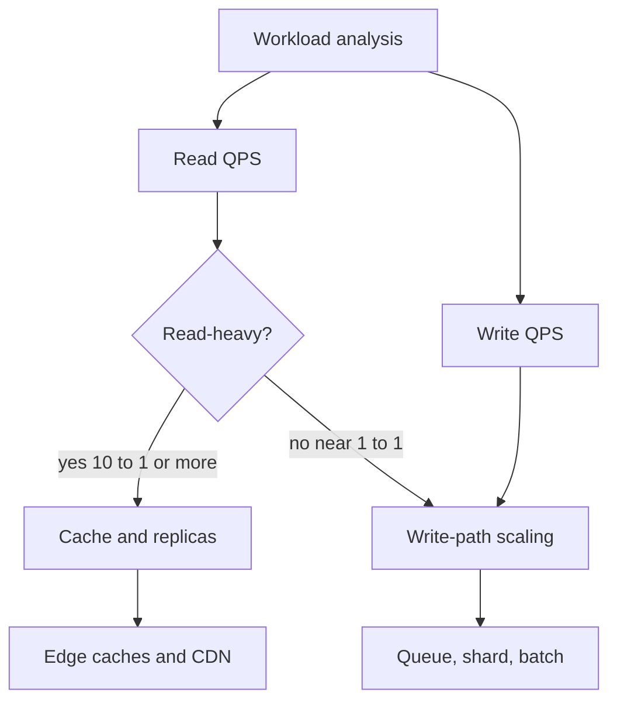

# Read/Write Ratio

## 1. One-Line Definition
The read/write ratio is the number of read operations per write operation (often stated 10:1, 20:1) in a workload, and it decides whether read scaling (cache, replicas, CDN) or write scaling (sharding, queues) dominates the architecture.

## 2. Why Do We Need It?
Most systems are dramatically read-heavy, and each read and write exercises the infrastructure differently: reads are cheap-to-serve with cache and replicas, while writes are serialized through a single source of truth and usually require durable I/O. Knowing the ratio (and the per-request mix) tells you whether the design's money goes into caching or into write-paths — designing a read-heavy product with write-side machinery is wasted complexity, and vice versa.

## 3. Simple Intuition
A restaurant menu vs a kitchen: the menu (read) gets looked at thousands of times a day but printed in the morning once; the recipe file (write) changes rarely. Compare that to a transaction log (a stock ticker) where every entry is a write nobody re-reads much. Same "users", completely different plumbing — the ratio tells you which one you are.

## 4. What Happens Without It?
You guess. A "must-have-load-balancing-and-sharding" design for a 10:1 read-heavy feed wastes sharding complexity that caching would have fixed for a tenth of the effort; or you cache a write-heavy workload and the cache misses 50% of the time while the write path still caps you. The ratio is the cheapest filter between "cache it" and "shard it".

## 5. Core Idea
- **Define it per operation path, not globally:** home feed (reads) vs posting (writes) are separate ratios; quote the read QPS and write QPS, then the ratio is derived.
- **Where does the ratio send you?**
  - Reads dominate (10:1+): cache hot reads, add read replicas, serve static at the edge, denormalize for read shape.
  - Writes dominate or equal: focus on write throughput — streaming/batching, [[sharding|Sharding]] for write scale, [[outbox-pattern|Outbox Pattern]] and queues to decouple read-side materialization.
- **Hidden amplification:** one "write" usually triggers many reads later (a post is written once, read 100 times); and one logical write produces multiple physical writes (indexes, replicas, WAL).
- **Deterministic sources skew writes:** a "read-mostly" config/catalog can still be 1:1 if clients poll it aggressively — measure refreshes, not just user actions.
- **Sizing impact:** read-heavy → cache size and replica count govern; write-heavy → storage/replication overhead and ingest pipeline govern.

## 6. Important Terminology

| Term | Simple Meaning |
|------|----------------|
| Read/write ratio | Reads per write for a workload/path |
| Read-heavy | Ratio well above 1:1 (10:1 or 20:1 typical) |
| Write-heavy | Ratio near/at 1:1 or below |
| Logical write | One user-facing mutation (a post, an order) |
| Physical write | Each index/replica/WAL update inside storage |
| Read amplification | A query rereading data built by several writes |
| Write amplification | One write touching many storage structures |
| Cold vs hot ratio | Ratio inside the hot path vs edge/rare paths |

## 7. Basic Architecture



## 8. Request or Data Flow
1. Instrument traffic or project it: reads = page views/list ops/fetches; writes = mutating calls.
2. Sum each per day. `read QPS = reads/day ÷ 86,400`, `write QPS = writes/day ÷ 86,400`.
3. Derive the ratio and compare it per path, not just in aggregate.
4. Read-heavy paths get cache + read replicas; write-heavy paths get batching/queues and, at scale, sharding.
5. Watch the hidden amplification: 1M posts/day × 30 physical writes each sets disk/CPU, independent of the friendly ratio.

## 9. Practical Example
**Video/photo sharing (assumptions):** 20M DAU; each user watches/scrolls 60 feeds a day and uploads 0.5 items.
- Reads: 20M × 60 = 1.2B/day → ≈ 13,900 avg QPS.
- Writes: 20M × 0.5 = 10M/day → ≈ 116 avg QPS.
- Ratio ≈ 120:1 — aggressively read-heavy → cache feeds, use read replicas, CDN for media; shortlist only moderate write machinery.
Each upload, though, hits object storage + metadata + a fan-out into millions of followers; the *write path* still needs a queue even though the ratio says reads.

## 10. Scaling
- **Read-heavy:** scale horizontally with cache tiers and read replicas; a 100:1 system can serve most traffic from memory/edge before the DB ever sees it.
- **Write-heavy:** reads stage on replicas, but writes cluster on the primary — the ceiling reveals itself as the ratio approaches 1:1 (every request is a write).
- **Path-wise ratios diverge at scale:** a global feed is 1000:1 while a "latest activity" stream is 2:1 — split the architecture per path instead of forcing one ratio.
- **Write amplification grows superlinearly:** more indexes/replicas per write raise physical write cost and storage; budget it separately.

## 11. Reliability and Failure Scenarios

| Failure | What Happens | Detection | Recovery | Trade-off |
|---------|--------------|-----------|----------|-----------|
| Read replicas fail | Read QPS hits cache/primary | Replica health, replica lag | Fail reads to cache, new replica | partial read degradation |
| Write path queues back up | Writes buffer, lag grows | Consumer lag metric | Scale consumers, shed or throttle | lower freshness |
| Cache fills for read-heavy path | Reads hit DB at write-only scale | Hit-ratio drop | Evict cold, resize | cache cost |
| Ambiguous ratio hides imbalance | Wrong architecture from wrong assumption | Realtime split of read vs write | Re-estimate, re-route | rework |

## 12. Consistency and Correctness
Read replicas and caches are only valid where the product tolerates eventual consistency; where users must read their own writes, route that slice to the primary (read-your-writes path). A heavy read ratio does not excuse serving stale balances or un-confirmed payments — split the ratio by freshness requirement, not just by volume.

## 13. Performance
The ratio dictates where latency is won: in a 10:1 system, shaving 10 ms off the read path saves 10x more user-facing time than optimising the write path. Write-heavy products win by batching (group commits, async flushes) since each write pays disk/network regardless. Always report the ratio with the per-path latencies it implies.

## 14. Security
- Analysing read/write per path must not leak per-user activity patterns — aggregate and anonymize.
- Write-heavy endpoints are favourite attack targets; a bot can flip a 100:1 product into a 1:1 one by flooding writes — rate-limit and authenticate write paths specifically.

## 15. Trade-Offs

| Choice | Advantages | Disadvantages | When to Use |
|--------|------------|---------------|-------------|
| Cache-first design | Huge read capacity, cheap | Staleness, cold misses | Ratio 10:1 or more |
| Read replicas | Handles read volume at DB level | Replica lag, storage cost | Ratio high, cache insufficient |
| Sharding for writes | True write/storage scaling | Cross-shard complexity | Ratio near 1:1, writes cap |
| Queues/batching for writes | Absorbs write bursts | Added latency, ordering care | Write-heavier moments |

## 16. Common Mistakes
- Quoting one global ratio when different paths differ by 100x.
- Designing write machinery (sharding, distributed txns) for a genuinely read-heavy product.
- Ignoring physical write amplification (each logical write touches indexes + replicas + WAL).
- Assuming a read-heavy ratio means the write path can be an afterthought.
- Forgetting machine-driven reads (polls, webhooks, sync clients) that can skew "reads" upward while still hammering a DB.

## 17. HLD vs LLD Boundary
HLD: measure/project read vs write QPS per path, decide cache/replica vs queue/shard, pick the consistency split. LLD: implementing the replica routing, the write batching in a DAO, buffering a specific flush loop.

## 18. Interview Questions

### Beginner
- What does a 10:1 read/write ratio imply for the architecture?
- Convert 500M reads/day and 25M writes/day into average QPS.

### Intermediate
- A chat app is 20:1 reads. Where do you put cache, replicas, and the write path?
- Your ratio is 1:1 for order placement, 100:1 for order lookup. Design the split.

### Advanced
- How does physical write amplification change your storage/replica estimates in a write-heavy system?
- A "read-mostly" config service collapses under polling traffic. Diagnose by ratio and fix.

## 19. Interview Memory Summary

> [!abstract]- Interview Memory Summary

### Remember

- Ratio = read QPS ÷ write QPS, measure per path, not globally.
- Read-heavy (10:1+) → cache + read replicas + CDN.
- Write-heavy (near 1:1) → queues, batching, then sharding.
- One logical write spawns many physical writes (indexes, replicas, WAL).
- Write paths are attack and bot targets — protect them.

### 30-Second Explanation

Split your traffic into read QPS and write QPS per path. If reads dominate, buy capacity with caches and replicas and accept a little staleness; if writes dominate, focus on the write pipeline, batching and write-scaling before adding cache. The ratio is the cheapest architectural filter you have, but only when measured per path with physical write amplification counted separately.

### Interview Traps

- Stating "10 to 1" with no per-path split in a mixed product.
- Adding sharding to fix a read problem the ratio already explains.
- Forgetting that every logical write multiplies into physical writes.
- Ignoring polls/sync clients that make "reads" load the DB.

### Key Trade-Off

The read/write ratio trades architecture for reality: read-heavy designs pay in deliberate staleness (caches, replicas) while write-heavy designs pay in complexity (queues, shards, distributed correctness) — and getting the ratio wrong pays in both.

## 20. Related Concepts

### Prerequisites

- [[capacity-estimation|Capacity Estimation]] — where read/write QPS splits are derived.
- [[dau-mau|DAU and MAU]] — the audience numbers the ratio multiplies.

### Commonly Used Together

- [[caching|Caching]] — the read-heavy lever.
- [[database-replication|Database Replication]] — read replicas absorb read QPS.
- [[database-indexing|Database Indexing]] — the write cost of extra indexes shows up here.
- [[oltp-vs-olap|OLTP vs OLAP]] — read-heavy vs write-heavy often maps to transactional vs analytical shapes.

### Alternatives

- [[sql-vs-nosql|SQL vs NoSQL]] — when write-heaviness pushes the data model choice.

Related planned topics (not authored yet): write-heavy workload reference, read-your-writes consistency.

## 21. References
Standard estimation material (Alex Xu *System Design Interview*); read/write amplification described in storage and database docs. Verify specific amplification counts with your database engine documentation.

## 22. Active Recall

Test yourself before revealing each answer.

> [!question]- What does a 10:1 read/write ratio tell you first?
> That the architecture should optimize the read path first: a cache and read replicas capture most traffic, so you don't yet need write-scaling machinery. Measure it per path though — a hidden 1:1 path (orders, activity logs) still needs its own treatment.

> [!question]- 500M reads/day and 25M writes/day. Average QPS each?
> Reads: 500M ÷ 86,400 ≈ 5,787 QPS; writes: 25M ÷ 86,400 ≈ 289 QPS. Ratio ≈ 20:1, read-heavy. Apply a peak factor (3-5x) for sizing and remember writes still serialize on the primary.

> [!question]- Why measure the ratio per path instead of globally?
> A feed product is ~100:1 overall but its "post" path is 1:1 or worse. A design built on the global ratio caches the feed correctly yet under-plans the write path; per-path ratios let each component pick cache vs queue/shard correctly.

> [!question]- What is write amplification and why does it break friendly ratios?
> One logical write becomes several physical writes: the WAL, the primary index, every secondary index, and every replica. At 5x amplification a system that "looks" 20:1 may be doing a 4:1 of real disk I/O — storage, IOPS, and replica bandwidth must be sized from physical writes, not the user-facing ratio.

> [!question]- Interview scenario: a "read-only catalog" service melts during the day. What's your first hypothesis?
> Poll/sync clients: 1000 internal calls per minute that re-read config the user never re-reads. It's read-heavy in ratio but the reads hit the same DB row on every poll. Fix by observing clients to stop polling (long-poll/SSE), caching with TTLs, or versioning so clients re-fetch on change only.

> [!question]- Trade-off: cache-first vs replica-first for a read-heavy path.
> Caches give the biggest latency/capacity win per dollar but introduce staleness and miss-storms; replicas preserve richer query patterns and stay fresher but cost storage and reproducibility of compute. Start with a cache for identical hot reads, add replicas for read volume the cache can't absorb.

> [!question]- When does sharding actually become necessary despite a high read ratio?
> When writes or total storage cap the primary: the ratio says reads but the growth is in write QPS or dataset size — the two resources replicas and caches cannot grow. At that point write QPS per shard and storage per shard, not the ratio, drive the design.

> [!question]- Why are write paths prime security targets under a ratio model?
> Bots can flood writes cheaply and flip a 100:1 product to 1:1, saturating the primary where all writes collide. Rate-limit, authenticate, and add admission control to write endpoints specifically — the read path has caches to absorb it, the write path does not.

## 23. When Should I Use This?

### Use it when

- You start any HLD and need to split reads from writes before picking machinery.
- You must choose between more cache, more replicas, or sharding.
- You size storage, IOPS, or replica bandwidth and need physical write counts.

### Avoid it when

- The workload is dominated by scheduled jobs or machine traffic where "users" don't exist.
- You need per-query detail, not a path-level ratio.
- The ratio is fought over while neither read QPS nor write QPS is even derived — get the raw numbers first.

### What problem does it solve?

Problem: architects pick load-balancing/sharding/caching without knowing the workload shape, over-engineering the wrong tier. Solution: split traffic into read QPS and write QPS per path, then route read-heavy paths to cache/replica levers and write-heavy paths to queue/batch/shard levers, with physical write amplification separately budgeted.

### What problem does it NOT solve?

It doesn't substitute for absolute QPS (a 10:1 ratio at 100 vs 1M QPS is two different designs), doesn't decide consistency or freshness windows, and can't capture variability — a ratio is an average, so bursts, viral moments, and bot floods still need load testing and headroom.

## 24. Decision Connections

Decisions that go together with the read/write ratio:

- [[capacity-estimation|Capacity Estimation]] — the recipe that produces both QPS sides of the ratio.
- [[caching|Caching]] — the primary lever when reads dominate.
- [[database-replication|Database Replication]] — read replicas for read volume beyond the cache.
- [[database-indexing|Database Indexing]] — its write cost is the "other side" of the ratio.
- [[oltp-vs-olap|OLTP vs OLAP]] — read vs write-heavy workloads often separate into transactional and analytical stores.
- [[sql-vs-nosql|SQL vs NoSQL]] — write-heavy append workloads push toward streaming/specialised stores.

Decision tree:

```
Workload is defined; split reads vs writes
    |
    +-- Reads dominate by 10x or more
    |      +-- Identical hot reads?  → [[caching|Caching]] first
    |      +-- Read QPS still high?  → [[database-replication|Database Replication]]
    |      +-- Static/edge content?  → CDN layer
    |
    +-- Writes dominate or near 1 to 1
    |      +-- Durable single primary? → queue + batch before sharding
    |      +-- Writes/storage outgrow one node? → [[sharding|Sharding]]
    |
    +-- Mixed paths?
           split per path; do not average into one ratio
```