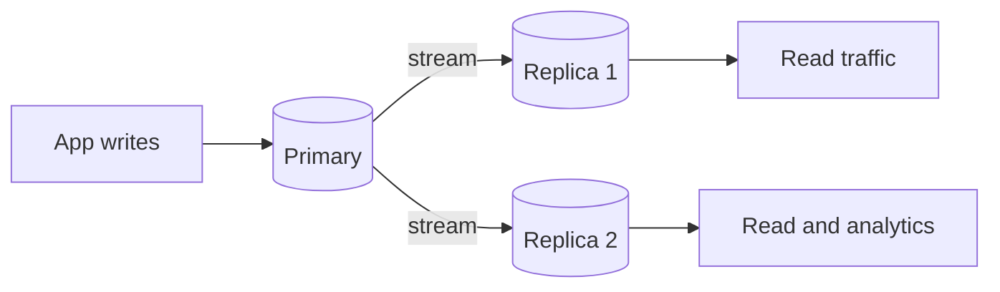

# Replication Overhead

## 1. One-Line Definition
Replication overhead is the extra cost of keeping N copies of data consistent — multiplying storage, write bandwidth, CPU, and operational complexity by the replica count — and it shapes whether the read/availability win of replicating is worth the N-1 bill.

## 2. Why Do We Need It?
Replication is the default "scale reads" answer, but every replica is a full dataset copy that must be fed: each write goes to the primary and then to every follower (write amplification × N), storage multiplies by N, and the network must carry N-1 copies of every write. Teams size the primary, forget the multiplier, and discover weeks into production that their "free" read replica tripled storage and write-taxed the stream. Estimation makes the N-1 cost visible before you commit.

## 3. Simple Intuition
One professor (primary) dictates notes to every student in the room (replicas). Each new sentence costs the professor breath (primary CPU) and every student ink (follower apply). Each student stores a full copy of the lecture. Adding more students = more copies of the same ink, not new content — and the slowest student (lagging replica) sets how fresh the class is allowed to think the notes are.

## 4. What Happens Without It?
The replica multiplier lands after launch: storage bill ×3, write IOPS ×3, a binlog stream saturating internal bandwidth, and replica lag that makes every "read replica" serve stale data — plus the failover surprise where promoting a follower means re-feeding an entire dataset. "Replication for availability" ends up as a cost multiplier nobody budgeted.

## 5. Core Idea
- **The overhead ledger — always count N-1:**
  - *Storage:* dataset × replicas (plus logs/WAL).
  - *Stream bandwidth:* every logical write shipped N-1 times as replay bytes.
  - *Write-path cost:* serializing and fanning out on the primary; sync mode adds a wait on every write.
  - *Follow-ups:* lag-driven read routing, re-sync after promotions, leader catch-up.
- **Sync vs async is the central trade:** sync = every write confirms at R replicas (no loss, but write latency = slowest replica and availability drops); async = fast writes, potential loss of unacknowledged writes when the primary crashes; semi-sync (wait for one) is the middle.
- **What replication actually buys:** read scaling for eventually-stale reads and analytics offload, plus HA/failover copies. Not write scaling, never a substitute for [[sharding|Sharding]] on the write path.
- **Composition with sharding:** `shards × replicas per shard` — nine shards × 3 is 27 dataset copies, not 9.
- **Round numbers:** 1k writes/s × 2 KB with 3 replicas ships ~4 MB/s on the replication stream *in addition to* app traffic, and stores 3 copies of the data.

## 6. Important Terminology

| Term | Simple Meaning |
|------|----------------|
| Primary / leader | Node that accepts writes and fans them out |
| Follower / replica | Node replaying the primary's stream |
| Replication stream | The log/binlog bytes shipped to followers |
| Sync / async | Wait-for-replica confirmation vs fire-and-forget |
| Replica lag | How far behind a follower's apply is |
| Write amplification | Physical write cost vs the user's one logical write |
| RPO / RTO | Data-loss bound / time-to-recover after failure |
| Restore-from-snapshot | Rebuilding a replica from a backup + replay |

## 7. Basic Architecture



Writes land on the primary and fan out as a stream to followers; reads spread across replicas. Sync mode inserts a wait on the follower ack before the write is acknowledged.

## 8. Request or Data Flow
1. A write lands on the primary: commit locally + append to the replication log.
2. Followers pull (or the primary pushes) the log chunk and replay it as a state machine.
3. Async: the app is acknowledged immediately; followers converge later (lag = ms-seconds). Sync: the app waits for the follower ack (RPO close to 0, latency up by a network hop).
4. Reads route to the primary or the freshest replica per the consistency policy.
5. On failure: promote a follower, move reads, and re-sync the loser from a snapshot — a massive bandwidth/IO event when the dataset is large.

## 9. Practical Example
**Orders database (assumptions):** 500 writes/s × 2 KB; 3 replicas (primary + 2); dataset 2 TB with 30% yearly growth.
- Storage: 2 TB × 3 = 6 TB plus logs/indexes — ~7 TB, and it grows yearly.
- Replication stream: 500 × 2 KB × 2 followers ≈ 2 MB/s — trivial in a DC, painful and billable cross-region.
- Async write latency ≈ local commit only (1-3 ms). Semi-sync adds a follower ack hop (3-8 ms). The headline is the storage and stream budget; latency is the secondary tax.
- The comparison that matters: 2 TB, no stream, no offload, no failover if you do not replicate — the whole argument is whether the availability/read win clears 3x storage and the lag surface.

## 10. Scaling
- **Read scaling:** replicas multiply read QPS until follower apply lags under write volume or storage cost dominates; past that, cache or shard.
- **Write scaling:** replication never adds write capacity — writes still serialize on one primary; beyond a ceiling you [[sharding|Shard]] and accept N copies per shard.
- **Cross-region:** a remote replica is a full copy, an egress bill, and a lag firewall — this is where the multi-region cost story (see [[cross-region-replication|Cross-Region Replication]]) starts.
- **Log-based systems:** Kafka and event stores replicate the log itself (see [[kafka-replication|Kafka Replication]]) — the same N-1 stream math applies to topics.

## 11. Reliability and Failure Scenarios

| Failure | What Happens | Detection | Recovery | Trade-off |
|---------|--------------|-----------|----------|-----------|
| Follower crashes | Lag grows; primary still authoritative | Replica health, lag metric | Re-sync from snapshot + replay | bandwidth |
| Primary crashes async | Up to N-1 acks of writes lost | Failover alarm | Promote newest follower | RPO window |
| Stream saturates cross-region | Followers lag or re-sync in a loop | Lag metric, egress bill | Compress/batch stream, cut replicas | fewer copies |
| Promote lagging follower | Cutover serves stale/missing data | Differential vs primary | Choose up-to-date follower, policy | RPO |

## 12. Consistency and Correctness
Replication is where consistency becomes concrete: async replication means replica reads can be stale until the stream catches up — route read-your-writes traffic to the primary (see [[strong-vs-eventual-consistency|Strong vs Eventual Consistency]]). Failover must promote the follower with the highest applied log position and must not roll back acknowledged writes. Sync mode doubles the latency term in the overhead ledger but buys the durability.

## 13. Performance
Three measurable axes: write latency (sync mode), stream bandwidth (N-1 copies of every write), and follower apply CPU (replays everything the primary did). Replica lag is the visible symptom — the perfect early-warning that a replication design is running past its budget; watch it per follower, not just as an average.

## 14. Security
- Replication streams carry the entire dataset and must be encrypted in transit, especially cross-region; a replica is an attractive exfiltration target, so isolate its access.
- Replica credentials should be least-privilege; a follower promoted to primary inherits full authority, so rotation and audit must cover the whole replica set.

## 15. Trade-Offs

| Choice | Advantages | Disadvantages | When to Use |
|--------|------------|---------------|-------------|
| Sync replication | RPO near zero, strong durability | Write latency and availability coupling | Money/payment data |
| Async replication | Fast writes, simple | Loss window, staleness | Most web workloads |
| Semi-sync | Middle ground | Still a hop on writes, minor loss | Balanced production systems |
| Few replicas | Cheap, small lag surface | Little read capacity, less HA | Fast-moving small data |
| Many replicas | Big read fan-out | Storage ×N, stream load | Read-heavy, availability-hungry |

## 16. Common Mistakes
- Sizing storage from "the dataset" instead of dataset × replicas.
- Treating replicas as free and ignoring the N-1 stream bandwidth and apply CPU.
- Promising RPO 0 on an async topology.
- Using replicas to scale writes — impossible, writes serialize on the primary.
- Forgetting follower re-sync after lag or failover: snapshot restore is a massive bandwidth/IO event.

## 17. HLD vs LLD Boundary
HLD: replica count, sync/async choice, RPO/RTO target, cross-region copy policy, read-routing rules. LLD: replication slot config, snapshot/replay job tuning, lag-alert thresholds on one leader, stream compression settings.

## 18. Interview Questions

### Beginner
- What does replication cost in storage and why?
- Difference between sync and async replication in write latency and durability.

### Intermediate
- Size storage and stream bandwidth for 1k writes/s × 3 KB with 3 replicas and a 5 TB dataset.
- Reads grow stale under replica lag. Where do you route read-your-writes traffic?

### Advanced
- Your cross-region replicas keep lagging. Diagnose and redesign the topology.
- Can replication increase write capacity? Argue with a worked example.

## 19. Interview Memory Summary

> [!abstract]- Interview Memory Summary

### Remember

- Replication cost = ×N storage, ×(N-1) stream bandwidth, ×1 primary write fan-out.
- Async = fast writes with a loss window; sync = RPO near zero, slower writes; semi-sync is the middle.
- Replicas scale reads within lag; they never scale writes.
- Shards × replicas multiply; nine shards × 3 = 27 copies.
- Promote the follower with the highest applied log position.

### 30-Second Explanation

Every replica is a full dataset copy that must be fed: cost per replica = storage (dataset + logs), the stream bandwidth of N-1 channels carrying every write, and the apply CPU replaying primary work, with sync mode adding write latency. Sizing starts by multiplying dataset by replicas and writes by N-1 before the read/HA benefits enter the argument.

### Interview Traps

- Sizing storage before multiplying by replica count.
- Announcing RPO 0 on an async topology.
- Proposing replicas for write scaling.
- Ignoring lag as a real correctness constraint.
- Forgetting re-sync storms after lag or failover.

### Key Trade-Off

Replication trades multiplied storage, stream bandwidth, and consistency machinery for read fan-out and availability — the whole HLD decision is whether the availability/read win clears the N-1 cost, and that is arithmetic, not a slogan.

## 20. Related Concepts

### Prerequisites

- [[database-replication|Database Replication]] — the topology and modes this overhead formalizes.
- [[sharding|Sharding]] — the write-scaling complement that replication cannot be.

### Commonly Used Together

- [[replication-lag|Replication Lag]] — the operational symptom of an oversized replication design.
- [[strong-vs-eventual-consistency|Strong vs Eventual Consistency]] — what replica freshness and routing must honor.
- [[cross-region-replication|Cross-Region Replication]] — the same overhead multiplied by geography.
- [[kafka-replication|Kafka Replication]] — log-based replication pays the same N-1 bill.

### Advanced Concepts

- [[cap-theorem|CAP Theorem]] — availability vs consistency is the sync/async split in disguise.
- [[failover|Failover]] — promotion and re-sync are the recovery half of the ledger.

Related planned topics (not authored yet): quorum-read costing, replication-channel sizing.

## 21. References
Database replication documentation (MySQL, Postgres, Kafka) covers sync/async modes and stream mechanics; storage and bandwidth follow from their replication-factor settings. Verify numbers against the engine you deploy.

## 22. Active Recall

Test yourself before revealing each answer.

> [!question]- What are the three axes of replication overhead?
> Storage (dataset × replicas), stream bandwidth (every write shipped N-1 times), and the write path (serialization + fan-out on the primary, plus a sync wait). Teams usually count only storage and find the other two axes in production.

> [!question]- Sync vs async replication in durability and latency terms.
> Sync waits for a replica to persist before acknowledging — RPO near zero at the cost of write latency (an extra round trip) and write availability tied to replica health. Async acknowledges at the primary only — fast and simple, but a primary crash before the replica applies loses those writes.

> [!question]- 1k writes/s × 3 KB, 3 replicas, 5 TB dataset. Storage and stream?
> Storage = 5 TB × 3 = 15 TB plus logs. Stream = 1k × 3 KB × 2 followers ≈ 6 MB/s. Fine within a DC; cross-region that becomes a 6 MB/s egress bill and 15 TB per region — the moment replication gets expensive.

> [!question]- Interview scenario: replica lag grows on a system sized "for free reads". What's the real problem?
> Either write volume exceeds the follower's apply rate, the stream is congested (cross-region, huge values), or the follower is under-provisioned CPU/disk. The "free read replica" was never free — lag is the N-1 cost refusing to stay hidden. Fix the topology or add real capacity.

> [!question]- Design decision: during failover, which follower do you promote?
> The one with the highest applied log position — the least-lagging follower — after confirming it is current enough for your RPO. Promoting a stale follower rolls back acknowledged writes and silently corrupts read-your-writes semantics. Promotion rules are design, not ops trivia.

> [!question]- Why can't replicas scale writes?
> Every write must reach the primary to generate the replication stream — one source of truth and one fan-out point. Scaling writes by adding replicas means multiple writers and, with them, conflict resolution; that is sharding (see [[sharding|Sharding]]), not replication.

> [!question]- Trade-off: sync writes with an 8 ms follower ack across regions.
> You bought near-zero RPO at 3-5x write latency and availability now tied to follower reachability. If the product tolerates a few seconds of loss on a rare primary crash, async wins; if money or audit demands RPO near zero, budget the ack hop and the region topology explicitly.

> [!question]- Interview scenario: nine shards × three replicas. How many dataset copies?
> 27 — shards multiply, not add. Nine shards at 5 TB each is 45 TB of raw data, ×3 = 135 TB. Replication overhead composes multiplicatively, and "9 shards for write scale" quietly becomes the 135 TB storage and stream bill nobody in the room computed.

## 23. When Should I Use This?

### Use it when

- You add read replicas or set a replication factor and must size storage, bandwidth, and CPU.
- You choose sync vs async and need to state the RPO/latency consequences.
- You compose sharding with replication and must budget copies correctly.

### Avoid it when

- Reads are the true bottleneck and the data fits one primary comfortably — replication buys little and pays N-1 anyway; [[caching|Caching]] may be cheaper.
- You need durability, not read scalability — that is backup/restore and WAL archiving, a smaller multiplier.
- The system is log/appended (Kafka-style) where the stream *is* the product — the cost framing sits elsewhere.

### What problem does it solve?

Problem: replication is treated as free by default, then triples storage and write cost at launch, or promises durability it cannot keep. Solution: a replicas-visibility ledger — storage × N, stream × (N-1), sync-mode latency, lag ceilings — that is priced before the copy is justified by the read/HA win it buys.

### What problem does it NOT solve?

It does not make replicas durable (backup is still separate), does not scale writes (that remains sharding territory), and cannot fix a lagging follower — the overhead math tells you whether the design was financially sane; it does not operate the failover, which is an ops/reliability problem.

## 24. Decision Connections

Decisions that go together with replication overhead:

- [[database-replication|Database Replication]] — the mechanics whose cost this stitches up.
- [[replication-lag|Replication Lag]] — the operational price you pay when the stream overruns the followers.
- [[strong-vs-eventual-consistency|Strong vs Eventual Consistency]] — sets how much of the read path replicas may legally serve.
- [[cross-region-replication|Cross-Region Replication]] — the same ledger with geography and egress multiplied in.
- [[kafka-replication|Kafka Replication]] — log replication running the identical N-1 stream math.
- [[sharding|Sharding]] — the write-scaling lever; shards × replicas compose multiplicatively.
- [[cap-theorem|CAP Theorem]] — the sync/async trade is CAP written as a price list.

Decision tree:

```
"Let's replicate" is proposed
    |
    +-- Why? Read scaling? → accept eventual staleness, size the cache first
    |      +-- Availability/HA? → add replicas, define failover + RPO
    |
    +-- Add N-1 to the budget
    |      storage × N, stream × (N-1), apply CPU, sync hop if any
    |
    +-- Writes are the growth problem?
           → replication cannot help → [[sharding|Sharding]] instead
    |
    +-- Wins clear the bill?
           → proceed with sync/async choice per [[database-replication|Database Replication]]
```