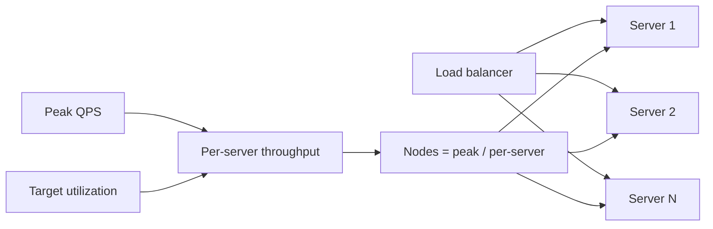

# Server Capacity

## 1. One-Line Definition
Server capacity is the maximum workload — requests per second, concurrent connections, memory, and CPU — one server instance can sustain at an acceptable latency, and it converts total system QPS into a node count.

## 2. Why Do We Need It?
Architectures are decided by "how many boxes?" A single number — "one app server handles ~1-3k QPS, one 4-vCPU API box ~2-5k QPS" — turns raw traffic into a fleet size, and that fleet size drives cost, [[horizontal-vs-vertical-scaling|Horizontal vs Vertical Scaling]], and [[autoscaling|Autoscaling]] strategy. Without it you either buy 10x too many servers or collapse at the first peak; capacity math is the bridge between QPS and cost.

## 3. Simple Intuition
A toll booth: each booth (server process) processes cars (requests) at some rate; the more booths you open, the more cars per hour — but each booth has a max rate (CPU), a queue limit (concurrency), and enough road to hold waiting cars (memory/connections). Capacity math is: cars/hr ÷ cars/hr-per-booth + headroom, then make sure no single booth's queue-length blows up the line.

## 4. What Happens Without It?
You size the fleet by guesswork: either over-provision (crippling cost) or under-provision (p99 explodes, DB meltdown, capacity alerts at 2am). Without a per-request latency and per-server throughput model, autoscaling thresholds have no basis and every new feature silently renegotiates "how many servers" without anyone noticing until the page drops.

## 5. Core Idea
- **Per-request model first:** one request consumes CPU time (e.g., 2-5 ms of compute on a core), allocates memory, and holds a connection open for its latency. Throughput per core = `1 / CPU-seconds-per-request`; a 2 ms CPU request means ~500 req/core/s, then reality (GC, locks, syscalls) cuts that 2-5x.
- **Typical reference numbers (use as sanity, quote with caveats):**
  - Static/edge proxy: tens of thousands of QPS per instance.
  - Stateless app server (light JSON transforms, few DB hits): 1-3k QPS at 4-8 vCPU.
  - DB-hosting service: interaction *with* its own connections/IOPS, not "QPS".
- **Memory and connections are second ceilings:** a box with 1,000 connections × 8 KB buffers and per-request 500 KB transient objects dies before its CPU does — estimate both.
- **Latency is the arbiter:** capacity is only valid at a target percentile. Server % CPU, p99 latency, and utilization curve together; a 90% CPU box at p99 30 ms is different from p99 300 ms.
- **Utilization target:** run sustained ~40-60% to leave room for bursts, failover, and GC/anti-patterns; >85% core CPU invites cascades.
- **Headroom → node count:** `nodes = peak QPS ÷ (per-server QPS × target utilization)`.

## 6. Important Terminology

| Term | Simple Meaning |
|------|----------------|
| QPS / RPS | Requests processed per second |
| Concurrency | Requests in flight simultaneously |
| Utilization | Fraction of a resource (CPU/RAM) actually used |
| CPU-seconds per request | Compute a request actually consumes |
| Headroom | Extra capacity beyond expected peak (20-50%) |
| Tail latency | Slowest percentile (p99) of request latencies |
| Throughput ceiling | Max requests/s at an acceptable p99 |
| Connection ceiling | Max concurrent sockets before buffers/memory cap |

## 7. Basic Architecture



## 8. Request or Data Flow
1. Derive peak QPS from capacity math. Pick a target latency (p99) and utilization (say 60%).
2. Measure or assume CPU-seconds per request (2-5 ms typical for a light service); per-server QPS = cores × `1/CPU-per-req` × efficiency (0.5-0.8).
3. Check the memory/connection ceiling for that same box (concurrency × bytes in flight).
4. Take whichever ceiling is lower → per-server capacity at the target utilization.
5. Nodes = peak QPS ÷ per-server capacity. Add 1+ spare for failover and deploy.

## 9. Practical Example
**Feed API (assumptions):** 20k peak QPS; one 8-vCPU box sustains ~2k QPS at 60% util and p99 50 ms.
- 20,000 ÷ 2,000 = 10 nodes; at 60% target, you need 10 ÷ 0.6 ≈ 17 nodes. Add one spare → 18.
- Connection check: 2,000 in-flight × 100 KB/req = 200 MB per node — trivial on 8 GB, so CPU is the binding resource, and autoscaling should scale on CPU/p99, not connection count.
- If the box is instead a Redis host for the same feed, the "server" is memory/IOPS-bound and the same QPS could need sharding — proving that "server capacity" is architecture-specific, not a constant.

## 10. Scaling
- **Horizontal (more nodes):** trivial for stateless services; per-node throughput roughly constant, so node count scales linearly with QPS.
- **Vertical (bigger box):** doubles CPU usually less than doubles throughput — lock contention, GC, memory bandwidth plateau; benefit decays.
- **Amdahl in reverse:** adding nodes to a stateful path shuffles state and caps the gain at the coordinator — estimate per-perf with the state in mind.
- **Autoscaling needs a capacity model:** thresholds (CPU %, p99) only make sense once you've set peak QPS per server at the target utilization.
- **Fleet economics:** capacity math feeds cost — see [[cost-estimation|Cost Estimation]] for the money side of the same node count.

## 11. Reliability and Failure Scenarios

| Failure | What Happens | Detection | Recovery | Trade-off |
|---------|--------------|-----------|----------|-----------|
| Node death under peak | Peers inherit its QPS, spike CPU | Instance health | N+1 spare node, LB drain | spare cost |
| Unexplained QPS drop | Capacity model wrong (GC, lock) | Throughput vs CPU scatter | Load test, fix hotspot | testing time |
| Traffic spike beyond estimate | p99 blows out, rejections | Latency/error SLO | Scale out fast, shed load | degraded UX |
| Memory ceiling reached | OOM loop | RSS metric | Right-size or scale out | cost |

## 12. Consistency and Correctness
Capacity is only trustworthy if it respects the consistency model: replicas must serve read QPS within lag bounds; strongly-consistent reads pin to primaries and shrink their capacity. The node count for a read-heavy system is very different if reads are allowed to hit replicas vs if every read must hit the primary — fold that in, or the design is wrong regardless of math.

## 13. Performance
Capacity and performance are the same coin: the p99 you hold constant while estimating throughput is the metric that fails first under miscalculation. Watch for non-linearities — CPU near 100% makes latency explode (a knee, not a line), connection limits produce throughput cliffs, and disk/network I/O can cap a box below what CPU math predicts.

## 14. Security
- Attack traffic consumes capacity as-real as user traffic: size for peak plus a bot/WAF multiplier.
- Rate-limiter bins and per-tenant isolation occupy memory per node — capacity must include the abuse-handling layer, not just user app constants.

## 15. Trade-Offs

| Choice | Advantages | Disadvantages | When to Use |
|--------|------------|---------------|-------------|
| Bigger instances | Fewer nodes, simpler ops | Vertical scaling plateau, blast radius | Predictable workloads |
| Smaller instances, more nodes | Granular scaling, isolation | More state, more ops sprawl | Variable/stateless load |
| 60% util target | Absorbs bursts, failover | Pays for idle CPU | General internet service |
| High-util target | Cheaper | Cascade risk at peaks | Predictable, replanned |

## 16. Common Mistakes
- Treating "server capacity" as a fixed constant instead of a function of latency target and workload shape.
- Sizing on CPU only, ignoring connections/memory ceilings.
- Using 100% utilization as the design point — the knee of the latency curve is far earlier.
- Forgetting N+1/failover nodes in the fleet count.
- Deriving autoscaling thresholds with no capacity model at all, so it reacts late.

## 17. HLD vs LLD Boundary
HLD: per-server QPS ceilings, node count, utilization target, scale strategy, failover capacity. LLD: profiling a specific endpoint, tuning thread pools/connection pools, choosing GC flags, replicating per-box metrics into autoscaling config.

## 18. Interview Questions

### Beginner
- How many servers for 100k peak QPS if one server handles 2k QPS at 60% util?
- What is the connection between CPU-seconds per request and per-core throughput?

### Intermediate
- Estimate node count and point out the binding constraint for a 50k QPS stateful feed service on 8-vCPU boxes.
- When does scaling a DB-backed service horizontal stop giving you linear QPS?

### Advanced
- A fleet handles 300k QPS but p99 degrades past 70% CPU on any node. Diagnose and re-model the capacity plan.
- Design an autoscaling input set that uses a capacity model rather than reactive CPU alarms.

## 19. Interview Memory Summary

> [!abstract]- Interview Memory Summary

### Remember

- Per-core throughput = 1 ÷ CPU-seconds per request, reality discounts by 2-5x.
- Typical app server: 1-3k QPS at 4-8 vCPU, 40-60% util target.
- Nodes = peak QPS ÷ per-server capacity at target util, plus failover.
- Check the memory/connection ceiling — it caps before CPU does.
- Capacity is valid only at a stated latency percentile.

### 30-Second Explanation

Build a per-request model (CPU-seconds, bytes, connections), compute per-server throughput to a target latency and 60% utilization, take the lower of CPU vs memory/connection ceilings, then fleet size is peak QPS divided by per-server capacity with a spare for failover. Validate with load tests, since constants are architecture- and load-pattern-specific.

### Interview Traps

- Quote "one server = 10k QPS" with no workload context.
- Sizing to 95% CPU as if it were safe.
- Forgetting failover capacity and autoscaling lag.
- Ignoring the memory ceiling until a box OOMs mid-interview.

### Key Trade-Off

Server capacity trades per-node density for latency and safety: pushing utilization toward the knee of the latency curve buys cheaper fleets but flips bursts and failovers into outages — so the design point must be a latency-percentage, not "max out the box".

## 20. Related Concepts

### Prerequisites

- [[capacity-estimation|Capacity Estimation]] — total system QPS, the numerator of the fleet math.
- [[latency-vs-throughput|Latency vs Throughput]] — throughput is capacity, latency is its validity condition.

### Commonly Used Together

- [[horizontal-vs-vertical-scaling|Horizontal vs Vertical Scaling]] — the direct decision the node count feeds.
- [[autoscaling|Autoscaling]] — capacity model becomes the autoscaler's thresholds and lag.
- [[load-balancing|Load Balancing]] — distributing the fleet QPS across the node count.
- [[reverse-proxy|Reverse Proxy]] — the high-QPS edge that keeps app boxes at their model.

### Advanced Concepts

- [[tail-latency|Predictable Tail Latency]] — the p99 that defines "acceptable" throughput.
- [[cloud-infrastructure|Cloud Infrastructure]] — instance families/tiers set the vCPU/RAM units the math runs on.

Related planned topics (not authored yet): capacity-model spreadsheets for interview prep, multitenant capacity partitioning.

## 21. References
Per-request CPU-cost references such as Doug Lea's "The cost of the JVM" summary and Jeff Dean's "Numbers everyone should know"; load-test methodology from standard system-design interview material. Treat every constant as a hypothesis, verified by a load test against your own stack.

## 22. Active Recall

Test yourself before revealing each answer.

> [!question]- Why is capacity "QPS at an acceptable p99" rather than just QPS?
> A server can serve 20% more QPS by letting latency balloon — that is not capacity, that is overload. Capacity is the throughput point where the latency percentile you promised still holds, so every fleet estimate has an implicit p99 contract attached.

> [!question]- How does CPU-seconds-per-request convert to per-core QPS?
> Throughput per core ≈ 1 ÷ CPU-seconds-per-request, discounted by GC/locks/syscalls (factor 2-5x). A 2 ms-compute request is ~500/core/s ideal, maybe 100-250 real. Multiply by cores and the efficiency discount for the box's ceiling.

> [!question]- 100k peak QPS, 2k QPS per server, 60% util target. How many nodes?
> 100,000 ÷ 2,000 = 50 servers at 100% — that's the trap. At 60% target: 50 ÷ 0.6 ≈ 84, plus a failover spare (85-90). Always apply utilization to the divided denominator before comparing against the raw number.

> [!question]- Interview scenario: 300k QPS but p99 degrades past 70% CPU on any node. What's happening?
> You've hit the latency knee — lock contention, GC, or I/O serialization make additional load convert straight into tail latency rather than throughput. Diagnose with profiles; the model needs a lower usable per-node QPS or the workload needs splitting, not just "more servers".

> [!question]- Design decision: autoscaling on CPU alone vs a capacity model.
> CPU alone reacts: the box is already saturated when the alarm fires, and a single metric conflates a bad deploy with real load. A capacity model scales from predicted QPS per node at target util and latency (plus measured CPU as confirmation), so it acts early and has a defined ceiling.

> [!question]- Trade-off: vertical bigger boxes vs horizontal more nodes for a stateful service.
> Vertical buys throughput until lock/bandwidth plateaus cheaply, but a bigger spine box is a bigger blast radius. Horizontal buys linear scaling only while the service is stateless or sharded; shared state caps the gain at the coordinator. Estimate both, then choose by state size and failover risk.

> [!question]- Failure scenario: a node dies at exactly peak load. What did the capacity model miss?
> Failover capacity: the fleet was sized so each node runs at target util alone, so the surviving nodes inherit the dead one's load and breach their latency knee. Correct sizing keeps N-1 nodes under utilization, and the LB drains the failed node before the rest degrade.

> [!question]- Why is the memory ceiling "checked before the answer sticks"?
> A box can look CPU-fine and OOM at the same QPS because connections, buffers, and in-flight objects eat RAM per request. Capacity is min(CPU ceiling, memory ceiling, connection ceiling) — quoting nodes without the memory check returns a fleet that dies on the wrong resource.

## 23. When Should I Use This?

### Use it when

- You convert total QPS into a fleet for [[cost-estimation|Cost Estimation]] or an interview.
- You configure [[autoscaling|Autoscaling]] or capacity planning and need thresholds.
- You evaluate a server family/tier and need to sanity-check node count.

### Avoid it when

- The service's real bottleneck is network, disk, or an external dependency with its own ceiling — estimate the binding resource.
- You need measured per-request profiles, not assumptions — a load test replaces the estimate.
- Memory-only (cache/RAM) services where "tables" are bytes, not QPS — use memory/cache estimation instead.

### What problem does it solve?

Problem: traffic is known but the fleet is guessed — over-provisioned, under-provisioned, or autoscaled with no basis. Solution: a per-request model (CPU-seconds, bytes, connections) that yields per-server QPS at a target latency and utilization, from which node count and scale thresholds are arithmetic.

### What problem does it NOT solve?

It does not measure real hotspots (profiling/load tests do), does not decide the data path (a DB-backed "server" is gated by its own storage/IOPS), and is only as good as its constants — every number is a hypothesis until verified in the actual stack.

## 24. Decision Connections

Decisions that go together with server capacity:

- [[capacity-estimation|Capacity Estimation]] — the peak-QPS numerator of the fleet math.
- [[latency-vs-throughput|Latency vs Throughput]] — the p99 contract that makes capacity meaningful.
- [[horizontal-vs-vertical-scaling|Horizontal vs Vertical Scaling]] — what the node count decides.
- [[autoscaling|Autoscaling]] — capacity model becomes scaling thresholds and lead time.
- [[load-balancing|Load Balancing]] — distributing QPS across the computed fleet.
- [[cost-estimation|Cost Estimation]] — node count × instance price is the money side of capacity.
- [[tail-latency|Predictable Tail Latency]] — the percentile that defines the acceptable ceiling.

Decision tree:

```
Capacity unknown
    |
    +-- Load is QPS at a target latency?
    |      per-server QPS model → [[server-capacity|Server Capacity]]
    |      +-- Stateless? → horizontal, linear node count
    |      +-- Stateful?  → shard or accept non-linear
    |      +-- Peak volatile? → [[autoscaling|Autoscaling]] + headroom
    |
    +-- Load is memory/working set?
           → [[cache-size-estimation|Cache Size Estimation]] / memory model instead
    |
    +-- Cost is the binding question?
           → [[cost-estimation|Cost Estimation]] from the node count
```