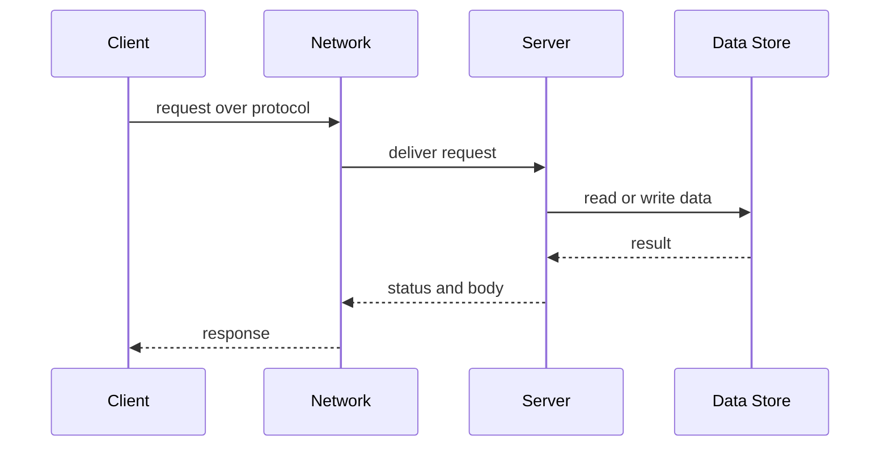

# Client-Server Model

## 1. One-Line Definition
The client-server model splits a networked application into clients (which request work) and servers (which provide work, data, or resources), communicating over a standard protocol such as HTTP.

## 2. Why Do We Need It?
Most real systems have a natural imbalance: a few authoritative sources of data (the catalog, the ledger, the profile) and enormous numbers of users who want to read and change it. The client-server model centralizes authority and storage on the server while keeping clients cheap, simple, and many — which is what makes the web, mobile apps, and API-driven products possible at all.

## 3. Simple Intuition
A restaurant: the diner (client) does not walk into the kitchen — they order from the waiter (protocol). The kitchen (server) holds the recipes and ingredients (authority and data), produces the dish (work), and the waiter brings it back. Many diners, one kitchen; the kitchen decides what is true.

## 4. What Happens Without It?
Without a defined client-server split, every device would carry its own copy of the data (no central truth), coordinate with every other device directly (peer-to-peer spaghetti), or re-implement authority and security per device. Updates would diverge, "who owns this record" would be undefined, and you could never have a single database or a trusted leader.

## 5. Core Idea
- **Roles are asymmetric:** the client initiates a request; the server listens and responds. The server owns shared state and is usually the authority for the data.
- **Request/response is the pattern:** one exchange = one question, one answer. It maps to HTTP verbs, RPC calls, and SQL queries alike.
- **Statelessness is a server strategy:** an HTTP server can forget every client between requests, so any server instance can answer any request — which is what makes horizontal scaling cheap.
- **Servers are not monolithic:** an app server is itself a client of its database, a cache, and downstream services (N-tier). Every layer asks "who is the server for this specific question?"
- **Thin vs thick client:** a browser is a thin client (renders server response); a mobile app is thicker (local caching, offline logic) but still depends on the server for truth.

## 6. Important Terminology

| Term | Simple Meaning |
|------|----------------|
| Client | The side that initiates requests |
| Server | The side that listens and responds, owns data |
| Request / Response | One exchange: question in, answer back |
| Protocol | The agreed rules of the exchange (HTTP, TCP) |
| Stateless server | Server holds no memory of past requests |
| N-tier | Layers of servers, each tier calling the next |
| Thin client | Renders server output, holds little logic |
| Peer | A node that is client and server at once (P2P) |
| Sticky session | LB pins a client to one server holding its state |

## 7. Basic Architecture



The client never talks to the data store directly: it asks the server, and the server enforces authority and consistency.

## 8. Request or Data Flow
1. Client resolves the hostname via [[dns|DNS]].
2. Client opens a [[tcp|TCP]] connection and sends an HTTP request.
3. A [[load-balancing|Load Balancer]] picks a healthy server instance and forwards the request.
4. The server validates and authenticates, does the work (usually calling a data store or another service), and returns a status plus body.
5. Client receives the response; a stateless server discards all memory of the exchange.

## 9. Practical Example
**Photo-sharing app (assumptions):** 50M DAU, uploads and feeds.
- 50M clients hit a fleet of stateless API servers behind an LB (500 app nodes).
- Upload (`POST /photos`) reaches the app server, which stores bytes in blob storage and a row in the database — the app server is the client of those stores.
- Reads hit [[caching|Caching]] and a [[cdn|CDN]], so the server and network are not on every hot path.
- The mobile client is thick: it caches thumbnails locally, but the server remains the authority on which photos exist.

## 10. Scaling
- **Server becomes the bottleneck by design** (it does the real work and holds state). Scale by making servers stateless and adding more of them horizontally ([[horizontal-vs-vertical-scaling|Horizontal vs Vertical Scaling]]).
- **Connections scale badly without help:** one server hits file-descriptor and CPU limits on connections — put an [[load-balancing|Load Balancer]] in front and pool connections inside.
- **State is the enemy of scaling:** sessions forced to one instance make that instance a SPOF (planned); push state to a shared store or the client ([[stateless-vs-stateful-services|Stateless vs Stateful Services]]).
- **Reads scale cheaply:** caching plus CDN multiply effective capacity long before you scale the server fleet.

## 11. Reliability and Failure Scenarios

| Failure | What Happens | Detection | Recovery | Trade-off |
|---------|--------------|-----------|----------|-----------|
| Server dies | Requests fail or hang | Health checks | LB routes to healthy instances, [[failover|Failover]] | needs 2+ instances |
| Network blip | Requests dropped or lost | Timeouts, retries | Client retry with backoff | adds latency |
| Server overloaded | Latency spikes, drops | 5xx rate, queue depth | Auto-scale, load shed, backpressure | complexity |
| Client offline | No requests at all | None (client initiates) | Client reconnects and syncs | eventual consistency |

The key asymmetry: because the client initiates, the server cannot push state changes to offline clients — that needs a different mechanism (WebSockets, push, polling — planned topics).

## 12. Consistency and Correctness
- Stateless servers keep consistency simple: each request is complete in itself, and the server serializes writes to shared data.
- Because requests travel over a lossy network, retries happen: give mutating requests [[idempotency|Idempotency]] keys so a duplicated request does not apply twice.
- Clients hold stale data (cached pages, offline queues) — the server is the authority and must resolve conflicts on write.

## 13. Performance
- The model pays **one round trip (RTT) per logical request** minimum; most of a response's latency is network, not compute ([[network-latency|Network Latency]]).
- Reduce RTTs with connection reuse (keep-alive), batching, and edge caching.
- The huge majority of traffic is read: cache aggressively so requests never reach the app server.

## 14. Security
- TLS everywhere: the client authenticates the server (certificates) and the server authenticates the client (tokens, cookies, mTLS) — [[encryption-and-keys|Encryption and Keys]].
- The server holds the data, so it is the main attack surface: least-privilege credentials, per-tenant isolation, input validation, rate limiting.
- Public clients are untrusted by default — never trust client-supplied IDs, never echo client input unvalidated ([[web-vulnerabilities|Web Vulnerabilities]]).

## 15. Trade-Offs

| Choice | Advantages | Disadvantages | When to Use |
|--------|------------|---------------|-------------|
| Thin client | Simple, updates in one place, security on server | Needs network every time | Web, low offline need |
| Thick client | Fast UI, offline capability | App store cycles, duplicated logic, more attack surface | Mobile, strong UX |
| Stateless server | Trivial horizontal scaling, any instance serves | State pushed elsewhere | Most web APIs |
| Stateful server | In-memory session speed | Sticky sessions, harder scaling | Legacy, simple apps |
| Central authority | One source of truth | Single choke point if not replicated | Most products |
| Peer-to-peer | No central server, great fault tolerance | Consistency, security, discovery hard | File transfer, crypto |

## 16. Common Mistakes
- Holding per-user state on a server while expecting any instance to answer any request (hidden state breaks scaling).
- Assuming the client always reaches the same server, then never handling retries, timeouts, or connection loss.
- Making the database reachable by the client, or passing client input straight to SQL.
- Making every interaction synchronous request/response when some can be cached or made async ([[message-queue|Message Queue]]).
- Forgetting the server is also a client: no retry or backoff on the server-to-database leg.

## 17. HLD vs LLD Boundary
HLD: who is the client and who is the server (tiering), protocol choice (HTTP/gRPC), stateless vs stateful decisions, load-balancing topology, caching boundaries. LLD: one endpoint's request handler, a client's retry loop, header parsing, connection-pool settings in a single service.

## 18. Interview Questions

### Beginner
- What is the difference between a client and a server?
- Why does a stateless HTTP server scale more easily than a stateful one?

### Intermediate
- Your API servers are stateless but login sessions break after scale-out. What moved, and where should the state live?
- Why is a single server a single point of failure in this model, and what do you add?

### Advanced
- Design a system where a mobile client must stay consistent with the server while offline for hours. Where does the model break?
- Your "server" is the client of a database, a cache, and a payment service. How do retries and failures differ on each leg?

## 19. Interview Memory Summary

> [!abstract]- Interview Memory Summary

### Remember

- Client initiates; server listens, owns data, responds.
- Request/response is the core exchange; HTTP is its standard protocol.
- Stateless servers plus shared state mean trivial horizontal scaling.
- The server is the authority; the client can be thin or thick.
- Servers are clients of the tiers below them.
- Caching and CDNs remove most reads before they reach the server.
- Network loss means retries: idempotency keys make them safe.

### 30-Second Explanation

The client-server model centralizes authority and data on servers while keeping clients many and cheap. The client sends a request over a protocol (DNS to TCP to HTTP); a load balancer routes it to a stateless server instance that does the work against data stores and replies. Statelessness is what makes horizontal scaling cheap, and caching keeps most reads off the server entirely.

### Interview Traps

- Saying "state is fine on the server" and then discovering sessions pin traffic to one instance.
- Forgetting the client initiates — you cannot push to an offline client without a push mechanism.
- Ignoring network failure; no link is reliable, so retries and timeouts are mandatory.
- Treating the database as reachable by the client.

### Key Trade-Off

Centralizing authority on the server gives a single source of truth and cheap scaling (stateless), but makes the server the bottleneck and the main attack surface — everything you own is concentrated behind one door.

## 20. Related Concepts

### Prerequisites

- [[system-design-fundamentals|System Design Fundamentals]] — the skeleton most designs hang on.
- [[dns|DNS]] — the first step: turning a name into a server address.

### Commonly Used Together

- [[http-and-https|HTTP and HTTPS]] — the standard request/response protocol for the model.
- [[load-balancing|Load Balancing]] — turns "one server" into a fleet of interchangeable servers.
- [[stateless-vs-stateful-services|Stateless vs Stateful Services]] — the scaling consequence of where state lives.
- [[caching|Caching]] — reads that skip the server entirely.
- [[message-queue|Message Queue]] — decoupled communication when a reply is not needed on the same call.

### Alternatives

- Peer-to-peer (each node is both client and server) — more resilient, far harder consistency and discovery.
- [[message-queue|Message Queue]] and event-driven flows — decoupled instead of direct request/response.

### Advanced Concepts

- [[microservices|Microservices]] — many small servers, each a client of the others, coordinated over the network.
- [[horizontal-vs-vertical-scaling|Horizontal vs Vertical Scaling]] — the growth strategy for the server tier.

Related planned topics (not authored yet): peer-to-peer, websockets, server-sent-events, forward-proxy.

## 21. References
Kurose and Ross, *Computer Networking: A Top-Down Approach* (application layer). RFC 9110 (HTTP semantics). Kleppmann, *Designing Data-Intensive Applications* (ch. 1, reliability at scale). Re-check protocol details against current RFCs.

## 22. Active Recall

Test yourself before revealing each answer.

> [!question]- What is the single biggest scaling lever the client-server model gives you, and why?
> Making the server **stateless**: then any instance can answer any request, so you scale by adding interchangeable instances behind a load balancer. State is pushed to a shared store or back to the client.

> [!question]- Why can't a web server push new data to a browser the way it returns a request?
> Because the client initiates every exchange; the server only responds. Unsolicited updates need a long-lived open channel (WebSockets/SSE — planned) or client polling. That asymmetry is the model's defining constraint.

> [!question]- Trade-off: thin client vs thick client for a mobile app?
> Thin clients update centrally, keep security on the server, and stay simple, but need the network constantly. Thick clients cache and work offline with a fast UI, but ship logic through app stores, duplicate it, and widen the attack surface.

> [!question]- Your API server holds session data in memory. What breaks when you scale horizontally?
> A user's next request may hit an instance that never saw their session, so they get logged out or their cart "clears." Fix: move state to a client cookie or a shared cache, or use sticky sessions — which defeats scaling.

> [!question]- What are the three legs of the model, and how does reliability differ on each?
> Client to server, server to data store, and server to downstream services. The client-server leg needs retries with idempotency; the server-store leg needs connection pooling and backoff; each leg fails independently and none is reliable by default.

> [!question]- Interview scenario: a notes app must work offline and sync later. Where does the model break, and what do you build?
> The server-only model cannot read or write while the client is offline. Add a local store and an outgoing sync queue; on reconnection the thick client replays changes with idempotency keys, and the server resolves conflicts instead of blindly overwriting.

> [!question]- Why is a stateless server said to trade CPU for flexibility?
> Stateless means the server must re-derive or look up context on every request (extra DB/cache read — CPU and latency), but gains the flexibility that any instance can serve anyone, which is what horizontal scaling depends on.

## 23. When Should I Use This?

### Use it when

- There is a clear source of truth (catalog, ledger, profile) that many users read and write.
- You want a simple, request/response interaction that scales horizontally via stateless servers.
- Clients are heterogeneous (browser, mobile, third-party) and need a standard protocol.
- Central control over security and data integrity matters more than offline capability.

### Avoid it when

- Clients must work offline for long stretches and the server cannot push updates (a different sync model is needed).
- The workload is fire-and-forget with no reply expected — async messaging is cheaper.
- You need massive decentralized fault tolerance that no single authority can give (peer-to-peer).
- The "server" is really a shared bus and neither side is authoritative (event-driven fits better).

### What problem does it solve?

Problem: many clients need centralized, consistent access to authoritative data. Bottleneck: one server can only serve a limited number of connections and requests. Solution: keep servers stateless so any instance can answer, scale horizontally behind a load balancer, and offload reads to caching and CDN layers.

### What problem does it NOT solve?

The model does not give you offline capability or server-initiated delivery (those need push/polling), eventual consistency across bulky client caches, or decentralized architectures where no node owns the data. It also does not protect you from making the server the single point of failure.

## 24. Decision Connections

Decisions that go together with the client-server model:

- [[http-and-https|HTTP and HTTPS]] — the request/response protocol the model usually speaks.
- [[load-balancing|Load Balancing]] — how "one server" becomes a scalable fleet.
- [[stateless-vs-stateful-services|Stateless vs Stateful Services]] — the core decision that determines whether the fleet scales.
- [[dns|DNS]] — the name-to-address lookup behind the first request.
- [[caching|Caching]] — reads that never reach the server.
- [[message-queue|Message Queue]] — the async alternative when no reply is needed.
- [[idempotency|Idempotency]] — makes retries over a lossy network safe.
- [[microservices|Microservices]] — the server tier itself becomes many clients and servers.

Decision tree:

```
A system must serve many clients
    |
    +-- Replies needed on the same call, central authority?
    |      → [[client-server-model|Client-Server Model]]
    |         |
    |         +-- Scale-out required?      → stateless servers + [[load-balancing|Load Balancing]]
    |         +-- Sessions must survive?   → move state to client/cache or accept sticky
    |         +-- Many repeated reads?     → [[caching|Caching]] and [[cdn|CDN]]
    |         +-- Flaky network?           → retries + [[idempotency|Idempotency]]
    |
    +-- Fire-and-forget, no reply?
    |      → [[message-queue|Message Queue]]
    |
    +-- Long offline stretches, server push needed?
           → add local store + sync, or push via WebSockets/SSE (planned)
```