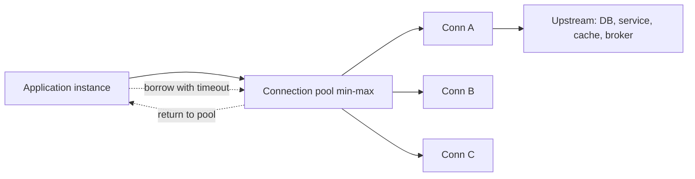

# Connection Pooling

## 1. One-Line Definition
Connection pooling keeps a small, pre-opened, reused set of network connections to an upstream system — a database, HTTP backend, cache, or broker — that requests borrow for one operation and return, instead of opening and closing a fresh connection each time.

## 2. Why Do We Need It?
Establishing a connection is expensive: TCP handshake, optional TLS handshake, authentication, and server-side memory allocation can take 10-100ms even on a healthy network. Most upstreams also cap concurrent connections, so connection-per-request both wastes CPU and drains the upstream's connection budget under load. Pooling amortizes the setup cost and keeps the number of live connections stable, which is a core performance and reliability lever at the network layer.

## 3. Simple Intuition
A taxi fleet instead of ordering a new taxi for every passenger. Each request borrows an already-waiting cab (pooled connection) for its trip, then returns it. You keep just enough cabs for peak busy periods: too few, passengers queue; too many, cabs idle burning fuel (upstream memory). The dispatcher's rules — how long a passenger will wait before leaving (borrow timeout), and how many cabs may exist (pool max) — decide how graceful the system is under a storm.

## 4. What Happens Without It?
Every operation runs connect → auth → use → close: thousands of socket churns, 10-100ms of handshake overhead per call, and TLS handshakes saturating CPU on both ends. At high concurrency the upstream exceeds its connection ceiling, new connects time out, callers retry, retries create more connect attempts — the classic **connection storm**, where failure feeds more connection churn until nothing works.

## 5. Core Idea
- **Pool lifecycle:** pre-warm connections at startup, check one out per operation, return it (always, even on error), validate before reuse (stale/half-open connections are replaced), and drain gracefully on shutdown.
- **Borrow semantics:** a borrow is a lease, not a stream contract — the caller must not assume ownership, must not cache the connection across requests, and must return within a bounded time (see long transactions in `07-databases/database-connection-pooling.md`).
- **Bounds:** `min` keeps steady-state capacity warm; `max` caps upstream connections; a **borrow timeout** converts queueing into a fast failure (retry/backoff or 503) instead of an infinite wait pile.
- **Where it applies:** HTTP keep-alive semantics (RFC 9110), outbound HTTP/gRPC client channels, cache clients, broker producers/consumers, and database drivers — the mechanism is identical at the network layer, and the database case has its own deeper treatment.

## 6. Important Terminology

| Term | Simple Meaning |
|------|----------------|
| Pool size | Configured min/max number of open connections |
| Borrow/return | Check a connection out per operation and hand it back |
| Borrow timeout | How long a request waits for a free connection before failing |
| Idle connection | Open but unused; costs upstream memory |
| Stale / half-open | Connection that died silently; caught by validation before reuse |
| Pre-warm | Open connections eagerly at startup, not on first request |
| Drain | During shutdown: stop taking borrows, finish in-flight, close |
| Connection storm | Failure cascade: churn → retries → more connects → meltdown |

## 7. Basic Architecture



## 8. Request or Data Flow
1. A request needs the upstream → borrows a pooled connection (waits at most the borrow timeout).
2. Runs its operation on that connection.
3. On success **or** exception the connection is returned to the pool, never closed.
4. If the pool suspects staleness, it validates (ping/ISSUE a cheap read) and discards dead connections.
5. Burst exceeds the pool → graceful timeout → the caller fails fast (retry with backoff, 503) rather than queueing forever.

## 9. Practical Example
**Checkout service (assumptions):** service talks to a PostgreSQL primary and a legacy payment HTTP endpoint.
- Payment endpoint: open connection costs ~40ms (TCP + TLS + auth). At 200 QPS, per-call connects would add ~8s of setup per second and saturate the endpoint's listener; a pool of 50 connections with keep-alive makes setup cost negligible. Database client: pool 20-30 per node with `borrowTimeout = 200ms` — at saturation the service returns 503 with `Retry-After` instead of queueing.
- The numbers to tune are system-specific; the invariant is: pool sized to measured latency and upstream caps, borrow timeouts that fail fast.

## 10. Scaling
- **Total capacity = instances × pool_max.** Scaling nodes multiplies open connections, so the upstream's connection cap (DB `max_connections`, listener backlog, proxy limits) is the real ceiling — coordinate, don't just add nodes.
- **Per-host pools:** for multi-replica upstreams, pool per target host so one slow host doesn't consume the whole pool (prevents head-of-line blocking across hosts).
- **Idle cost:** idle connections hold upstream memory — treat the pool as a resource, not free capacity.
- **Warm pools:** on scale-out, spin up instances with pre-opened connections, or accept a cold-start handshake burst.

## 11. Reliability and Failure Scenarios

| Failure | What Happens | Detection | Recovery | Trade-off |
|---------|--------------|-----------|----------|-----------|
| Upstream slow/restarting | Pool fills with waiting and stale conns | Borrow-timeout rate spike | Fail fast, back off via circuit breaker, let pool rebuild | graceful 503 vs retry storm |
| Connection leak (bug) | Pool drains to zero over hours | Pool active count plateaus at 0 | Fix path; use bounded connection TTL to force recycle | complexity |
| Network blip | Half-open connections | Validation fails on borrow | Discard and re-create | small validation cost |
| Mis-tuned max | Too many conns → upstream OOM | Upstream memory alert | Lower max; add replicas not connections | — |
| Deploy/restart | In-flight work killed if drained wrongly | Drain-in-progress flag | Graceful drain before shutdown | longer deploy window |

## 12. Consistency and Correctness
Pooling does not change consistency semantics — but it is a trap zone: never hold a borrowed connection across an async boundary or inside a long transaction "to keep the upstream steady"; that is a pool leak by another name and it starves other requests. Reused connections can carry session state or transaction context from the previous borrower — reset/clear session state per borrow for multi-tenant upstreams.

## 13. Performance
- Hit path: pooled reuse saves the 10-100ms handshake per operation — the single biggest latency win at this layer.
- Metrics to watch: `active`, `idle`, `waiting`, `borrow-timeout rate` — waiting is the queueing signal and the best p99 leading indicator.
- Rule of thumb: pool too small → latency spikes under burst (queuing); pool too large → idle memory and slow failure at saturation. Size against measured latency curves, not guesses.

## 14. Security
- Pooled connections carry the app role's credentials — inject via secrets manager, not logs or config strings.
- Multi-tenant caution: a pooled connection may inherit the previous borrower's session or role — reset per borrow.
- Rate-limit/don't retry storm the connect path itself: a flood of borrow-timeouts that reconnect aggressively turns an upstream outage into credential and connect churn against the upstream's ports.

## 15. Trade-Offs

| Choice | Advantages | Disadvantages | When to Use |
|--------|------------|---------------|-------------|
| Generous pool (high max) | No queuing on healthy path | Idle memory, slow failure at saturation | Cheap, horizontally-scaled upstream |
| Tight pool + short timeout | Fast failure, protects upstream | Unnecessary 503s on small blips | Expensive/shared upstream |
| Per-host pools | Isolates a slow host | More knobs per host | Fan-out to many replicas |
| Transaction-scoped borrow | Frees capacity quickly | Fiddlier code | OLTP-heavy callers |
| No pooling (raw connect) | None that matter | Handshake + churn per op | One-off batch, zero reuse |

## 16. Common Mistakes
- Sizing `max` "so we never wait" → upstream OOM at the first real burst.
- No borrow timeout → waiters pile up and double load under failure.
- Leaks: connection fetched once, never returned (async or exception paths).
- Holding pooled connections inside long transactions to "protect" the upstream.
- Forgetting pools stack per instance: 200 instances × 50 = 10,000 connections to an upstream that supports 2,000.

## 17. HLD vs LLD Boundary
HLD: which upstreams need pooling, pool sizing policy per tier, borrow-timeout + fail-fast wiring (circuit breaker/503), and connection-count budgeting against upstream caps. LLD: exact client/pool library configuration (`maximumPoolSize`, `connectionTimeout`), and the return-in-`finally` code pattern inside one service.

## 18. Interview Questions

### Beginner
- Why do we pool connections instead of opening one per request?
- What actually makes opening a connection expensive at the network level?

### Intermediate
- Your p99 explodes but upstream CPU is fine. What pool pitfalls do you check?
- 200 instances each with a pool of 50: what is the real constraint?
- How do you prevent a connection storm from taking down the upstream?

### Advanced
- Design pooling for a fan-out service calling 50 upstream hosts where one host is slow.
- How would you size a pool for a service at 1k QPS with a p99 upstream latency of 80ms?

## 19. Interview Memory Summary

> [!abstract]- Interview Memory Summary

### Remember

- Connecting costs TCP + TLS + auth + memory (10-100ms); reuse is cheap.
- Pool = pre-warmed shared set, borrowed per operation, returned always.
- Borrow timeout is the fail-fast control that stops storm pile-ups.
- Capacity = instances × pool_max — the upstream's connection cap is the ceiling.
- Drain before shutdown; validate stale/half-open connections before reuse.
- Never hold a borrowed connection across async boundaries or long transactions.

### 30-Second Explanation

A pool keeps pre-warmed connections to each upstream, borrowed per operation with a short borrow timeout and returned even on error. Size min/max against measured latency and upstream connection caps, fail fast to retry/503 instead of queueing, and remember total connections = instances × pool size. This removes per-call handshake cost and converts upstream saturation into graceful degradation.

### Interview Traps

- Assuming pool size alone is the concurrency budget — it stacks across instances.
- Sizing "so we never wait" → upstream OOM under burst.
- No borrow timeout → waiters that double under failure.
- Ignoring leaks in async/exception paths.
- Holding pooled connections in long-running transactions.

### Key Trade-Off

Pool size trades queuing risk at peak (too small → p95 spikes) against idle upstream memory and slow failure at saturation (too big); the sweet spot is measured against observed latency and the upstream's total connection cap.

## 20. Related Concepts

### Prerequisites

- [[http-and-https|HTTP and HTTPS]] — keep-alive is connection pooling for HTTP
- [[database-connection-pooling|Database Connection Pooling]] — the database-specific deep dive of this same idea

### Commonly Used Together

- [[reverse-proxy|Reverse Proxy]] and [[load-balancing|Load Balancing]] — pools reuse the connections these layers terminate
- [[rate-limiter|Rate Limiter]] — shedding load before it reaches the pool
- [[retry-and-timeout|Retry and Timeout]] — the fail-fast + backoff behavior behind borrow timeouts
- [[circuit-breaker|Circuit Breaker]] — the app-level cut when an upstream is saturated

### Alternatives

- [[stateless-vs-stateful-services|Stateless vs Stateful Services]] — stateless services plus pooling scale horizontally cleanly

### Advanced Concepts

- [[bottleneck-identification|Bottleneck Identification]] — queue depth and waiting are the metrics to watch
- [[service-mesh|Service Mesh]] — connection management often moves to sidecars at platform scale

Related planned topics (not authored yet): tcp, network-latency.

## 21. References
RFC 9110 (HTTP connection management / keep-alive); HikariCP and PostgreSQL `max_connections` guidance for the DB case. Verify pool tuning against current client and upstream docs.

## 22. Active Recall

Test yourself before revealing each answer.

> [!question]- Basic understanding: why are fresh connections expensive to open?
> Each connect is a TCP handshake (1 RTT), often a TLS handshake (1-2 more RTTs), authentication, and server-side memory allocation — roughly 10-100ms and a burst of CPU. Doing that per request burns both ends and is the seed of connection storms.

> [!question]- Basic understanding: what distinguishes a "borrow" from owning the connection?
> A borrow is a lease for one operation: the caller returns the connection (even on error) promptly, never caches it across requests, and the pool guarantees validation and recycling. Ownership would break pooling's reuse and leak the pool.

> [!question]- Design decision: how do you size a pool for a service at 1k QPS with an 80ms p99 upstream latency?
> Roughly, concurrency in flight at steady state ≈ QPS × latency = 1000 × 0.08 = 80 connection-occupancy, but you size for peak and latency variance, not the mean — so budget your peak occupancy and add borrow timeout; then tune against measured waiting, not a formula. Pool too small queues (p95 spikes); too big wastes memory.

> [!question]- Trade-off: what do you sacrifice by setting a very large pool?
> Idle connections consume upstream memory and slow failure at saturation — at peak the upstream may OOM before any latency signal appears. Generosity trades a clean fail-fast path for silent resource exhaustion.

> [!question]- Failure scenario: the upstream is slow/crashing and borrow timeouts spike. What are the two mistakes you must avoid?
> 1) Queuing forever instead of failing fast, and 2) retrying in a way that reconnects aggressively and snowballs into a connection storm. Recovery: fail fast → circuit breaker → backoff, let the pool rebuild slowly, return 503 with Retry-After.

> [!question]- Interview scenario: 200 instances each configured with pool max 50, upstream supports 2000 connections. What breaks?
> 200 × 50 = 10,000 requested connections against a 2,000-connection upstream: the upstream refuses/exhausts at the first burst. The real ceiling is the upstream cap; fix by scaling upstream replicas or reducing per-instance pool max, not by adding instances.

> [!question]- Interview scenario: "we don't need pooling, our framework handles it." Is that safe?
> Only if the framework actually reuses connections (keep-alive) AND you control the pool bounds and borrow timeouts. "Handled" often still means per-request behavior at a different layer — you still own sizing, fail-fast, and the instances × pool ceiling.

## 23. When Should I Use This?

### Use it when

- Services or clients talk to shared upstreams (DB, HTTP backend, cache, broker) on the hot path.
- Per-request connect overhead (10-100ms) matters to your latency or CPU budget.
- You need backpressure against upstream saturation (fail fast, not queue forever).
- You are budgeting connections against an upstream's explicit ceiling.

### Avoid it when

- Workloads are one-off batch where reuse saves nothing.
- You cannot size the pool in practice — blind defaults create the very storms pooling prevents.
- Your code holds connections across async boundaries or long transactions (you'll leak the pool).
- You expect the pool to be the system's *total* concurrency budget — it is only a conduit.

### What problem does it solve?

Problem: fresh connections cost handshakes plus memory on both ends, remote systems cap concurrent connections, and per-op churn burns CPU. Bottleneck: setup cost and connection exhaustion. Solution: a pre-warmed pool with borrow timeouts and fail-fast backpressure reuses connections and turns upstream saturation into measured, graceful degradation.

### What problem does it NOT solve?

It does not scale the upstream (scale replicas/instances for that), does not prevent long-transaction starvation, and does not lift the upstream's connection ceiling — the pool is a conduit, not capacity.

## 24. Decision Connections

Decisions that go together with connection pooling:

- [[http-and-https|HTTP and HTTPS]] — HTTP keep-alive is pooling at the protocol layer; HTTP/2 multiplexing changes the calculus again.
- [[database-connection-pooling|Database Connection Pooling]] — the specialization of this idea for databases, with DB-specific sizing guidance.
- [[reverse-proxy|Reverse Proxy]] / [[load-balancing|Load Balancing]] — pooled upstream connections inside the proxy or gateway tiers.
- [[retry-and-timeout|Retry and Timeout]] — the backoff + fail-fast policy that borrow timeouts hand off to.
- [[circuit-breaker|Circuit Breaker]] — tripping the cut when an upstream is saturated instead of queuing forever.
- [[rate-limiter|Rate Limiter]] — shedding load before it ever borrows a connection.
- [[bottleneck-identification|Bottleneck Identification]] — `waiting` and borrow-timeout rate are the first signals to watch.

Decision tree:

```
Callers hit a shared upstream system
    |
    +-- Calls are frequent and share a destination?
    |      → [[connection-pooling|Connection Pooling]]
    |         |
    |         +-- Destination is a database?      → [[database-connection-pooling|Database Connection Pooling]]
    |         +-- HTTP service?                   → keep-alive semantics ([[http-and-https|HTTP and HTTPS]])
    |         +-- Saturation must fail fast?      → short borrow timeout + [[circuit-breaker|Circuit Breaker]]
    |         +-- Client retries flood on outage? → backoff + jitter via [[retry-and-timeout|Retry and Timeout]]
    |         +-- Burst traffic must not hit it?  → [[rate-limiter|Rate Limiter]] upstream
    |
    +-- Upstream connections already at ceiling?
           → scale upstream replicas, not instance pool sizes
```