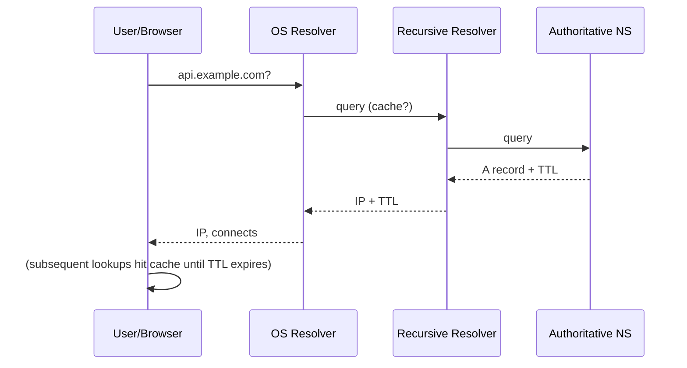

# DNS (Domain Name System)

## 1. One-Line Definition
DNS is the internet's phonebook: it translates human-readable hostnames (e.g., `api.example.com`) into the IP addresses machines actually use to connect.

## 2. Why Do We Need It?
Humans can't remember 104.18.x.y addresses, and IPs change constantly (new servers, auto-scaling, failovers). DNS decouples *names* from *addresses*, letting you move traffic, scale, and fail over without users noticing.

## 3. Simple Intuition
You tell a taxi "take me to Stadium Avenue". The driver looks up the street on a map (DNS query), gets coordinates (IP), and drives. The street name stays stable even when the road is rerouted (IP changes) — as long as the map (DNS) is updated.

## 4. What Happens Without It?
You'd hard-code IPs in every app and config. Any deployment, instance replacement, or failover would break links or require touching every client. You couldn't route users to the nearest datacenter cheaply, and a dead IP would mean waiting for manual fix.

## 5. Core Idea
DNS is a **hierarchical, distributed, cached** lookup system:
- **Resolvers:** your ISP/OS stub resolver asks a recursive resolver.
- **Recursive resolver:** walks the hierarchy — root → TLD (`.com`) → authoritative nameserver (for `example.com`).
- **Authoritative nameserver:** the one with *authority* for a domain; returns the **A/AAAA** record (IPv4/IPv6) plus **TTL**.
- **Records:** A/AAAA (address), CNAME (alias), MX (mail), TXT, NS, and geo-aware strategies (GeoDNS) for routing.

**TTL** is the currency: lower TTL = faster propagation of changes but more queries; higher TTL = caching efficiency but slower failover. **Caching** happens at every level (browser, OS, resolver, CDN).

**DNS load balancing:** multiple A records → the resolver/rotator distributes clients; GeoDNS returns different IPs per region; **Anycast** advertises the same IP from many locations — the network routes each user to the nearest.

## 6. Important Terminology

| Term | Simple Meaning |
|------|----------------|
| A / AAAA record | Hostname → IPv4 / IPv6 |
| CNAME | Hostname → another hostname (alias) |
| TTL | Cache lifetime of a record |
| Recursive resolver | Resolves on your behalf, caches |
| Authoritative NS | The source of truth for a zone |
| GeoDNS | Returns region-appropriate IPs |
| Anycast | Same IP served from many places; routing picks nearest |
| Propagation | Time for updated records to replace cached ones |

## 7. Basic Architecture



## 8. Request or Data Flow
1. `api.example.com` typed.
2. Stub resolver checks OS/browser cache → then recursive resolver (with its own cache).
3. On miss, resolver walks root → TLD → authoritative NS for example.com.
4. NS returns IP + TTL; every hop caches it.
5. Client connects to the IP; if the service fails, DNS isn't usually retried — clients may cache the dead IP for the TTL. That's why TTL sizing matters for failover.

## 9. Practical Example
**Global API with regional failover (assumptions):** users worldwide, want <30 ms resolution.
- GeoDNS returns `us-east-1` IPs to US users, `ap-south-1` to India.
- Each regional record uses a **low TTL (e.g., 60-120 s)** so a region failover propagates quickly.
- A global load balancer health-checks each region; on region failure it flips DNS to the healthy region (or relies on Anycast + BGP withdraw).

## 10. Scaling
- DNS itself scales via caching and anycast (query volume to your NS drops to cache-miss rate).
- More records/sharded zones: split into subdomains handled by different NS teams.
- **Peak queries** matter only for the authoritative tier; resolvers absorb nearly everything.
- **TTL strategy:** longer TTL on stable, infrastructure-facing names; short TTL on traffic-routing/fallback-critical names (the trade-off is resolver load).
- **Hotspot risk:** a flash-sale domain with a low TTL generates a query storm per second of cache — size authoritative NS for worst-case miss rate.

## 11. Reliability and Failure Scenarios
- **Authoritative NS outage:** everything for the zone breaks unless redundant NS + anycast — always run ≥2 NS in different locations.
- **Stale cache after failover:** clients hold the dead IP until TTL expires → mitigate with shorter TTL and connection-level retry ("connect to another A record").
- **DNS poisoning/cache pollution:** resolvers validate (DNSSEC) to prevent malformed redirects.
- **Detection:** resolve-time latency SLOs, resolver error rates, NS query volume; alert before users feel it.
- **Recovery:** as redundant as the NS layer; keep DNS change workflow (low TTL, staged) runbooked.

## 12. Consistency and Correctness
DNS is **eventually consistent by design** — write propagation is TTL-bounded. Never build "turn off DNS → instant failover" expectations; the delay is the sum of TTLs along every cache. Treat DNS as configuration that must change carefully and be monitored.

## 13. Performance
Adds one latency budget item (~10-30 ms typical resolution, sub-ms when cached). Keep the first-byte pipeline fast by caching at the edge (anycast resolvers), and remember **DNS is just the first hop** — a slow *connect* (TCP+TLS) is often misattributed to DNS.

## 14. Security
- **DNSSEC** validates records (prevents poisoning).
- **DDoS** on NS mitigated via anycast/caching.
- Never expose internal hostnames in public DNS (split-horizon DNS: public vs private zones).
- DNS is a reviewed-control point for phishing (domain hijack → TLS issuance) — lock registrar and use registrar locks.

## 15. Trade-Offs

| Choice | Advantages | Disadvantages | When to Use |
|--------|------------|---------------|-------------|
| Long TTL | Few queries, resilient to NS load | Slow failover propagation | Stable infra names |
| Short TTL | Fast failover/routing | More queries, more NS load | Region routing, LB endpoints |
| GeoDNS | Local traffic, less latency | Complexity, cache staleness | Global products |
| Anycast | Automatic nearest routing, DDoS absorb | Requires IP/network control | CDN, auth endpoints |
| Single NS | Simple | SPOF | Dev only |

## 16. Common Mistakes
- Copying IP-to-name config everywhere instead of using service discovery (DNS/SRV) — instance churn breaks hard-coded IPs.
- Long TTL on a name you rely on for failover — you've invented a 24h outage window.
- Forgetting **DNS caching in browsers/OS/app clients** — "it propagated" is only true for fresh lookups.
- Confusing A-record rotation with health-based routing: DNS LB can't see backend health unless you build a health-aware nameserver.

## 17. HLD vs LLD Boundary
HLD: naming topology, TTL strategy, GeoDNS/anycast placement, internal vs public zones, failover approach. LLD: exact resolver library config, retry/connect-timeout knobs in code.

## 18. Interview Questions

### Beginner
- What does DNS do and why is it cached?
- What is the difference between a recursive resolver and an authoritative nameserver?

### Intermediate
- How do you use DNS to route users to their nearest region?
- Why does a low TTL help during a disaster, and what does it cost?

### Advanced
- Design a DNS-based global load balancer that fails over automatically between regions.
- How do DNSSEC and Anycast change your DNS architecture for a global service?

## 19. Interview Memory Summary

> [!abstract]- Interview Memory Summary

### Remember

- DNS maps names→IPs, hierarchical + cached.
- TTL bounds propagation — the currency of failover speed.
- GeoDNS/Anycast give local routing + failover.
- Run ≥2 anycast authoritative nameservers.
- DNS failover is only as fast as the slowest cache.

### 30-Second Explanation

A hierarchical phonebook that caches: resolvers walk root → TLD → authoritative NS; TTL decides how fast changes propagate, so use GeoDNS for region affinity and a short TTL (60-120s) on names you rely on for quick failover.

### Interview Traps

- Claiming "DNS switches instantly during failover" — TTLs along the chain make it second-to-minute-level at best.
- A long TTL on a name you rely on for failover — you've invented a 24h outage window.
- Forgetting DNS caching in browsers/OS/app clients — "it propagated" is only true for fresh lookups.
- Confusing A-record rotation with health-based routing — DNS LB can't see backend health unless the nameserver is health-aware.

### Key Trade-Off

A lower TTL buys faster routing/failover propagation at the cost of more queries and more authoritative-NS load — size TTL to each name's role, never one value everywhere.

## 20. Related Concepts

### Commonly Used Together

- [[http-and-https|HTTP and HTTPS]] — every web request begins with a DNS lookup.
- [[load-balancing|Load Balancing]] — DNS/GeoDNS is the entry point the LB VIP resolves to.
- [[reverse-proxy|Reverse Proxy]] — the ingress that DNS points clients at.
- [[cdn|CDN]] — edge selection rides on GeoDNS/Anycast.

### Alternatives

- [[load-balancing|Load Balancing]] (DNS round-robin can distribute traffic, but only an LB can health-check and prune backends)

### Advanced Concepts

- [[caching|Caching]] — DNS is itself a hierarchy of caches; the same TTL/invalidation laws apply.

Related planned topics (not authored yet): geo-dns-anycast, global-load-balancing.

## 21. References
RFC 1034/1035 (DNS), RFC 4033+ (DNSSEC); current cloud DNS documentation (Route 53, Cloud DNS). Revisit for current geo-routing features.

## 22. Active Recall

Test yourself before revealing each answer.

> [!question]- What does DNS actually do, in one sentence?
> DNS is the internet's phonebook: it translates human-readable hostnames like `api.example.com` into the IP addresses machines use to connect, decoupling names from addresses that keep changing.

> [!question]- What is the difference between a recursive resolver and an authoritative nameserver?
> A recursive resolver walks the hierarchy (root → TLD → authoritative NS), caches the result, and answers on your behalf. The authoritative nameserver is the source of truth for a zone — the only one that owns the A/AAAA record for `example.com`.

> [!question]- How would you use DNS to route users to their nearest region?
> GeoDNS: return `us-east-1` IPs to US users and `ap-south-1` IPs to India users (or advertise one IP via Anycast and let the network route to the nearest PoP). Pair with a low TTL (60-120s) so a region failover propagates quickly.

> [!question]- What does a low TTL give you and what does it cost?
> Faster propagation — failover and routing changes reach clients sooner, which is exactly what you want during a disaster. It costs more queries and more load on the authoritative tier: every 1 second of cache = a potential query storm, so size the NS tier for the worst-case miss rate.

> [!question]- Your authoritative nameserver goes down. What happens, and how do you prevent it?
> The whole zone breaks: nobody can resolve the domain. Prevent by running ≥2 anycast NS in different locations, plus DNSSEC to stop poisoning; monitor resolve-time latency, resolver error rates, and NS query volume before users feel it.

> [!question]- You flip DNS to a healthy region during failover, but users still hit the dead region. Why?
> Every level caches: browser, OS, app client, recursive resolver. Until every TTL along the chain expires, clients keep resolving the old (dead) IP and connect is not retried. That's exactly why failover-critical names use a short TTL and connection-level retry ("try another A record").

> [!question]- Interview scenario: design DNS-based global load balancing with automatic regional failover.
> Put GeoDNS in front returning region-appropriate A records with a short TTL (60-120s). A global health checker probes each region; on failure it either updates the record to a healthy region or withdraws the route (Anycast + BGP). Add redundancy on the NS tier (≥2 anycast NS), and make the failover runbooked: staged, low-TTL, monitored.

> [!question]- What does DNSSEC add, and why do you need it despite the cost?
> It cryptographically validates records so resolvers can't be poisoned with fake answers (cache pollution / phishing redirects). The cost is crypto overhead and key management for the zone, but for anything serving real users it's the difference between trusting the resolver path and not.

## 23. When Should I Use This?

### Use it when

- Users reach your service by a hostname that must survive IP churn (auto-scaling, deploys, failover).
- You need to route users to their nearest region or datacenter (GeoDNS/Anycast).
- You want the first hop of failover to be switchable without touching client config.
- Client config must be decoupled from backend topology (DNS as service discovery).

### Avoid it when

- You need sub-second, health-aware failover — DNS TTLs and caches make it seconds-to-minutes at best.
- You need strict consistency — DNS is eventually consistent by design, TTL-bounded.
- Routing decisions depend on request content (path/header/cookie) — that's an L7 load balancer.
- Backends must be pruned by live health — DNS alone can't see a dead backend.

### What problem does it solve?

Clients hard-coding IPs break on every deploy, scale-out, or failover; DNS separates names from addresses so traffic moves without touching clients. Problem: name→address resolution must be fast, correct, and highly available. Bottleneck: one machine can't serve the world's lookups and can't know every backend change. Solution: a hierarchical, distributed, cached lookup with TTL-bounded propagation — plus Anycast/GeoDNS for locality.

### What problem does it NOT solve?

DNS cannot give you health-based or content-aware routing (that's a load balancer), sub-second failover (caches along the chain lag), or strict consistency (eventual by design). It also can't recover clients that have already cached a dead IP for the TTL.

## 24. Decision Connections

Decisions that go together with DNS:

- [[http-and-https|HTTP and HTTPS]] — every HTTPS flow begins with a DNS lookup; resolution latency is part of the first-byte budget.
- [[load-balancing|Load Balancing]] — DNS/GeoDNS finds the entry; the LB distributes behind it; DNS round-robin is the cheap, blind alternative.
- [[reverse-proxy|Reverse Proxy]] — the ingress DNS resolves to, the single TLS-terminating front door.
- [[cdn|CDN]] — CDN edge selection depends on GeoDNS/Anycast; DNS TTL drives how fast a broken edge reroutes.
- [[caching|Caching]] — DNS is a chain of caches; TTL is the invalidation knob, so the caching trade-offs apply verbatim.

Decision tree:

```
Users need to reach your service by name
    |
    +-- Few stable clients, fixed IPs?
    |      → skip DNS cleverness; hard-code or use plain A records
    |
    +-- IPs churn (auto-scaling, deploys, failover)?
    |      → [[dns|DNS]]
    |         |
    |         +-- Failover-speed critical?    → short TTL (60-120s)
    |         +-- Stable infra-facing names?  → long TTL
    |         +-- Region-local routing?       → GeoDNS
    |         +-- Need automatic nearest PoP? → Anycast
    |         +-- Poisoning a concern?        → DNSSEC
    |
    +-- Need health-aware, sub-second routing?
           → [[load-balancing|Load Balancing]] — DNS alone can't see backend health
```