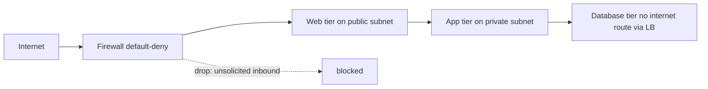

# Firewall

## 1. One-Line Definition
A firewall is a network device (or cloud service) that filters traffic passing between network zones by enforcing allow/deny rules — at the packet level (L3/L4), the session level, or the application level.

## 2. Why Do We Need It?
Nothing in a network should be reachable from anything else by default. Firewalls implement least-privilege networking: they decide which source zones may reach which destination zones on which ports/protocols, isolate public from private tiers, stop the majority of scanner/dos noise, and give your security team an enforcement point that matches the architecture diagram you drew.

## 3. Simple Intuition
A security guard with a clipboard at the building gate. He checks every visitor's ID (source), asks which floor and room they're going to (destination + port), and allows them only if the floor is on the permitted list. He also remembers visitors already inside (stateful tracking), and when someone says "everyone can come in without checking" you replace him — that's a default-permit firewall.

## 4. What Happens Without It?
Every service is globally reachable: your internal Redis, databases, admin consoles, and debug endpoints are one port-scan away from the internet. Attackers can reach anything they guess, unauthorized lateral movement within the network is trivial, and even benign mistakes (a dev tool listening on 0.0.0.0) become exposures. There is no single place to say "no."

## 5. Core Idea
- **Packet filter (stateless):** a rule per packet: source IP, dest IP, protocol, port → allow or deny. Cheap but blind — it can't tell a response from a new connection.
- **Stateful inspection:** tracks connections via a state table (conntrack); allows return traffic of established sessions automatically, blocks unsolicited inbound. This is the baseline modern firewall.
- **NGFW (next-gen):** adds application awareness (protocol identification beyond port numbers), user identity, TLS inspection, and IPS — layer 7.
- **WAF:** an application-layer firewall protecting web apps from HTTP attacks (injection, XSS) — the L7 cousin; see web-vulnerabilities and the planned waf-ddos topic.
- **Zones and default-deny:** you define trust zones (internet, web tier, app tier, db tier, admin) and default to dropping anything not explicitly allowed, then order rules so first-match wins (deny rules first).
- **Lifecycle:** rules must have owners, expiry, and review cadence; a stale "temporary" rule is how real breaches walk in.
- **Where it lives:** on-prem dedicated devices, cloud firewalls, security groups/NACLs (sky-friendly and stateless network ACLs), host-level firewalls, and LB/proxy-embedded filtering.

## 6. Important Terminology

| Term | Simple Meaning |
|------|----------------|
| Packet filter | Per-packet L3/L4 allow/deny without connection state |
| Stateful firewall | Tracks sessions; auto-allows return traffic of allowed connections |
| NGFW | Adds app-layer identification, identity, TLS inspection, IPS |
| WAF | Web-application HTTP-layer filter — the L7 specialist |
| ACL | Access Control List — ordered allow/deny rules |
| Zone | Trusted grouping of networks (internet, web, db, admin) |
| Default-deny | Drop everything unless a rule explicitly allows it |
| Rule ordering | First matching rule wins; broad deny before narrow allow |
| Security group | Cloud stateful filter attached to instances, allow-only |
| Network ACL | Cloud stateless filter at subnet edge with numbered rules |

## 7. Basic Architecture



## 8. Request or Data Flow
1. Client sends a packet; the firewall evaluates it against its rule set.
2. If no rule allows it → dropped (optionally logged). This covers both the scanner noise and your own audit evidence.
3. If allowed → the state table records the session so the response's return packets pass without re-evaluation.
4. Unsolicited inbound gets dropped unless an explicit rule (e.g., 443 to the web tier) opens it.
5. Anything beyond L4 must go to NGFW/WAF for app-layer decisions.

## 9. Practical Example
**Three-tier app (assumptions):** internet → CDN/LB → web → app → db.
- Firewall policies: allow 443 to the web tier from the CDN; allow web→app on the app port only; allow app→db on 5432 only; deny everything else east-west.
- The DB tier has no route to the internet and accepts nothing from any host except the app subnets — a leaked credential on the web tier cannot reach the database directly.
- Result of server compromise is contained: even a root shell in web can't talk to the DB without matching a rule.

## 10. Scaling
- **Rule-evaluation cost:** more rules and more state = more CPU; keep rule sets minimal, order deny-first so hot traffic hits short paths.
- **State table size:** NGFW/stateful firewalls hold a row per connection; websockets and long-lived sessions accumulate — size table capacity like conntrack (see nat).
- **Distributed firewalls:** cloud security groups attach to instances and scale with the fleet; a single big on-prem box becomes the bottleneck — prefer distributed rules that coexist with fewer, smaller edge filters.
- **Horizontal firewalls:** clustered or active-active pairs with symmetric routing or session-replication design.

## 11. Reliability and Failure Scenarios

| Failure | What Happens | Detection | Recovery | Trade-off |
|---------|--------------|-----------|----------|-----------|
| Firewall dies in fail-closed | All traffic blocked (full outage) | Health check on box | Failover pair; verify fail-open policy per tier | fail-open vs fail-closed |
| State table full | New connections dropped randomly | Table-full counter | Cleanup idle sessions, scale table | — |
| Stale rule added in an incident | Attack path left open after recovery | Rule-review on postmortem | Remove/expire incident rules | review burden |
| Buggy rule ordering | Legit traffic denied or everything allowed | Rule test suite + log review | Renumber rules; deny-first | testing cost |

## 12. Consistency and Correctness
Rule semantics must be predictable: **first-match-wins** means order is part of the contract, and overlapping rules must be resolved deliberately (broad deny, narrow allow). Stateful tracking must match the *flow* orientation — an allow rule applies per direction, and NAT in front (see nat) changes what source/dest addresses the firewall sees; place rules after NAT or account for translated addresses. Logging must be consistent so audit trails reconstruct who talked to whom.

## 13. Performance
- Stateful inspection adds a per-flow lookup and per-session memory — negligible at low volume, a real cost when rows pile up.
- TLS inspection (NGFW) is CPU-expensive: it re-terminates every HTTPS session and is a common reason firewalls cap throughput far below line rate.
- Rule count and eval order dominate packet rate: keep deny-first, short, and specific; monitor packet drops and table utilization.

## 14. Security
The firewall **is** the security control: enforce default-deny, deny first, match allow rules to real needs, and log denials for incident response. Avoid full-open ranges, avoid "allow all from anywhere," never put a DB/admin tier in a public zone, and remember firewalls inspect only what traverses them — internal traffic riding the same subnet does not pass through anything by default.

## 15. Trade-Offs

| Choice | Advantages | Disadvantages | When to Use |
|--------|------------|---------------|-------------|
| Stateless packet filter | Fast, simple, cheap | Blind to sessions; return traffic needs explicit rules | Low-cost edge padding |
| Stateful firewall | Understands sessions | State table is memory/SPOF surface | Standard tier boundary |
| NGFW | App-aware, TLS inspection, IPS | CPU-heavy, complexity, privacy | Regulated/enterprise edge |
| Security groups (cloud) | Scales with fleet, allow-only | Instance-level, not a subnet gate | Cloud native |
| WAF | L7 web-application protection | Doesn't replace network policy | Public web apps |

## 16. Common Mistakes
- Treating the firewall as a one-time setup: stale temporary rules are how breaches walk in.
- Default-permit everything and "deny later": the opposite order is the whole point.
- Allowing whole subnets/ranges instead of specific ports/services (blast-radius wastage).
- Putting the database or admin tier on a public zone with an allow rule that "we'll tighten later."
- Forgetting NAT changes addresses the firewall sees; or forgetting that cloud security groups are allow-only, so you must also add explicit deny or default routing controls where needed.

## 17. HLD vs LLD Boundary
HLD: zone model, allow/deny policy tiering per zone, stateful vs stateless choice, NGFW/WAF placement, rule philosophy (default-deny, deny-first), and NAT-in-front considerations. LLD: a specific security-group rule in cloud YAML, one iptables/ACL line, the WAF-rule regex for a given attack class.

## 18. Interview Questions

### Beginner
- What is the difference between a stateless and a stateful firewall?
- Why should firewalls default to deny rather than allow?

### Intermediate
- Your app tier is compromised with a root shell. How does the firewall architecture limit the blast radius?
- Cloud security groups are allow-only. What's the trap, and how do you add isolation on top?

### Advanced
- Design the firewall zoning model for a three-tier app with an admin VPN, including NAT consideration.
- A stateful firewall fails over and drops all connections. How do you make that survivable, and when is fail-open the right call?

## 19. Interview Memory Summary

> [!abstract]- Interview Memory Summary

### Remember

- Firewall = allow/deny policy between zones; default-deny is the baseline.
- Stateless = per-packet; stateful tracks sessions; NGFW/WAF go to layer 7.
- Rule ordering matters: first match wins — deny first, allow specific.
- It's a containment control: web-tier compromise shouldn't reach the DB.
- Logs of denials are your audit evidence and incident trail.
- NAT in front changes the addresses the firewall sees.

### 30-Second Explanation

A firewall is the enforcement point for least-privilege networking: zone-based default-deny rules, deny-first ordering, stateful session tracking, and (at the edge) application awareness. It contains a compromise to the tier it happened in, blocks unsolicited inbound, and produces the denial logs your security team needs — but only if rules are specific, reviewed, and never left as "temporary."

### Interview Traps

- Calling NAT a firewall (it blocks unsolicited inbound by side effect, nothing more).
- Building "allow everything, deny later" — the wrong order.
- Forgetting security groups are allow-only and so aren't an isolation boundary by themselves.
- Treating a firewall as a filter "somewhere in the chain" instead of a per-zone, per-direction policy.

### Key Trade-Off

The firewall trades connectivity convenience for containment and audit, and the cost is operational — state tables, rule hygiene, and failover posture must all be engineered or the control silently rots.

## 20. Related Concepts

### Prerequisites

- [[cloud-infrastructure|Cloud Infrastructure]] — the zones/regions/AZs the firewall spans
- [[encryption-and-keys|Encryption and Keys]] — TLS inspection and cert trust at the edge

### Commonly Used Together

- [[vpc-and-subnets|VPC and Subnets]] — subnets are the zones firewalls isolate
- [[nat|NAT]] — NAT in front changes the addresses/roles the firewall must reason about
- [[reverse-proxy|Reverse Proxy]] — edge tier where L7 filtering/WAF often lands
- [[rate-limiter|Rate Limiter]] — the traffic-shaping sibling of allow/deny

### Alternatives

- [[forward-proxy|Forward Proxy]] — egress policy for outbound client traffic

### Advanced Concepts

- [[web-vulnerabilities|Web Vulnerabilities]] — what a WAF at the edge filters
- [[service-mesh|Service Mesh]] — application-level policy/mTLS as a distributed "firewall"

Related planned topics (not authored yet): waf-ddos, network-partition.

## 21. References
NIST Special Publication 800-41 Rev. 1 (Guidelines on Firewalls and Firewall Policy); cloud-vendor security-group and network-ACL documentation for rules/stateless semantics. Verify current best practice with vendor docs.

## 22. Active Recall

Test yourself before revealing each answer.

> [!question]- Basic understanding: stateful vs stateless — what does the stateful one actually remember?
> A stateless packet filter applies the same per-packet test to everything. A stateful firewall records each allowed connection in a state table and automatically permits return traffic of established sessions while blocking unsolicited inbound — so replies flow without explicit rules but new arrivals don't.

> [!question]- Basic understanding: why is default-deny the correct starting posture?
> With default-allow, every new service, port, and debug endpoint is automatically reachable until someone remembers to block it — an attacker needs only one forgotten exposure. Default-deny flips the burden: reachability requires an explicit, reviewable decision, which is the only posture that matches the diagram you intended.

> [!question]- Design decision: your web tier is compromised with a root shell. Why does the firewall architecture matter, and what zone model contains it?
> If web can only reach the app tier on one port, and the app tier only reaches the DB on that DB port, a compromised web box has nowhere to go — it can't touch the DB or the internet. The model: internet → (443 only) → web → (app port only) → app → (5432 only) → db, with db having no public path at all.

> [!question]- Trade-off: fail-open vs fail-closed when a firewall fails.
> Fail-closed is safe but takes the whole network down on a single box failure — an availability outage. Fail-open keeps traffic flowing but silently removes the security control — a security outage. The correct answer is per-tier: public edge may accept brief fail-open behind redundancy, while a DB tier should fail closed; and the real mitigation is redundant firewalls so the question rarely matters.

> [!question]- Failure scenario: after an incident, you find a "temporary" firewall rule still open. Walk the fix.
> The rule is a standing exposure. Fix: incident cadence where every emergency rule has an owner, expiry, and sign-off record; on recovery, kill all temporary rules and re-open only what a review explicitly confirms, then add a regression test that fails if the rule count drifts.

> [!question]- Interview scenario: walk through securing the internet-facing surface of a public web app behind a CDN.
> 1) CDN in front; 2) firewall allows only 443 from the CDN to the edge/LB; 3) LB forwards to the app tier over an internal port (stateful allow); 4) app talks to the DB via a narrow allow; 5) DB has no internet route; 6) NGFW/WAF does L7/HTTPS inspection at the edge, deny-first, logging denials.

## 23. When Should I Use This?

### Use it when

- You have multiple trust zones (public edge, app tier, DB, admin) that must be isolated.
- You need to stop unsolicited inbound and contain compromise blast radius.
- Compliance requires an auditable network policy with denial logs.
- Cloud resources need per-instance, per-subnet, per-direction control.

### Avoid it when

- The "network" is a single sidecar-controlled mesh and policy already lives at the application layer (mesh mTLS/authorization replaces the L4 boundary for east-west traffic, though the edge boundary still belongs to a firewall/WAF).
- A stateless per-packet block would break session semantics you can't rebuild (stateful is the norm).

### What problem does it solve?

Problem: by default everything can reach everything, so exposure is a single forgotten port away. Bottleneck: no enforcement point between zones and no evidence of what was blocked. Solution: the firewall turns the intended architecture into enforced policy — default-deny, deny-first, stateful tracking, per-zone rules — plus the log trail that audits and incidents run on.

### What problem does it NOT solve?

It doesn't secure application logic (WAF/mesh needed for that), doesn't make NAT do security work, doesn't survive stale/excessively-broad rules left by humans, and inspecting only what traverses it leaves same-subnet traffic outside its view.

## 24. Decision Connections

Decisions that go together with firewalls:

- [[vpc-and-subnets|VPC and Subnets]] — the zones (public/private subnets) the firewall isolates.
- [[nat|NAT]] — NAT runs at the same edge; its address rewrites change what the firewall sees.
- [[cloud-infrastructure|Cloud Infrastructure]] — regions/AZs determine where filter boundaries can exist.
- [[reverse-proxy|Reverse Proxy]] — the edge tier where L7 enforcement/WAF terminates TLS.
- [[rate-limiter|Rate Limiter]] — load-shaping on top of allow/deny.
- [[encryption-and-keys|Encryption and Keys]] — TLS inspection only works with trusted keys/certs at the edge.
- [[web-vulnerabilities|Web Vulnerabilities]] — what a WAF at the boundary actually filters.

Decision tree:

```
Network must isolate zones and stop unsolicited inbound
    |
    +-- L3/L4 per-zone allow/deny needed?
    |      → [[firewall|Firewall]] (stateful, default-deny, deny-first)
    |         |
    |         +-- Instance-level, cloud-native, allow-only?  → security groups
    |         +-- Subnet-edge stateless numbering needed?    → network ACLs
    |         +-- NAT at the same edge?                       → coordinate with [[nat|NAT]]
    |
    +-- L7 / HTTPS inspection required?
    |      → NGFW or WAF at the [[reverse-proxy|Reverse Proxy]] edge ([[web-vulnerabilities|Web Vulnerabilities]])
    |
    +-- Application-level east-west policy?
    |      → [[service-mesh|Service Mesh]] mTLS/authorization
    |
    +-- Outbound client egress policy?
           → [[forward-proxy|Forward Proxy]]
```