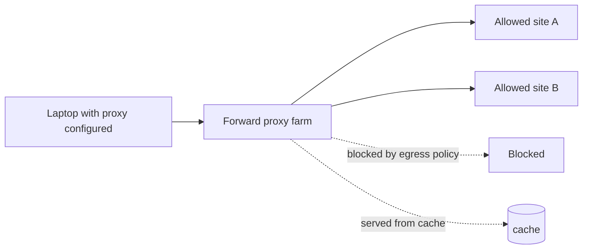

# Forward Proxy

## 1. One-Line Definition
A forward proxy is an intermediary that sits **in front of clients** and fetches internet resources on their behalf, because the client is explicitly configured (or directed) to route its outbound traffic through it.

## 2. Why Do We Need It?
Organizations need a choke point for **outbound** traffic: to enforce egress policy (block domains, filter categories), to inspect and log what leaves the network, to cache frequently fetched content, to apply authentication before granting internet access, and to give clients a stable gateway IP. A forward proxy centralizes all of that in one place that clients opt into reaching.

## 3. Simple Intuition
You don't walk to the embassy yourself; you give a trusted courier a list of documents to fetch and he brings them back. He knows every place you go, refuses packages from banned senders, keeps copies of frequently requested diplomas (cache), and will only run errands for people he has checked at the front desk (auth). The courier is the forward proxy; the destinations never meet you directly.

## 4. What Happens Without It?
Every client connects directly to the internet: no egress audit trail, no policy enforcement, no caching — 100 mobile/laptop/office clients download the same firmware or OS patch 100 times from the WAN. Malware exfiltration has a direct, unobserved path out of the network, and there is no single place to revoke or gate internet access.

## 5. Core Idea
- **Client-facing direction:** the proxy is configured *on the client* (system proxy settings, PAC file, or transparent redirection), making the client actively send its traffic to the proxy — the reverse of a reverse proxy, which clients reach by ordinary URL.
- **Modes:** explicit (client knows the proxy, sends absolute URI requests) vs transparent (network redirects traffic without client config).
- **Duties:** egress policy (DNS/URL allow-lists and block-lists), caching, authentication, logging/observability, TLS inspection — the proxy can decrypt-and-rescan HTTPS **only when** the client trusts its CA, otherwise it can only pass the tunnel through.
- **Tunneling:** for HTTPS, explicit proxies typically use the HTTP `CONNECT` method to open a raw TCP tunnel, after which the proxy sees only host+port, not bytes (unless the client trusts its CA for termination).
- **Forward proxy ≠ reverse proxy:** forward proxy fronts and controls the **client's** traffic to the internet; reverse proxy fronts and controls the internet's traffic to your **servers**.

## 6. Important Terminology

| Term | Simple Meaning |
|------|----------------|
| Forward proxy | Intermediary in front of clients, fetching from the internet for them |
| Reverse proxy | Intermediary in front of servers, accepting internet traffic for them |
| Explicit proxy | Client is configured to send traffic through the proxy |
| Transparent proxy | Network redirects client traffic to the proxy without config |
| CONNECT | HTTP method that opens a raw tunnel through the proxy (for HTTPS) |
| PAC file | Script a client uses to decide which requests go through the proxy |
| TLS interception | Proxy decrypts HTTPS by presenting its own trusted CA certificate |
| Proxy chain | Multiple proxies in series (client → proxy → proxy → origin) |

## 7. Basic Architecture



## 8. Request or Data Flow
1. Client is configured (or redirected) to send outbound traffic through the proxy.
2. Client sends an absolute-URI request (explicit mode) or the network transparently intercepts it.
3. Proxy checks egress policy: allow → continue; block → deny; cache hit → serve cached copy.
4. For HTTPS, proxy opens a CONNECT tunnel (or terminates TLS if the client trusts its CA).
5. Proxy logs metadata, optionally caches the response, and returns it to the client.

## 9. Practical Example
**Enterprise / office network (assumptions):** 10,000 devices, heavy repeat fetches.
- OS update URLs allowed + cached → a 200MB patch downloaded 1000 times becomes 1 WAN fetch + 999 LAN cache hits; egress bandwidth drops by orders of magnitude.
- Products/policies: every outbound request passes auth; a blocked domain list is enforced in one place.
- HTTPS: the org installs its CA on corporate laptops, so the proxy can scan traffic; BYOD devices without the CA get tunnel-only passthrough.

## 10. Scaling
- **Proxy farm:** run many stateless-by-request proxy instances behind a load balancer; scale out with clients, not by making the proxy beefier.
- **Cache is the lever:** hit ratio is what actually cuts WAN egress — size the shared cache, place it near the WAN link.
- **Connectivity:** treat the proxy as a SPOF — clients that can't reach it get *no internet*, so redundancy + client-side failover (multiple proxy addresses) is a reliability requirement.
- **TLS inspection CPU:** decrypt-and-rescan is expensive; dedicated inspection nodes or offload are the scaling answer, mirroring TLS termination in reverse proxies.

## 11. Reliability and Failure Scenarios

| Failure | What Happens | Detection | Recovery | Trade-off |
|---------|--------------|-----------|----------|-----------|
| Proxy down | All clients lose internet | Proxy health; client errors surge | Failover pair + client retry to next proxy | redundancy cost |
| Cache corruption | Stale/incorrect cached objects served | Cache checksum/validation | Evict + revalidate from origin | — |
| Tunnels exhausted | New HTTPS connections fail | Idle/tunnel count | Scale farm, tune tunnel timeouts | — |
| CA compromise | Proxy can decrypt everything (huge risk) | New-CA audit / HSM | Revoke, reissue, rotate; treat certs as critical secrets | ops burden |

## 12. Consistency and Correctness
Forward proxying itself adds no ordering guarantees — it is a transport. The correctness-sensitive parts are (a) cached-object freshness (must honor origin `Cache-Control`/`ETag`, or serve stale) and (b) logging completeness: if audit is the point, every allowed and blocked request must be logged with a consistent format and dedup on retries, so the audit trail does not double-count retried requests.

## 13. Performance
- Added hop: every request pays proxy-to-client + proxy-to-origin and the proxy's CPU. On the LAN this is microseconds-to-millis; the real win is negative latency from cache hits and deduplicated WAN fetches.
- Tunnels add a cheap transparent hop; TLS inspection adds one or two RTTs and significant CPU per new connection.
- Watch `cache hit ratio`, `CONNECT rate`, and proxy CPU/idle-tunnel counts as the primary signals.

## 14. Security
- Egress policy is the headline security value — DNS/URL allow-lists, malware/block lists, and classification filtering before traffic leaves.
- Detect and stop data exfiltration and cryptomining by category, not per-domain exceptions.
- TLS inspection is a dual-edged weapon: it must be disclosed, scoped, and the proxy CA stored/rotated like a crown jewel.

## 15. Trade-Offs

| Choice | Advantages | Disadvantages | When to Use |
|--------|------------|---------------|-------------|
| Explicit proxy | Full control, per-client policy | Requires client config | Corporate devices |
| Transparent proxy | Zero client config | Harder policy by user/identity | Network-level egress control |
| TLS inspection | Can scan HTTPS | Decrypts traffic (privacy), CA risk, CPU | Compliant corporate fleets |
| Tunnel-only HTTPS | Respects privacy, simple | Blind to content | BYOD / high-trust policy |
| Caching proxy | Huge WAN savings | Staleness risk, cache sizing | Repetitive download traffic |

## 16. Common Mistakes
- Confusing forward with reverse proxy in an interview — direction to clients vs to servers is the whole point.
- Assuming the proxy sees HTTPS contents; without a trusted CA it only sees the tunnel endpoint.
- Treating the proxy as optional/golden: when it dies, the entire client fleet loses connectivity; plan failover.
- Letting unindexed catch-all rules bypass egress policy ("allow all" exceptions).
- Ignoring stale-cache validation — serving an old cached object as if it were fresh.

## 17. HLD vs LLD Boundary
HLD: proxy tier placement and scale, egress policy taxonomy, caching policy, TLS inspection decision on/off, failover model. LLD: a specific client's PAC file, the proxy daemon's access-control syntax, one rule string in the firewall/allow-list.

## 18. Interview Questions

### Beginner
- What is a forward proxy and who does it sit in front of?
- How is a forward proxy different from a reverse proxy?

### Intermediate
- How does a forward proxy handle HTTPS traffic it can't decrypt?
- What scaling lever actually saves egress bandwidth and why?

### Advanced
- Design egress control for a 10k-device enterprise including TLS inspection and its risks.
- Compare transparent vs explicit forward proxies for policy enforcement by user identity.

## 19. Interview Memory Summary

> [!abstract]- Interview Memory Summary

### Remember

- Forward proxy fronts **clients**; reverse proxy fronts **servers**.
- Clients are configured (explicit) or redirected (transparent) to use it.
- Duties: egress policy, caching, auth, logging, TLS inspection.
- Without a trusted CA, HTTPS passes as a CONNECT tunnel the proxy can't read.
- The proxy is a SPOF for the client fleet — failover is required.
- Cache hit ratio is the egress-bandwidth lever.

### 30-Second Explanation

A forward proxy sits in front of clients and fetches internet resources for them, enforcing egress policy, caching, and logging in one choke point while a reverse proxy does the mirror image for servers. Client config or transparent network redirection sends traffic through it; HTTPS is tunneled (CONNECT) unless the client trusts its CA for inspection; and reliability matters doubly because a dead proxy means no internet at all.

### Interview Traps

- Mixing up direction (clients vs servers) — the number-one quiz trap for this topic.
- Claiming the proxy "sees" HTTPS when it is tunneled.
- Missing the failover obligation for a system that blankly cuts connectivity.
- Recommending TLS inspection without addressing CA and privacy risk.

### Key Trade-Off

Forward proxying buys egress control, cache reuse, and audit in one place by routing all client traffic through a choke point that becomes a SPOF and a privacy/staleness surface.

## 20. Related Concepts

### Prerequisites

- [[http-and-https|HTTP and HTTPS]] — the protocol the proxy speaks, incl. CONNECT tunneling and caching headers
- [[dns|DNS]] — filtering is often done at DNS/domain level inside the proxy

### Commonly Used Together

- [[encryption-and-keys|Encryption and Keys]] — TLS inspection and CA trust decisions
- [[web-vulnerabilities|Web Vulnerabilities]] — what egress inspection tries to stop leaving
- [[session-management|Session Management]] — proxy auth gates client identity before internet access
- [[load-balancing|Load Balancing]] — how a proxy farm scales behind a common endpoint

### Alternatives

- [[reverse-proxy|Reverse Proxy]] — the same idea in the opposite direction (fronts servers)

### Advanced Concepts

- [[service-mesh|Service Mesh]] — microservice equivalents move these duties into sidecars at platform scale

Related planned topics (not authored yet): ip-address, network-partition.

## 21. References
RFC 9110 (HTTP semantics incl. absolute-form request targets and CONNECT); RFC 1928 (SOCKS5, an alternative forward-proxy/tunnel protocol). Verify egress-policy and caching behavior with current proxy-vendor docs.

## 22. Active Recall

Test yourself before revealing each answer.

> [!question]- Basic understanding: in one sentence, what does a forward proxy do that a reverse proxy does not?
> It proxies traffic going *out* from clients to the internet, while a reverse proxy proxies traffic coming *in* to servers. Same box, opposite flank.

> [!question]- Basic understanding: how does a forward proxy handle HTTPS it cannot decrypt?
> It opens a raw tunnel via the HTTP CONNECT method: the client negotiates TLS directly with the origin through the tunnel, and the proxy only sees the destination host and port — unless the client trusts the proxy's CA, in which case the proxy can terminate and inspect.

> [!question]- Design decision: for a corporate fleet, explicit or transparent forward proxy — and why?
> Explicit gives per-user/per-device policy and auth at the cost of client configuration. Transparent requires no client config but can't attribute traffic to a user reliably. For identity-based policy you usually want explicit (or 802.1x/WireGuard-style per-user redirection); for blanket network egress blocking, transparent suffices.

> [!question]- Trade-off: what do you give up by enabling TLS inspection?
> Privacy: the proxy sees decrypted payloads, so data at rest in the proxy's logs/HSM must be protected; trust: clients must install the proxy's CA, creating a single point of decryption that is a lucrative target; performance: every new HTTPS flow pays decrypt+rescan CPU.

> [!question]- Failure scenario: the forward proxy crashes mid-afternoon. What happens to the fleet, and what saves you?
> Every configured client loses internet — worst case, all outbound work fails and audit logs stop. Saves you: a redundant proxy pair with automatic failover, multiple proxy addresses configured per client with retry, and monitoring that treats proxy health as a critical service.

> [!question]- Interview scenario: how do you stop an office from leaking data while still letting them browse HTTPS sites?
> Run a forward proxy with egress allow-lists and category filtering; for HTTPS, decide the TLS-inspection stance (corporate devices: trusted CA + inspection; BYOD: tunnel-only). Log every allow/deny decision, cache repeated downloads at the edge, and design proxy failover so policy enforcement never silently goes offline.

## 23. When Should I Use This?

### Use it when

- You need enforced, auditable **outbound** policy (block/monitor what leaves the network).
- Clients repeat-fetch content and you want LAN-cached copies to cut WAN bandwidth.
- Internet access requires authentication or per-user gating.
- You must filter or detect at a level DNS alone can't (URLs, categories, malware signatures).

### Avoid it when

- The traffic is internal and you need to front *servers* — that is a reverse proxy.
- Clients can't be configured and there's no clean place to redirect — transparency is not possible.
- You cannot accept a fleet-wide SPOF or the privacy burden of inspection.

### What problem does it solve?

Problem: outbound traffic is ungoverned, unobserved, and duplicated across the WAN. Bottleneck: no choke point for policy, cache, or audit, and repeated content saturates egress. Solution: a forward proxy concentrates client traffic, enforcing policy, caching hot content, and logging every decision in one scalable, redundant tier.

### What problem does it NOT solve?

It doesn't protect your own servers (reverse proxy's job), doesn't see encrypted content without the client trusting its CA, and it introduces new failure and privacy surfaces that must be engineered, not assumed away.

## 24. Decision Connections

Decisions that go together with a forward proxy:

- [[reverse-proxy|Reverse Proxy]] — identical mechanism, opposite direction; interviewers love the contrast.
- [[http-and-https|HTTP and HTTPS]] — absolute-URI requests, CONNECT tunneling, and cache headers all run on HTTP.
- [[dns|DNS]] — egress filtering frequently starts with domain resolution and can integrate with the proxy.
- [[encryption-and-keys|Encryption and Keys]] — TLS inspection keys/CA lifecycle is the sensitive tail of the design.
- [[web-vulnerabilities|Web Vulnerabilities]] — the exfiltration/malware classes egress control exists to intercept.
- [[session-management|Session Management]] — gating identity before granting internet access.
- [[load-balancing|Load Balancing]] — how the proxy farm itself stays available and scalable.

Decision tree:

```
Clients need controlled outbound access to the internet
    |
    +-- Identity-based egress policy and auth required?
    |      → [[forward-proxy|Forward Proxy]] (explicit mode)
    |
    +-- Only blanket network egress blocking, no config?
    |      → transparent forward proxy
    |
    +-- HTTPS content must be inspectable?
    |      → TLS inspection (client trusts proxy CA) — weigh against [[encryption-and-keys|Encryption and Keys]] risk
    |
    +-- Servers, not clients, need protecting?
    |      → [[reverse-proxy|Reverse Proxy]]
    |
    +-- Repeated downloads saturating the WAN?
           → enable proxy caching ([[http-and-https|HTTP and HTTPS]] cache headers)
```