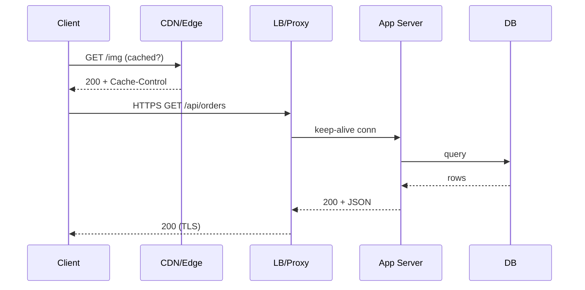

# HTTP and HTTPS

## 1. One-Line Definition
HTTP is the request/response protocol web apps run on; HTTPS is HTTP running inside a TLS-encrypted tunnel so data cannot be read or tampered with in transit.

## 2. Why Do We Need It?
Nearly every system design flows over HTTP(S): browsers and mobile apps talk to APIs, services call each other. Understanding methods, status codes, headers, keep-alive, caching, connection reuse, and the HTTP/1.1 vs 2 vs 3 differences directly shapes API design, proxy layers, and latency budgets.

## 3. Simple Intuition
HTTP is a typed postal service: an envelope (request line + headers), a body, and a standardized reply with a status slip (200 OK, 404 Not Found). HTTPS is the same postal service inside a locked, sealed courier van — nobody on the road (network) can read or alter the mail.

## 4. What Happens Without It?
Without a standard protocol every client and server would need bespoke wire formats (RPC without a standard). Without HTTPS, anyone on the network (WiFi, ISP, middlebox) can read passwords, tokens, and payment details, and tamper with responses.

## 5. Core Idea
**HTTP request:** method (GET/POST/PUT/PATCH/DELETE), URL, headers, optional body.
**Response:** status code (1xx informational, 2xx success, 3xx redirect, 4xx client error, 5xx server error), headers, body.
**Stateless:** each request is independent; *session* state is layered on via cookies/tokens.
**Connection reuse:** HTTP/1.1 keep-alive reuses TCP connections (saves TCP+TLS handshakes); HTTP/2 adds multiplexing (many streams over one connection, header compression); HTTP/3 runs over QUIC/UDP (faster handshake, better on lossy networks, no head-of-line blocking).
**HTTPS/TLS:** handshake negotiates cipher + keys; then all data is encrypted with symmetric bulk encryption (with certificate-based server identity). TLS session resumption makes repeated handshakes cheap.

**Why it matters in HLD:** status codes drive retry semantics (5xx = safe-ish to retry, 4xx = don't), headers carry caching/idempotency/auth, keep-alive + HTTP/2 reduce handshake storms, HTTPS adds a handshake latency cost that proxys/CDN and connection reuse mitigate.

## 6. Important Terminology

| Term                  | Simple Meaning                                                 |
| --------------------- | -------------------------------------------------------------- |
| Method                | GET/POST/PUT/PATCH/DELETE — verb the client wants              |
| Status code           | 3-digit result: 2xx ok, 3xx redirect, 4xx client, 5xx server   |
| Header                | Metadata (auth, content-type, cache-control, idempotency-key)  |
| Keep-alive            | Reuse one TCP connection for many requests                     |
| Multiplexing (HTTP/2) | Multiple parallel requests on one connection                   |
| TLS handshake         | Key exchange + identity check before encryption starts         |
| Session resumption    | Skip some handshake steps for repeat visits                    |
| Cookie                | Small client-stored token sent on every request to that domain |
| Idempotency-key       | Client-provided ID so a retried request doesn't double-apply   |

## 7. Basic Architecture



The edge (CDN/proxy) terminates most static HTTPS; the app path uses keep-alive to minimize handshakes.

## 8. Request or Data Flow
1. DNS resolves host; TCP connect; TLS handshake.
2. Client sends request with auth header/cookie.
3. Load balancer terminates HTTPS (or passes through), routes to a healthy app node.
4. App validates, does work, returns status + body.
5. Headers like `Cache-Control`, `ETag`, and `Idempotency-Key` decide caching and retry behavior.

## 9. Practical Example
**E-commerce checkout (assumptions):** idempotent payment retries.
- `POST /payments` with `Idempotency-Key: <uuid>`.
- Timeout on the call → client retries with the *same* key → server dedups → no double charge (HTTP status 200/409 semantics).
- Static assets via CDN with `Cache-Control: public, max-age=31536000` (cache-friendly hashed filenames).
- Server error semantics: 429 (rate limited) and 503 (overloaded) must be retried with backoff; 400 (bad request) must not.

## 10. Scaling
- **Connection scaling:** thousands of clients hammering TLS handshakes saturate CPU — use keep-alive, HTTP/2 multiplexing, TLS resumption, and let the proxy/CDN absorb handshakes.
- **Layered caching:** browser (`Cache-Control`), CDN/edge, app cache — each layer multiplies effective capacity.
- **Long-polling/SSE/WebSockets:** one open connection each — separate those from normal HTTP and size connection/instance limits differently.
- **HTTP/2 head-of-line:** TCP-level HOL remains on lossy networks → HTTP/3/QUIC removes it (better mobile video).

## 11. Reliability and Failure Scenarios
- **Handshake storms** on failover: many clients reconnecting after an LB blip — connection reuse + resumption + admission control.
- **Retry storms:** clients retry 5xx aggressively during an outage → exponential backoff + jitter + circuit breakers, and honor `Retry-After`.
- **Partial response / slow loris:** set read timeouts; proxies enforce max body size and timeouts.
- **Detection:** status-code rate (5xx-rate SLO), p99 latency, connection reuse success metrics.
- **Recovery:** LBs drain connections (connection draining), canary traffic, and cache-always pages.

## 12. Consistency and Correctness
HTTP is stateless, so correctness must be expressed explicitly: idempotency keys for retries, ETag/If-Match for conditional updates, 409 on version conflicts. Maps cleanly to HLD: "state lives in the server, requests are pure commands with keys."

## 13. Performance
- Handshake cost: TCP ≈ RTT, TLS ≈ 1-2 extra RTTs (resumable), HTTP/2 & 3 further cut repeated setup.
- Headers/compression: HTTP/2 HPACK, gzip/brotli bodies.
- Per-hop budgets: CDN edge → origin; keep payloads small and retry-cheap.

## 14. Security
- HTTPS everywhere: in-transit encryption; TLS versions current; short-lived certs.
- Auth via headers/tokens (not query params — they leak into logs).
- CSRF: state-changing requests via cookies need protection; prefer token headers.
- Edge controls: WAF, rate limiting per IP/token, and `HSTS` to force HTTPS.

## 15. Trade-Offs

| Choice | Advantages | Disadvantages | When to Use |
|--------|------------|---------------|-------------|
| HTTP/1.1 + keep-alive | Simple, universal | One-in-flight per conn, no multiplexing | Compat, low RTT cost |
| HTTP/2 | Multiplexing, compression | HOL over TCP on lossy nets | General APIs, web |
| HTTP/3 (QUIC) | Zero-RTT-ish, no HOL | CDN/proxy support varies | Mobile, video, lossy nets |
| REST (HTTP verbs) | Ubiquitous, cacheable | Over-fetching, chatty | Public APIs |
| Chatty granular APIs | Simple each call | Handshake + round trips overhead | Internal, low-scale |
| Session via cookies | Browser-native | CSRF surface, cookie size limits | Browser web apps |

## 16. Common Mistakes
- Retrying 4xx (4xx = client error; retry only 5xx/429/408/timeouts).
- Sending auth in query strings or logging headers — token leaks.
- Ignoring keep-alive/connection pooling → handshake storms under load.
- Using HTTPS "for free" without planning cert management, resumption, and edge termination.
- Choosing HTTP/2 but never using multiplexing benefits in the API shape.

## 17. HLD vs LLD Boundary
HLD: protocol choice (HTTP vs gRPC), edge termination, caching headers policy, connection budgets, retry semantics at system level. LLD: a specific client's retry/backoff implementation, exact header handling in code, connection pool settings per service.

## 18. Interview Questions

### Beginner
- What is the difference between HTTP and HTTPS?
- Name the HTTP methods you'd use to read, create, update, and delete a resource.

### Intermediate
- Which requests can be safely retried, and why?
- Why does HTTP/2 improve latency over HTTP/1.1, and what problem does HTTP/3 fix?

### Advanced
- Design an idempotent payment API over HTTP for a mobile app with flaky networks.
- How does keep-alive/connection-reuse change your capacity estimate for a 10k-QPS API?

## 19. Interview Memory Summary

> [!abstract]- Interview Memory Summary

### Remember

- Methods + status codes + headers = the contract.
- 4xx don't retry; 5xx/429 do (with backoff).
- Idempotency keys make retries safe.
- HTTPS = TLS tunnel; terminate at the edge, reuse connections.
- HTTP/1.1 → 2 → 3: connection reuse, multiplexing, no head-of-line blocking.

### 30-Second Explanation

HTTP is a typed request/response contract — verbs for CRUD, status codes for semantics, headers for caching/auth/idempotency. Retry 5xx/429 with backoff, never 4xx; carry an idempotency key so a retry can't double-apply, honor Cache-Control for layered caching, and let the edge terminate TLS with keep-alive/HTTP-2 reuse.

### Interview Traps

- Saying "retry on error" without distinguishing 4xx from 5xx — interviewers push on the duplicate-write scenario immediately.
- Retrying 4xx requests (client error) — only 5xx/429/408 and timeouts are retryable.
- Sending auth in query strings or logging headers — token leaks.
- Ignoring keep-alive/connection pooling → handshake storms under load.
- Choosing HTTP/2 without using multiplexing in the API shape.

### Key Trade-Off

HTTP buys reactive simplicity and layer-agnostic caching by staying stateless; correctness is pushed onto explicit contracts (status semantics, idempotency keys, Cache-Control) that you must design, not assume.

## 20. Related Concepts

### Prerequisites

- [[dns|DNS]] — the hostname must resolve before any HTTP request starts.

### Commonly Used Together

- [[load-balancing|Load Balancing]] — L7 LBs route on HTTP paths/headers and terminate TLS.
- [[reverse-proxy|Reverse Proxy]] — terminating TLS, caching, and edge routing in front of backends.
- [[caching|Caching]] — Cache-Control/ETag decide what each layer may cache.
- [[cdn|CDN]] — edge servers serve HTTP with cache headers; HTTP/3 support varies by provider.

### Alternatives

- [[message-queue|Message Queue]] (async, decoupled communication instead of synchronous request/response when a reply isn't needed on the same call)

### Advanced Concepts

- [[web-vulnerabilities|Web Vulnerabilities]] — HTTP surfaces CSRF, header injection, and auth-leak classes that edge/hardening choices interact with.

Related planned topics (not authored yet): rest, http-caching.

## 21. References
RFC 9110/9112 (HTTP semantics + HTTP/1.1), RFC 7540 (HTTP/2), RFC 9000 (QUIC/HTTP3), RFC 8446 (TLS 1.3). Re-check current protocol/CVE status with vendor docs.

## 22. Active Recall

Test yourself before revealing each answer.

> [!question]- What is the difference between HTTP and HTTPS?
> HTTP is the request/response protocol; HTTPS is HTTP inside a TLS-encrypted tunnel so data cannot be read or tampered with in transit. HTTPS adds a handshake round trip or two, which connection reuse (keep-alive, session resumption) mitigates.

> [!question]- Name the HTTP methods for read, create, update, and delete — and which errors you may retry.
> GET reads, POST creates, PUT/PATCH update, DELETE deletes. Retry-safety: 5xx/429/timeouts may be retried (with backoff); 4xx (client errors) must not be — retrying a bad request is guaranteed to fail again.

> [!question]- How do idempotency keys make payment retries safe?
> The client sends the same `Idempotency-Key` on retries; the server dedups against it, so the request applies exactly once even over a flaky network. Without it, a timed-out `POST /payments` retry could double-charge.

> [!question]- Why does HTTP/2 improve latency over HTTP/1.1, and what does HTTP/3 fix?
> HTTP/2 multiplexes many streams over one connection and compresses headers, cutting handshake overhead and parallelizing requests. HTTP/3 runs over QUIC/UDP, removing TCP head-of-line blocking on lossy networks — better for mobile and video.

> [!question]- Trade-off: where do you terminate TLS, and what do you pay either way?
> Terminate at the edge (CDN/proxy/LB): one certificate, TLS CPU offloaded, but the edge sees plaintext. Terminate end-to-end at the app: data stays encrypted further, but every backend pays handshake cost and manages its own certs — and only the edge knows the "true" client without extra headers.

> [!question]- A load balancer blips and thousands of clients reconnect at once. What goes wrong and how do you fix it?
> A handshake storm: every client renegotiates TLS simultaneously and saturates CPU. Mitigate with keep-alive + TLS session resumption so reconnects are cheap, use connection draining on the LB, and add admission control/backoff on clients.

> [!question]- Interview scenario: design an idempotent payment API over HTTP for mobile clients on flaky networks.
> POST /payments with a client-generated Idempotency-Key (UUID); on timeout the client retries with the same key and the server dedups (200 or 409). Return 429/503 for overload with Retry-After, never retry 400s, and keep Cache-Control off PII/auth responses.

> [!question]- What does keep-alive do, and how does connection reuse change a 10k-QPS capacity estimate?
> Keep-alive reuses one TCP+TLS connection for many requests instead of paying a handshake per request; HTTP/2 goes further by multiplexing. A capacity estimate switches from "handshake-bound" to "connection-bound" — you size by concurrent connections and per-request processing, not raw handshake throughput.

## 23. When Should I Use This?

### Use it when

- Browsers and mobile clients must talk to your APIs — HTTP(S) is the default standard.
- You need cacheability across layers (browser → CDN → proxy) via Cache-Control.
- Retries on flaky networks must be safe — idempotency keys + status semantics.
- Services communicate synchronously and you want a universal, inspectable wire protocol.

### Avoid it when

- You need strict typed schemas and streaming RPC at high internal scale (a binary/gRPC-style protocol is usually better).
- You need bidirectional push with low latency at high volume (WebSockets/QUIC).
- The flow is async and fire-and-forget — a message queue is the right transport.
- Your service is internal and chatty — many small HTTP calls add headers + round-trip overhead.

### What problem does it solve?

Problem: every client and server needs a standard, securable way to exchange requests and responses, and every request currently pays TCP+TLS handshake overhead. Bottleneck: raw handshakes and repeated setup dominate latency at scale, and plaintext lets anyone on the wire read/tamper. Solution: HTTP standardizes the contract; HTTPS (TLS) encrypts it; keep-alive, HTTP/2 multiplexing, and HTTP/3/QUIC remove the handshake and head-of-line costs.

### What problem does it NOT solve?

HTTP doesn't give you reliable delivery, freshness, or correctness — retry policy (idempotency, backoff), caching semantics (Cache-Control), and auth must all be built explicitly. It also doesn't give schema enforcement or efficient streaming for high-volume RPC; it's a vehicle, not a semantics layer.

## 24. Decision Connections

Decisions that go together with HTTP and HTTPS:

- [[dns|DNS]] — the lookup before the first byte; DNS TTL affects how fast you can move endpoints.
- [[load-balancing|Load Balancing]] — L7 balancing operates on method/path/headers and terminates TLS at the edge.
- [[reverse-proxy|Reverse Proxy]] — the front door where HTTP edge duties (TLS, caching, WAF, routing) are concentrated.
- [[caching|Caching]] — Cache-Control/ETag decide what may be cached where; HTTP caching is the first cache tier.
- [[cdn|CDN]] — edges serve HTTP with cache headers; protocol version (HTTP/1.1 vs 2 vs 3) changes edge behavior.
- [[retry-and-timeout|Retry and Timeout]] — HTTP status codes (4xx vs 5xx/429) drive retry policy; add backoff + jitter.
- [[web-vulnerabilities|Web Vulnerabilities]] — cookie-based auth over HTTP creates the CSRF surface; HSTS, header hygiene, and edge controls close it.

Decision tree:

```
A client must talk to a server over the network
    |
    +-- Standard web contract (browsers/mobile, universal)?
    |      → [[http-and-https|HTTP and HTTPS]]
    |         |
    |         +-- In-transit secrecy required?  → HTTPS (TLS), terminate at the edge
    |         +-- Retries possible?             → idempotency-key + retry only 5xx/429/408
    |         +-- Many requests per connection? → keep-alive, HTTP/2 multiplexing
    |         +-- Lossy/high-latency networks?  → HTTP/3 (QUIC)
    |         +-- Cacheable content?            → Cache-Control + [[caching|Caching]]
    |
    +-- Async fire-and-forget, no reply needed?
    |      → [[message-queue|Message Queue]]
    |
    +-- Strict typed streaming RPC at high internal scale?
           → consider a binary/gRPC-style protocol (beyond HTTP's sweet spot)
```