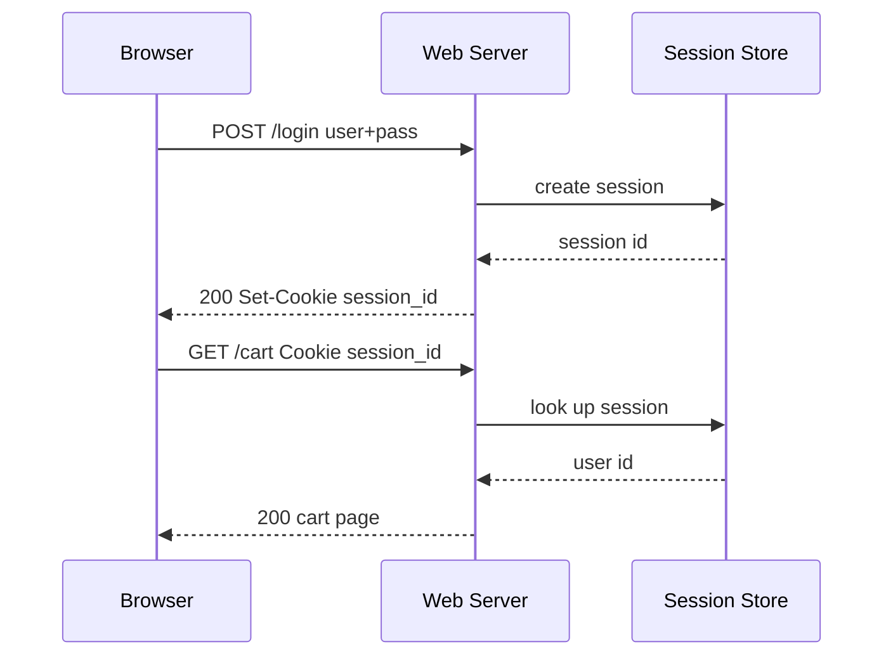

# HTTP Cookies

## 1. One-Line Definition
A cookie is a small piece of server-set state that the browser stores and automatically echoes back on every request to its domain, turning a stateless [[http-and-https|HTTP]] exchange into a stateful session.

## 2. Why Do We Need It?
HTTP is stateless by design: each request is independent and the server remembers nothing. But real products need continuity — who is logged in, what is in the cart, which experiment the user saw. Cookies give the browser a place to hold that token so the server can stay stateless while the user experience stays continuous.

## 3. Simple Intuition
A coat-check ticket. You hand your coat to the server (login); it gives you a numbered ticket (cookie). Every time you return to the cloakroom and present the ticket, the staff knows which coat is yours without re-checking your identity (no password re-entry on every request).

## 4. What Happens Without It?
Every request would need the user to prove identity and intent again (login on every page load) or the server would have to shoehorn identity into URLs (bleeds into logs, shared links, and analytics). No carts, no "remember me," no A/B bucketing that survives navigation — and browser-native auth (click "accept" on login) becomes impossible.

## 5. Core Idea
- **How it flows:** the server sends `Set-Cookie` on a response; the browser stores it and sends `Cookie: <name>=<value>` on subsequent requests to the matching domain/path. See the [[http-and-https|HTTP and HTTPS]] connection — cookies ride the normal header contract.
- **Content is opinionated state:** usually the cookie carries an opaque session id, or a signed/encrypted token (session as value \u201cstateless session\u201d), never raw passwords.
- **Scoping attributes:** `Domain` and `Path` limit which requests carry the cookie; `Secure` restricts to HTTPS; `HttpOnly` hides it from JavaScript; `Max-Age`/`Expires` set lifetime; `SameSite` controls cross-site sending.
- **Session vs persistent:** a cookie without Max-Age dies with the browser session; one with Max-Age survives restarts.
- **Sizes are tight:** roughly 4 KB per cookie and ~50-100 per domain; every byte travels on every matching request.
- **Third-party cookies:** those set by a different domain (trackers, embedded widgets) — the privacy battleground (being phased out by browsers).

## 6. Important Terminology

| Term | Simple Meaning |
|------|----------------|
| Set-Cookie | Response header that plants a cookie |
| Cookie header | Request header echoing stored cookies |
| Session cookie | Lives until the browser closes |
| Persistent cookie | Survives via Max-Age/Expires |
| HttpOnly | Cannot be read by JavaScript |
| Secure | Only sent over HTTPS |
| SameSite | Controls cross-site sends (Strict/Lax/None) |
| Third-party cookie | Set by a domain other than the one visited |
| Cookie jar | The browser's per-domain store |
| Session id | Opaque value mapped to server-side session |

## 7. Basic Architecture



The browser is the stateless transport; the cookie is the key; the session store (or the cookie value itself, if signed) is the truth.

## 8. Request or Data Flow
1. User logs in; server validates credentials.
2. Server creates a session (or a signed token) and replies with `Set-Cookie: sid=...; HttpOnly; Secure; SameSite=Lax; Path=/`.
3. Browser stores the cookie and attaches `Cookie: sid=...` to every same-domain request — silently, automatically.
4. Server looks up the session (Redis) or verifies the token signature, and serves personalized responses.
5. Logout deletes the session server-side and expires the cookie.

## 9. Practical Example
**E-commerce with CSRF-conscious auth (assumptions):** 10M MAU, HTTPS only.
- Login sets `sid` as `HttpOnly; Secure; SameSite=Lax; Path=/` — JavaScript cannot steal it, browsers refuse to send it over plain HTTP.
- The cart cookie holds a signed user id; the server verifies the signature on every read (stateless server, no per-user store).
- An admin API on another subdomain needs its own cookie, scoped by `Domain=.example.com` (or, safer, split domains) — never one cookie for everything.
- Payment endpoints check SameSite + a CSRF token; the cookie alone is not enough auth for mutations.

## 10. Scaling
- **Cookie lets the server be stateless:** the session lives in the browser's cookie jar or in a shared store (Redis), so any server instance can serve any user — scale horizontally without sticky sessions ([[stateless-vs-stateful-services|Stateless vs Stateful Services]]).
- **Small cookie, big system:** because the cookie travels with every request, keep it tiny; a 1 KB cookie on a 1M-QPS API is ~1 GB/s of overhead — use compact session ids, not embedded blobs.
- **Session store is the hot path:** every authenticated request hits it; replicate it, cache lookup, or switch to signed-cookie sessions when reads dominate.
- **CDN and caching walls:** `Set-Cookie` responses are typically non-cacheable (a CDN edge cannot serve one user's private page to others) — segregate cookie-bearing responses from cacheable static content.

## 11. Reliability and Failure Scenarios
- **Session store dies:** every authenticated request fails — replicate the store and fail over, or fall back to signed stateless cookies (which need nothing per-request).
- **Cookie lost or cleared:** users get logged out; the site should treat it as log-out, not an error, and let them re-authenticate.
- **Clock skew on Max-Age/expiry:** server and browser disagree → premature logouts; keep lifetimes generous and rotate sessions at login.
- **Over-large cookie:** browsers trim or drop cookies beyond limits — watch for apps that silently accumulate state.
- **Detection:** auth failure rates spike, session-store latency climbs; log and alert both.

## 12. Consistency and Correctness
- A cookie is a **claim, not a truth**: always revalidate server-side (session store check or signature) — never trust the value as identity.
- Session rotation: regenerate the session id on login (prevents fixation), on privilege change, and periodically (limits theft window); old sessions expire gracefully.
- If the cookie carries state (not just an id), it must be **signed** against tampering and optionally encrypted against snooping; version the format so old cookies can be rejected gracefully.

## 13. Performance
- Bandwidth tax: cookie bytes are on every matching request and response; measure and shrink.
- The session lookup adds a network/DB call per authenticated request unless the cookie is self-contained (signed) — trade a few kilobytes of signature work for a store round trip.
- Cookie headers do not block CDN caching of *other* resources, but they do block caching of cookie-bearing responses themselves.

## 14. Security
- **XSS:** JavaScript steals cookies → set `HttpOnly` (never readable by script) and keep the cookie out of the DOM (see [[web-vulnerabilities|Web Vulnerabilities]]).
- **CSRF:** browsers send cookies to the site even when a malicious form triggers the POST → `SameSite=Lax/Strict` plus a CSRF token on state changes (browser-native and token double-layer).
- **Theft:** `Secure` restricts to HTTPS, session rotation limits replay, signed cookies stop tampering, and short Max-Age shrinks the window.
- **Fixation:** always issue a fresh session id after login or privilege change, never reuse a pre-login value.
- **Privacy:** third-party cookies are being blocked by default — design tracking/embedding without relying on them.

## 15. Trade-Offs

| Choice | Advantages | Disadvantages | When to Use |
|--------|------------|---------------|-------------|
| Cookie + session store | Revoke instantly, no user data on client | Per-request store lookup, store must be HA | Sensitive/revocable auth |
| Signed cookie (stateless) | No store read, scales flat | Can't revoke before expiry, payload in client | High-read, low-sensitivity |
| HttpOnly cookie | Scripts can't steal it | JS can't read it for other uses | Any auth cookie |
| Third-party cookie | Cross-site personalization | Blocked by browsers, privacy weight | Avoid going forward |
| SameSite=None + Secure | Required for iframe embeds | Cross-site exposure | Embeds only |

## 16. Common Mistakes
- Storing the full user object or password hash in the cookie (unencrypted, oversized).
- Forgetting `HttpOnly` and letting one injected script exfiltrate every session.
- No `SameSite` and no CSRF token, then wondering how "browser-native" requests mutated state.
- Treating the cookie value as truth instead of signing it or validating server-side.
- Reusing one session cookie for every subdomain, widening the blast radius.

## 17. HLD vs LLD Boundary
HLD: cookie vs token vs server-session strategy, scope (domain/path) and lifetime policy, where sessions are stored, SameSite/Secure posture, logout/rotation policy. LLD: the exact attribute string in one `set-cookie` call, the session-store read in one middleware, CSRF token wiring in one frontend.

## 18. Interview Questions

### Beginner
- What is a cookie, and why does HTTP, which is stateless, need it?
- What is the difference between a session cookie and a persistent cookie?

### Intermediate
- Why does `HttpOnly` + `Secure` + `SameSite=Lax` matter, and which attack does each attribute stop?
- Why should the server revoke sessions at logout, and what if the cookie itself holds the state?

### Advanced
- Design stateless auth for a 100k-QPS API using signed cookies — and explain what you give up.
- How do you do cross-site embeds without third-party cookies now that browsers block them?

## 19. Interview Memory Summary

> [!abstract]- Interview Memory Summary

### Remember

- HTTP is stateless; cookies bolt state onto it.
- Set-Cookie plants, Cookie header re-sends, per domain and path.
- Attributes: HttpOnly, Secure, SameSite, Domain, Path, Max-Age.
- Cookies are claims — always validate server-side.
- HttpOnly blocks XSS; SameSite + tokens block CSRF.
- Session cookie vs persistent = browser lifetime vs Max-Age.
- Every byte of cookie rides on every request — keep it tiny.

### 30-Second Explanation

The server plants a small token via `Set-Cookie`; the browser echoes it on every matching request, so a stateless HTTP server can still recognize a continuous user. Scope it with Domain/Path, harden it with HttpOnly+Secure+SameSite, and treat it as a key you revalidate (session store or signature) rather than as truth, because XSS and CSRF both target cookies specifically.

### Interview Traps

- Calling a cookie "identity" — it is an opaque reference you must resolve or verify server-side.
- Claiming SameSite alone stops CSRF; the token still matters for older flows.
- Ignoring the bandwidth tax of large cookies on high-QPS APIs.
- Treating third-party cookies as a safe default when browsers block them.

### Key Trade-Off

Cookie plus session store gives you instant revocation and no client-side secrets but costs a store lookup per request; signed cookies scale flat and stateless but cannot be revoked and trust their own expiry — pick by how quickly you must be able to kill a session.

## 20. Related Concepts

### Prerequisites

- [[http-and-https|HTTP and HTTPS]] — the stateless protocol cookies exist to paper over.

### Commonly Used Together

- [[session-management|Session Management]] — the server-side half of the cookie session design.
- [[web-vulnerabilities|Web Vulnerabilities]] — XSS and CSRF are the two attacks cookie attributes exist to stop.
- [[stateless-vs-stateful-services|Stateless vs Stateful Services]] — cookies are how you keep web servers stateless.
- [[cdn|CDN]] and [[caching|Caching]] — why cookie-bearing responses must not be cached for other users.

### Alternatives

- Tokens in `Authorization` headers (OAuth/JWT) — not browser-cookie magic, used for APIs and same-site checkouts.

### Advanced Concepts

- [[oauth-oidc-jwt|OAuth, OIDC, and JWT]] — modern token-based auth rarely uses cookies for SPAs backends.
- [[idempotency|Idempotency]] — retry safety that cookie-based sessions do not provide on their own.

Related planned topics (not authored yet): http-caching, sticky-sessions.

## 21. References
RFC 6265 (HTTP State Management Mechanism — the cookie spec). OWASP Session Management Cheat Sheet and OWASP Cross-Site Request Forgery Prevention Cheat Sheet. Verify current browser third-party-cookie policy with current vendor documentation.

## 22. Active Recall

Test yourself before revealing each answer.

> [!question]- How does a cookie turn a stateless protocol into a stateful session, in one line?
> The server sends `Set-Cookie` with an id or token; the browser stores it and automatically sends `Cookie` on every matching-domain request, so the server can recognize the same user across requests without storing anything about them between them.

> [!question]- What does each of HttpOnly, Secure, and SameSite=Lax protect against?
> HttpOnly stops JavaScript from reading the cookie, defeating XSS theft. Secure stops the cookie traveling over plain HTTP. SameSite=Lax blocks cross-site POST/echo sends, killing the most common CSRF path; tokens still cover the rest.

> [!question]- Why can't you revoke a signed cookie, and what do you do instead?
> The token's validity is in its signature and expiry — the client holds it, so you cannot kill it now. Mitigations: short lifetimes plus rotation, server-side blocklists for known-bad sessions, or switching to a session store when immediate revocation matters.

> [!question]- Trade-off: session-store cookies vs signed stateless cookies at high QPS?
> Session-store cookies cheaply offer instant revocation but add a store round trip on every authenticated request (and the store must be highly available). Signed cookies are stateless and read-free but trust their payload, can't be revoked, and push a few bytes of signature check into every request.

> [!question]- A CSRF attack succeeds on your site despite SameSite. What was probably missing, and what broke?
> SameSite alone is not a complete defense — the mutation channel may not be a cookie-only POST the browser enforces, or older browser flows bypass it. The missing layer is a CSRF token in the mutation request, or origin/referrer checks on the server. Defense-in-depth: attributes plus token, not attributes alone.

> [!question]- Your session store died and every user was logged out simultaneously. How do you design so this is survivable?
> Replicate the session store and make it highly available (which still leaves a window). For reads that tolerate it, sign the cookie so authentication works with zero store reads when the store is down — or better, architect so the store is not on the auth hot path at all.

> [!question]- Interview scenario: you need "remember me" logins on HTTPS for a browser product with a hard privacy requirement. Walk the cookie design.
> Plant a persistent, signed session cookie: HttpOnly (script can't lift it), Secure (HTTPS only), SameSite=Strict/Lax (cross-site CSRF muzzle), scoped to the exact domain path, short Max-Age with server-side rotation. Revalidate the signature server-side on every request; regenerate the id at login and on privilege change; keep personalization/embeds free of third-party cookies.

## 23. When Should I Use This?

### Use it when

- A browser product must remember login, carts, or preferences across requests.
- You want web servers to stay stateless while behavior stays stateful (session in cookie or store).
- You need browser-native binding (users are the browser's user) rather than per-API tokens.
- Session continuity across page loads matters and revocation via the session store is good enough.

### Avoid it when

- Clients are native apps or services (no cookie jar — use bearer tokens in headers).
- You need instant, guaranteed revocation of a high-value session (use a store, not a cookie).
- The payload would exceed ~4 KB per cookie.
- Cross-site embeds must work under browser third-party-cookie blocking — cookies are the wrong tool now.

### What problem does it solve?

Problem: HTTP is stateless, so "who is this user, what is their cart" dies between requests. Bottleneck: re-proving identity on every request is unusable and stateless servers cannot remember. Solution: a small, scoped, hardened token in the browser's cookie jar that is echoed automatically, letting servers stay stateless while sessions persist.

### What problem does it NOT solve?

Cookies do not authenticate anyone (they are claims you must verify), do not guarantee integrity (sign or store state server-side), can be stolen or forged if mis-attribute, and do not survive browser clearing, private mode, cross-domain needs, or the third-party-cookie block. For native apps and first-party-API identity you want tokens, not cookies.

## 24. Decision Connections

Decisions that go together with cookies:

- [[http-and-https|HTTP and HTTPS]] — cookies are HTTP headers; HTTPS (Secure) is a precondition for any real cookie.
- [[session-management|Session Management]] — the store/rotation/revocation design that backs the cookie.
- [[web-vulnerabilities|Web Vulnerabilities]] — XSS and CSRF, the attacks the attributes were built to stop.
- [[stateless-vs-stateful-services|Stateless vs Stateful Services]] — cookies are a core tool for keeping web tiers stateless.
- [[caching|Caching]] — why cookie-bearing responses drop out of the cacheable set.
- [[oauth-oidc-jwt|OAuth, OIDC, and JWT]] — the token-based alternative when cookies are the wrong carrier.

Decision tree:

```
A client needs to be recognized across requests
    |
    +-- Browser, with full cookie semantics?
    |      → cookies, hardened: HttpOnly + Secure + SameSite
    |         |
    |         +-- Instant revocation needed? → session store, tiny opaque id
    |         +-- Read-heavy, scalable flat? → signed stateless cookie
    |         +-- Cross-site embed required? → break the third-party cookie; use tokens or iframe sandboxing
    |
    +-- Native app or API client?
    |      → bearer token / [[oauth-oidc-jwt|OAuth, OIDC, and JWT]] — no cookie jar involved
    |
    +-- Server farms that must not remember users?
           → stateless cookies or Central Session Store, modeled in [[session-management|Session Management]]
```