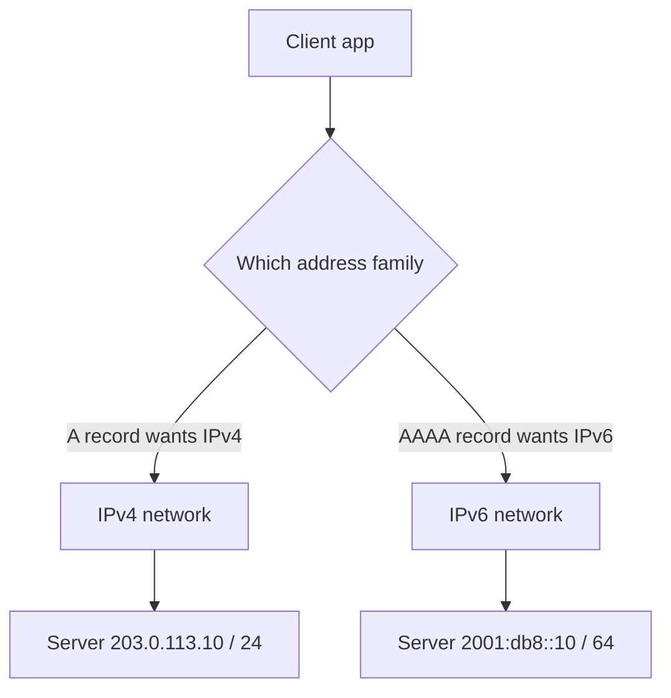

# IP Address (IPv4 vs IPv6)

## 1. One-Line Definition
An IP address is the numeric identifier of a device's network interface — 32-bit in IPv4 and 128-bit in IPv6 — used to route packets toward their destination across the internet.

## 2. Why Do We Need It?
Packet networks are hierarchies of routers, not direct point-to-point wires. To get a packet from anywhere to anywhere, every interface needs a globally meaningful address that routers can aggregate and forward toward. IP addressing gives the internet that scalable, hierarchical location scheme — and `IP address` is also what DNS resolves names into.

## 3. Simple Intuition
A street address: city (network/subnet) narrows to street (subnet) then house number (host). The address is hierarchical, so the postal service (routing) only needs to know "which city" at each junction — it does not need to know every house on the planet.

## 4. What Happens Without It?
Without addresses, a packet would have no destination and routers nothing to match — communication would be impossible. Without enough address space (the IPv4 shortage), you would have to renumber, multiplex, or reject connections constantly; that is exactly why IPv6 exists.

## 5. Core Idea
- **IPv4:** 32 bits, ~4.3 billion addresses, written `192.168.1.10`. Exhausted by the 2010s → NAT, private ranges, and dual-stack became routine.
- **IPv6:** 128 bits, written `2001:0db8:85a3::8a2e:0370:7334` (compressed). Designed to end NAT (every interface can be globally addressable), simplify headers, and support stateless autoconfiguration.
- **Address classes of use in design:** **public** (routable anywhere), **private** (`10.0.0.0/8`, `172.16.0.0/12`, `192.168.0.0/16` — used inside a VPC or office, unroutable on the internet), **loopback** (`127.0.0.1`/`::1` = this machine), **link-local** (`169.254.x.x`/`fe80::`), and **reserved** ranges.
- **CIDR:** the `/n` notation (`10.7.0.0/16` = a subnet of 65,536 addresses). Subnets are the unit of isolation, firewalling, and routing.
- **DNS tie-in:** A records map names to IPv4, AAAA to IPv6; browsers and libraries attempt both (happy eyeballs).
- **Interface, not device:** one machine can hold many interfaces and many IPs (multi-homed, containers, pods).

## 6. Important Terminology

| Term | Simple Meaning |
|------|----------------|
| IPv4 | 32-bit address, four octets |
| IPv6 | 128-bit address, hex notation |
| Public IP | Globally routable address |
| Private IP | Internal-only, not routable on internet |
| CIDR | Subnet notation: prefix + `/n` |
| Subnet | A contiguous block of the address space |
| Loopback | Address for the machine itself (`127.0.0.1`) |
| NAT | Hiding many private IPs behind one public IP |
| A / AAAA record | DNS: name → IPv4 / IPv6 |
| Dual-stack | Running IPv4 and IPv6 simultaneously |
| Interface IP | Address bound to a specific NIC/pod, not device |

## 7. Basic Architecture



DNS supplies the address; the network delivers the packet to whichever address the caller picked. Modern clients run dual-stack and prefer whichever path completes faster.

## 8. Request or Data Flow
1. Client asks DNS for a name and gets back A (IPv4) and AAAA (IPv6) records.
2. Client picks an address family (Happy Eyeballs tests both in parallel and keeps the winner).
3. The packet is built with the destination IP; routers match its prefix and forward hop by hop.
4. Inside the datacenter, source and destination are typically **private** IPs; a NAT gateway or LB exposes traffic to the internet with a public IP.
5. The server's process sees the packet, demultiplexed by port, and replies.

## 9. Practical Example
**Multi-tier web app in a VPC (assumptions):** 100 app servers, one ALB.
- Servers get private IPs from `10.20.0.0/16` — unreachable from the internet, no public exposure.
- The ALB holds a public IP (or Elastic IP) and forwards to those private addresses.
- An egress NAT gateway gives app servers outbound internet (they connect out using private IPs mapped to one public IP).
- DB subnet is `10.30.0.0/20`, reachable only from the app subnet (security groups by CIDR) — the IP layout *is* part of the security boundary.

## 10. Scaling
- **IPv4 is the scarcer resource:** public IPv4s are pooled at the edge (LB/NAT), never handed to every pod. Containers get private IPs per pod instead (see [[cloud-infrastructure|Cloud Infrastructure]]).
- **Service discovery beats hard-coded IPs:** instances churn, so route by name (DNS, SRV) rather than by address (see [[service-discovery|Service Discovery]]).
- **IPv6 removes the NAT bottleneck** and unbounded addresses, at the cost of managing a new protocol family concurrently.
- **NAT session limits:** tracking every outbound connection has a state table ceiling — plan for the ephemeral-port math (see [[ports|Ports]]).
- **Latency is unchanged by the number:** routing is hop-count and queueing bound, not address count bound.

## 11. Reliability and Failure Scenarios
- **IP is best-effort:** a packet can be lost, duplicated, or reordered — IP alone gives no delivery guarantee; that is [[tcp|TCP]]'s job.
- **Address conflicts:** two hosts bound to the same IP → drops both. DHCP detects duplicates (DAD) and fails the misconfigured host.
- **Renumbering breaks services:** an IP you renumber or recycle silently strands traffic; always route by name and keep addresses stable via static IPs or DNS.
- **Subnet as blast radius:** one compromised CIDR can reach everything in it, so narrow the CIDR per tier.
- **Detection:** ICMP-based reachability, address-resolution failure, and routing-blackhole symptoms (connect timeouts on an otherwise-fine network).

## 12. Consistency and Correctness
- Addresses must be **unique within their scope**: private ranges rely on your net being consistent; public ranges on registrar/IANA coordination. Duplicate addresses are the classic "same IP two machines" outage.
- DNS-to-IP mapping drifts over time (TTL-bounded), so clients can briefly hit stale addresses — treat the mapping as eventually consistent.
- Subnet layout decisions are expensive to change later; plan CIDR blocks before pods and accounts grow (see [[capacity-estimation|Capacity Estimation]] for IP needs).

## 13. Performance
- Header cost: IPv4 ≈ 20 bytes base, IPv6 fixed 40 bytes — negligible per packet on modern links.
- IPv6 simplifies firewall processing (no options fragmentation) and avoids NAT translation overhead (fewer state lookups).
- No added latency from the address itself; perceived slowness from addressing is almost always DNS, routing, or NAT funneling, not the IP number.
- Fragmenting (a too-small MTU) causes costly remediation — use standard MTUs or Path MTU Discovery.

## 14. Security
- **IP is location, not identity:** an attacker can spoof or hijack addresses; never authenticate by IP alone.
- Trust boundaries are expressed in CIDR: allow only the app-subnet range into the DB security group; every extra writable range is an expanded blast radius.
- Private ranges give no inherent safety — anything routable from a public path is public; NAT only obscures, it does not authenticate.
- Logs carry IPs that identify users (PII); redact/pseudonymize and obey residency rules ([[data-residency|Data Residency]]).

## 15. Trade-Offs

| Choice | Advantages | Disadvantages | When to Use |
|--------|------------|---------------|-------------|
| Dual-stack IPv4+IPv6 | Reaches everyone, moves toward v6 | Run two protocols, double edge config | Public internet services |
| Private IPs + NAT | Few public IPs, hiding | NAT state table limits, log tracing harder | VPCs, default cloud |
| Public IPs per node | No NAT, direct | Gloabal IPv4 scarcity, larger attack surface | Edge/LB, IPv6-native |
| Static IP (Elastic) | Stable DNS, easy LB | Cost, must manage | LBs, gateways, databases |
| DHCP/dynamic | Zero config, scale-out friendly | Addresses change — breaks hard-coding | Autoscale fleets |

## 16. Common Mistakes
- Hard-coding IPs instead of using names and service discovery — instance churn breaks them silently.
- Treating a private range as "safe" because it is non-internet-routed — any reachable path is public.
- Not planning subnet/CIDR space before accounts and pods grow, then forcing mass renumbering later.
- Assuming NAT gives you security; it gives you scarcity relief and obscurity, nothing more.
- Ignoring IPv6 growth when latency or NAT state is the new bottleneck.

## 17. HLD vs LLD Boundary
HLD: CIDR planning per tier, public vs private topology, NAT placement, dual-stack decision, where static IPs are required, security-group boundaries by subnet. LLD: the exact CIDR value for a subnet, firewall rule enumeration, DHCP/DAD config on a single host.

## 18. Interview Questions

### Beginner
- What is the difference between IPv4 and IPv6 addressing?
- Why can a private IP like `10.0.0.5` never be used on the internet?

### Intermediate
- You have 10,000 instances but 20 public IPv4s. How do you architect the addressing?
- Why would you put a database on a private subnet and NAT-gateway your app servers out?

### Advanced
- How does IPv6 change the architecture of a large multi-tenant cloud (no NAT, per-pod addressing)?
- Design an address plan for a multi-account, multi-region deployment that must never renumber or overlap.

## 19. Interview Memory Summary

> [!abstract]- Interview Memory Summary

### Remember

- IPv4 has 32 bits and is exhausted; IPv6 has 128 bits and ends NAT.
- Public vs private: `10/8`, `172.16/12`, `192.168/16` are internal-only.
- CIDR `/n` defines the subnet; subnets are security boundaries.
- IP is location, not identity — never authenticate by IP alone.
- Route by name (DNS/discovery), not by address.
- Dual-stack and NAT hide the migration while IPv6 rolls out.
- IP is best-effort delivery; reliability lives in TCP and above.

### 30-Second Explanation

IP addressing gives every interface a globally meaningful, hierarchical number a router can forward on (IPv4, exhausted, or IPv6, effectively unlimited). You keep private subnets per tier in a VPC, expose only the edge with public IPs/NAT, scope security groups by CIDR, and route clients by DNS names so instance churn never strangles traffic.

### Interview Traps

- Using IPs as identity — that is what tokens and mTLS are for.
- Claiming private ranges are secure; they are just not globally routable.
- Forgetting the NAT ephemeral-port math caps concurrent outbound connections.
- Rebuilding an address plan after scale-out instead of sizing CIDR blocks up front.

### Key Trade-Off

Public, globally-routable addresses make every host reachable and simple but scarce and exposed; private addressing plus NAT/UAT at the edge conserves the two at the cost of extra translation state and obscured tracing.

## 20. Related Concepts

### Prerequisites

- [[dns|DNS]] — names resolve into the A/AAAA addresses every request travels on.

### Commonly Used Together

- [[tcp|TCP]] and [[udp|UDP]] — the protocols that carry data between IP addresses and ports.
- [[ports|Ports]] — the per-process demultiplexer that rides on top of an IP.
- [[network-latency|Network Latency]] — path distance, not address size, decides delay.
- [[cloud-infrastructure|Cloud Infrastructure]] — VPC, subnets, and security groups are the IP plan in practice.
- [[geo-dns-anycast|Geo-DNS and Anycast]] — the same IP announced from many places for nearest routing.

### Alternatives

- [[dns|DNS]]/service discovery instead of remembering numbers — names are the address you should actually use.

### Advanced Concepts

- [[edge-computing|Edge Computing]] — thousands of edge POPs share pooled, anycasted addresses.
- [[cdn|CDN]] — address selection (GeoDNS/Anycast) decides which edge answers.

Related planned topics (not authored yet): nat, vpc-and-subnets, forward-proxy.

## 21. References
RFC 1918 (private addressing), RFC 791 (IPv4), RFC 8200 (IPv6), RFC 4291 (v6 addressing architecture), IANA special-purpose registries. Kurose and Ross, *Computer Networking: A Top-Down Approach* (network layer). Verify current cloud CIDR guidance with provider docs.

## 22. Active Recall

Test yourself before revealing each answer.

> [!question]- In one sentence, what does an IP address do, and what is the key IPv4-to-IPv6 change?
> It gives every interface a routable numeric identity; IPv4 holds 32 bits (exhausted by the 2010s) while IPv6 holds 128 bits, removing the scarcity that forced NAT and private addressing.

> [!question]- Which ranges are private, and why do they matter in a design?
> `10.0.0.0/8`, `172.16.0.0/12`, and `192.168.0.0/16`. They are internal-only and non-routable on the internet, so VPCs give every internal node a private IP and expose only the edge via NAT or a public LB — the whole internal topology stays invisible to the internet.

> [!question]- Why is it dangerous to authenticate by IP address?
> IP is a location hint, not an identity: addresses can be spoofed, reused, and changed, and one NAT maps thousands of users behind a single IP. Authorization must come from tokens, TLS client certs, or session state — never the source address.

> [!question]- Trade-off: private IPs plus NAT vs giving every node a public IP?
> Private+NAT conserves scarce IPv4s and hides internals but adds translation state (a table that caps concurrent connections) and complicates tracing. Public-per-node is simple and direct but expensive in IPv4 and widens the attack surface; IPv6 makes public-per-node the natural default.

> [!question]- A service broke after its instance was replaced. What is the classic addressing cause?
> Something hard-coded the instance's old IP, or a recycled/renumbered address no longer matches the DNS record. The fix is architectural: route by name (service discovery), keep static IPs only where stability is required (LB, gateway), and tune DNS TTL so replacement propagates fast.

> [!question]- Interview scenario: design a multi-tenant SaaS where tenants must never touch each other and renumbering is forbidden.
> Allocate private CIDR blocks per tenant or per cell up front, one subnet per tier, strict security groups (allow only the adjacent tier's CIDR), NoNAT at the edge for outbound, and zero direct internet exposure for data subnets. Log and plan IP growth with capacity estimation so blocks never need to be cut and renumbered later.

> [!question]- What does "dual-stack" mean, and when would you run it even though it doubles config?
> The host carries and is reachable via both an IPv4 and an IPv6 address simultaneously. You run it during migration so IPv4-only and IPv6-only clients both connect, accepting double edge configuration until the world grows out of IPv4.

## 23. When Should I Use This?

### Use it when

- You design any networked topology: subnets, security groups, load balancers, VPCs.
- You are estimating address counts and CIDR sizes for growth.
- You must expose services publicly and decide public IPs vs NAT vs dual-stack.
- Clients reach services by name, so the DNS-to-address mapping sets routing and failover behavior.

### Avoid it when

- You can gloss over addressing entirely (mock interviews at the "one LB, one DB" level rarely need CIDR math).
- The design is server-internal and a managed platform already abstracts subnets and NAT for you.
- You only need to reason about application logic — addressing is infrastructure detail there.

### What problem does it solve?

Problem: packets have no structured way to find their destination across a global mesh of routers. Bottleneck: 32-bit IPv4 address space is exhausted. Solution: hierarchical, aggregatable addresses (IPv4 and now IPv6) with private subnets and edge NAT to conserve the scarce pool, plus DNS to decouple names from numbers that churn.

### What problem does it NOT solve?

Addressing does not provide delivery guarantees (that is TCP), identity or authenticity (that is TLS/tokens), or isolation on its own — a private IP is just a convention until a firewall or security group enforces it. It also does not decide which service runs where; that is discovery and routing.

## 24. Decision Connections

Decisions that go together with IP addressing:

- [[dns|DNS]] — resolves names into the addresses every packet travels on; TTL controls how fast address changes propagate.
- [[tcp|TCP]] / [[udp|UDP]] — the transports that assume an address is correct and add reliability or speed on top.
- [[ports|Ports]] — the per-process number that, with an IP, forms the socket every connection binds to.
- [[cloud-infrastructure|Cloud Infrastructure]] — VPC, subnets, and security-group rules are the practical coat of the address plan.
- [[geo-dns-anycast|Geo-DNS and Anycast]] — one address served from many places for nearest routing.
- [[network-latency|Network Latency]] — path distance and queueing, not address size, decide round-trip time.
- [[capacity-estimation|Capacity Estimation]] — count addresses and CIDR sizes before you grow, never after.

Decision tree:

```
Clients must reach a resource over the internet
    |
    +-- Name-based, churn-tolerant access?
    |      → [[dns|DNS]] + [[service-discovery|Service Discovery]]
    |
    +-- Public exposure needed?
    |      +-- Stateful edge, few addresses? → LB NAT for real public IP
    |      +-- IPv6 mature in your regions?  → public per-pod, no NAT
    |      +-- Both client types present?    → dual-stack
    |
    +-- Internal topology with isolation?
    |      → private subnets per tier in [[cloud-infrastructure|Cloud Infrastructure]]
    |         |
    |         +-- Tight blast radius? → one CIDR per tier, allow adjacent only
    |         +-- Outbound internet?  → egress NAT gateway
    |
    +-- Where locality matters?
           → [[geo-dns-anycast|Geo-DNS and Anycast]] (same IP, many edges)
```