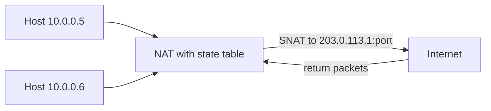

# NAT

## 1. One-Line Definition
Network Address Translation (NAT) rewrites the source (or destination) IP address and port of packets as they cross a network boundary, so that many private hosts can share one or a few public IP addresses.

## 2. Why Do We Need It?
IPv4 addresses ran out. Home and office networks use private address space (RFC 1918), which cannot be routed on the public internet, so a device at the edge — a home router, cloud NAT gateway, or carrier-grade NAT — must translate private addresses to public ones on the way out. NAT also gives a useful side effect: without an explicit mapping, the outside world cannot open connections to your internal hosts.

## 3. Simple Intuition
An office with one external phone line. Every employee (private host) makes outgoing calls through the receptionist (NAT), who remembers "Desk 7 called +44…" and forwards the return call to the right desk. Internally everyone has an extension (192.168.x.x); externally the whole office is just one phone number (public IP). If someone rings the main line without an earlier outgoing call, the receptionist has no desk to send it to.

## 4. What Happens Without It?
Without NAT every device would need its own globally routable IP — impossible since IPv4 ran out. On a private network with no NAT, either internal hosts can't reach the internet, or you burn scarce public IPs per device. The result would be address exhaustion at every office and no way to expose an internal server safely without exposing its real address.

## 5. Core Idea
- **SNAT / outbound translation:** rewrite source IP+port of outgoing packets; remember the mapping in a **state table** so return packets can be rewritten back.
- **NAPT/PAT (port address translation):** the most common form — many private IPs map to one public IP by giving each flow its own source port.
- **DNAT / inbound translation:** map a public IP+port to a specific internal server (port forwarding) so internet clients can reach it.
- **State table / conntrack:** the mapping table that lives in the NAT device; every flow is an entry, and entries expire on a timeout (TCP longer, UDP shorter).
- **NAT behavior classes:** *full-cone* (binding accepts any inbound from the same external IP:port) vs *symmetric* (each destination gets a different external port — much harder to traverse), which matters to peer-to-peer protocols.
- **NAT traversal:** when both peers are behind NAT, direct connection needs discovery protocols — STUN (find your public mapping) and TURN (relay when direct fails).
- **CGNAT:** carriers apply NAT to customer networks at scale, using shared address space (RFC 6598), trading per-IP observability for address reuse.
- **NAT ≠ proxy:** NAT rewrites packet headers (layer 3/4) silently; a proxy terminates and re-originates the application flow (see forward-proxy).

## 6. Important Terminology

| Term | Simple Meaning |
|------|----------------|
| Private IP | RFC 1918 range (10/8, 172.16/12, 192.168/16) — not routable publicly |
| Public IP | Globally routable internet address |
| NAT table | Rows mapping an internal flow to an external IP:port |
| NAPT / PAT | Address translation via many internal IPs → one public IP + unique ports |
| SNAT / DNAT | Rewrite source (outbound) / destination (inbound) address |
| Port forwarding | A static DNAT rule: public IP:port → one internal host:port |
| Binding | Mapping created by an outgoing flow |
| Cone vs symmetric | How permissive a mapping is for inbound; symmetric is traversal-hard |
| CGNAT | Carrier-grade NAT; ISP applies NAT to customer networks |

## 7. Basic Architecture



## 8. Request or Data Flow
1. Host behind NAT sends an outbound packet; NAT notes (src IP:port, dst IP:port) in the state table, rewrites src to the public IP + a free port.
2. The request goes to the internet; the server replies to the public IP:port.
3. NAT looks up the mapping, rewrites the destination back to the internal host:port, and forwards.
4. If no mapping exists (an unsolicited inbound packet), NAT drops it — inbound is naturally blocked unless a DNAT/port-forward rule exists.

## 9. Practical Example
**Small cloud app (assumptions):** a private subnet in 10.1.0.0/16.
- Instances have only private IPs. Outbound API calls go through a NAT gateway with one elastic public IP: all 10 instances' traffic shares it via unique ports; on a burst of 500 concurrent flows to one external API, conntrack holds 500 rows.
- The app serves the public API through an internet-facing load balancer instead of NAT-port-forwarding the backend — NAT handles *egress* here; ingress goes via the LB (see vpc-and-subnets).

## 10. Scaling
- **Conntrack table is memory + capacity:** each flow is a row; big UI/OS-install bursts or long-lived websockets accumulate rows. Size the NAT box's conntrack capacity, or the table overflows and flows are dropped.
- **One public IP is a shared quota:** port space (~65k per IP for TCP) can run out; scale with multiple public IPs or multiple NAT gateways (each with its own state table).
- **Per-zone quotas:** a NAT gateway per availability zone removes the cross-zone hop and a single-region SPOF.
- **UDP flows** create short-lived entries; aggressive no-response timeouts keep the table clean.

## 11. Reliability and Failure Scenarios

| Failure | What Happens | Detection | Recovery | Trade-off |
|---------|--------------|-----------|----------|-----------|
| NAT device fails | All mapped flows drop; outbound traffic dead | Health check on gateway | Failover pair; new flows re-map | connections reset |
| Conntrack overflow | New/flows dropped randomly | Table-full counters | Scale capacity, reduce long-lived flows | cost |
| State loss on failover | Existing flows re-mapped (state empty) | Connection reset storm | Clients reconnect (retry logic) | brief outage |
| Timeout too short | Idle long-poll/WS die mid-session | Flow-reset complaints | Tune timeouts per protocol | table bloat |

## 12. Consistency and Correctness
NAT state is local to each device, so a mapping is only consistent on that box — failover does not preserve state. For long-lived flows (websockets, telemetry), design clients to tolerate reconnect and re-establish bindings. From a correctness standpoint, NAT is a layer-3/4 rewrite: it does not change application semantics, but it breaks protocols that put their addresses inside the payload (FTP active mode, SIP) unless an ALG or tunnelling (e.g., via the proxy layer) handles it.

## 13. Performance
- NAT cost is a table lookup + checksum recompute per packet: small on modern hardware, invisible for most workloads; the real limits are conntrack memory and flow-per-second churn.
- Each NAT hop adds a point where packets are dropped and mapped; a per-AZ gateway keeps the path short.
- Traversal-free connectivity (peering, VPN, direct-connect) bypasses NAT entirely — the cleanest latency fix for service-to-service traffic.

## 14. Security
- NAT's biggest plus: internal topology is hidden and unsolicited inbound is dropped by default — a baseline filter, but not a substitute for a real firewall; verify with [[firewall|Firewall]].
- Don't rely on NAT for isolation: a misconfigured DNAT/port-forward, or an exposed management port through a rule, leaks a host. NAT is not an access-control system.
- Hygiene matters: NAT appliances with default creds are a famous attack vector for home/CGNAT edge devices.

## 15. Trade-Offs

| Choice | Advantages | Disadvantages | When to Use |
|--------|------------|---------------|-------------|
| NAT (private egress) | Saves public IPs, hides hosts | Stateful so SPOF-ish, breaks traversal/ALG | Nearly every private network |
| Public IPs per host (no NAT) | Simple routing, no state to break | IP scarcity, exposes hosts | Small fleets, public services |
| NAT gateway per AZ | HA + shorter path | More state tables, more cost | Cloud production |
| CGNAT | Enables huge customer counts | No per-customer IP, fairness/os abuse issues | ISPs |
| No NAT (peering/VPN/transit) | No mapping, no timeout risk | Separate routing architecture needed | Service-to-service traffic |

## 16. Common Mistakes
- Designing NAT as if it were the security boundary — NAT is not a firewall.
- Forgetting conntrack limits when planning websockets or long-lived TCP flows.
- Expecting failover to preserve active mappings — it never does; make clients reconnection-safe.
- Using NAT public-IP load distribution (a dozen flows hammering the spare public IP).
- Ignoring NAT traversal: peer-to-peer and UDP-based products break silently behind symmetric NAT without STUN/TURN.

## 17. HLD vs LLD Boundary
HLD: NAT strategy per tier (private subnets + egress NAT gateway vs public IPs), per-AZ placement, quotas/flow budgets, and how long-lived flows connect through and around NAT. LLD: the specific conntrack timeout value, one nftables/iptables rule, STUN client configuration in a device.

## 18. Interview Questions

### Beginner
- What problem does NAT solve, and what is NAPT?
- Why does an unsolicited inbound packet to a NAT'd host get dropped?

### Intermediate
- Your app opens 100k long-lived websocket connections behind a NAT gateway. What breaks and what are the fixes?
- How does NAT affect peer-to-peer UDP connectivity, and what does STUN/TURN do?

### Advanced
- Your NAT gateway fails over and all live connections drop. Design the client and infrastructure changes to make this survivable.
- Compare NAT-based egress with routing over VPN/peering for service-to-service traffic at high volume.

## 19. Interview Memory Summary

> [!abstract]- Interview Memory Summary

### Remember

- NAT rewrites source/destination IP:port with a state table (conntrack) at the edge.
- Private RFC 1918 → one public IP via unique source ports = NAPT/PAT.
- Unsolicited inbound is dropped by default — NAT blocks, but it is not a firewall.
- Conntrack is the scaling + failure surface: rows are memory, state dies on failover.
- Cone vs symmetric NAT decides peer-to-peer traversal; STUN/TURN handle it.
- NAT is layer 3/4; the forward proxy is a fully separate application-layer concept.

### 30-Second Explanation

NAT lets a private network share scarce public IPs by rewriting source addresses and remembering each flow in a state table. It gives a free default-denied inbound posture but that is incidental, not access control; its real costs are conntrack capacity, state loss on failover, and NAT-traversal problems for protocols that embed addresses or need inbound peer connections.

### Interview Traps

- Calling NAT a security boundary — it blocks unsolicited inbound but grants no isolation guarantees.
- Forgetting failover drops mappings: live TCP/websocket flows die on failover.
- Claiming NAT is protocol-agnostic — ALG-required protocols (FTP/SIP) break.
- Confusing NAT with a proxy — different layers entirely.

### Key Trade-Off

NAT trades IP scarcity and default-inbound-blocking for a stateful, regional failure surface — an edge device whose table is memory, whose state dies on failover, and which peers must traverse.

## 20. Related Concepts

### Prerequisites

- [[cloud-infrastructure|Cloud Infrastructure]] — regions/AZs where NAT gateways are placed
- [[vpc-and-subnets|VPC and Subnets]] — the private networks NAT sits on the edge of

### Commonly Used Together

- [[firewall|Firewall]] — the actual security policy that belongs *behind* NAT
- [[forward-proxy|Forward Proxy]] — application-layer egress control in front of NAT (different layer)
- [[http-and-https|HTTP and HTTPS]] — long-lived HTTP/websocket flows feel NAT timeouts most

### Alternatives

- [[locality-based-routing|Locality-Based Routing]] and [[geo-dns-anycast|Geo-DNS and Anycast]] — routing that avoids or works around NAT for traffic delivery

### Advanced Concepts

- [[encryption-and-keys|Encryption and Keys]] — when tunnels (VPN/peering) bypass NAT for service traffic

Related planned topics (not authored yet): ip-address, ports, network-partition.

## 21. References
RFC 1918 (private addressing), RFC 1631 (original NAT), RFC 3022 (traditional NAT/NAPT), RFC 4787 (NAT behavioral requirements — cone/symmetric), RFC 6598 (shared address space/CGNAT). Verify traversal behavior against current STUN/TURN and gateway docs.

## 22. Active Recall

Test yourself before revealing each answer.

> [!question]- Basic understanding: what exactly does NAPT translate, and why ports?
> NAPT maps many private IPs to one public IP by rewriting both address and source port — each outbound flow gets its own public port so return packets can be demultiplexed to the right internal host. Ports are the multiplexing key.

> [!question]- Basic understanding: why is an unsolicited inbound packet to a NAT'd host dropped?
> Because NAT only forwards inbound packets that match an existing state-table entry — a mapping created by an *outgoing* flow (or an explicit DNAT/port-forward rule). With no mapping, the NAT device has no idea which internal host the packet is for.

> [!question]- Design decision: your backend opens 100k long-lived websocket connections through a NAT gateway. What do you engineer for?
> Conntrack table capacity (100k+ rows of memory), long-flow timeouts so idle connections aren't silently reset, per-AZ/NAT-gateway placement so the table isn't a single box, and client reconnection logic — because any NAT failover wipes every mapping and all connections must rebuild.

> [!question]- Trade-off: NAT vs direct public IPs and peering for a high-volume service.
> NAT saves public IPs and hides hosts but adds a stateful hop whose table is memory and whose role can drop live flows on failover. No-NAT architectures (public per host, or VPN/VPC peering) remove the state and timeout risk at the cost of address planning and exposure.

> [!question]- Failure scenario: the regional NAT gateway fails over. Diagnose and fix the symptom.
> Symptom: every outbound connection resets at the same time. Cause: mappings live in the failed box's conntrack; the standby has none. Fix: dual gateways with clients that connect and reconnect idempotently, keep the standby warm, and treat "all connections die on failover" as expected behavior, not a bug.

> [!question]- Interview scenario: your peer-to-peer video app can't connect between two users behind NAT. Walk through it.
> Both users hold private addresses; on symmetric NAT an inbound peer flow doesn't match any mapping. Resolution: STUN to discover each binding, then try direct P2P; if symmetric-NAT or firewall blocks it, fall back to TURN relaying through a public server.

## 23. When Should I Use This?

### Use it when

- Private address space must reach the internet with minimal public-IP use.
- You need default-inbound-blocking for egress-only workloads.
- You're traveling a classic corporate/edge network design (RFC 1918 + NAT gateway).

### Avoid it when

- Service-to-service traffic can ride a tunnel/peering that avoids NAT entirely (fewer state hops).
- High-volume long-lived flows dominate and conntrack/state-loss is unacceptable.
- Peer-to-peer or ALG-dependent protocols must be the primary path without relay infrastructure.

### What problem does it solve?

Problem: IPv4 exhaustion and a private address space that cannot route on the public internet. Solution: NAT multiplexes many private hosts onto few public addresses via a state table, and as a side effect gives default drop of unsolicited inbound traffic.

### What problem does it NOT solve?

It is not security/access control (that's the firewall's job), doesn't preserve state across failover, doesn't play well with peer-to-peer without STUN/TURN, and can't make a UDP/TCP protocol that embeds its own addresses work without protocol help.

## 24. Decision Connections

Decisions that go together with NAT:

- [[vpc-and-subnets|VPC and Subnets]] — the private/subnet architecture NAT gateways sit on the edge of.
- [[cloud-infrastructure|Cloud Infrastructure]] — where (which region/AZ) gateways are placed; quotas per AZ.
- [[firewall|Firewall]] — the actual policy layer behind NAT; NAT is incidental blocking only.
- [[forward-proxy|Forward Proxy]] — application-layer egress control, complementary to layer-3 NAT.
- [[http-and-https|HTTP and HTTPS]] — long-lived web/websocket flows are the first victims of NAT state.
- [[encryption-and-keys|Encryption and Keys]] — tunnels/VPN solve the NAT hop for service traffic.
- [[locality-based-routing|Locality-Based Routing]] — choosing paths that avoid crossing NAT and the internet entirely.

Decision tree:

```
Private hosts must reach the public internet
    |
    +-- Few public IPs, hide internal topology?
    |      → [[nat|NAT]] / NAPT via gateway
    |         |
    |         +-- Big burst or websocket-heavy?  → size conntrack, per-AZ gateways
    |         +-- P2P peers must connect?         → STUN/TURN to traverse
    |         +-- Long-lived flows on failover?   → design reconnection, not state preservation
    |
    +-- Service-to-service, high volume?
    |      → prefer tunnel/peering to skip NAT ([[encryption-and-keys|Encryption and Keys]])
    |
    +-- Tight egress policy needed too?
    |      → apply [[firewall|Firewall]] and [[forward-proxy|Forward Proxy]] on the egress path
    |
    +-- Isolated private network with no public egress?
           → [[vpc-and-subnets|VPC and Subnets]] only (no NAT needed)
```