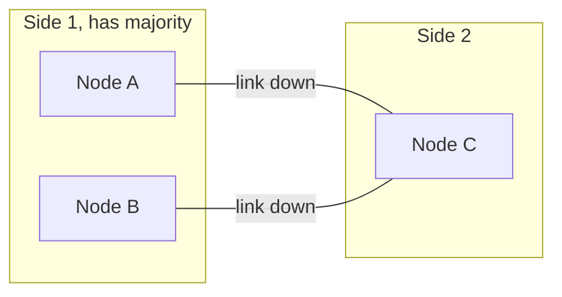

# Network Partition

## 1. One-Line Definition
A network partition is when the network itself fails so that parts of a distributed system can no longer talk to each other, splitting one logical cluster into subgroups that cannot exchange messages.

## 2. Why Do We Need It?
Distributed systems assume they can coordinate, but coordination runs over a network that *does* fail — cables cut, routers misconfigured, switches reboot, clouds have AZ/region incidents. Because a partition is unavoidable at scale (it is the P in [[cap-theorem|CAP Theorem]]), every system must decide *before* it happens what each side of the split is allowed to do. Understanding partitions is what turns "why did we lose data" post-mortems into designs that degrade predictably.

## 3. Simple Intuition
Two branches of a bank, one bridge connecting them. The bridge collapses: the branches cannot talk. Each branch still sees its own customers. If both branches keep approving withdrawals, the bank may overdraw its books when the bridge reopens; if both branches stop until the bridge returns, the bank is down for everyone. There is no third option — you pick which pain.

## 4. What Happens Without It?
Assume away the partition and the system breaks at the worst moment: two "leaders" both accepting writes (split brain), writes lost or double-applied on heal, clients hanging because the timeout is longer than the partition, or every node blindly voting in a way that deadlocks the cluster. The cost shows up as silent data divergence — the most expensive bug class in distributed systems.

## 5. Core Idea
- **Partition looks identical to slow/failure:** nodes detect "the other side is gone" only through timeouts and heartbeats — a slow GC pause, a temporary queue, or a dead link all produce the same symptom. Detection is inference, not knowledge.
- **Majority and quorum:** the winning side in a split is the one holding a majority of votes (or quorum of replicas). Rule: a node only claims leadership/writes if it can still reach a majority — this guarantees at most one side leads.
- **Fencing is the teeth of quorum:** even if an old leader believes it still has majority (a false grant), a fencing token invalidates it so it cannot corrupt new state.
- **CP vs AP:** [[cap-theorem|CAP Theorem]] says during a partition you choose consistency (refuse writes on the minority side; stop to stay safe) or availability (keep serving on both sides and reconcile later, e.g. [[strong-vs-eventual-consistency|eventual consistency]]).
- **Failover is a partition reaction:** detection via heartbeats, election/standby promotion — the mechanism itself assumes partitions can happen ([[failover|Failover]]).
- **Partitions come in shapes:** node-to-node link cuts, region isolation, asymmetric routes, split secondaries. Not all splits are clean halves.

## 6. Important Terminology

| Term | Simple Meaning |
|------|----------------|
| Partition | Subgroups that cannot reach each other |
| Split brain | Two sides both acting as leader |
| Majority | More than half of the voting replicas |
| Quorum | Minimum set needed to make a decision |
| Heartbeat | Periodic liveness signal between nodes |
| Leader election | Choosing one node as the decision-maker |
| Fencing token | Proof that a leader is still legitimate |
| Timeout | The boundary between "slow" and "gone" |
| Stale read | Serving old data because the fresh copy is behind a partition |
| Heal | The partition resolves and sides reconnect |

## 7. Basic Architecture



Nodes A and B still reach each other (majority) and can elect a leader and keep writing. Node C is isolated: it must stop accepting writes (CP) or keep serving stale/optimistic data (AP).

## 8. Request or Data Flow
1. Nodes heartbeat each other on a fixed interval.
2. A link fails; heartbeats stop between the sides. Each node starts timing out its peers.
3. Side A+B sees majority and confirms or re-elects a leader; the leader obtains a fresh fencing token.
4. Side C's old leader times out and steps down — it may still hold old leased leadership and must be fenced by the token before it writes anything.
5. On heal, sides exchange missed writes, reconcile conflicts (AP), or replay from the log (CP) — then resume normal operation.

## 9. Practical Example
**Raft-style replicated database across 3 AZs (assumptions):** 5 nodes, writes need a majority.
- Nodes across AZ 1 and AZ 2 (3 nodes) keep quorum during a partition and continue; AZ 3's single node is cut off.
- The AZ-3 node serves reads from its local lagging replica (acceptable staleness) but any write it accepts would violate the majority rule, so it rejects writes during the partition — that is the [[cap-theorem|CAP Theorem]] consistency choice, visible to users as write errors rather than data loss.
- On heal, the isolated node streams the log from the leader and catches up; no writes were lost on either side.

## 10. Scaling
- **More nodes = more partition combinations:** a 5-node cluster has many split configurations; quorums must tolerate every one (any majority must overlap any other majority).
- **Cross-region partitions are the norm, not the exception:** spanning regions multiplies tail latency and partition surface; domain trade-offs escalate ([[cross-region-replication|Cross-Region Replication]], [[global-consistency|Global Consistency]]).
- **Partition-tolerant scaling needs consistency-ecosystem sizing:** quorum sizes, number of replicas, and availability targets trade directly — more replicas raise availability but widen the window for divergent state.
- **Partitions during rebalancing/migrations** compound with the reshradding in flight ([[database-replication|Database Replication]]); do maintenance in small windows with fencing.

## 11. Reliability and Failure Scenarios

| Failure | What Happens | Detection | Recovery | Trade-off |
|---------|--------------|-----------|----------|-----------|
| Link cut | Heartbeats stall, sides diverge | Heartbeat/timeout thresholds | Quorum side leads, minority fences | false-positives if too aggressive |
| Asymmetric partition | A can reach B, B cannot reach A | Conflicting heartbeats | Majority re-election | temporary inconsistency |
| Node crash | Looks like partition to peers | Heartbeats stop | Failover to replica | needs fencing |
| Region isolation | Whole AZ unreachable | Region probes | Regional failover | data loss window or staleness |
| GC pause | Slow node "looks" dead | p99 monitor, jitter threshold | Longer heartbeat timeout | slower detection |

Partitions are *detected*, not "occurred" — the timeout that decides slow-versus-dead is the single most contentious tuning knob ([[reliability|Reliability]]).

## 12. Consistency and Correctness
- During a partition, the system's guarantees are defined by its partition policy: CP refuses minority-side writes (available only on the majority side); AP accepts writes on both sides and needs conflict resolution when they heal ([[strong-vs-eventual-consistency|Strong vs Eventual Consistency]]).
- The fence must be checked on **every** mutating action, not just at election: a stale leader that has "lost" its lease can still corrupt state if the token is not validated against the current generation.
- Writes committed before the partition are safe and must be durable on heal; writes racing the partition boundary are the ambiguity zone — prefer "avail on majority, fence the rest" for correctness-critical data.
- Clock skew poisons leases and fencing — rely on monotonic generation numbers, not wall-clock comparisons.

## 13. Performance
- Vertical cost of resilience: another write to replicas before ack adds latency (majority = slowest quorum member + network RTT). Cross-region quorums pay real RTT ([[network-latency|Network Latency]]).
- Heartbeat traffic is small and constant; the expensive part is the *election*failover storm when a partition or slow node triggers timeouts fleet-wide (thundering herd on the coordinator).
- Tail composition: partitions push p99 far past p50 — clients must bound their own timeouts so an isolated region doesn't escalate into a retry stampede.

## 14. Security
- Partitions can be *induced*: BGP hijacking, firewall changes, DDoS saturating a link — an attacker can manufacture the split and ride the confusion ([[adversarial-reliability|Adversarial Reliability]]).
- Control-plane isolation: the coordination network itself is a target; separate admin from data traffic, authenticate heartbeats, and treat "partition by attacker" as a design case with fencing.
- Even a genuine partition is a data-exposure surface (replicas serving stale data after denying writes) — decide the staleness/SLO before the incident, not during it.

## 15. Trade-Offs

| Policy | Advantages | Disadvantages | When to Use |
|--------|------------|---------------|-------------|
| CP (refuse minority writes) | No divergent state, predictable | Minority region is down, write errors | Money, inventory, auth |
| AP (serve on both sides) | Availability everywhere | Conflicts on heal, reconciliation burden | Feeds, likes, telemetry |
| Majority quorum | At most one leader, no split brain | Requires majority online, write-latency | Replicated databases |
| Leases + fencing | Fast failover | Lease expiry must be conservatively sized | Coordinators |
| Sync replication | No committed-write loss | Write latency = farthest replica RTT | Strict durability |
| Async replication | Fast local writes | Window of uncommitted writes across nodes | Trade durability for latency |

## 16. Common Mistakes
- Running a 2-node cluster "with failover" — a single link break makes no majority, so either stop (downtime) or split brain (data loss); a 3-node quorum is the minimum honest design.
- Failing to fence after election: the old leader keeps writing while deposed, corrupting state silently.
- Tuning heartbeat timeouts so tight that a GC pause or slow disk triggers a "partition" and an election storm.
- Treating partition detection as certainty: timeouts produce false positives, so design idempotent, fenced, lease-guarded actions anyway.
- Assuming the partition is the rare case — network partitions are a first-class, guaranteed failure in multi-AZ and multi-region designs.

## 17. HLD vs LLD Boundary
HLD: the partition policy (CP vs AP) per data class, quorum/replica sizing, leasing and fencing design, heartbeat topology and timeout budgets, region failover procedure. LLD: the exact lease duration constant, the fence-token check in one write path, the heartbeat interval on one node.

## 18. Interview Questions

### Beginner
- What is a network partition, and why is it "guaranteed to happen" at scale?
- What is split brain, and how does a majority quorum prevent it?

### Intermediate
- A 5-node replicated DB in 3 AZs partitions with 3 nodes on one side. Which side keeps serving writes, and what does the other side do?
- Why can a slow node and a dead link produce the same symptoms, and what is the tuning consequence?

### Advanced
- Design a partition policy for a system that holds both payment balances and read-heavy profiles. How do the policies differ and why?
- Why must a deposed leader be fenced, and what breaks if you skip the token check?

## 19. Interview Memory Summary

> [!abstract]- Interview Memory Summary

### Remember

- A partition is the network failing to connect subsystems — guaranteed at scale.
- P in [[cap-theorem|CAP Theorem]]: during a partition choose consistency or availability.
- Detection is inference: timeouts decide "slow" versus "dead."
- Majority quorum guarantees at most one leader.
- Fencing tokens make quorum enforceable, not aspirational.
- CP refuses minority writes; AP serves stale on both sides and reconciles.
- A 2-node cluster cannot have true failover — 3+ is the minimum honest quorum.
- Partitions can be attacker-manufactured (BGP, DDoS).

### 30-Second Explanation

A partition splits a cluster into sides that cannot reach each other, and since the network will eventually fail, you must decide the policy in advance. Detection is heartbeat timeouts; the classic safety rule is majority-quorum leadership plus fencing tokens, so at most one side writes. Then you choose, per data class, whether the minority side stops (CP, consistent but partially down) or keeps serving and reconciles later (AP, available but divergent).

### Interview Traps

- Claiming 2 nodes give failover — a tie has no majority, so you get downtime or split brain.
- Forgetting the fencing token: majority alone only works if the deposed leader is disabled, not just demoted.
- Tuning timeouts so tight that a GC pause manufactures a fake partition.
- Calling a partition "the rare case" in a multi-region design.

### Key Trade-Off

Every partition policy trades availability against consistency: majority-quorum plus fencing gives at-most-one-leader safety at the cost of minority-side downtime (CP), while serving both sides keeps everyone up but requires conflict resolution that can silently diverge (AP).

## 20. Related Concepts

### Prerequisites

- [[cap-theorem|CAP Theorem]] — the P that partitions embody; pick your C or A per data.
- [[strong-vs-eventual-consistency|Strong vs Eventual Consistency]] — what each side serves during a partition.

### Commonly Used Together

- [[consensus|Consensus]] — majority-based agreement is the standard partition-controlling protocol.
- [[raft-and-paxos|Raft and Paxos]] — leader election plus fencing inside a well-known protocol.
- [[failover|Failover]] — what your system does when the partition is detected.
- [[database-replication|Database Replication]] — the replication topology a partition cuts through.
- [[distributed-transactions|Distributed Transactions]] — partition policy determines whether 2PC is even viable.

### Alternatives

- AP-style reconciliation with CRDTs and version vectors when availability is the hard requirement.

### Advanced Concepts

- [[distributed-locks|Distributed Locks]] — lease plus fence-token pattern is a partition-survival playbook.
- [[gossip-protocol|Gossip Protocol]] — how partition detection and metadata spread without a central tempo bar.
- [[multi-region-consensus|Multi-Region Consensus]] — correctness while spanning the partitions regional tears create.

Related planned topics (not authored yet): split-brain, quorum, pacelc.

## 21. References
Kleppmann, *Designing Data-Intensive Applications* (ch. 8, the standard practical treatment of partitions). Gilbert and Lynch, "Perspectives on the CAP Theorem". Ongaro and Ousterhout, "In Search of an Understandable Consensus Algorithm" (Raft). Kleppmann, "How to do Distributed Locking" (the fencing-token argument). Re-check against current system documentation.

## 22. Active Recall

Test yourself before revealing each answer.

> [!question]- What exactly is a network partition, and why is it guaranteed in a distributed system?
> It is the failure of the network itself such that some nodes cannot reach others, splitting one logical cluster into isolated sides. At scale — multi-AZ, multi-region, transit outages — the link failure is a question of when, not if, so the design is obligated to assume it.

> [!question]- Why can "a slow node" and "a dead link" produce the exact same symptom?
> Because nodes only ever observe silence: a peer that is processing slowly, paused by GC, or wholly disconnected is indistinguishable until a heartbeat times out. Detection is inference from absence, which is why heartbeat timeouts are contentious and why partition logic must stay idempotent and fenced rather than trusting "it must be dead."

> [!question]- How does a majority quorum prevent split brain?
> A node may only lead or accept writes while it can reach a majority of voting replicas. Since any two majorities intersect, at most one side of a partition can hold a majority — both sides can never simultaneously believe they are legitimate, and the minority is structurally barred from leading.

> [!question]- Why is a majority decision not enough without a fencing token?
> A deposed leader can still be partitioned away from the new leader and believe it retains its lease. The fencing token is the generation counter: the new leader bumps it, and every stale write from the old leader is rejected because its token is outdated — otherwise "at most one leader" is a fiction.

> [!question]- Trade-off: refuse writes on the minority side (CP) vs serve on both sides (AP)?
> CP banishes divergent state and guarantees one logical truth — but the minority region is effectively down and its users see write errors. AP keeps everyone served but the two sides diverge and you pay conflict resolution, reconcilable only if the data is naturally mergeable. Money and inventory go CP; feeds and likes go AP.

> [!question]- A GC pause makes node A look dead, so the cluster elects B and fetches a new lease. Then A wakes up. What breaks if there is no fence?
> A still thinks it is leader and keeps writing, while B also writes — the exact split brain the quorum was supposed to prevent. The fencing token (A's is stale) is the only thing that stops A's writes from corrupting the new leader's state, which is why tokens must be checked on every mutating operation.

> [!question]- Interview scenario: design the partition strategy for a multi-region replicated payment-and-profile system.
> Split by data class: balances use CP governed by a majority-quorum RAFT-like consensus with fencing tokens — the minority side rejects writes (write errors are the honest outcome); profiles use AP with async replication and reconciliation, accepting temporary staleness. Add regional failover with runbooked fencing, monitor heartbeats and timeouts as first-class signals, and chaos-test the exact split you drew in the diagram.

## 23. When Should I Use This?

### Use it when

- You replicate or coordinate across hosts, AZs, or regions — any system with more than one machine making writes.
- You must strengthen: leader election, quorum sizing, fencing, heartbeat timeout budgets.
- The data has a "correct" answer whose wrongness is expensive (money, inventory, auth).
- Interviews push on CAP, split brain, or why replication "lost" writes.

### Avoid it when

- The system is a single node or relies on a platform that already encapsulates quorum and fencing for you.
- You only need best-effort reading of mutable state with no cross-node coordination.
- The design is entirely client-server with no leader/copy/consensus concept.

### What problem does it solve?

Problem: a set of coordinated nodes can lose connectivity and start acting as independent halves. Bottleneck: detection is inference (timeouts), and disagreements can double-write or lose accepted data. Solution: majority-quorum leadership so only one side leads, fencing tokens that enforce the decision, and an explicit per-data partition policy (stall the minority, or serve and reconcile) chosen before the split.

### What problem does it NOT solve?

Partition handling does not make the partition invisible — someone loses (latency, availability, or consistency). It does not remove the need for conflict resolution in AP designs, does not protect against application bugs that write wrong data on the winning side, and does not fix detection ambiguity. It makes the failure *bounded and predictable*, not painless.

## 24. Decision Connections

Decisions that go together with network partitions:

- [[cap-theorem|CAP Theorem]] — the framework that says the network partition is a fact of life; choose C or A.
- [[strong-vs-eventual-consistency|Strong vs Eventual Consistency]] — the consistency flavor each partition side serves.
- [[consensus|Consensus]] / [[raft-and-paxos|Raft and Paxos]] — the protocols that make the quorum decision safe.
- [[failover|Failover]] — the detection-and-promotion mechanism partitions trigger.
- [[database-replication|Database Replication]] — the topology the cut slices; replica placement is partition policy.
- [[distributed-locks|Distributed Locks]] — the lease-plus-fence pattern in isolation.
- [[cross-region-replication|Cross-Region Replication]] — partitions become the norm, not the exception, across regions.
- [[availability|Availability]] — what you optimize when you pick AP for a data class.

Decision tree:

```
Is there more than one node that can accept writes?
    |
    +-- No → good luck; nothing to partition
    |
    +-- Yes → assume the partition will happen
    |      |
    |      +-- Wrong answers expensive?
    |      |      → CP: majority-quorum leadership + fencing tokens
    |      |         minority side rejects writes with a clear error
    |      |
    |      +-- Availability the hard requirement?
    |      |      → AP: serve both sides, reconcile on heal
    |      |         needs merge-capable data and conflict resolution
    |      |
    |      +-- Mixed data classes? → partition the policy by data, region, and consistency
    |
    +-- Across regions? → escalate the same policy with [[cross-region-replication|Cross-Region Replication]] and [[multi-region-consensus|Multi-Region Consensus]]
```