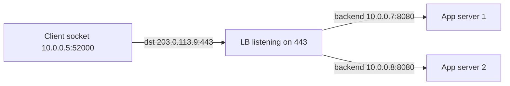

# Ports

## 1. One-Line Definition
A port is a 16-bit number (0-65535) that identifies a specific service or process on a host, so that when a packet arrives at an IP address it is handed to the right application, not just the right machine.

## 2. Why Do We Need It?
An IP address finds the machine; the machine runs thousands of processes (web server on 443, SSH on 22, a database on 5432). Without ports, only one process per machine could use the network. Ports are how the OS demultiplexes incoming traffic and how clients address a specific service — and they are half of the connection identity (source IP, source port, destination IP, destination port).

## 3. Simple Intuition
An apartment building: the IP is the building's street address, the port is the apartment number. The mail arrives at the building; the porter (OS) reads the apartment number and delivers each letter to the right resident. Two residents in one building — two ports on one IP.

## 4. What Happens Without It?
One process per machine (absurd in a colocation world), plus no way to say "this packet is for the API, not for SSH on the same box." Multi-tenant cloud, microservices, containers, and LBs all rely on many listeners per address — ports make that isolation and multiplexing possible.

## 5. Core Idea
- **The 16-bit space:** 0-65535, split into well-known (0-1023, e.g., 22 SSH, 53 DNS, 80 HTTP, 443 HTTPS), registered (1024-49151, e.g., 3306 MySQL, 5432 Postgres, 6379 Redis, 8080 dev HTTP), and **ephemeral** (49152-65535) — the range clients pick random source ports from.
- **Role asymmetry:** the *destination* port names the service (well-known, stable); the *source* port on the client is random ephemeral — each new connection takes a new source port so replies demultiplex correctly.
- **The 4-tuple identifies a connection:** (src IP, src port, dst IP, dst port). Many connections can share one destination port because source ports differ.
- **TCP and UDP both use ports**, but with separate spaces — a TCP 53 and a UDP 53 are different listeners.
- **DSTNAT and port forwarding** rewrite the destination; a public LB listens on 443 and forwards to a backend's 8080. NAT also rewrites source ports (that is where ephemeral exhaustion bites).
- **Ports bind to interfaces:** one process can listen on specific IPs only (e.g., DB bound to private IP, never 0.0.0.0).

## 6. Important Terminology

| Term | Simple Meaning |
|------|----------------|
| Port number | 16-bit service identifier |
| Well-known port | 0-1023, standardized services |
| Registered port | 1024-49151, common apps |
| Ephemeral port | 49152-65535, random client source ports |
| Socket | IP + port pair bound to a process |
| 4-tuple | src IP/port + dst IP/port = connection identity |
| Listener | A process bound and waiting on a port |
| DNAT / port forward | Rewriting the destination port at the edge |
| SNAT | Rewriting the source port/address for outbound |
| Port exhaustion | Running out of available source ports |

## 7. Basic Architecture



The client's destination port says "HTTPS please"; the LB's port says "this is the front door"; the backend ports (8080) are internal conventions only the LB needs to know.

## 8. Request or Data Flow
1. Client picks a random ephemeral source port (e.g., 52000) and targets the well-known destination port 443 for an [[http-and-https|HTTPS]] connection.
2. The OS on the server reads dst port 443 and hands the segment to the TLS-listener bound there.
3. The server replies to (client IP, client port 52000); the client OS knows which open connection that port belongs to.
4. Behind a flat internal network, all 100 backends listen on 8080; the LB picks one and opens a second connection (its source port → backend 8080).
5. When the client closes, its ephemeral port returns to the pool.

## 9. Practical Example
**K8s-style microservices (assumptions):** 50 services, one ingress.
- Ingress controller listens on host port 443; each service listens on its own internal port (e.g., `auth:8080`, `payments:8081`).
- `Service Discovery` knows which pod IP and port answer for `auth` — nobody hard-codes ports.
- An outbound NAT pool serves 10,000 instances through a few egress IPs — with ~16,000 ephemeral ports per IP, heavy cross-service outbound traffic must watch exhaustion.
- Security groups allow `443 from 0.0.0.0/0`, but `8080` only from the ingress's subnet — port-level ACLs are the isolation.

## 10. Scaling
- **Servers are port-rich, clients are port-starved:** a server can hold thousands of connections on port 443 because each has a distinct client 4-tuple; the client-side ephemeral range (about 16k usable ports per source IP) is the real ceiling for outbound connections.
- **Scaling the listener:** many connections on one port → put an LB in front, then distribute. The port is never the bottleneck; process capacity and NAT state are.
- **NAT exit exhaustion:** thousands of pods egressing through a few SNAT IPs burn ephemeral ports — add IPs, IPv6, or egress proxies.
- **Containers and namespaces:** each pod gets its own IP and ports, so the same container port (8080) coexists on thousands of pods without conflict.

## 11. Reliability and Failure Scenarios
- **Port conflict:** two processes bind the same (IP, port, protocol), the second fails or steals traffic — a classic deploy/binding bug.
- **TIME_WAIT and exhaustion:** quickly-opening-and-closing connections leave sockets settling in TIME_WAIT; at high rates they can starve the ephemeral pool on the closing side (visible in [[tcp|TCP]]).
- **Listener dies:** connections to the port get RST/reset or hang — health checks must probe the actual service port, not just the host.
- **Firewall misconfig:** forgetting to open a new service's port silently turns a launch into a timeout drill.
- **Detection:** bind errors, connection-refused (port closed) vs timeout (filtered) — the two tell you firewall vs node failure.

## 12. Consistency and Correctness
- Ports must be assigned **consistently across the fleet**: the same service must answer on the same port everywhere, or discovery maps break.
- An (IP, port, protocol) triple must be unique per host — duplicates are undefined behavior.
- Internal port conventions are contracts: changing a service's port without updating discovery and security groups breaks calls you thought were stable.

## 13. Performance
- Port demultiplexing is a hash, effectively free.
- The real costs sit nearby: TCP connection setup, TIME_WAIT recycling, and NAT's per-connection state lookup. A NAT/LB with millions of tracked 4-tuples becomes memory-bound long before ports themselves are slow.
- Choosing ephemeral ranges wider than 16k needs extra source IPs (or sysctl tuning), not faster code.

## 14. Security
- **Every open port is attack surface:** scan-minimize — only the well-known edge ports reach the internet; everything else drops at the security group.
- Port scanning is the attacker's census: reduce advertised ports, use a single ingress (443) and route internally by path/host.
- Never trust a port's "well-knownness" as security — port 3306 is still MySQL even if you move it.
- Internal-only binding (listen on the private IP, not 0.0.0.0) keeps a DB from being reachable on public interfaces.

## 15. Trade-Offs

| Choice | Advantages | Disadvantages | When to Use |
|--------|------------|---------------|-------------|
| One well-known edge port (443) | Minimal surface, universal | All services share one front door | Internet-facing APIs |
| Per-service ports | Direct service addressing | More surface, more firewall rules | Internal, trusted nets |
| DB on private IP only | Kept off public path | Discovery must know the address | Data stores |
| NAT egress pooling | Few public IPs | Ephemeral exhaustion at scale | Default cloud egress |
| IPv6 per-pod | No port/NAT scarcity | New tooling, dual config | Large fleets |

## 16. Common Mistakes
- Treating a firewalled port as an authentication boundary — ports select services, they don't verify callers.
- Ignoring the ephemeral-port ceiling when estimating outbound connection capacity.
- Leaving development defaults open (8080, 3306, 27017) on public security groups.
- Forgetting that TCP and UDP port spaces are separate, so blocking TCP 53 does not help DNS.
- Hard-coding ports in client config instead of using service discovery.

## 17. HLD vs LLD Boundary
HLD: edge listener strategy (one 443 front door vs per-service ports), port conventions across services, NAT/SNAT sizing, which subnets may reach which ports. LLD: the bind address in a config file, `SO_REUSEADDR`, ephemeral-range sysctls, a specific `kubectl port-forward`.

## 18. Interview Questions

### Beginner
- What is a port, and why does one machine need thousands of them?
- What is the difference between a well-known and an ephemeral port?

### Intermediate
- Five services, one server, one IP. How does a caller reach each one, and how does the OS route replies correctly?
- Why can thousands of connections share a server's port 443, but a client exhaust its ephemeral range?

### Advanced
- 10,000 services egress through three NAT IPs. Predict the bottleneck and design around it.
- Design the port and security-group scheme that lets microservices reach each other but never the public internet.

## 19. Interview Memory Summary

> [!abstract]- Interview Memory Summary

### Remember

- IP finds the machine; port finds the process.
- 0-1023 well-known, 1024-49151 registered, 49152-65535 ephemeral (client source ports).
- The 4-tuple (src IP/port, dst IP/port) identifies each connection.
- The server port is stable (443); the client port is random per connection.
- TCP and UDP have separate port spaces.
- NAT translates ports — state there is a real ceiling.
- Every open port is attack surface; 443 as the only door shrinks it.

### 30-Second Explanation

Ports demultiplex a host's traffic: the destination port names the service (443 HTTPS), the client picks a random ephemeral source port so the 4-tuple stays unique. Servers are port-rich (thousands of connections on one well-known port), while the client ephemeral range and NAT state are the real ceilings — so design edges as one 443 door, keep internal ports as conventions, and size NAT egress for connection volume.

### Interview Traps

- Saying "ports are identity" — they are selectors, not authenticators.
- Ignoring the ephemeral-port math when asked about outbound connection capacity.
- Blocking TCP 53 and claiming DNS is dead.
- Forgetting that open ports inside a subnet are still reachable from compromise paths.

### Key Trade-Off

A minimal, well-known edge port set shrinks attack surface and unifies routing but concentrates all services behind one front door; per-service ports are direct and explicit but multiply surface and firewall rules.

## 20. Related Concepts

### Prerequisites

- [[ip-address|IP Address (IPv4 vs IPv6)]] — the address that ports attach to.

### Commonly Used Together

- [[tcp|TCP]] — the transport whose connections are identified by the 4-tuple.
- [[udp|UDP]] — the other transport with its own port space.
- [[http-and-https|HTTP and HTTPS]] — 80/443, the well-known ports nearly every design uses.
- [[dns|DNS]] — resolves names so clients know which IP (and thus which port) to try.
- [[load-balancing|Load Balancing]] — one LB port fans to many backend ports.
- [[service-discovery|Service Discovery]] — answers "which IP and port answers for this service" without hard-coding.

### Alternatives

- [[dns|DNS]]-based named service selection (SRV records) instead of remembering port numbers.

### Advanced Concepts

- [[cloud-infrastructure|Cloud Infrastructure]] — security groups and network policies operate at CIDR-plus-port granularity.
- [[containers-and-vms|Containers and VMs]] — per-pod IPs and port namespaces multiply listeners safely.

Related planned topics (not authored yet): nat, vpc-and-subnets, firewall.

## 21. References
IANA Service Name and Transport Protocol Port Number Registry (see RFC 6335 for the assignment process). RFC 9239 (v6 as the default), Kurose and Ross, *Computer Networking: A Top-Down Approach* (transport layer). Verify service default ports with current vendor docs.

## 22. Active Recall

Test yourself before revealing each answer.

> [!question]- In one sentence, how do ports and IPs divide labor?
> The IP finds the machine and the port finds the process on that machine; together they form the destination address a packet must hit.

> [!question]- Why can a busy server accept thousands of connections on port 443, while a single client exhausts its own ports?
> The 4-tuple is unique per connection: the server's (dst IP, dst port) stays constant but each arriving client differs, so the receive side never collides. The client, however, must mint a new source port per outbound connection, and only ~16k ephemeral ports exist per source IP — that is the cap.

> [!question]- Trade-off: one public port (443) vs a port per service on the internet?
> One 443 door gives a tiny attack surface and lets a single LB/ingress route by host or path; per-service ports are simple to reason about but widen surface and multiply firewall rules, so they belong on internal networks, not the internet edge.

> [!question]- Your new service times out when other services call it, but tests work locally on localhost. What is the likely limit?
> A security group or firewall that did not open the service's port on the receiving subnet, or a listener bound to a specific/internal IP the caller cannot reach — connect refused versus timeout distinguishes "filtered" from "closed or down."

> [!question]- What is the 4-tuple, and what breaks if it ever collides?
> (Source IP, source port, destination IP, destination port) — the OS's handle on a connection, used both to demultiplex incoming packets and to replay replies to the right socket. Two live connections sharing a full tuple are indistinguishable; that is why source ports are random and recycled only after TIME_WAIT.

> [!question]- Interview scenario: estimate whether three NAT IPs are enough for 10,000 services that each make ~5 outbound calls/sec.
> 50,000 calls/sec × ~10 sec per call in TIME_WAIT ≈ 500,000 concurrent ephemeral ports needed; three NAT IPs give only ~3 × 16,000 ≈ 48,000 — a 10x shortfall. Fixes: more NAT IPs, IPv6 without NAT, or an egress proxy pooling connections instead of burning a port per call.

> [!question]- A developer blocked TCP port 53 to "block DNS traffic." What is wrong?
> DNS normally runs over UDP 53; TCP 53 is only for fallback and large transfers. Blocking TCP 53 alone blocks nearly nothing, while leaving UDP 53 wide open — always treat the TCP and UDP port spaces as separate.

## 23. When Should I Use This?

### Use it when

- You design the edge: what port does the public LB listen on, and how big is the exposed surface?
- You define service-to-service access: internal port conventions and the security groups that permit them.
- You estimate outbound capacity through NAT and worry about ephemeral exhaustion.
- You reason about discovery: clients need to know which IP and port answer for a service.

### Avoid it when

- The platform hides ports entirely (serverless function endpoints, managed message queues — no listening ports in your design).
- You are designing pure business logic where transport details are abstracted away.
- A single managed LB front door already routes everything; port-level design is a sub-detail there.

### What problem does it solve?

Problem: one host runs many services, and packets need a way to land on the right process. Bottleneck: one machine, enormous connection fan-in. Solution: stable well-known destination ports per service plus random ephemeral source ports per connection, giving every connection a unique 4-tuple and letting thousands of clients share one server port.

### What problem does it NOT solve?

Ports do not authenticate callers, isolate tenants, or protect data — firewalls/security groups that use ports enforce only "which service," never "which user." They also do not provide reliability or ordering (that is the transport), and they do not solve address scarcity by themselves (that is NAT/IPv6).

## 24. Decision Connections

Decisions that go together with ports:

- [[ip-address|IP Address (IPv4 vs IPv6)]] — the address side of the socket pair.
- [[tcp|TCP]] and [[udp|UDP]] — the transports whose connections ports identify; choose the transport first, then the port convention.
- [[http-and-https|HTTP and HTTPS]] — 80/443, the ports the internet standardizes on.
- [[load-balancing|Load Balancing]] — a single edge port derived to many backend ports.
- [[service-discovery|Service Discovery]] — resolves the running IP and port for a name, replacing hard-coded port config.
- [[cloud-infrastructure|Cloud Infrastructure]] — security groups allow specific CIDR-to-port pairs, making this the isolation mechanism.
- [[network-latency|Network Latency]] — port decisions don't add latency, but STR/NAT state tables do at scale.

Decision tree:

```
A caller must reach a specific service on a host
    |
    +-- Internet-exposed?
    |      → one front door port 443, route by host or path
    |         +-- Extra exposure worth it?  → NO, keep surface minimal
    |
    +-- Internal service-to-service?
    |      → standard port per service + [[service-discovery|Service Discovery]]
    |         +-- Isolated per tenant or cell? → separate subnets, port ACLs
    |
    +-- Outbound from a fleet?
    |      → size NAT egress for ephemeral-port volume, or use IPv6
    |
    +-- Managed platform (serverless, queues)?
           → ignore ports; the platform owns listeners
```