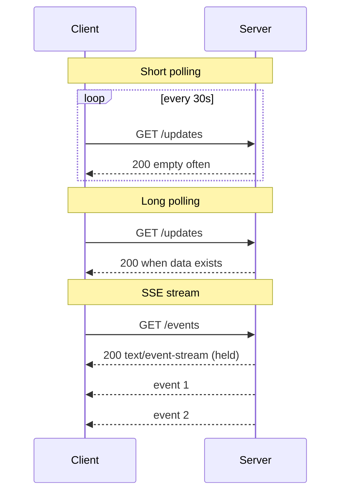

# SSE / Long Polling / Short Polling

## 1. One-Line Definition
Short polling, long polling, and Server-Sent Events (SSE) are three HTTP-only techniques for getting updates from a server without an open two-way socket: re-request on a timer, hold a request until an update exists, or keep a single long-lived HTTP stream of server-pushed events.

## 2. Why Do We Need It?
HTTP is request/response, but many features — notifications, live scores, order status, news feeds — need the *server* to deliver changes. WebSockets requires an upgrade and a full-duplex protocol; these three give you "good enough" realtime over plain HTTP, with varying trade-offs in latency, cost, and connection semantics. For many products the simpler the better, and SSE in particular gives true server→client push with HTTP-native mechanics and automatic reconnection.

## 3. Simple Intuition
- **Short polling** is checking your mailbox every 10 minutes: you only see mail that arrived since your last look, and you pay for the trip each time.
- **Long polling** is waiting at the mailbox until the mailman arrives, then going home and coming back to wait again: you notice mail instantly, but you're always "on the clock" waiting.
- **SSE** is a newspaper subscription: the paper delivers fresh articles to your door as they publish, and the delivery person knows to resume after a gap (reconnect by issue number).

## 4. What Happens Without It?
Users only see changes when they refresh the page; the "live" indicator is a myth. Applications that need up-to-date state either force manual refreshes (bad UX), hammer the server with empty polls (wasted cost), or turn to WebSockets for everything (protocol and infra complexity) — when a one-way push or a coarse refresh would have solved 80% of the product.

## 5. Core Idea
- **Short polling:** client asks "anything new?" on a timer. Dead simple, works everywhere, but latency = interval and cost = requests-per-uptime, mostly empty.
- **Long polling:** client asks and the server *holds* the request open until an update arrives (or a long timeout), then answers and repeats. Instant-ish latency at the cost of held HTTP connections and proxy timeout tuning.
- **SSE (`text/event-stream`):** the server opens *one* long-lived HTTP response that streams events as they happen. HTTP-native (works through ordinary proxies/CDNs, gets TLS from HTTPS), one-way only (server→client), and — critically — the browser's `EventSource` **auto-reconnects** and tracks a **Last-Event-ID** so missed events can be resumed. Best combined with the same HTTP headers and caching rules as normal responses.
- **Common center:** all three ride plain HTTP(S); the difference is connection lifetime and who initiates delivery.

## 6. Important Terminology

| Term | Simple Meaning |
|------|----------------|
| Short polling | Client re-requests on an interval |
| Long polling | Server holds the HTTP request until an update exists |
| SSE | One long-lived HTTP stream of server-pushed text events |
| EventSource | Browser API for SSE with auto-reconnect |
| text/event-stream | The SSE response content type |
| Last-Event-ID | Resume marker so reconnects don't miss events |
| retry field | SSE's suggested reconnect delay |
| Connection idle timeout | Proxy/LB timeout that can kill held requests |

## 7. Basic Architecture



## 8. Request or Data Flow
1. **Short polling:** timer fires → client GET → server returns pending updates (often none) → repeat. The server never holds anything; state is whatever exists at request time.
2. **Long polling:** client GET → server blocks (up to a cap) on a queue/change-notifier → on event (or timeout), returns updates → client re-issues the GET instantly. Each "round trip" is a full HTTP request again.
3. **SSE:** client GET `/events` accepting `text/event-stream` → server splices its changes into the open response body as `data:` lines → events include an `id`; if the connection drops, the client reconnects sending `Last-Event-ID` and the server resumes after the last delivered event.

## 9. Practical Example
**Live-scores dashboard (assumptions):** 50k concurrent viewers, an update every ~1s per in-play game.
- **Short polling every 5s:** 20 requests/viewer/minute → 1M empty request/min; server cost explodes while perceived latency is up to 5s.
- **Long polling:** sub-second latency, but 50k simultaneous held HTTP connections need LB idle-timeout tuning and per-connection server resources.
- **SSE:** 50k held connections, but events stream the moment they exist with automatic `Last-Event-ID` recovery — the cleanest fit when delivery is one-way. (Add WebSockets only when clients must also send.)

## 10. Scaling
- **Short polling scales by capping interval and deduping:** the biggest lever is asking less often and letting the client/local cache absorb updates; empty-poll floods are the killer.
- **Long polling and SSE are connection-scale heavy:** capacity = concurrent held HTTP connections × per-connection resources. LBs must have long/disabled idle timeouts, CDNs must not buffer the stream, and connection count is the unit you size by.
- **Fan-out inside the backend:** with many connections, update distribution to all of them is a publish-subscribe pattern over a shared broker (see publish-subscribe) — instances subscribe and stream to their own connections.
- **Dedup at the source:** if 50k clients watch the same feed, one update should fan out to the broker once, not be re-derivable 50k times.

## 11. Reliability and Failure Scenarios

| Failure | What Happens | Detection | Recovery | Trade-off |
|---------|--------------|-----------|----------|-----------|
| LB idle timeout kills long poll/SSE | Connections die mid-update | Drop-rate on stream | Client auto-reconnect (SSE) / re-poll | tuning |
| Server restarts | Held connections break | Connection-count drop | EventSource reconnects from Last-Event-ID | — |
| CDN buffers SSE stream | Events arrive in bursts, not live | Delivery-time skew | Disable buffering for the path | — |
| Backend lag on updates | Feed falls behind | Producer-lag metric | Scale consumers | latency |

## 12. Consistency and Correctness
Ordering is per-connection/per-stream: SSE events arrive in send order, and the `id` + `Last-Event-ID` contract makes reconnects *resumable* — the server replays from after the last delivered id, so gaps heal. Long/short polling instead sample *current state*: a client can miss a transient update entirely (state-change between polls) unless the server persists a monotonic event log and the client tracks its cursor. For correctness-sensitive feeds, persist the event stream (broker/DB) and treat all three transports as views over it.

## 13. Performance
- **Short polling:** latency = interval; cost ∝ request rate (empty polls dominate).
- **Long polling:** latency ≈ event frequency (server answers as soon as something exists); cost = held-connection resources.
- **SSE:** per-event overhead is just an HTTP chunk — small; latency is real server-to-client push. Sizing unit: held HTTP connections and event throughput, not request rate.
- For rare/coarse updates all three beat WebSockets (no upgrade, no duplex protocol); for chat-like frequency only WebSockets simply.

## 14. Security
- All three are ordinary HTTP(S), so HTTPS is standard — never plaintext over the LAN/internet path.
- **Auth for SSE is the gotcha:** `EventSource` cannot set custom headers, so token auth must be query-param/path-based, or pair the stream with a short-lived URL/cookie handshake — and keep it from leaking into logs (see http-and-https header hygiene).
- Long-poll and SSE endpoints must rate-limit per client to avoid connection floods, and treat any client-controlled cursor (Last-Event-ID) as tainted input (validate before replaying).

## 15. Trade-Offs

| Choice | Latency | Server Cost | Complexity | Best For |
|--------|---------|-------------|------------|----------|
| Short polling | interval-bound | requests/second | none | Rare, coarse updates; unauthenticated hacks |
| Long polling | ~event-driven | held connections | Low | Comet-era push on plain HTTP |
| SSE | real-time push | held connections | Low | One-way feeds with auto-reconnect |
| WebSockets | real-time duplex | sockets + infra | High | Two-way chat/gaming |

## 16. Common Mistakes
- Using short polling for realtime-ish features and burning QPS on empty requests.
- Forgetting LB/proxy idle timeouts silently kill long-poll and SSE connections.
- Overbuilding: choosing WebSockets when one-way SSE plus its free auto-reconnect is the actual need.
- SSE without `Last-Event-ID` and a persisted event log — reconnect loses everything in flight and it's invisible.
- Letting `EventSource` hit an endpoint that wants an auth header it can't send; or letting the token-bearing URL into logs.

## 17. HLD vs LLD Boundary
HLD: transport choice (short vs long polling vs SSE vs WebSockets), stream/connection sizing, fan-out bus behind feeds, reconnection/cursor policy, timeout and proxy tuning. LLD: the `EventSource` instantiation, the server's `data:` line generator, one client-library poll loop, a specific `Last-Event-ID` replay query.

## 18. Interview Questions

### Beginner
- How do short polling, long polling, and SSE differ in connection life and latency?
- Why does short polling cost so much at scale?

### Intermediate
- Design a live-scores feed for 50k viewers; justify polling vs SSE and the fan-out.
- SSE can't set auth headers with EventSource. How do you authenticate the stream?

### Advanced
- How do you guarantee that a long-poll/live-feed client never misses an update across a server restart?
- When is WebSockets genuinely better than SSE, and how do you decide?

## 19. Interview Memory Summary

> [!abstract]- Interview Memory Summary

### Remember

- Short polling = ask on a timer; latency = interval, cost = empty requests.
- Long polling = server holds the request until data exists; latency ≈ event rate.
- SSE = one held HTTP stream, server→client only; has free auto-reconnect + Last-Event-ID.
- All three are plain HTTP(S) — no upgrade, proxy-friendly, HTTPS-native.
- Capacity cadence: held connections (long-poll/SSE) vs request rate (short).
- The robust pattern: persist an event log; the transport is just a view.

### 30-Second Explanation

Short polling re-asks on a timer (simple, interval-bound); long polling pins one HTTP request until an update exists (instant-ish, held-connection cost); SSE keeps a single long-lived HTTP stream and pushes events with automatic `Last-Event-ID` reconnection. They trade up from coarse to true push while staying HTTP-native; for one-way feeds, SSE is usually the right answer before you reach for WebSockets.

### Interview Traps

- Ignoring LB/proxy idle timeouts when holding requests open.
- Saying "realtime" and immediately jumping to WebSockets — SSE often does it with HTTP semantics.
- SSE without a persisted event log + Last-Event-ID (reconnects silently lose events).
- Treating auth like a regular API when EventSource can't send headers.

### Key Trade-Off

HTTP-only push gives you protocol simplicity, proxy-friendliness, and (for SSE) free reconnection at the cost of one-way-only delivery and per-connection resource holding — WebSockets is the upgrade you pay for when clients must also send.

## 20. Related Concepts

### Prerequisites

- [[http-and-https|HTTP and HTTPS]] — all three ride ordinary HTTP(S); headers/timeouts decide survival
- [[dns|DNS]] — resolving the stream's host

### Commonly Used Together

- [[websockets|WebSockets]] — the full-duplex option these techniques compare against
- [[message-queue|Message Queue]] / [[publish-subscribe|Publish-Subscribe]] — the event bus feeding your streams
- [[event-driven-architecture|Event-Driven Architecture]] — the pattern the feed layer fits into
- [[load-balancing|Load Balancing]] — connection-draining + idle-timeout behavior decides stream survival
- [[reverse-proxy|Reverse Proxy]] — where stream buffering/CC headers must be handled correctly
- [[retry-and-timeout|Retry and Timeout]] — reconnect-backoff semantics on top of EventSource

### Alternatives

- [[webhooks|Webhooks]] — push to a *server-owned* endpoint instead of a client view

### Advanced Concepts

- [[consumer-lag|Consumer Lag]] — the stream producer falling behind consumers
- [[api-timeouts|API Timeouts]] — the timeout math long polling must obey

Related planned topics (not authored yet): http-cookies.

## 21. References
WHATWG HTML Standard, "Server-Sent Events" section (the `EventSource` interface, event-stream format, Last-Event-ID); RFC 9110 for HTTP semantics that these techniques rely on. Verify current browser/LB behaviors with vendor docs.

## 22. Active Recall

Test yourself before revealing each answer.

> [!question]- Basic understanding: what is the concrete difference between short polling and long polling?
> Short polling: the client re-asks on a timer, and the server answers immediately — latency is bound by the interval and most responses are empty. Long polling: the server holds the client's request until an update exists (or times out), then answers — latency tracks event arrival, but every wait is still a full held HTTP request that must be re-issued.

> [!question]- Basic understanding: what does Last-Event-ID actually do in SSE?
> The server assigns each event an `id`; when the connection drops, the client's EventSource automatically reconnects *with* `Last-Event-ID` in the request, and the server resumes after that id. Combined with a persisted event log, no event between disconnect and reconnect is lost — that's SSE's built-in correctness story.

> [!question]- Design decision: 50k viewers watching a live scores feed. Poll, SSE, or WebSockets, and for which reasons?
> SSE: one-way updates, HTTPS-native, auto-reconnect, held-connection capacity (50k). Long polling costs the same connections with per-message re-handshakes and worse middleware survival; short polling costs millions of empty requests a minute; WebSockets adds duplex machinery you don't need. Scale by fanning one update out through the pub/sub bus to all connections.

> [!question]- Trade-off: why is SSE "good enough realtime" for most products, and when do you accept the WebSockets upgrade?
> SSE delivers one-way with real push, free reconnect, and HTTP proxy/TLS compatibility for a fraction of the infra complexity — that covers feeds, notifications, and dashboards. You upgrade to WebSockets when the client must also send frequent messages (chat, cursors, gaming) where per-message HTTP round trips would dominate.

> [!question]- Failure scenario: an LB idle timeout is set to 60s and kills your long-poll/SSE streams. Diagnose and fix.
> Symptom: clients "disconnect" every minute or so and events arrive in bursts. Cause: the LB/proxy refuses to hold an idle request open. Fix: WS/long-connection-aware LB with long or disabled idle timeout, or heartbeat/hold messages inside the stream; for SSE rely on EventSource auto-reconnect as the safety net; for long polling honor `Retry-After`/reconnect delay.

> [!question]- Interview scenario: guarantee a notification feed client never misses an update across a server restart.
> The transport is only a view over a persisted event log: attach monotonically increasing ids server-side; the client resumes by Last-Event-ID after any reconnect, and the server replays from the log from that point. The stream may drop, the EventSource reconnects, and the log heals the gap — correctness lives in the log, not the connection.

## 23. When Should I Use This?

### Use it when

- Updates are one-way server→client and arrival freshness matters.
- You want HTTP-native realtime that proxies/CDNs and HTTPS handle easily.
- SSE's auto-reconnect and Last-Event-ID are worth more than duplex messaging.
- Long polling/short polling are the only option on a constrained or legacy stack.

### Avoid it when

- Clients must also send messages in real time — use WebSockets.
- Update rate is extremely high and connection-holding dominates — WebSockets/streaming infrastructure is the fit.
- Poll cadence is so low-stakes that short polling's simplicity wins anyway.

### What problem does it solve?

Problem: HTTP is request/response; clients can't see changes without asking, and asking costs. Solution: a latency/cost ladder from short polling (cheapest, coarsest) through long polling (held request, instant-ish) to SSE (true one-way push with auto-reconnect) — HTTP-native, mostly proxy-proof, and sized by held connections when it reaches real-time.

### What problem does it NOT solve?

None of them give full duplex (that's WebSockets), SSE can't set auth headers through EventSource, long polling is vulnerable to proxy timeouts, and short polling never beats its interval — pick the right rung and know the ladder stops before two-way.

## 24. Decision Connections

Decisions that go together with SSE / polling:

- [[http-and-https|HTTP and HTTPS]] — the transport all three ride; headers and timeouts decide stream survival.
- [[websockets|WebSockets]] — the full-duplex alternative this family is measured against.
- [[message-queue|Message Queue]] / [[publish-subscribe|Publish-Subscribe]] — the event bus that fans updates to all held connections.
- [[load-balancing|Load Balancing]] — idle timeouts and connection draining make or break long-lived feeds.
- [[reverse-proxy|Reverse Proxy]] — buffering/CORS/header handling at the edge of a stream.
- [[event-driven-architecture|Event-Driven Architecture]] — the architectural slot a feed belongs to.
- [[retry-and-timeout|Retry and Timeout]] — reconnect-backoff in combination with SSE's auto-reconnect.
- [[webhooks|Webhooks]] — the push variant for server-owned endpoints instead of client views.

Decision tree:

```
Clients must see server-side changes
    |
    +-- Changes rare, coarse, deadline loose?
    |      → short polling (e.g. 30s interval)
    |
    +-- Two-way messaging with frequent client sends?
    |      → [[websockets|WebSockets]]
    |
    +-- One-way server-push with reconnect safety?
    |      → [[server-sent-events|SSE / Long Polling / Short Polling]]
    |         |
    |         +-- Streaming HTTP available?      → SSE with Last-Event-ID + event log
    |         +-- Plain HTTP only (legacy)?       → long polling
    |         +-- Fan-out to many connections?    → [[publish-subscribe|Publish-Subscribe]] behind the stream
    |         +-- Edge/LB must hold requests?     → [[load-balancing|Load Balancing]] tuning
    |
    +-- Push to a server endpoint instead of a client view?
           → [[webhooks|Webhooks]]
```