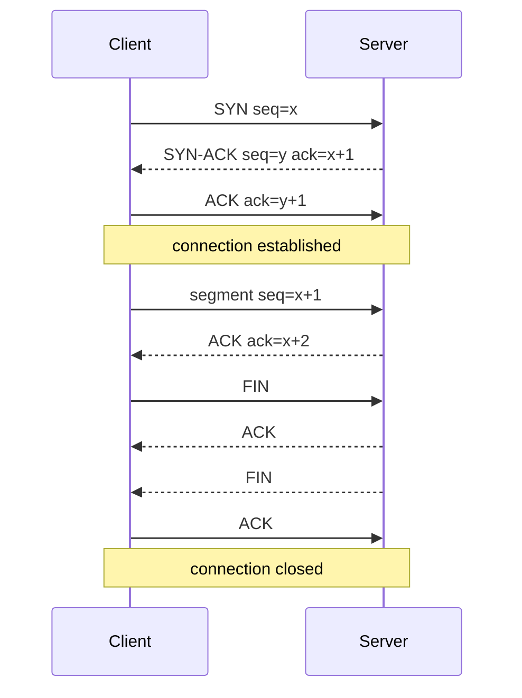

# TCP (Transmission Control Protocol)

## 1. One-Line Definition
TCP is the connection-oriented transport protocol that delivers data between two endpoints reliably, in order, without duplicates, on top of the best-effort IP layer.

## 2. Why Do We Need It?
[[ip-address|IP]] delivers packets with no guarantees — they can be lost, reordered, duplicated, or dropped. Applications that must handle byte streams (HTTP pages, file transfer, SQL results, distributed-system RPCs) do not want to re-implement reordering, retransmission, flow control, and congestion control each time. TCP is the standardized layer that provides those guarantees, and it is also the reason modern HTTP and databases behave the way they do.

## 3. Simple Intuition
Registered mail with tracking: the sender numbers every letter, receives a receipt (ACK) for each, resends anything not acknowledged, and holds their sending rate back when the postal network is congested. A phone call is an even better image — TCP *connects* two parties and keeps the line open — while a postcard (UDP) just goes out and is forgotten. TCP adds a handshake, an open channel, and a polite goodbye.

## 4. What Happens Without It?
Every app would invent its own reliability: ad-hoc retransmission timers, sequence accounting, buffer management, and flow control — subtly broken in hundreds of places. Worse, without TCP's congestion control, overloaded routers would melt under uncoordinated retransmits, collapsing the network (congestion collapse). Without it, HTTP, TLS, gRPC, and database drivers would compute much more per byte than they do today.

## 5. Core Idea
- **Connection-oriented:** a dedicated full-duplex channel begins with a 3-way handshake — SYN, SYN-ACK, ACK — and ends with a 4-way teardown; each connection is identified by the 4-tuple (see [[ports|Ports]]).
- **Reliable, ordered, once-only:** data is chopped into segments, each given a sequence number; the receiver acknowledges (ACKs) received data and the sender retransmits anything not ACKed within the timeout. Order is reassembled, duplicates dropped — the app sees one clean byte stream.
- **Flow control:** the receiver advertises a window (how much it can buffer); the sender never exceeds it — a fast producer can't drown a slow consumer.
- **Congestion control:** the sender also paces itself by network state — slow start doubles the window per RTT until a loss, then backs off (AIMD / Cubic) — so many flows share links "fairly."
- **Cost of guarantees:** in-order delivery means head-of-line blocking (one lost segment stalls everything behind it), and every ACK plus timer adds overhead. This is the [[udp|UDP]] trade-off.
- **Statefulness is expensive:** each connection holds kernel memory; servers at scale manage thousands of them carefully (connection pooling, keep-alive).

## 6. Important Terminology

| Term | Simple Meaning |
|------|----------------|
| Handshake | SYN, SYN-ACK, ACK — opens a connection |
| Segment | TCP's unit of data |
| Sequence number | Byte position; enables ordering and dedup |
| ACK | The receiver's receipt, tells what next byte to send |
| RTT / RTO | Round-trip time / retransmission timeout |
| Sliding window | How many unacknowledged bytes may be in flight |
| Congestion control | Pacing send rate to the network's condition |
| Slow start | Ramp-up phase doubling the window per RTT |
| Head-of-line blocking | One loss stalling later data on the same flow |
| TIME_WAIT | Cooldown after close so late packets die out |
| Keep-alive | Periodic probes on idle connections |
| Half-open connection | One side gone, the other still thinks it's open |

## 7. Basic Architecture



The handshake costs one extra round trip versus a bare send; every reliable byte depends on the ACK loop between the two endpoints.

## 8. Request or Data Flow
1. Client dials an address: (server IP, well-known port) with a fresh random source port.
2. SYN / SYN-ACK / ACK establish the connection; each side learns the other's numbering.
3. Requests are segmented, numbered, sent, ACKed; any gap is retransmitted on timeout.
4. When the window fills, the sender waits — flow and congestion control decide throughput (see [[network-latency|Network Latency]] for the window math).
5. On done, FIN/ACK teardown; TIME_WAIT on the closing side keeps stale segments from polluting a reused socket.

## 9. Practical Example
**HTTP API to a database-backed server (assumptions):** 10k QPS, keep-alive.
- The server holds an [[http-and-https|HTTP]] keep-alive pool: a few thousand long-lived TCP connections carry tens of thousands of requests each, avoiding a handshake per request.
- Each request is in-order and reliable — the app layer trusts it, but a slow consumer still needs flow control so the sender backs off.
- Latency math: if RTT is 100 ms and the request needs 3 round trips (TLS included), first byte ≈ 300 ms + server time. Keep-alive turns repeated requests into ~1-RTT each.
- Under loss, throughput collapses (slow start restarts) — which is why a flaky mobile link is a different design problem (see [[udp|UDP]]/QUIC).

## 10. Scaling
- **Connections are memory, not telepathy:** each open socket costs kernel buffers (tens of KB). A box juggling 100k idle connections is fine; 100k *active* ones need big RAM and tuned limits.
- **Handshake storms:** after a failover, thousands of clients reconnect and SYN simultaneously — absorb with keep-alive, session resumption, and admission control (see [[circuit-breaker|Circuit Breaker]]).
- **Connection pooling is the scaling lever:** reuse connections instead of opening per request ([[database-connection-pooling|Database Connection Pooling]]); LBs and proxies centralize the reuse.
- **TIME_WAIT exhaustion:** high-rate short-lived connections burn ephemeral ports locally — balance, reuse, or tune before you see "Address already in use" at scale.
- **Generic backlog, LB thinning:** a Layer-4 LB terminates thousands of TCP connections and forwards — size its conntrack tables and timeouts (see [[load-balancing|Load Balancing]]).

## 11. Reliability and Failure Scenarios

| Failure | What Happens | Detection | Recovery | Trade-off |
|---------|--------------|-----------|----------|-----------|
| Packet loss | Retransmit, throughput drops | Duplicate ACKs, RTOs | Slow-start recovery | latency spike |
| Link down | Connection hangs | Keep-alive misses | App timeout + reconnect | timeout tuning |
| Server crash | RST or silent drop | Connect/read errors | Retry to another instance | needs retry logic |
| Half-open connection | One side gone, sockets linger | Idle detection | TCP keep-alive probes | periodic bytes |

TCP is reliable *given a connection*; it cannot detect that the peer's app is hung, only that the peer's kernel stopped responding — so apps still need timeouts and retries ([[retry-and-timeout|Retry and Timeout]]).

## 12. Consistency and Correctness
- TCP guarantees the byte stream arrives **once, in order** to the application — so application-level duplicates (from app-layer retries) are *not* its business: the app still needs [[idempotency|Idempotency]] for its own retried requests.
- Ordering is transport-only: two parallel TCP connections can interleave differently — order-sensitive apps must serialize or tag.
- Half-open suspicion is a correctness trap: a peer that emitted FIN-less silence (process killed) leaves the other side believing the connection healthy — keep-alive and app-layer heartbeats are the fix.

## 13. Performance
- One extra handshake RTT to open; keep-alive amortizes it to near zero per request.
- **Throughput ceiling = window / RTT:** to push 10 Gbps at 100 ms RTT you need ~125 MB of in-flight unacknowledged data (bandwidth-delay product) — larger windows or more parallel connections, not faster CPUs.
- Head-of-line blocking: a single lost segment stalls the whole pipeline; fine for web pages, bad for video where [[udp|UDP]]/QUIC shines.
- Small-packet efficiency: Nagle/delayed-ACK interplay can add latency for tiny interactive requests — tune or batch consciously.

## 14. Security
- TCP itself is unencrypted and open to snooping and hijacking in the clear — always run TLS above it ([[encryption-and-keys|Encryption and Keys]]).
- SYN floods can exhaust server state — use SYN cookies/limits at the edge; never expose plain TCP services without a firewall.
- Port scanning and connection resets (RST injection) are spoofing vectors on plain TCP.
- The connection is identified by the 4-tuple, which can be spoofed under weak ISPs — which is one more reason identity lives at the TLS/app layer, not the transport.

## 15. Trade-Offs

| Choice | Advantages | Disadvantages | When to Use |
|--------|------------|---------------|-------------|
| TCP | Ordered, reliable, congestion-safe | Handshake + HOL, stateful/memory | HTTP, DBs, RPCs |
| Keep-alive reuse | Nearly free subsequent requests | Idle connections tie memory | High-QPS APIs |
| Very large windows | High throughput at long RTT | Tuned per link, memory heavy | WAN data transfer |
| Multiple parallel conns | Beat single-flow window caps | Unfair share, more state | Browser, big downloads |
| Disable keep-alive | Zero idle overhead | Dead peer detection delayed | Short-lived clients |
| [[udp|UDP]]/QUIC | No HOL, fast handshake | App must rebuild reliability | Video, mobile, gaming |

## 16. Common Mistakes
- Assuming "TCP is reliable" covers app semantics — the app can still crash mid-write; you need idempotency and retries anyway.
- Forgetting that a new connection costs an RTT — then designing chatty APIs that reopen connections per call at high QPS.
- Not sizing TIME_WAIT / ephemeral ports, then hitting silent connect failures at scale.
- Treating throughput as pure bandwidth and ignoring the window/RTT ceiling.
- Tuning timeouts short enough that a normal GC pause or cluster rebalance looks like a dead connection and triggers stampedes.

## 17. HLD vs LLD Boundary
HLD: connecting topology (keep-alive pooling, LB termination, protocol choice, connection budgets per tier, timeout policy). LLD: socket options in one server (`TCP_NODELAY`, backlog, window size), retransmission tuning, the reconnect loop in one client.

## 18. Interview Questions

### Beginner
- How does TCP give reliability when IP does not?
- What happens in a 3-way handshake, and what does it cost?

### Intermediate
- Why does a high QPS API use keep-alive and connection pools instead of one connection per request?
- Why can uploads and downloads both be slow even when bandwidth is huge?

### Advanced
- How do you get 10 Gbps of throughput over a 100 ms RTT link using TCP?
- What breaks first at 100k concurrent TCP connections on one server, and how do you design around it?

## 19. Interview Memory Summary

> [!abstract]- Interview Memory Summary

### Remember

- Reliable, ordered, duplicate-free byte stream over unreliable IP.
- 3-way handshake (SYN, SYN-ACK, ACK) = one extra RTT.
- Sequence numbers + ACKs + retransmission = reliability.
- Flow control = receiver window; congestion control = slow start and backoff.
- Throughput ceiling ≈ window / RTT.
- Head-of-line blocking is the price of in-order delivery.
- Connections are stateful and memory-hungry; pool and reuse them.

### 30-Second Explanation

TCP opens a stateful connection (SYN, SYN-ACK, ACK), splits data into numbered segments, ACKs and retransmits lost ones, and paces itself with flow and congestion control so the network stays fair. It is why HTTP and databases behave, but each connection costs a handshake RTT and kernel memory, throughput is capped at window/RTT, and one loss stalls the whole pipe — so reuse connections, size timeouts, and put idempotency above the transport anyway.

### Interview Traps

- Claiming TCP makes retries unnecessary — app-level idempotency is still required.
- Opening a connection per request and being surprised by handshake overhead.
- Ignoring the window/RTT ceiling when asked to size a big transfer.
- Tuning timeouts so aggressively that normal jitter triggers retry stampedes.

### Key Trade-Off

TCP trades a stateful, cheaper-to-reason pipe with ordering and congestion safety against a handshake RTT, head-of-line blocking, and kernel-memory cost per connection — the reason UDP/QUIC exists for low-latency and lossy paths.

## 20. Related Concepts

### Prerequisites

- [[ip-address|IP Address (IPv4 vs IPv6)]] — the address layer TCP rides on.
- [[ports|Ports]] — the 4-tuple (IP/port pairs) that names each connection.

### Commonly Used Together

- [[http-and-https|HTTP and HTTPS]] — HTTP/1.1 and 2 run over TCP; connection reuse and multiplexing are TCP awareness.
- [[network-latency|Network Latency]] — RTT, window, and loss are the numbers that make TCP behave.
- [[load-balancing|Load Balancing]] — Layer 4 LBs terminate, pool, and balance TCP connections.
- [[database-connection-pooling|Database Connection Pooling]] — the connecting reuse pattern that keeps TCP costs flat.
- [[retry-and-timeout|Retry and Timeout]] — app logic that works with, not against, TCP timeouts.

### Alternatives

- [[udp|UDP]] — connectionless, no reliability, lower latency and no HOL blocking.
- [[rpc-grpc-graphql|RPC, gRPC, and GraphQL]] — gRPC keeps TCP connection reuse but adds its own streaming semantics.

### Advanced Concepts

- [[tail-latency|Predictable Tail Latency]] — happens when one slow TCP flow delays an entire fan-out.
- [[replication-lag|Replication Lag]] — the same window/ack dynamics appear in data replication pipelines.

Related planned topics (not authored yet): connection-pooling, websockets.

## 21. References
RFC 9293 (TCP, merged successor to RFC 793). Kurose and Ross, *Computer Networking: A Top-Down Approach* (transport layer). Kleppmann, *Designing Data-Intensive Applications* (ch. 8, network and latency realities). Re-check protocol parameters with current IETF docs.

## 22. Active Recall

Test yourself before revealing each answer.

> [!question]- How does TCP convert a lossy, unordered IP into an ordered, reliable byte stream, in three moves?
> Number every segment with a sequence number, ACK each received byte so the sender knows what arrived, and retransmit anything not ACKed by the timeout — the receiver reassembles in sequence and drops already-seen bytes.

> [!question]- What is the 3-way handshake and what does it cost?
> SYN, SYN-ACK, ACK — the two sides agree on sequence numbers and open a full-duplex connection. The cost is one extra round trip before data flows, and that RTT shows up in the first-byte latency of every new connection.

> [!question]- Why is TCP throughput not simply "bandwidth"?
> You can only keep about window-size bytes unacknowledged in flight, so the ceiling is window/RTT — at 100 ms RTT a 1 MB window caps at ~80 Mbps no matter how fat the pipe. Raise the window or open parallel connections, not the link speed.

> [!question]- Trade-off: TCP reliability vs UDP/QUIC for a video stream?
> TCP's in-order retransmission blocks all later data on a loss (head-of-line), wrecking the stream; UDP/QUIC lets the app drop late frames and move on, trading a perfect stream for a live one — the right choice when timing beats completeness.

> [!question]- A server restart keeps half of your clients stuck for minutes. What is the mechanism, and what fixes it?
> Half-open connections: clients' sockets think the old connection lives, but the server kernel is gone — nothing is sent, nothing is seen dead. Fix: TCP keep-alive probes and app-level heartbeats that surface deadness quickly, plus client-side reconnect with jittered backoff.

> [!question]- Interview scenario: justify connection pooling for a 100k-QPS microservice mesh.
> A handshake per call costs an RTT and floods SYN + TIME_WAIT state; at 100k QPS that means tens of thousands of fresh connections a second, exhausting kernel memory and ephemeral ports. A pool keeps a few thousand long-lived TCP connections in flight, amortizing handshake and ACK overhead across millions of requests — TCP's costs become flat instead of per-request.

> [!question]- Why do TCP timeouts tempt you into tuning them wrong?
> Too long: dead connections hang requests and users feel the pause. Too short: a GC pause, a slow disk, or a heartbeat gap looks like death, triggering a stampede of retries. The right timeout is a statistical decision above the *network* RTT including the app's own p99 processing — which is why it belongs in the design docs, not the socket boilerplate.

## 23. When Should I Use This?

### Use it when

- The app needs reliable, ordered byte delivery (web, APIs, files, database protocols).
- Latency tolerance is normal and exactness beats freshness (one perfect stream over several lossy ones).
- You can amortize one-time connection cost through pooling and keep-alive.
- You want the mature congestion-control ecosystem that keeps the whole network fair.

### Avoid it when

- Real-time timing matters more than completeness (voice, video, games) — infer [[udp|UDP]]/QUIC.
- You hand-off-loss online: a floor is a whole retransmission window of stall.
- Every connection is so short that handshake + TIME_WAIT cost dominates — the platform may already pool it for you.
- Marginal latency on mobile lossy networks is the differentiator — HTTP/3 over QUIC wins.

### What problem does it solve?

Problem: the IP layer offers no delivery guarantee, so applications need ordering, retransmission, flow control, and congestion safety shared by all. Bottleneck: naive retransmission would collapse overloaded networks. Solution: a stateful, sequence-numbered, ACK-driven, self-regulating transport — with pooling and keep-alive patterns making that state cheap at scale.

### What problem does it NOT solve?

TCP does not authenticate or encrypt (TLS sits above it), does not detect hung application processes (only unresponsive kernels), does not guarantee *application* semantics (duplicate app retries still need idempotency), and its in-order guarantee actively harms real-time media. It also cannot overcome latency physics — distance, not TCP, sets the floor.

## 24. Decision Connections

Decisions that go together with TCP:

- [[http-and-https|HTTP and HTTPS]] — the protocol family that lives on TCP and tunes keep-alive and multiplexing.
- [[udp|UDP]] — the "when would I ever not want TCP" counterweight.
- [[network-latency|Network Latency]] — the RTT, loss, and window numbers that predict what TCP will actually deliver.
- [[load-balancing|Load Balancing]] — where TCP connection lifecycle (termination, pooling, draining) is concentrated.
- [[database-connection-pooling|Database Connection Pooling]] — the reuse pattern that tames per-connection TCP cost.
- [[retry-and-timeout|Retry and Timeout]] — app behavior must cooperate with TCP timeouts, not fight them.
- [[ports|Ports]] — the 4-tuple identity every connection depends on.
- [[circuit-breaker|Circuit Breaker]] — how you stop retry storms when TCP-level health alone says "green."

Decision tree:

```
Data must move between two endpoints
    |
    +-- Needs ordered, reliable delivery?
    |      → [[tcp|TCP]]
    |         |
    |         +-- Many calls per client?       → keep-alive and [[database-connection-pooling|Connection Pooling]]
    |         +-- Huge transfers, long RTT?    → size the window, or parallel streams
    |         +-- Lossy mobile media?          → reconsider: [[udp|UDP]]/QUIC
    |
    +-- Real-time timing beats completeness?
    |      → [[udp|UDP]] or QUIC/HTTP3
    |
    +-- Built on managed platform (LB, queues)?
           → platform owns connections; you design pooling and timeouts
```