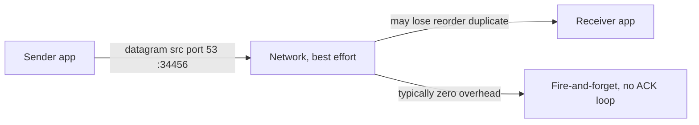

# UDP (User Datagram Protocol)

## 1. One-Line Definition
UDP is a connectionless transport that sends independent datagrams to an address with minimal overhead and no retransmission, ordering, or delivery guarantee — speed and freshness over completeness.

## 2. Why Do We Need It?
Reliability has a cost: [[tcp|TCP]]'s in-order retransmission stalls everything behind a lost segment (head-of-line blocking) and adds a handshake, which is fatal for real-time traffic — voice, video, game state — where a late retransmit is worse than a skip. Many other workloads (DNS lookups, one-shot queries) are a single datagram that fits in one packet and are cheaply retried without a connection. UDP exists so these flows can move with almost no overhead, leaving reliability to whoever actually needs it.

## 3. Simple Intuition
Postcards dropped into a slot: no envelope, no tracking, no confirmation, sent fast and forgotten. Sometimes a card is lost or arrives out of order and you never know — which is fine for a weather update, bad for a wedding invitation. TCP is the registered letter with receipts; UDP is the aspirational postcard.

## 4. What Happens Without It?
If every flow over a network had to be reliably reliable like TCP, your voice call would freeze waiting on a retransmitted syllable, a video call would buffer behind a lost frame, and DNS would waste hundreds of bytes per lookup. No UDP means the low-latency, loss-tolerant, connectionless ecosystem — game UDP sockets, RTP media, QUIC's foundation, service broadcast/multicast — simply cannot exist at its current efficiency.

## 5. Core Idea
- **Datagram = one message, one packet (usually):** the app sends a self-contained datagram; message boundaries are preserved (TCP gives a byte stream — a subtle but critical difference).
- **Connectionless and stateless:** no handshake, no connection object, no state on the server — any number of datagrams in, each independent.
- **Minimal effort delivery:** UDP checks a checksum but does not retransmit, reorder, or deduplicate. Delivery is best-effort: may lose, may duplicate, may arrive out of order.
- **No congestion control by default:** UDP will blast at full line rate — good for fresh data, dangerous for the network (this is why QUIC re-adds pacing).
- **Small header:** 8 bytes (vs 20+ for TCP), so more payload per packet and less to parse.
- **Supports multicast and broadcast**, which connection-oriented TCP effectively cannot.

## 6. Important Terminology

| Term | Simple Meaning |
|------|----------------|
| Datagram | One self-contained UDP message |
| Connectionless | No handshake, no connection state |
| Best-effort | Delivery attempted, not guaranteed |
| Port number | Same demultiplexer as TCP, separate space |
| Checksum | Error detection, not recovery |
| Multicast | Send one datagram to a group |
| Broadcast | Send to everyone on the subnet |
| RTP | Media transport built over UDP |
| QUIC | Google/IETF: reliable protocol built on UDP |
| DTLS | TLS-style encryption over UDP |

## 7. Basic Architecture



That is the whole protocol — a message, a destination, a checksum. Everything else (retry, ordering, pacing) is the application's or a wrapper protocol's job.

## 8. Request or Data Flow
1. The app constructs one datagram and calls `sendto(addr, port)` — no handshake, no setup.
2. The packet moves through the network like any IP packet; routers may drop it under congestion.
3. The receiver's OS demultiplexes by destination port and delivers to the listening socket.
4. If the datagram was lost, *nothing happens* — the sender's timer (if any) decides whether to resend.
5. The app adds its own sequence numbers and timestamps when it needs ordering and timeliness.

## 9. Practical Example
**Live video call + a DNS lookup (assumptions):** 10k concurrent calls, sub-second freshness.
- Audio/video ride RTP over UDP: a lost frame is skipped, not awaited — the call stays "live" (the right [[network-latency|latency]] budget).
- Phone-side jitter buffers absorb reordering; a pragmatic 5% loss means a speckle, not a stall.
- A DNS resolver sends a single UDP query to port 53 and retries after a timeout — one packet, no connection, exactly the cheap-retry pattern.
- Media that needs reliability anyway uses QUIC: UDP packets carrying a TCP-style reliability layer, so video gets both freshness and in-order recovery where it matters.

## 10. Scaling
- **Servers smile on UDP:** no per-connection state means a single process can answer millions of independent datagrams (DNS, gaming servers) with far less memory than the TCP equivalent.
- **But the edge must watch volume:** no congestion control means a burst floods queues; rate-limit, throttle, and shape UDP at the LB/firewall, and size the NIC for peak datagram rate.
- **Multicast scales fan-out:** one datagram to a group delivered to N receivers is vastly cheaper than N unicast copies (streaming, discovery, leaderless replication gossip).
- **Proxy/LB support varies:** many L7 LBs and firewalls treat UDP awkwardly (connection tracking for stateful flows like QUIC) — verify your platform before committing the protocol choice.

## 11. Reliability and Failure Scenarios
- **Loss is a feature, not a bug:** for media, drop-and-continue beats stall-and-wait. For anything else, the app must detect gaps (sequence numbers) and decide to retry or skip.
- **Duplication and reordering happen:** stateless replays of the same datagram are possible; numbers and ids make duplicates harmless.
- **No detection that the peer is alive:** UDP gives you zero signal — your own response/ack or app heartbeat is the only liveness check.
- **Receiver too slow:** UDP drops input at the socket buffer when the app can't keep up — visible as silent datagram loss that you must measure above the wire.

## 12. Consistency and Correctness
- Ordering is not implied: multi-datagram state (a fragmented file, a reordered sample burst) needs explicit sequence numbers and reassembly on the app side.
- A datagram is atomic to the app — but only if smaller than the MTU; oversized datagrams fragment and are more likely to be dropped silently (match your payload to path MTU).
- Idempotency is easy to get wrong in UDP because retransmits can duplicate: idempotent operations are the difference between harmless and doubling.

## 13. Performance
- **Low latency by construction:** no handshake RTT, no HOL blocking, no ACK pacing — a datagram leaves immediately.
- **The latency/freshness trade:** you accept *occasional* loss so the *stream* never stalls; p99 for each datagram stays flat.
- Overhead: 8-byte header and zero connection bookkeeping mean CPU and memory go to payload, not plumbing.
- Pitfall: without pacing, bursts starve TCP flows on shared links — always shape what you ship.

## 14. Security
- **Spoofing is trivial** (no handshake to prove liveness) and **amplification is real**: a small spoofed request to a big responder can flood a victim (DNS/DDoS reflections) — mind the size of your responses.
- No encryption: media and datagrams travel in the clear unless wrapped (DTLS, QUIC) — see [[encryption-and-keys|Encryption and Keys]].
- Rate-limit, ACL, and filter the UDP surface at the edge; fewer open UDP ports is safer ([[ports|Ports]]).
- Multicast/broadcast leaks: scope them to the subnet and never trust broadcast source addresses.

## 15. Trade-Offs

| Choice | Advantages | Disadvantages | When to Use |
|--------|------------|---------------|-------------|
| UDP | No handshake, no HOL, no state | No reliability, no pacing, spoofable | Voice/video, DNS, games |
| TCP | Ordered, reliable, fair | Handshake RTT, HOL blocking, state cost | Web, files, DBs, RPC |
| UDP + app retries | Cheap for idempotent one-shots | App must redo reliablity | DNS, health pings |
| UDP + QUIC | Fresh and reliable, fast handshake | New stack, proxy support varies | Mobile web, media, CNI |
| Raw UDP broadcast | Zero-cost discovery | Scope leaks, no auth | Subnet-local discovery |

## 16. Common Mistakes
- Building TCP-in-UDP by hand (retry, ordering, flow control) when QUIC or TCP already exists — you inherit cable-bug probability for no reason.
- Sending datagrams larger than the MTU, then wondering why "guaranteed" messages vanish (fragmentation drops).
- Assuming UDP is lossless on localhost — loopback drops under buffer pressure too.
- Skipping idempotency: retransmits and duplicate datagrams are normal, and unguarded logic doubles effects.
- Shipping unencrypted media or control over wide-area UDP without DTLS/QUIC.

## 17. HLD vs LLD Boundary
HLD: protocol selection (TCP vs UDP), pacing/rate-limit policy at the edge, multicast vs unicast topology, QUIC adoption, jitter-buffer sizing and loss budget. LLD: a socket's `SO_RCVBUF` on one receiver, the datagram struct and its sequence field, the exact timeout in one retry loop.

## 18. Interview Questions

### Beginner
- What is the difference between TCP and UDP in three points?
- Why are DNS queries often sent over UDP?

### Intermediate
- Design a live voice service. Why do you not just use TCP, and what does the app do when a packet is lost?
- What is a UDP amplification attack, and why is a small request able to flood a victim?

### Advanced
- Why did QUIC build reliability on top of UDP instead of fixing TCP?
- How does a "reliable UDP" layer (QUIC) decide between retransmitting and skipping for live media?

## 19. Interview Memory Summary

> [!abstract]- Interview Memory Summary

### Remember

- Connectionless, stateless, best-effort datagrams.
- No handshake, no retransmission, no ordering, no congestion pacing.
- 8-byte header; message boundaries preserved.
- Freshness beats completeness: drop-and-continue for media.
- App adds sequence numbers, retries, and timestamps itself.
- No state on the server = huge scale for request/response datagrams.
- Spoofing + amplification are the classic UDP security traps.

### 30-Second Explanation

UDP sends self-contained datagrams with an 8-byte header and zero connection state — no handshake, no retransmission, no ordering, no pacing. It is the right transport when a retransmitted-by-TCP frame would arrive too late to matter (voice, video, games, DNS one-shots). Whoever needs reliability adds it above (sequence numbers, retries, QUIC); anyone shipping wide-area UDP must also add pacing and DTLS to dodge amplification and snooping.

### Interview Traps

- Calling UDP "unreliable" as if it were broken — for its workloads, dropping is the correct behavior.
- Building QUIC-like reliability from scratch when QUIC already exists.
- Forgetting UDP has no liveness signal: you must heartbeat or confirm yourself.
- Ignoring amplification: responses must not dwarf spoofed requests at the edge.

### Key Trade-Off

UDP trades guaranteed delivery for latency and state-free scale — the app or a wrapper (QUIC/DTLS) must re-add exactly the reliability, ordering, and encryption it actually needs, trading head-of-line-free freshness for its own complexity.

## 20. Related Concepts

### Prerequisites

- [[ip-address|IP Address (IPv4 vs IPv6)]] — the addressing layer datagrams travel on.
- [[ports|Ports]] — UDP ports demultiplex datagrams, in a space separate from TCP.

### Commonly Used Together

- [[dns|DNS]] — the canonical single-datagram UDP workload.
- [[network-latency|Network Latency]] — loss, jitter, and RTT budgets are why UDP wins for media.
- [[http-and-https|HTTP and HTTPS]] — HTTP/3 moves HTTP onto QUIC, a UDP-based transport.
- [[edge-computing|Edge Computing]] — real-time, loss-tolerant edge protocols almost always choose UDP.

### Alternatives

- [[tcp|TCP]] — the reliable, ordered, slower-to-connect alternative.
- [[http-and-https|HTTP and HTTPS]] over TCP — fine when freshness is not the constraint.

### Advanced Concepts

- [[tail-latency|Predictable Tail Latency]] — UDP is the escape route from TCP's head-of-line stalls.
- [[consensus|Consensus]] — gossip/keep-alive protocols over UDP multicast trade speed for proto complexity.

Related planned topics (not authored yet): websockets, quic-http3 details.

## 21. References
RFC 768 (UDP). RFC 9000 (QUIC). Kurose and Ross, *Computer Networking: A Top-Down Approach* (transport layer). Verify QUIC/UDP3 support maturity with current platform and CDN docs.

## 22. Active Recall

Test yourself before revealing each answer.

> [!question]- Name the three properties TCP has that UDP deliberately throws away, and what UDP keeps instead.
> Retransmission (reliability), ordering, and connection state/congestion pacing. It keeps fast, independent, best-effort datagrams with an 8-byte header — you trade guarantees for latency and stateless scale.

> [!question]- Why do live voice and video prefer UDP even though packets get lost?
> TCP would pause the stream behind the lost segment (head-of-line blocking) while a retransmit arrives, and each pause is audible/watched. UDP lets the decoder skip the lost sample and play on — a 5% glitch is far better than a 300 ms stall every time the network wavers.

> [!question]- What is the amplification attack, and how do you stop your UDP server from being a weapon?
> An attacker spoofs a victim's address as a source and sends small requests to servers whose responses are much larger — the servers flood the victim. Stop by never letting a response dwarf a request (probe, then respond big on the second round, as in classic DNS resolver hardening), plus rate limits and source-scoped ACLs at the edge.

> [!question]- Trade-off: retry at the app layer vs TCP for a "reliable over UDP" design?
> App-layer retries are cheap for idempotent one-shot datagrams (a DNS query retransmit is harmless) but you rebuild ordering, dedup, and pacing the moment you stream. TCP's native handling is battle-tested; QUIC gives you both worlds — a reliable layer over UDP with no head-of-line blocking.

> [!question]- Why did QUIC choose UDP rather than extending TCP?
> TCP's reliability layer can't be scoped per-stream and its handshake and head-of-line rules are baked into every deployment (middleboxes, OSes). Over UDP, QUIC owns its own reliability, multiplexing, and 0-RTT-seeding — evolving in user space with browsers and CDNs, not waiting on the kernel stack.

> [!question]- Your app "guarantees" messages but larger ones vanish on a real network. What is happening?
> Datagrams larger than the path MTU get fragmented; a router dropping one fragment silently kills the whole message, and UDP gives no signal. The fix is payload-sized-to-MTU (or path-MTU discovery) and, where messages must exceed it, a reassembly/seq scheme in the app or a move to TCP/QUIC.

> [!question]- Interview scenario: use UDP for a leaderless cluster that needs periodic liveness and total fan-out. What do you add?
> Periodic heartbeats (your own liveness, since UDP signals nothing), sequence numbers to fence stale/duplicate datagrams, multicast for efficient fan-out to the group, and an idempotent handler so replays are harmless. Add pacing so bursts don't starve TCP neighbors, and authenticate datagrams — UDP sends are trivially spooled.

## 23. When Should I Use This?

### Use it when

- Real-time timing matters more than perfect delivery (voice, video, games, telemetry).
- The workload is a single self-contained request your app can cheaply retry (DNS-style).
- You need multicast/broadcast fan-out that TCP cannot give.
- You want state-free scale for huge numbers of independent messages.

### Avoid it when

- Data must arrive once, in order, no matter what — that is TCP's job.
- Your "UDP solution" is really a retry + sequencing + pacing implementation in disguise (use QUIC).
- The edge/proxy/firewall fleet does not handle UDP flows well in your cloud.
- You ship encrypted payload but have no DTLS/QUIC story — UDP carries plaintext by default.

### What problem does it solve?

Problem: TCP's reliability machinery (handshake, ACKs, in-order retransmission) adds latency and stalls that kill real-time and one-shot traffic. Bottleneck: connection state and head-of-line blocking at scale. Solution: a connectionless, state-free datagram transport that preserves message boundaries and freshness, letting the app decide exactly how much reliability to re-spend on.

### What problem does it NOT solve?

UDP does not deliver, order, deduplicate, or pace — it will happily flood a network and lose messages with no apology. It does not prove liveness, authenticate the sender, or encrypt the payload. Any of these, added by hand, is effectively re-inventing TCP or QUIC; choose deliberately rather than by default.

## 24. Decision Connections

Decisions that go together with UDP:

- [[tcp|TCP]] — the reliability baseline UDP is compared against; pick by latency vs completeness.
- [[http-and-https|HTTP and HTTPS]] — HTTP/3 over QUIC (UDP) is how web traffic keeps evolving past TCP's limits.
- [[network-latency|Network Latency]] — the RTT, jitter, and loss budgets that justify UDP for media.
- [[ports|Ports]] — UDP's own demultiplexer, separate from TCP's.
- [[dns|DNS]] — the textbook UDP workload: one datagram, cheap app-level retry.
- [[edge-computing|Edge Computing]] — live media and control at the edge use UDP for low-latency freshness.
- [[encryption-and-keys|Encryption and Keys]] — without DTLS/QUIC you are shipping plaintext.

Decision tree:

```
Application needs to move data over the network
    |
    +-- Must arrive intact, in order, no matter what?
    |      → [[tcp|TCP]]
    |
    +-- Freshness beats completeness? (media, games, telemetry)
    |      → [[udp|UDP]]
    |         |
    |         +-- Need reliability too?     → QUIC (UDP + TLS + recovery)
    |         +-- Fan-out to a group?       → multicast on UDP
    |         +-- Cheap idempotent one-shot? → plain UDP + app retry (DNS style)
    |
    +-- Edge/cloud filters UDP flows poorly?
           → reconsider HTTP/3 or the proxy topology first
```