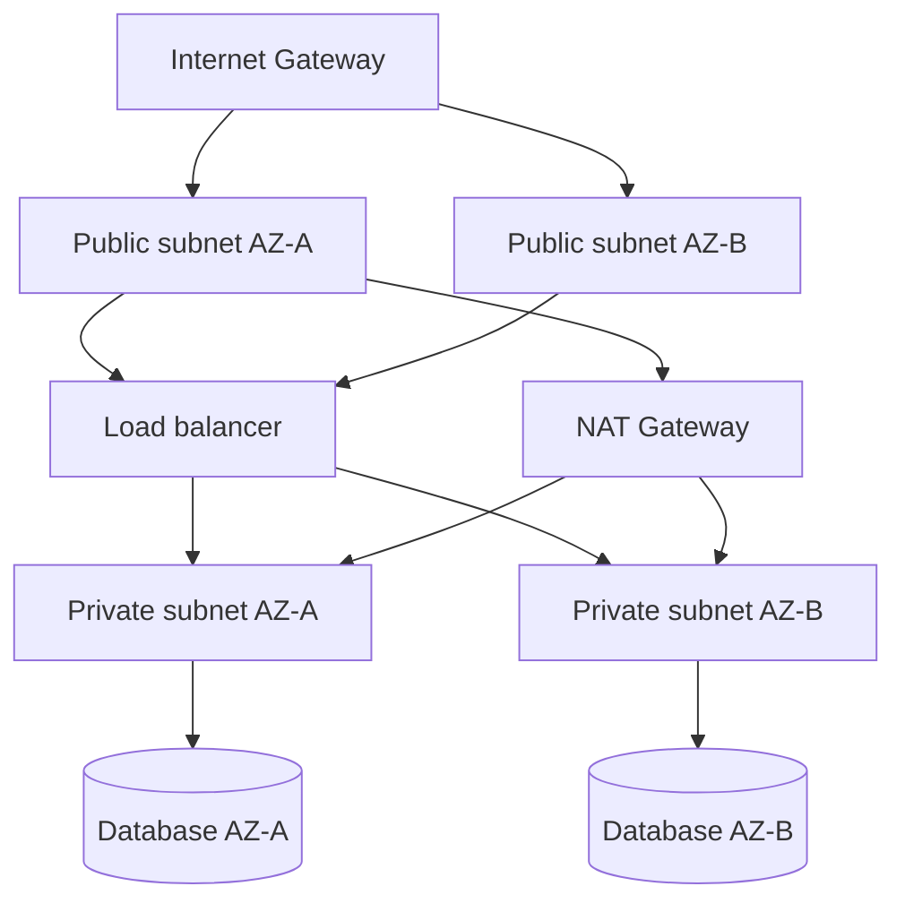

# VPC and Subnets

## 1. One-Line Definition
A Virtual Private Cloud (VPC) is the isolated private network you carve out of a cloud provider's address space, with its own CIDR block, route tables, and gateways; subnets are the address ranges within it that live in a single availability zone and carry specific routing/access rules.

## 2. Why Do We Need It?
Cloud resources are meaningless without a network to live in. A VPC gives you your own address space, the ability to route traffic between tiers, control what is public vs private, and connect to the office or other clouds — without it, every resource would sit on a shared network with no isolation, no CIDR planning, no explicit route tables, and no way to make tenancy boundaries real.

## 3. Simple Intuition
The VPC is a private office building with its own floor plan. The building has one street-front door (internet gateway) and one service door (VPN/peering). Floors are subnets — some floors have windows to the street and accept deliveries from outside (public subnets via the front door), others are interior-only (private subnets, reachable only through a secured service door or via a floor.plan route table). The signposts (route tables) at each door decide which corridor each visitor may use, and each room has its own door list (security groups).

## 4. What Happens Without It?
No isolation: resources reach each other by guessable internal IPs with no owner-defined boundaries, egress/ingress is whoever-configured-what, and there's no clean path to a database tier that must never touch the internet. You'd also have no idea of your address space, making peering, VPN, and compliance review effectively impossible.

## 5. Core Idea
- **CIDR planning:** pick a private range (RFC 1918) and subdivide. Leave headroom for growth and for *other* VPCs you will peer with — overlapping CIDRs are the classic cloud mistake.
- **Subnet = zone:** in most clouds a subnet lives in exactly one availability zone (AZ), so AZ-level design (multi-AZ, three-tier) is realized as subnets-per-tier-per-AZ.
- **Public vs private subnet:** public subnets have a route via an internet gateway (IGW); private subnets have no direct IGW route — their egress goes through a NAT gateway/VPN/proxy.
- **Route tables:** per-subnet: which destinations go where (via local, via IGW, via NAT, via peering, via transit gateway). Routing decisions here are what make tiers public or private.
- **Gateways and connectivity:** IGW (internet in/out), NAT gateway (private-subnet egress; see nat), VPN/DirectConnect (office/hybrid), VPC peering (VPC-to-VPC), VPC endpoints (service access without the internet), transit gateway (hub for many VPCs/VPNs).
- **Two access-control layers:** security groups (stateful, instance-level, allow-only) and network ACLs (stateless, subnet edge, numbered allow/deny) — both needed for capable isolation; see firewall.
- **Multi-VPC strategy:** by environment (dev/stage/prod), by team/tenant, or by region; cross-region via peering/transit/global routing as needed.

## 6. Important Terminology

| Term | Simple Meaning |
|------|----------------|
| VPC | Isolated virtual network with its own CIDR |
| CIDR | Address-range notation (e.g., 10.0.0.0/16) |
| Subnet | AZ-pinned slice of the VPC's address space |
| Route table | Per-subnet rules mapping destination ranges → gateway |
| Internet gateway | The door from public subnets to the internet |
| NAT gateway | Managed egress for private subnets (see nat) |
| Security group | Instance-level stateful allow-only filter |
| Network ACL | Subnet-edge stateless numbered allow/deny |
| VPC peering | Private link between two VPCs |
| VPC endpoint | Private access to a cloud service without the internet |
| Transit gateway | Hub connecting many VPCs/VPNs |
| Peering/overlap | Two VPCs choosing the same IP ranges (breaks peering) |

## 7. Basic Architecture



## 8. Request or Data Flow
1. External client → IGW → route table of the public subnet → load balancer in a public subnet.
2. LB forwards over an internal link to an app instance in a private subnet (security group must allow it).
3. App needs the DB: private subnet's route sends it locally to the DB subnet; only the app security group may reach the DB's group on 5432.
4. App needs an external API: no IGW route on the private subnet → NAT gateway → public internet, with the app's source IP rewritten (see nat).
5. A dev on the office VPN: VPN → route table/transit → the same private subnets, no internet exposure at any point.

## 9. Practical Example
**Three-tier SaaS (assumptions):** prod VPC `10.10.0.0/16`, two AZs.
- `10.10.1.0/24` + `10.10.2.0/24` = public ALB subnets (AZ-A/AZ-B); `10.10.3.0/24` + `10.10.4.0/24` = private app subnets; `10.10.5.0/24` + `10.10.6.0/24` = private DB subnets.
- DB subnet has no IGW route and only the app security group can speak 5432 → a public web compromise can't reach RDS.
- Private subnets egress via a NAT gateway per AZ → 200 instances share two public IPs, and the region can fail over one AZ without losing egress.

## 10. Scaling
- **Address space is your first scaling decision:** CIDR too small and subnets run out of IPs (add parts of the range, never "just bigger" — it gets painful). Reserve space per AZ/tier and leave headroom for peering overlap.
- **Subnet count grows with tiers × AZs** — stay consistent; a naming/CIDR matrix prevents the classic "which range was that" confusion.
- **NAT is a shared egress point:** watch conntrack table size and NAT-gateway bandwidth as private-subnet traffic grows (see nat scaling).
- **Fleet growth:** security groups scale to instances; route tables to subnets; the limits to watch are IP headroom, NAT throughput, and peering/transit bandwidth.
- **Multi-region:** separate VPC per region, with peering/transit gateways and service endpoints, keeps latency local and blast radius regional.

## 11. Reliability and Failure Scenarios

| Failure | What Happens | Detection | Recovery | Trade-off |
|---------|--------------|-----------|----------|-----------|
| AZ fails | Resources in that AZ's subnets are gone | AZ health metrics | Multi-AZ subnets + failover/LB drains | duplicate infra across AZs |
| NAT gateway dies | Private-subnet egress stops | Egress-ping + NAT metrics | Per-AZ redundant NAT or failover | cost |
| Route table misconfigured | Traffic black-holes or leaks public | Route-ping/connectivity tests | Re-apply golden route config | — |
| CIDR overlap with peer | Peering routes conflict, unpredictable | Peering route checks | Plan non-overlapping ranges up front | planning burden |

## 12. Consistency and Correctness
Routing correctness is monotonic: the route table is the single source of truth for "how do I reach destination X." A route to the IGW on a subnet makes it public; a missing route silently black-holes. The stateful security-group layer and stateless ACL layer must agree — because ACLs are stateless and ordered, a one-way allow often needs an explicit return-rule; assumptions here are the classic "works in dev, fails in prod" bug. Terraform/IaC golden configs keep route tables and groups reproducible (see infrastructure-as-code).

## 13. Performance
- Direct private links (peering/VPC endpoints) outpace the public path and skip NAT latencies — prefer them for internal service traffic.
- NAT adds a hop + table lookup per flow: for latency-critical egress, size the NAT gateway or route high-volume traffic via peering/endpoints.
- Security groups are evaluated at the instance/hypervisor level — effectively free; network ACLs are cheap per packet but their ordering/statelessness add config complexity, so keep hot-path rules short.

## 14. Security
The VPC's whole point is isolation: default-deny inbound at the security-group/ACL layer, private tiers with no internet path, least-privilege SG rules (port + source-IP scoped), and no broad `0.0.0.0/0` on anything that matters. Multi-tenant SaaS gets stronger isolation by keeping tenants partially per-VPC (see tenancy-and-cells). Encryption in transit (TLS/tunnels) still applies *inside* the VPC — the VPC prevents uninvited guests, not eavesdropping by an insider with access to a link.

## 15. Trade-Offs

| Choice | Advantages | Disadvantages | When to Use |
|--------|------------|---------------|-------------|
| Single VPC, many subnets | Simple, one address space | Tenants/teams share risk; scaling limits | One product/team |
| Multi-VPC per team/tenant | Strong isolation, blast-radius split | Peering/transit cost, address planning | SaaS, security-sensitive |
| Public subnets | Direct ingress simplicity | Exposure of the tier itself | Edge/LB tier only |
| Private subnets + NAT | Hidden tiers, controlled egress | NAT SPOF/throughput, extra hop | App/DB tiers |
| Transit gateway hub | Many VPCs connect centrally | Central SPOF, cost | Enterprise many-VPC |
| VPC peering | Simple, private | No transitive routing, per-pair | Few VPCs |

## 16. Common Mistakes
- **CIDR overlap:** two VPCs both using `10.0.0.0/16` can never peer cleanly — plan ranges before building.
- Putting DB/admin in public subnets "temporarily" — it's how breaches reach the crown jewels.
- Security-group rules scoped to `0.0.0.0/0` because it's easier — that's just a firewall you forgot.
- One subnet per AZ regardless of tier (web+app+db in a single range) — isolation becomes impossible.
- Ignoring stateless-ness of ACLs (forgetting the return rule) and the allow-only behavior of security groups until something breaks in prod.

## 17. HLD vs LLD Boundary
HLD: VPC CIDR and subnet matrix per tier/AZ, public-vs-private posture, gateway and connectivity plan, security group vs ACL posture, multi-VPC/peering strategy. LLD: a specific route-table entry, one security-group rule in cloud config, an IaC resource block for a subnet.

## 18. Interview Questions

### Beginner
- What does a VPC give you that a plain shared network doesn't?
- What's the difference between a public and a private subnet?

### Intermediate
- Why should your database subnet never have an internet route, and how does it still get patched?
- Your VPCs overlap in CIDR and can't peer. What options do you have?

### Advanced
- Design the VPC/subnet architecture for a multi-tenant SaaS spanning three tiers and two AZs, including egress and endpoints.
- When do you choose multi-VPC over one big VPC, and what do you pay either way?

## 19. Interview Memory Summary

> [!abstract]- Interview Memory Summary

### Remember

- VPC = isolated private network with its own CIDR; subnet = AZ-pinned slice.
- Subnets per tier × AZ is the standard matrix; public (IGW) vs private (NAT) posture per tier.
- Route tables decide public/private; SGs (stateful, allow-only) + ACLs (stateless, ordered) enforce.
- Private tiers have no internet route; NAT gateway handles egress.
- Plan non-overlapping CIDRs or peering breaks.
- Security groups for instance, ACLs at subnet edge — both or you have a hole.

### 30-Second Explanation

A VPC is your private network in the cloud, plussed with AZ-pinned subnets, route tables, and gateways. Public subnets reach the internet via an IGW; private tiers have no internet route and egress via NAT. Two enforcement layers — security groups (instance, stateful, allow-only) and network ACLs (subnet, stateless, ordered) — isolate tiers, and the whole design hangs on upfront CIDR planning so peering, multi-AZ, and tenancy stay clean.

### Interview Traps

- Forgetting that security groups are allow-only — no explicit deny, so isolation needs ACLs/routes too.
- CIDR overlap between peered VPCs than can never be fixed cleanly.
- Placing a database/admin subnet in a public range "temporarily."
- Confusing NAT gateway (private-subnet egress) with a security boundary.

### Key Trade-Off

The VPC buys isolation, planning, and connectivity control at the cost of upfront address design and ongoing routing/ACL management — the layout decisions you make first are the ones you live with longest.

## 20. Related Concepts

### Prerequisites

- [[cloud-infrastructure|Cloud Infrastructure]] — regions/AZs are where subnets are pinned
- [[nat|NAT]] — egress for private subnets

### Commonly Used Together

- [[firewall|Firewall]] — security groups and ACLs are the cloud firewall layers
- [[forward-proxy|Forward Proxy]] — an application-layer option for private-subnet egress policy
- [[kubernetes|Kubernetes]] and [[kubernetes-services|Kubernetes Services]] — a cluster runs inside a VPC with its own node/pod networking
- [[containers-and-vms|Containers and VMs]] — the workloads subnets host
- [[autoscaling|Autoscaling]] — new instances land in pre-built subnets with ready security groups

### Alternatives

- [[geo-dns-anycast|Geo-DNS and Anycast]] and [[locality-based-routing|Locality-Based Routing]] — global traffic routing that sits *above* VPC boundaries

### Advanced Concepts

- [[encryption-and-keys|Encryption and Keys]] — tunnels (VPN/DirectConnect) connecting VPC to the office
- [[service-discovery|Service Discovery]] — how instances inside private subnets find each other

Related planned topics (not authored yet): network-partition.

## 21. References
AWS VPC/subnet/security-group/network-ACL documentation (the canonical full treatment); RFC 1918 (private addressing); RFC 4632 (CIDR). Verify limits and anachronisms against current cloud-provider docs.

## 22. Active Recall

Test yourself before revealing each answer.

> [!question]- Basic understanding: what does a route from a subnet via an Internet Gateway actually mean?
> It means the subnet's route table includes a default route to the IGW, so instances there are directly reachable from and can directly reach the internet — that's what makes a subnet public. Drop that route and it becomes private: no direct internet path either way.

> [!question]- Design decision: how does a private-subnet database still get security patches without an internet route?
> Egress-only or controlled paths: a NAT gateway grants outbound-only access (patches download), a VPC endpoint reaches the provider's update service privately, or a bastion/VPN path pulls patches while inbound access stays denied. The principle is *reachability is directional and rule-driven*, not binary.

> [!question]- Trade-off: security groups vs network ACLs — why do you need both?
> Security groups are instance-level, stateful, allow-only — great isolation but they cannot express "deny this specific source" or block traffic syntactically on the subnet edge. Network ACLs are stateless, ordered, and can deny, but you must write return rules manually. Together you get per-instance control plus subnet-edge enforcement; each alone leaves a gap.

> [!question]- Failure scenario: two prod VPCs both use 10.0.0.0/16 and you must peer them. What now?
> You can't route one 10.x range into another — collisions make routing undefined. Realistic fixes: re-CIDR one VPC (painful downtime-heavy) or refuse to peer and instead use a non-overlapping transit/nat-interspersed topology. The lesson: overlap must be decided before building, not after.

> [!question]- Interview scenario: design a three-tier multi-tenant SaaS in two AZs inside one VPC.
> 1) CIDR 10.10.0.0/16; 2) subnets per tier × AZ — public ALB (A/B), private app (A/B), private DB (A/B); 3) DB subnets no IGW route, only app SG can hit 5432; 4) NAT gateway per AZ for private egress; 5) multi-AZ for LB, app asg, and DB; 6) IaC golden configs so route tables and SGs are reproducible.

> [!question]- Design decision: when do you split into multiple VPCs instead of adding subnets?
> When blast radius or tenant isolation demands it (a compromised workload shouldn't cross into another tenant's plane), when teams operate independently, or when compliance needs per-boundary separation. Cost: peering/transit management and careful non-overlapping addressing — the strong isolation is rarely free.

## 23. When Should I Use This?

### Use it when

- You're deploying workloads in the cloud and need a real, addressable, isolated network.
- Tiers must be isolated (web private from public internet, DB from everything).
- You need planned, auditable routing, egress (NAT/VPN/endpoints), and multi-AZ placement.
- Hybrid/office connectivity (VPN/DirectConnect) must terminate somewhere well-defined.

### Avoid it when

- A serverless/fully-managed workload needs no networking surface you own (the provider subsumes VPC/network detail, though most managed services still terminate into a VPC for isolation).
- A single shared network with managed isolation is genuinely sufficient (rare beyond demos).

### What problem does it solve?

Problem: deployed resources need a defined, isolated, routable address space with controlled public/private boundaries. Solution: the VPC provides CIDR planning, AZ-pinned subnets, route tables, and gateways; security groups + ACLs enforce tier isolation; NAT/endpoints handle egress; peering/transit ties VPCs together.

### What problem does it NOT solve?

It doesn't secure application logic (WAF/mesh matter too), doesn't protect against a compromised admin or over-broad rule, won't fix CIDR overlap retroactively, and — critically — a VPC is not the same as server-level security: encryption in transit and access control still apply inside it.

## 24. Decision Connections

Decisions that go together with VPC and subnets:

- [[cloud-infrastructure|Cloud Infrastructure]] — the region/AZ canvas the VPC is drawn on.
- [[nat|NAT]] — how private subnets get egress without internet routes.
- [[firewall|Firewall]] — security groups + network ACLs are the enforcement layers inside the VPC.
- [[forward-proxy|Forward Proxy]] — application-layer egress policy for private-subnet fleets.
- [[kubernetes|Kubernetes]] — clusters occupy node subnets; pod/network policies layer on top.
- [[autoscaling|Autoscaling]] — scale-out needs pre-built subnets and ready security groups.
- [[service-discovery|Service Discovery]] — instances in private subnets still must find each other.
- [[encryption-and-keys|Encryption and Keys]] — tunnels (VPN/DirectConnect) connecting VPCs to offices.

Decision tree:

```
Cloud workloads need an isolated, routable network
    |
    +-- Multi-tier isolation required?
    |      → [[vpc-and-subnets|VPC and Subnets]] (subnets per tier × AZ)
    |         |
    |         +-- Must be internet-reachable?     → public subnet via Internet Gateway
    |         +-- Private, egress only?           → private subnet + [[nat|NAT]]
    |         +-- Instance-level allow-only?      → security groups
    |         +-- Subnet-edge deny capability?    → network ACLs ([[firewall|Firewall]])
    |
    +-- Multi-tenant / strict blast-radius?
    |      → multiple VPCs with peering/transit
    |
    +-- Office or on-prem connectivity?
    |      → VPN / DirectConnect tunnel ([[encryption-and-keys|Encryption and Keys]])
    |
    +-- Fully managed, no VPC surface owned?
           → serverless/managed services ([[serverless|Serverless]])
```